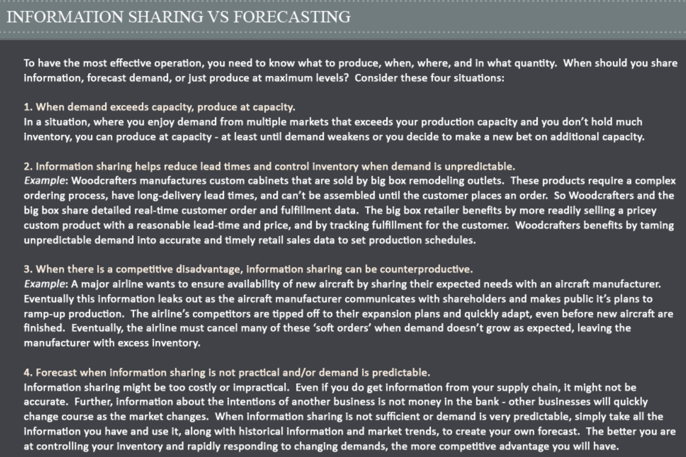
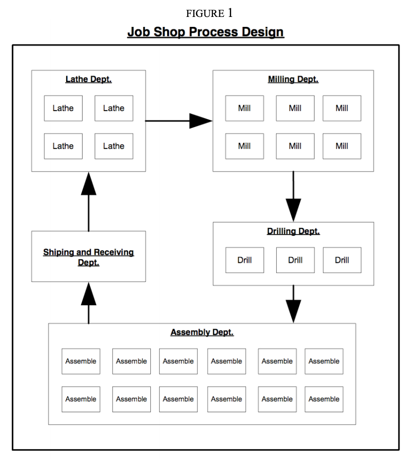
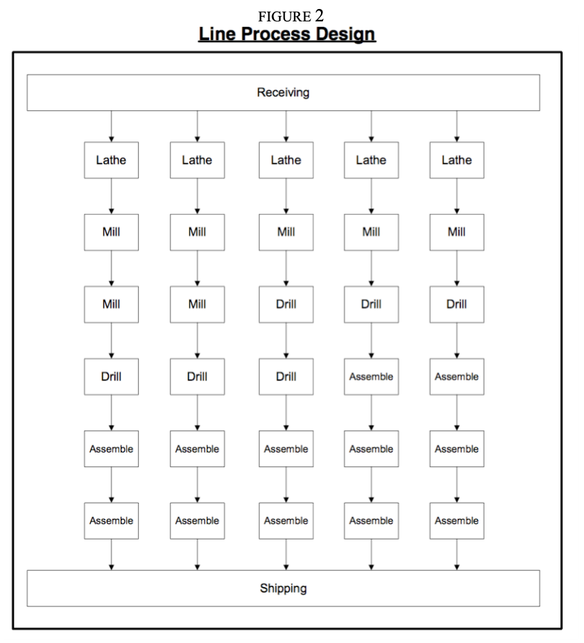
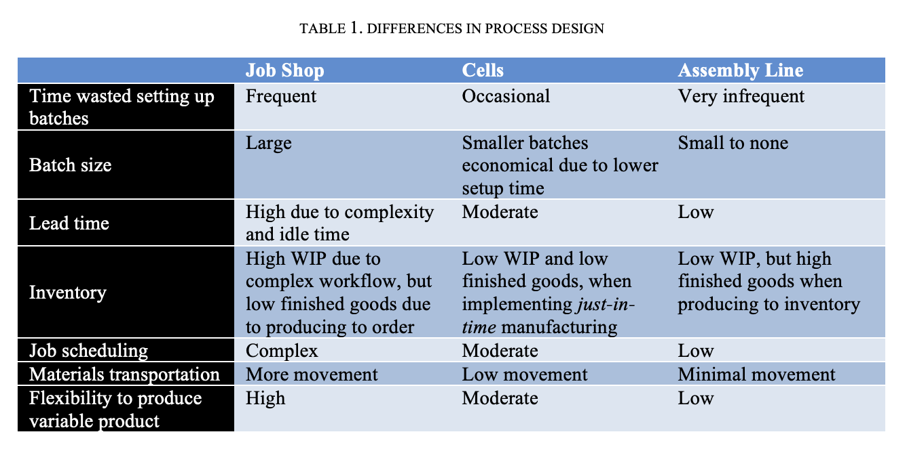
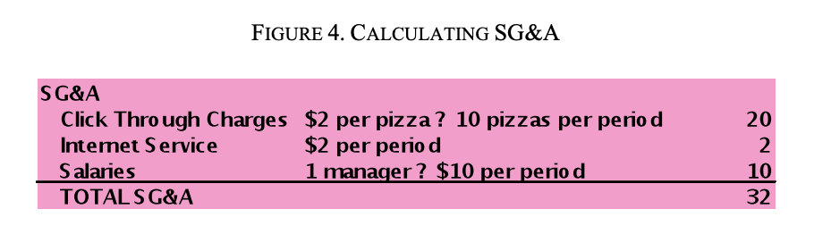
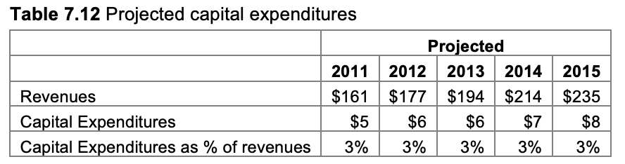

**W1 Intro: Operations & Costs**

You can increase *capacity* by increasing the number of units you can
make and deliver at any one time. You can increase *efficiency* by
lowering the cost of making each unit.

The overarching question of the Operations & Costs course is: How do you
build a production—or service—delivery process that delivers exactly the
right product or service, in the right quantities, at the right time,
with the lowest cost per unit and the smallest upfront investment
possible?

In these unit economics experiences, you will practice asking the most
important questions of entrepreneurship, like:

• How many units do you need to sell to reach cash flow breakeven and
stop hemorrhaging cash? • Once your business reaches a critical mass,
how long will it take to reach payout and recover your investment?

• How do you measure—in cash—how costs and profits will vary with sales,
over a variety of production-process archetypes?

• What simple ways exist for you to value your business once it reaches
critical mass?

Put yourself in the customers shoes Operations are not about what you
want to produce. It is about what the customer wants you to produce.
Never lose sight of this.

Create a culture that fosters continuous improvement. Look for
bottlenecks, the obstacle that keeps the whole line from improving
throughput.

Dealing with Bottlenecks:

> • Identify the bottleneck
> 
> • Exploit the bottleneck
> 
> • Subordinate everything else to the above decision
> 
> • Elevate the bottleneck
> 
> • Go Back to the first step, and repeat . . .

**W2/W4: The Goal**

What is the goal? 

To Increase throughput while simultaneously decreasing inventory and
operating expenses.

  - Throughput: the rate at which the system generates money through
    sales (the money coming in)

  - Inventory: all the money invested in things it intends to sell
    (money in the system)

  - Operating Expenses: the money spent to turn inventory into
    throughput (money you pay to make throughput happen)

For it to be spending time on output that’s already You could think
you’re running an efficient system, but your thinking might be
wrong. **If you didn’t increase sales, throughput, or decrease costs,
you didn’t increase productivity**. 

If you don’t know what the real goal is, which you could very well be
wrong about, then you can’t figure out what to do to reach the goal.
And **the goal of any business is to make money**. 

If you keep everyone and everything working at full capacity, you’ll
naturally build up inventory by creating excess work. A plant where
everyone is working all the time is very inefficient. You can’t have a
“balanced plant” without doing excess work. 

Because of **dependent events** and **statistical fluctuations**, you’ll
naturally run into **bottlenecks** in the system, kind of like the
fattest kid on a hike slowing everyone down. **The whole system only
moves as fast as the bottleneck**, so it makes sense to focus on
increasing the bottleneck’s capacity and tying the rest of the system’s
rate to the rate of the bottleneck. In the analogy, put the fat kid at
the front of the line, and make his backpack as light as possible so he
can walk faster. 

Since **output can only deviate up to the maximum level determined by
its dependent events**, but it can deviate down much lower, with
successive dependent events you’ll get further and further negative
fluctuations. A kid can come to a halt, but he can only catch up as much
as the kid in front of him, he can never catch up past the point the
previous kid has already walked. 

**Bottleneck:** “A bottleneck is any resource whose capacity is equal to
or *less than* the demand placed upon it. And a non-bottleneck is any
resource whose capacity is greater than the demand placed on it.”
\[139\]

**An easy way to find a bottleneck is to look and see what has a big
pile of work in front of it** \[144\]

**To optimize the system, make the flow through the bottleneck equal to
the demand from the market**. Or, a tiny bit less than the demand from
the market. \[139\]

**In most cases you’ll have capacity that is hidden from you because
some of your thinking is incorrect**. The first thing you should always
do is see exactly how the bottlenecks are currently operating, and if
you can change how they’re used to increase their capacity (before
simply hiring or buying more tools). \[152\]

**If you lose even one hour on the bottleneck, you have lost it forever.
You can’t get it back somewhere else in the system**. Your throughput
for the entire system will be lower by whatever amount the bottleneck
produces in that time. \[153\]

Lost time on the bottleneck is lost throughput which means you’ve lost
the *total output of the whole system*. **If your whole plant earns
$1,000 an hour, then an hour lost on the bottleneck is $1,000 lost**.
Make sure it’s time isn’t wasted by: \[157 / 159\]

  - Sitting idle and not getting used during some break

  - Making it work on something you don’t need

You can increase the capacity of the bottleneck by: \[159\]

  - Only making it work on what will increase throughput *today*

  - Taking some of the load off the bottleneck and giving it to
    non-bottlenecks

When you make a non-bottleneck do more work than the bottleneck, you
create excess inventory and thus lose money. \[210\]

What you have to do is **figure out how to release materials at the
start of the process exactly according to the capacity of the
bottleneck**. \[216\]

**If you** **reduce your batch size, you increase throughput** **by
reducing inventory held and reducing the amount of cash tied up at any
one time.** It also lets you move faster, since the gaps will be smaller
since the time to process a batch will be lowered as well, and your
total lead time on any project condenses. \[232\]

**Three simple questions:** What to change, what to change to, and how
to cause the change. \[337\]

**W6: Scheduling & Sequencing Pt. 1**

> **Gantt Chart Basics**

A Gantt chart is a horizontal bar graph used to visualize the sequence
and timing of tasks in a project or process.1 Gantt charts are a useful
planning instrument before a project starts and can be used during a
project to measure progress and make it easier for team members to
communicate. Developing a Gantt chart helps you visualize and confront
scheduling challenges associated with your project or process. As you
work to define the tasks and sequence them, you may need to gather
information or assistance from your project team or customer. Once a
project is underway, your Gantt chart can serve as a reminder of the
tasks that need to be completed each day (or hour or minute) and as a
checkpoint to make sure each task is being completed on
time.

**W7: Processes 101**

**What is a process and why is it important for entrepreneurs?**

A process is a series of steps that converts a raw material into a good
or service valued by a customer, by adding labor, energy, and ingenuity.
Processes are important for entrepreneurs because dividing a more
complex task into smaller steps enables the creation of value to be
standardized—which allows an individual worker to specialize and learn
to do an individual task better, cheaper, and faster over time. With
each task in your process specialized, you can hire lower cost labor or
even purchase a machine to automate the task.

**Creating a Process**

1\. Define the Customer Need

2\. Designing: Choose which part of the process you will own

3\. Designing: Chart the steps you will control

4\. Execute your process in the real world

5\. Continually improve

**Process Mapping**

Being able to describe, order, chart, and measure individual tasks and
overall processes is a critical skill for entrepreneurs. That means
learning, practicing with, and becoming fluent in the symbols and
conventions of Process Flow Diagrams (or Process Maps), which allow you
to describe and measure a process on paper—and share it with managers
and others—before you try it for real.

Here’s a brief vocabulary lesson in the language of Process Flow
Diagrams:

A rectangle represents a single **Task** in the process. A task is
completed at a **workstation** where energy or labor is used to
transform a material or deliver a service. Usually there is a worker in
charge of doing the work, sometimes with the aid of some equipment.
Sometimes tasks are **automated** and do not require a worker.

A solid arrow shows the direction of **Materials Flow**. Materials are
either raw materials or semi-finished products or services. These flows
should mimic as closely as possible how real materials will flow on the
shop floor of your business.

A dashed arrow shows **Information Flow.** Information flow can be as
important in a process as material flow or tasks. Workers need to
communicate with one another to move the proper amount of materials
along in the process, shape raw materials into useful products that
conform to a customer’s specifications, or signal a flaw that needs to
be repaired.

An inverted triangle shows temporary storage of material as it waits in
queue to move to the next step in the process. There are three types of
**Inventor**y.

Raw Materials WIP Finished Goods

1\. **Raw Materials** are inputs of material into the process.

2\. **Work in Process (WIP)** means units of production that have been
partially, but not completely, transformed from Raw Materials into
Finished Goods and are temporarily stored in a queue awaiting the next
step in the process.

3\. **Finished Goods (FGI)** are final products that have been
completely transformed by 8 the process and are ready for delivery to
the customer.

**3 Types of Processes:**

  - Serial Process is simply a series of
    tasks that are completed in sequence.

  - Parallel Process is when the exact
    same task is done simultaneously by two or more workstations at the
    same time, to divide the flow into multiple streams. Parallel
    workstations make sense when it’s not cheaper to use a larger
    machine.

  - Batch Process means that a group of
    products are all acted on by a workstation at once, rather than one
    at a time.

**Process Metrics**

The most important measures of the performance of your operation are:

• Reliability. How effective are you at
making units that meet specification?

• Flexibility. How much variability can
your process handle?

• Capacity. How many units can you
produce in a given time period?

• Lead-time. How long does it take for a
customer’s order to be filled?

• Overall investment. How much money,
including equipment, inventory, etc., is tied up in the line?

**Some Definitions**

**Capacity**

How many units (on average) could a given workstation transform in a
period of time? Capacity is important because the overall process
capacity will be constrained by the workstation with the lowest
capacity.

**Output**

How many actual units did a given workstation actually transform in a
period of time, given that the process didn’t work exactly as expected?
Actual output is important because it shows how well the workstation is
performing in reality versus what it theoretically could produce.

**Process Time**

How long does it take to transform inputs into one unit of output at a
given workstation? The process time of a task is important because the
sum of all process times from start to finish, will determine how long a
customer must wait before their product is delivered.

**Cycle Time**

How frequently are units completed at a particular process stage? For a
workstation with two workers performing tasks in parallel, the cycle
time will be 50 percent of what it would be with only one worker
performing the task. In general, the equation for calculating cycle time
for a workstation is:

**(Task process time per unit) / (\# of Tasks in Parallel at
Workstation)**

Cycle time is important for an entrepreneur to understand, because cycle
time tells you for a given period of time how many units are being
produced at this workstation. The cycle time for the process as a whole
is the same as the cycle time of the individual component process (or
processes) with the greatest cycle time – also known as the “bottleneck”
process.

See below: Capacity & Cycle Time: An Inverse
Relationship

**Idle Time**

A workstation which does not have any work-in-process inventory
available to be transformed is experiencing idle time. Idle time
represents unused capacity at the workstation. Too much idle time at a
workstation is a waste of resources. Depending on the needs of the
overall process, you might seek to increase the availability of
work-in-process inventory at the workstation so there is less idle time,
or you may reassign the idle worker to perform another task.

So when a workstation is experiencing idle time, it is operating at less
than 100 percent capacity (this isn’t necessarily a bad thing). A useful
way to measure the productivity of a workstation is **capacity
utilization.** To calculate the capacity utilization for a workstation
for a given time period, simply divide the actual production output by
the expected capacity.

For example, if a workstation is capable of transforming 50 units per
hour, but is only able to produce 30 units per hour due to idle time,
then the capacity utilization for the workstation is: Capability
Utilization = (Actual Output)/(Expected Capacity) = (30 units)/(50
units) = 0.60 = 60%

**Wait Time**

The amount of time that the unit being transformed has to wait in queue
prior to entering the next workstation is referred to as wait time. Wait
time is important to calculate because a unit waiting is a unit that is
not being converted into money from sales.

**Lead-Time**

Lead-time is an important measure of your process. The simplest
definition is that lead-time is the total elapsed time from when a
request is made to when the request is filled.

**Process Balance**

  - A process is balanced when the capacities of each process stage are
    closely matched, resulting in a minimum of idle time for the
    workstations and a minimum amount of wait time for WIP inventory.

  - However, once your line is up and running, balancing the capacities
    of each process stage is not a critical goal. Once your real-world
    line is running, you should focus on finding and eliminating
    bottlenecks.

**Bottlenecks: An Important Limiting Factor**

**Conclusion**

You start your business with a product idea and a plan for how you will
operate. You want to deliver the right product, at the right time, at
the right cost. But as soon as you start operating, you realize that
your processes can be improved. Your process doesn’t work exactly how
you expected, customers behave in ways that you didn’t anticipate, and
you must change your process or your product to take advantage of this
new information.

Using a process map, you can identify and measure each step in the
process. This enables you to find the step in your prcess where making a
small change might make a big difference.

As a bootstrap entrepreneur, you’ll want to standardize tasks and
delegate them. It’s easier to hire and train someone, when their job
task is simplified and clearly defined.

By measureing each step in your process, you can also identify your
bottleneck – the resource in your process with the lowest capacity. This
will be an important tool you will use later to find and fix the step in
your process that is keeping you from producing units even better,
faster, or cheaper.

**3 Business Model Archetypes**

**Archetypes are only models and each has a different trade off between
risk and reward. The attractiveness of any particular business depends
not only on its model, but how well management executes, the reactions
of the competition, and the general business context.**

**Artisan**

Deliver highly customized products to customers who will pay for exactly
what they want

Examples: portrait artist, tailor of
handmade suits, tutor

**Job Shop**

Some customers need a limited number of standardized products, too many
units to be made by hand, but not enough units from any one customer to
justify investments in expensive machinery. Job shops spread the costs
of machinery over a larger number of units by combining customer orders
and using production lines that can be reconfigured to produce small
batches of different products.

> Examples: small bakery producing a
> variety of items, machine shop producing batches of different
> electrical components, software programming company that customizes
> input screens while reusing a core set of code

**Mass Production**

Mass production facilities produce large quantities of standardized
products (commodities) for customers who care more about price than
customization. Long production runs spread fixed period costs and
investments over a large number of units

> Examples: a commodity chemical factory,
> generic drug manufacturer, automobile manufacturer

**Each archetype and every business model represents different
trade-offs between cash, risk and time. The attractiveness of any real
business will depend on how well you select and satisfy customers, how
well you match demand to the right production processes and how you
defend against competitors.** Each model has a characteristic pattern of
cash flows that are driven by it’s unit economics.

It is good to compare these models by their
pre-tax operating margin: the percentage
of each dollar of revenue that remains after operating expenses have
been subtracted.

Each of the three archetypal business models has a different
relationship between price, unit volume, cost structures, and free cash
flows. One way to talk about these patters is in terms of pre-tax
operating margin. Pre-tax operating margin is the percentage of each
dollar of revenue that remains after operating expenses have been
subtracted.

To calculate pre-tax operating margin, divide the total pre-tax cash
flow by the total revenue.

To estimate it, compare the amount of space taken up by the green bar
(pre-tax cash flow), as compared to the total height of the stacked bar
(revenue).

W9: Making Incremental Improvements

A busy entrepreneur must choose between one of four actions as the next
focus for improvements in operations:

1\. Create a new process.

2\. Incrementally improve an existing process.

3\. Make a large bet to leapfrog the current operational model.

4\. Make serious cost reductions to eliminate costly spare capacity.

*This note focuses on step 2: the methods to incrementally improve a
process.*

The Basics of Bottlenecks

A bottleneck is the step in your process that has the lowest capacity.
It’s the “tight spot” that keeps you from producing and selling more
product. It’s the place where work begins to “stack up.” The throughput
of your entire business is limited by this critical resource.

You can spend all the time you want adding capacity to other steps in
your process but, until you fix the bottleneck, throughput will not
increase. When customer demand exceeds your ability to throughput
product, then it’s time to get serious about relieving your operational
bottleneck.

Ask these important questions in this order:

1\. Where is the bottleneck?

2\. Is the bottlenecked workstation doing its job properly?

3\. Is the bottleneck starved for work?

4\. Can the bottleneck work “faster”?

5\. Does the bottleneck need more resources to keep up with customer
demand?

6\. (Repeat as needed.)

***Debottlenecking Step 1: Where is the bottleneck?***

Before you can fix the bottleneck, you must find it. Remember, a task is
not necessarily the bottleneck just because it takes a longer amount of
time or it has fewer resources or capabilities. Map and then measure
each step in the process. Look for the workstation with the lowest
capacity, that’s your bottleneck. Depending on the complexity of your
process, identifying the bottleneck may be easy or difficult. In a
simple process with standardized products or services 3 being delivered
at a constant rate (limited variability), spotting the bottleneck may be
as simple as seeing where unfinished product (work-in-process or WIP) is
piling up. No matter how well you map your process, bottlenecks can
surprise you. Sometimes a new bottleneck will emerge unexpectedly when a
machine breaks down or a critical staff member calls in sick. Remember:
all efforts to increase your throughput should begin at the bottleneck.

***Debottlenecking Step 2: Is the bottlenecked workstation doing its job
properly?***

Before you can complete any task faster and cheaper (more efficiently)
you must first be able to do it correctly (effectively). Is the person
or machine assigned to the bottlenecked workstation making too many
mistakes and outputting defective products? Or are the inputs entering
the workstation already defective, causing this step in the process to
fail? Reduce Defective Outputs Defective product is a waste of time and
materials that can quickly clog your process. Find out what is causing
defective product and fix it.

Lessons learned: • Make quality repeatable by having clear, measurable
quality standards and standardizing and documenting tasks so you
consistently meet or exceed those standards. • If a worker lacks the
skill to complete a task, then train the worker or reassign the task to
a more skilled worker. • If a machine is not functioning properly, fix
the machine or change procedures to use the machine more effectively.

***Control Quality Earlier to Reduce Defective Inputs***

Sometimes defects in work-in-process are not immediately obvious. A
defective unit might proceed through many steps in your process before
it is rejected. It is critical waste to have your bottleneck working on
units that will be rejected later. So it’s important to make sure that
WIP entering your bottleneck is not defective. Inspect inputs before
they enter the bottleneck. Rejects should be put into scrap or re-worked
to standard before they enter the bottleneck. Of course, inspection
doesn’t solve the root cause of the defect. Nor does inspection add
value to the unit, though it may keep you from wasting further time and
effort on a defective unit. It may be that an upstream workstation is
causing a quality problem or it could be that the raw materials are
defective before you even start working on them. In the long run, you
will want to identify why the defect is occurring, fix the root cause of
the problem, and, if possible, eliminate the need to inspect.

Lessons learned: • If the bottleneck step seems to be doing its job, but
still not producing quality outputs, then check the quality of the
inputs.

***Debottlenecking Step 3: Is the bottleneck starved for work or
blocked?***

The bottleneck can’t be doing work if it doesn’t have anything to work
on. The output of a bottlenecked workstation suffering from starvation
can be readily improved by providing a consistent supply of inputs.

***Add a Work-in-Process (WIP) Buffer Before the Bottleneck to Eliminate
Idle Time***

In other words, keep a stack of materials constantly waiting to enter
the bottlenecked station to make sure it’s always busy.

Lessons learned: • If the variability of upstream workstations causes
the bottleneck to run out of inputs, solve this problem by adding a
work-in-process (WIP) inventory buffer before the bottleneck. • Keep the
buffer stocked with quality WIP in sufficient supply so that the
bottleneck never has to wait for inputs.

***Produce to Inventory to Better Utilize Capacity***

A business often produces to order—manufacturing units only when
customer orders are being filled. Because of this inconsistent demand, a
bottlenecked workstation will remain idle and starved for inputs until a
new order is ready to be processed. During production, if this
workstation becomes overburdened by demand, then the capacity of the
entire process is limited. In this case, you could produce more output
by running the operation consistently even when demand is inconsistent.
The result is Finished Goods Inventory (FGI) awaiting sale.

Lessons learned: • Producing to inventory is one way to utilize more of
your production capability. • One advantage of producing to inventory is
that it can drastically reduce customer wait time. • When possible,
reorganize your production line so that customization is completed at
the end of your process, after the bottlenecked workstation.

***Smooth Demand To Better Utilize Capacity***

Another way to reduce idle time on your bottleneck is to smooth out
customer demand so that your process runs more evenly. If you must
produce to order due to the customized nature of your product, you can
take steps to require customers to order in a way that makes the rate of
production less variable.

Example 1: A medical clinic levels demand
by requiring patients to make an appointment. As a result, customer
demand is matched to availability of appropriate medical staff.

Lessons learned: • Customers may be willing to order and wait until you
can serve them. • You can use incentives (better or cheaper service) to
encourage customers to order at times that are more convenient for you.
• These tactics allow you to utilize your resources more consistently,
which can lower your average cost per unit.

***Eliminate Blocking***

Blocking occurs when a downstream workstation is busy and cannot accept
inputs from an upstream workstation. Unless there is sufficient WIP
buffer between workstations, blocking can back up a line, slowing
everything down. Bear in mind that a blocked workstation is a
bottleneck, but it may not be the bottleneck with the lowest capacity on
the line.

Lessons learned: • Add a WIP buffer after the bottlenecked workstation
if output from your critical resource is being blocked by downstream
workstations.

***Debottlenecking Step 4: Can the bottleneck work “faster?”***

You have made sure that the bottleneck is capable of doing its job
properly and you have also created a smoother flow of materials to
reduce idle time at the bottleneck. Next you should look again at the
bottleneck workstation itself to see if it can output more units. Is
there any down time that can be eliminated? Can the workstation tasks be
optimized?

***Increase the Pace***

At this point, we assume the worker or machine is capable of performing
the task, but the output may not be as fast or consistent as desired. In
some cases, it may be possible to increase the pace of worker output by,
for example, increasing motivation and incentives, offering additional
training, or adjusting environmental conditions. While there may be
little possibility for reasonably increasing worker speed on an already
fast-paced factory floor, the productivity of 8 salaried professionals
can often be improved with clear expectations, motivation, incentives,
and other environment improvements.

***Reduce Resource Shortages***

Lack of worker availability can cause downtime at the bottleneck.
Workers need to take breaks. They may call in sick, take vacation time,
or spend too much time in unproductive meetings. Whether a task is 100
percent direct labor or a combination of machines and labor, schedule
staff rotations to minimize bottleneck task downtime. Train backup
workers who can fill in on critical tasks when the usual workers are
unavailable.

***Setup Time***

Often a workstation that handles batches requires setup or change over
time to reset the machine or process from running one product to
another. The traditional approach to minimize setup times for batches
has been to run large batches for a long period. This means fewer setups
are required. However, smaller batches give you more flexibility and
responsiveness to variable customer demand and help you keep
inventory-holding costs down. So you may need to balance tradeoffs
between batch size, batch frequency, batch characteristics, and downtime
for setup.

Lessons learned: • Setup time is downtime when your bottleneck is not
producing throughput. • Moving resources to the bottleneck to reduce
setup time increases the amount of time that your bottleneck can be
adding value for customers.

***Maintenance and Repair Time***

Machines must be maintained to operate properly. For example, during a
period of peak demand, a machine may be operated continuously without
routine maintenance to increase output. Sometimes this is a worthwhile
risk, though in the long run operating a machine without proper
maintenance can lead to a variety of negative outcomes.

Lessons learned: • Proper maintenance keeps your operation safe and
productive. • Plan for downtime and have backup resources. • Integrate
maintenance into regular operations to ensure maximum uptime.

***Eliminate Unnecessary Steps***

Examine all the activities conducted at the bottleneck. The fewer tasks
the better.

Lessons learned: •Excess movement of workers and transportation of
materials is waste. •Minimize non-value-adding activities to decrease
cost and lead-time.

***Standardize and De-Skill the Task***

Sometimes the bottleneck workstation includes several complex activities
that lack standardization and are difficult to repeat reliably. Look to
decompose the bottleneck workstation task to its simplest elements.

Lessons learned: • Standardized tasks require less capability (skill and
experience) from your machines and laborers. • Standardized tasks are
less complex, easier to repeat, and less costly.

***Move Work Away from the Bottleneck***

Once you have standardized and de-skilled the task, it may be possible
to simplify the workstation task by moving activities to upstream or
downstream workstations that have more capacity.

Lessons learned: •Moving work away from the bottleneck increases
throughput. •Before you can move work away from the bottleneck, you must
be able to break the task down into its simplest component parts.

**The Right Place for a Bottleneck**

Remember that every process will have a bottleneck. A process without
any bottlenecks would have enormous excess capacity. If you already have
the operational capacity to make more units of production than you can
sell, then the factor limiting the throughput of your business is your
sales process. In this case, increasing the capacity of your sales
process should be a higher priority than adding to your ability to
produce units that would be unsold.

When customer demand is not sufficient to risk the cost of adding
capacity, it generally makes sense to locate the operational bottleneck
at the workstation that would require the greatest capital expense to
add a parallel resource. In other words, use all the techniques
discussed above as needed to optimize your process to use your most
costly resource as intensively as possible.

After you have used these techniques to improve the throughput of your
bottleneck, your bottleneck may still be in the same place. If so, you
will want to consider elevating the capacity of this critical resource,
which will increase your costs. “Elevating the capacity” simply means
spending money to add more resources (workers or machines) to increase
the rate at which you can perform the bottlenecked task.

Before you do this you must ask: What is the
value of relieving this bottleneck?

To find the answer, determine what the costs and expected revenue will
be after you add a resource at your bottleneck. Estimate the worst,
expected, and best-case scenarios for sales and the operational
throughput with your new process.

You may need to give up free cash flow in the short-term to add
resources (either capital investments or additional fixed-period cost
commitments). Additional resources will likely increase your monthly
breakeven point, too. The additional revenue generated by the new
resource must be more than the cost of adding the resource. Adding a
resource to the bottleneck is not worthwhile unless it adds to your free
cash flow in the long term. When your projection demonstrates that a
long-term improvement to free cash flow is questionable with an
additional resource, you might be better off raising your prices or
focusing on a smaller segment of the market instead. If you identify
more than one way to relieve the bottleneck, you should run projections
for each debottlenecking solution to determine which will return the
highest free cash flow over time.

***A Fifth Debottlenecking Step: Does the Bottleneck Need More
Resources?***

If you find that your critical resource is still limiting your
throughput, you may need to elevate this bottleneck to a higher level of
capacity. A capital investment or additional fixed-period cost
commitment may be required to achieve a marginal throughput improvement
at this workstation. So before you make the additional commitment, be
sure that the cost of additional capacity will be offset by increased
customer demand.

***Consider Outsourcing the Task***

Before you invest in additional capacity, consider outsourcing the task.

Lessons learned: • Outsourcing can lower costs and improve quality. •
Capacity is increased and you can also instantly become more capable,
flexible, and reliable by partnering with an expert service provider.

***Upgrade to Larger or Better Equipment***

When your operation is limited by the capacity of a piece of equipment,
you have several options. You could replace the current machine with a
new machine that has greater capacity. This upgraded machine might be
larger or faster at producing outputs. It might even be more reliable at
producing outputs with higher quality. Alternatively, you could purchase
an identical machine and operate both machines in parallel to accomplish
the same task. Also, when purchasing new equipment, you are the
customer. So be sure to consider how this equipment will be better,
faster, or cheaper for you. A faster machine will do more in less time,
decreasing your lead-time and increasing your capacity. That’s probably
what you need simply to relieve the bottleneck. However, you might find
that a newer or larger machine could cost less per unit to operate.
Finally, you might find a machine that has additional capabilities,
which gives you more flexibility in your process or product mix. Be
careful, though: making a big equipment change might require you to
redesign your entire process.

Lessons learned: • Upgrading your equipment can impact both your
capacity and your capability. • You must anticipate how adding a bigger
or faster machine will impact the flow with other workstations in your
operation. • You must decide if two machines in parallel are better than
one bigger/faster machine. • A more efficient machine may lower your
cost per unit. • A more flexible machine may allow you to do new things.

***Replace Labor with a Machine***

Some tasks can be completed faster and more reliably with a machine.

Lessons learned: • Generally, a machine can only do one thing, but do it
really well. • Machines can be dramatically faster than labor for some
tasks. • While machines have to be maintained, they don’t get tired or
distracted. So results can be more consistent and reliable than with
direct labor.

***Add Labor to the Bottleneck***

Often, the quickest, most intuitive way to add capacity to a bottleneck
is to add people to the task. Whether adding more operators to a
machine, adding more laborers to a pure labor task, or asking workers to
work overtime, laborers can be very flexible and resourceful in getting
the job done. However, skilled workers aren’t always readily available.
They are costly and often finicky. Unskilled workers may take a long
time to ramp up and might be ineffective for some time. Adding direct
labor may be a quick fix but, in the long run, it can also be the most
costly approach to relieving a bottleneck.

**Creating a Culture of Continuous
Improvement**

After reading the steps about bottlenecks above, you might believe that
running an operation is simply a matter of rational “whack-a-mole”
debottlenecking, where the boss walks through a plant and points out
which bottleneck needs to be relieved next.

Nothing could be further from the truth. Real human beings run factories
and service-delivery systems—not computer-controlled machines. And there
is no substitute for a group of people who are continually looking for
ways to improve a system. Plus, customer demand is always changing,
which means production processes should change too, in many small ways,
to adapt. But most companies don’t inspire employees to embrace
continuous improvement and often fall behind more innovative
competitors.

Yes, it makes sense to inspire everyone to look for and try to relieve
bottlenecks, but often they may be hard to spot or move around in
unpredictable ways. And it often takes a long time to retrain workers or
order new machinery and, at times, workers will discover an entirely new
way to execute a process that costs very little and leads to great jumps
in efficiency.

So, as you continue your relentless analysis of bottlenecks, reserve a
great deal of time to follow the eight rules below to inspire and equip
your workers, and they will repay you in a thousand unseen ways.

*1. When your operations are running smoothly, encourage your people to
use downtime to look for improvements.*

Take that time to make minor operational tweaks when the operation is
below capacity— you’ll have the time and attention to do so, which won’t
be true if the plant is pushing 100- percent capacity.

2\. *Encourage employees to continuously improve, standardize, and
delegate tasks.*

Make sure that all the steps in your process are standardized,
documented, and delegated to properly trained people. Take another look
at your production process. Are there tasks being done by highly paid
employees that have now become routine enough to be performed by
lower-cost labor, if only the steps were more simply described? Could
automation relieve an employee from a mundane task?

*3. Set measurable goals that are tied to incentives, and pay well for
exceptional performance.* People work for many reasons besides money,
but you are foolish to ask them to do things against their own
self-interest. Set clear, measurable, objective goals—ambitious but
reachable—and pay your people well for exceeding them. You’ll be shocked
at how many 16 more excellent suggestions you get from workers on the
frontline than from newly minted MBAs.

*4. Make heroes of your top-performing employees and share their magic.*

Look for your top-performing employees. What are they doing better than
the average employee? Can you make heroes of your top workers? Celebrate
them in some way? Ask them to create a manual or video that shows how a
task can be improved? Hold a contest to encourage additional
innovations? How can you capture the improvements in ways that spread
them across the company and encourage more innovation?

*5. Keep a close eye on your competitors.*

What about competitors? Have you heard from your customers or suppliers
about process improvements that have been offered by competitors or new
entrants? Has there been some sort of technological leap that you’ve
overlooked? Is there an easy way to copy these?

*6. Make reducing waste a virtue.*

Praise those who eliminate waste. Are there ways to use materials more
efficiently? Are there extra process steps that can be removed? Is there
unnecessary movement of resources or transportation of inventory? Can
work-in-process inventories be reduced to lessen inventory costs and
improve throughput time? Where in the process do rejects or rework
appear? Are quality-control steps placed as early in the process as
possible, so that you aren’t wasting time and effort on products that
will later be rejected because of an early flaw? Can you trace rejects
to a systemic flaw in procedures or some sort of variation in the
quality of raw materials?

*7. Look down the supply chain for gains.*

Can you find suppliers that will deliver materials faster or cheaper?
Provide better terms? Are there tasks you can outsource so that you can
spend you most precious resources on doing what your customers value
most?

*8. Look up to your customers for ways to delight them.*

Ask the sales department to let its salespeople speak directly to those
on the shop floor about your customers’ needs. Is there something your
customer doesn’t like doing that you could do for them? Make and test a
new version of your product. Experiment with small batches of differing
materials. Enhance your customers’ experience by simplifying the
ordering process or making queuing more pleasant. Look particularly
close at ways to customize your product that only require small changes—
like different colors or flavorings—and that can be added at the end of
the production process without reducing overall production efficiency.

Identifying and relieving bottlenecks in an orderly, systematic manner
is a virtue. But never forget that your frontline employees are the
eyes, ears, hands, legs—and most importantly—the heart and soul of your
production process. If you can inspire your people to embrace continuous
improvement, to hunt for small incremental improvements, long-term
learning, and the removal of bottlenecks—and occasionally even insights
that will allow you to leapfrog the competition—you’ll never wake up to
find that a competitor is gaining on you, because a motivated workforce
is a competitive advantage few can copy.

**Conclusion**

The best entrepreneurs never rest. They are never satisfied with an
operation, and they are always looking for incremental improvements that
will add more value for customers at a lower cost. Incremental
improvements begin with identifying—and, where profitable—removing
bottlenecks in a deliberate and systematic way.

But continuous operational improvement is never as cut and dry as
analysis makes it seem. Flesh-and-blood human beings—each with his or
her own ambitions and dreams—run factories and service-delivery
processes. If you can hire the right people, and inspire them to embrace
continuous improvement, you’ll be building an operational advantage that
no other company can copy.

**Operational Hiccups**

How to recognize and fix the variability and inconsistency in your
processes

Whenever something in your operations seems out of whack, these are the
three questions you should be asking:

1\. How uniformly are my employees and production processes working?

2\. Are my customers’ needs changing, am I effectively measuring that
change, and am I adjusting my processes to meet those needs?

3\. How sensitive are my customers to variation in product quality, and
how should I adjust my processes and sales funnel accordingly?

No matter how hard you try, the real world will never fit neatly into
your operational flow charts and diagrams and forecasts. Employees
aren’t machines. Their work paces vary, they get sick, and some of
them just underperform. Customers’ desires change. Some of your products
will be duds, defective, inconsistently manufactured.

It’s inescapable. But that’s not to say it’s unmanageable. Aim to
recognize and minimize variability and inconsistency in your processes,
and the better off you’ll be.

**Little’s Law and the Fundamentals of Queuing**

Tools to help you better match demand and supply

***What Are Queues and Why Do They Matter to Entrepreneurs?***

A queue, or “line,” forms any time there is a wait to access a limited
resource. Raw cookie dough (work-in-process or WIP) waits to be baked
until the oven is available. Much like WIP inventory in a factory
waiting for the next workstation, customers stand in line to wait for
the next available bank teller.

A **queue** consists of an arrival process, a wait (a WIP area), a
service process with limited resources (workstation), and a departure.

***Little’s Law***

Little’s Law is a simple-looking equation with profound implications for
understanding the nature of a process. Depending on the arrangement of
the equation, it can tell you how large an average queue you can expect
to form, how long each person must wait to be satisfied (and in the same
vein, how long until you get paid), and how large of an investment you
can expect in workin-process inventory.

Understanding how to use Little’s Law is easy, because the equation is
simple. Grasping all the ways this versatile equation can be used
requires slogging through the examples below. Little’s Law states that
under steady conditions the average number of items in a queue equals
the average rate at which items arrive and enter the system multiplied
by the average amount of time the item spends in the queuing system
(including wait and service time).

> ***Number of items in queue = rate of arrival \* time in system***

At its simplest, this is nothing more complicated than a mathematical
way of estimating how many people will be waiting in line for a ride at
Disneyworld, given the rate at which tourists approach the ride and how
long it takes between when the tourists enter the line and the ride is
completed.

Example: A call center receives customer
calls at a rate of 30 per hour. The average time that it takes to serve
a customer call is 10 minutes. How many customer calls do you expect are
in line at any given time? To solve this problem you are probably
wondering many things, such as “How many workers are taking calls?”

The benefit of Little’s Law is that if you have two of the values of the
equation, you can calculate the third value without additional
information about the process.

So here’s how you use Little’s Law to solve this
problem:

Number of items in queue = rate of arrival \* time in system = (30 calls
an hour/60 minutes) \* 10 minutes = 0.5 calls per minute \* 10 minutes
Number of items in queue = 5 calls (on average)

**Two conditions apply for Little’s Law to be used accurately:**

• All units used in the formula must match. (Notice in the example “rate
of arrival” is converted to calls per minute instead of hour to be
consistent with average time in system in minutes.)

• All values used in the formula must represent averages of a stable
system over time.

***Case 1:***

It takes 5 minutes for the first unit entering the system to make its
way to the end of the line—1 minute at each of the 5 machines. Once the
system is primed, there are 5 units of work-in-process in the system at
all times—one at each machine. Because the machines each take exactly 1
minute (no variability in process times), no work-in-process builds-up
between machines. That is, this system is perfectly balanced.

Why do you care as an entrepreneur?
Because every minute of “priming time” is time that you aren’t making
sales. It’s “dead time” that becomes expensive if you’ve got a long
process to prime, and have to prime it frequently. Plus, you want to
know how much you’ll have to invest in work-in-process.

Like the first unit, all subsequent units require 5 minutes to move
through the entire system. Thus, the throughput time for every unit is 5
minutes. The cycle time of this system is 1 minute per unit after it is
fully primed—each minute one unit is completed (“falls off the end of
the line”).

Why do you care as an entrepreneur?
Because if a special order arises, a customer will need to wait five
minutes from the time the order is taken, until the order is complete.
And you’ll want to know that once primed, you can service one standard
customer order per minute—anymore than that and your queue will start to
grow.

Is there a constant relationship between cycle time, lead/throughput
time, and work-inprocess? A careful examination of the system shows that
there is such a relationship. At any instant, five units of
work-in-process are in the system. The last unit (the one just completed
by machine five) has been in the system 5 minutes. This is the essence
of Little’s Law.

***Case 2:***

If cycle time of each machine were 2 minutes instead of one, the cycle
time of the whole system would also be 2 minutes. In this case, there
would still be 5 units in the system at any instant, but the last unit
would have been in the system for 10 minutes instead of 5. In other
words, the throughput time would double if the cycle time doubles. Thus,
there is a 1:1 relationship between cycle time and throughput time.
Double the cycle time and the throughput time also doubles.
Why do you care as an entrepreneur?
Because you’ll want to know how the effect of changing the line will
have an impact on capacity and the lead-time for special-order
customers.

***Case 3:***

Conversely, if the cycle time of each machine remained at 1 minute, but
the length of the line was doubled to 10 machines, the cycle time of the
whole system (once primed) would remain 1 minute. However, in this
extended 10-machine line, there would be 10 units of work-in-process in
the system at any instant, twice the previous level. The last unit would
have been in the system 10 minutes instead of 5 like the previous
scenario. Thus, we can see there is a 1:1 relationship between
work-in-process and throughput time. Double the work-in-process (due to
lengthening the line) and the throughput time doubles.

Why do you care as an entrepreneur?
Because you’ll want to know how a change in the process will affect the
amount of money you’ll have to invest in work-in-process inventory.

Mathematically, this relationship can be expressed as:

> Throughput (Lead) Time = Cycle Time \* Work-in-Process

**Calculate WIP Given Throughput Time and Cycle
Time**

As an entrepreneur, you’ll be interested in how the setup of your
production line will impact work-in-process inventory.

Example: Suppose you run a factory that
builds motorcycles. It takes 120 hours of production from start to
finish to complete one motorcycle. Your process is fully primed and
operating steadily. Every 2 hours, on average, a finished motorcycle is
completed.

***On average, how many motorcycles must therefore be in process (WIP
inventory) at one time?*** Work-in-Process = Throughput Time / Cycle
Time = 120 hours / 2 hours per motorcycle

Work-in-Process = 60 motorcycles in production

Recall that capacity is the reciprocal of cycle time, so you can express
the capacity of this process as:

Capacity = 1/ Cycle time = 1 / (2 hours per motorcycle)

Capacity = 0.5 motorcycles per hour

\*It is useful to know the amount of work-in-process required by your
process. If, for example, you knew that the cost-of-goods (COGS) for
each motorcycle is $3,750, then you can quickly estimate the amount of
investment you have in WIP (60 motorcycles \* $3,750 each, so COGS =
$225,000 WIP).

**Calculate Cycle Time Given Throughput Time and
Work-in-Process**

You also may want to know how your production process will impact cycle
time and capacity.

Example: Your potato chip factory
operates nonstop. One bag takes 90 minutes to produce from start to
finish. In your operation, you have on average 4,500 bags in process at
a time.

***What is the rate (minutes per bag) at which finished potato chip bags
roll-off the line***?

Cycle Time = Throughput Time / Work-in-Process = 90 minutes lead time
for a bag / 4,500 bags in process

Cycle Time = 0.02 minutes per bag

Or you can express the capacity of your process as:

Capacity = 1/ Cycle time = 1 / (0.02 minutes per bag)

Capacity = 50 bags per minute

**Conclusion**

One of the most difficult jobs you will have as an entrepreneur will be
balancing demand and supply under quickly changing conditions.
Understanding the basics of queuing, and how the wait time for customers
is impacted by changes in the production process will be critical for
making the best tradeoffs between customer satisfaction and costs in
real time.

Little’s Law is a very useful formula for doing “quick-and-dirty”
calculations of process times and inventory requirements. It is
especially handy when one of the variables cannot be directly observed
or when you want to forecast “what if” operational scenarios.

Importantly, Little’s Law also clearly illustrates the constant
relationships between these fundamental process variables. You simply
cannot manage or control all three variables simultaneously; at best,
you can affect two of them and the third will mathematically be a given.
You need to decide for your business which process variable is most
important to manage in order to increase your free cash flows and better
meet customer needs.

\*Perhaps the most important lesson that Little’s Law can impart is that
the more work-in-process that you add to your process, the longer your
lead-time will be. For this reason, many companies use a variety

W10: Operations Midpoint Reflection 1&2

**Running the Business**

Four choices for improving the operational effectiveness and efficiency
of your business

Entrepreneurs always have too much to do. There’s courting new
customers, attracting the best employees and, when needed, finding the
right investors. Oh and, by the way, you also need to always, always be
making operational improvements to deliver the right product, at the
right time, at the lowest possible costs, because you can bet that your
competitors are hard at work doing the same thing.

\*Yet, as important as operational improvements are to the long-term
health and profitability of your business, how do you know which
operational task is the most urgent and important as you focus and shift
between priorities?

This is perhaps the most fundamental question in operations, the
question this note will answer. In short, you must choose between four
alternatives, each of which may need some attention, so your task is to
pick the most important and urgent between the following:

1\. Creating a new process

2\. Incrementally improving an existing process by adding incremental
capacity or changing the system to increase demand

3\. Making a large bet to leapfrog the current operational model

4\. Making serious cost reductions to eliminate costly spare capacity

This note gives a brief overview of each alternative.

***Create a New Process***

To create a new process (or redesign an existing process) you will need
to clearly define the customer and their needs, identify all the steps
of the process, and sequence them in the correct order.1 The most
important questions to answer to guide your process design are:

• Do I need a high-volume / low-customization process, or the opposite?

• How much operational capacity will be needed? If you are not certain
about the customer’s need or the steps in the process, you may need the
flexibility to conduct some process experiments before committing to a
high-volume process

***Incrementally Improve Effectiveness and Efficiency***

Most often you will be making small changes to continuously improve your
existing processes— maximizing your long-term free cash flows and slowly
growing the throughput of your business in sync with customer demand.
In your spare time, you should always be looking
for “free” ways to improve your process.

When capacity exceeds demand

When the capacity of your process exceeds the demand placed on it, look
for ways to attract incremental demand by making your product (goods or
services) better or cheaper. For example, standardize tasks to lower
costs (and prices), improve quality, or add customization at the end of
the process to reach a new market segment.

When demand exceeds capacity

When customer demand increases, the upper limits of your capacity will
be tested. Unless demand is growing at an exceptional rate, you can
usually add incremental throughput by relieving bottlenecks within your
existing process.

Sometimes you can make small incremental improvements without adding
costs, simply by finding clever ways to simplify and improve your
process. At some point, when “free” improvements have been exhausted,
you may need to make a marginal increase in capacity by adding resources
(labor or machines) at the bottleneck to improve your throughput.

Any change to your process that will significantly increase your
fixed-period costs (by 20 percent or more), or that will take more than
two years to pay off, should not be considered an incremental
improvement but should be analyzed as a leapfrog of the current
operational model.

***Leapfrog the Current Operational Model***

Occasionally you will consider a strategic opportunity to make a
significant new sunk investment to dramatically scale the capacity of
your business. Making such an investment is a big bet that customer
demand will be steady and large enough over time to make your investment
worthwhile.

Growing your output within your current process and cost model is
sustainable, but limited. At some point, customer demand will explode
and you will become frustrated with the slow and tedious process of
de-bottlenecking. A few new, big machines, a new branch office, or an
entirely new factory can quickly catapult you to a new level of
production.

Serving many more customers at the same price and cost per unit is
interesting, but probably not compelling enough to risk everything on.
When you significantly scale your business, seek to take advantage of
the following game changers:

• Lower the cost per unit of production by achieving economies of scale
or economies of scope.

• Be a first mover to grab customers and keep them away from
competitors.

• Take advantage of higher volumes of raw material purchases and
finished goods sales to gain power with suppliers and buyers.

• Clone (franchise) your operation to access new geographic locations
for customers and suppliers.

• Move up or down the supply chain to control a key chokepoint where
profit margins are higher. • Use your knowledge of customers and/or
suppliers to create an entirely new business.

Rapidly growing your capacity will involve new processes or equipment
that may force you to specialize or alter your product. The risk is that
if your customer demand does not meet your expectations, you could
quickly run out of cash with increased cost commitments.

***Serious Reductions in Capacity***

Customer demand can stagnate at any point. It may be that customer
demand never reaches the levels of capacity that you built, or that
once-high customer demand has waned. In any instance, when you have
costly operational capacity that is not being used, you will need to
make some tough decisions to maximize free cash flows and long-term
profits.

A moderate amount of extra capacity can be healthy, if it’s not too
costly to maintain and if it can increase throughput during periods of
peak demand. However, when you determine that you have excess capacity
that is hampering your free cash flows, you must take action.

Serious reductions in capacity might be avoided if you can quickly fill
capacity by:

• Customizing your product for a new market segment

• Lowering prices to stimulate enough customer demand 4

• Renting out your most expensive resources

Abandoning hard-earned capacity can be a difficult decision, but it may
be your best option if the fixed-period cost commitments are too high.

***How Do You Decide Which Step to Take?***

Examine your processes for the following clues. When you encounter one
of these conditions, take the next step indicated.

Remember that you can apply these methods to any process in your
business, not just your “product manufacturing” processes. Examine your
sales process, your ordering process, service and support processes,
etc. If you look closely, there will always be more opportunities for
improvement than you have time for.

So use the following hints to help you set
priorities:

• The top priorities are always to keep customers satisfied and to
maximize long-term free cash flows.

• The problem that seems most urgent may not be the most important
problem to solve.

• You must make a process effective (make it work right) before you can
make it more efficient (cheaper and faster).

• Sometimes you need to do two things at once—for example, focusing on
running your old process effectively while you design and implement the
next-generation process to replace it.

• Set clear goals and build a culture of continuous improvement so that
your employees can autonomously handle day-to-day improvements while you
focus on long-term strategic improvements.

**Conclusion**

You will be constantly making small tactical changes to marginally
increase free cash flows by making customers happier through better,
faster, and cheaper service. Rarely does capacity stay balanced with
demand for long.

You will always be adjusting your inventory and resources to serve
customers while controlling costs. The further out of balance your
operational capacity and customer demand becomes, the more serious and
urgent the need to bring balance.

At the same time, you are focusing on the day-to-day tactical decisions
that make your process hum, you will need to prepare for inevitable
shifts in strategic focus to keep up with changing conditions.
Occasionally, you may make a strategic, game-changing decision to
leapfrog to a new operating model.

Though as soon as you do change your operating model, you’ll be back in
the trenches making the detailed daily operational decisions on the path
to maximizing customer satisfaction and free cash flows.

W11: Surverying The Battlefield

The battle for profits is won or lost in the trenches, one customer at a
time. But occasionally it makes sense to rise above the fray to survey
the entire battlefield. When that happens, you’ll want to understand
supply chains.

A supply chain is formed when different companies work to transform raw
materials into products that are delivered to customers. One way to
think about a supply chain is as a long series of manufacturing,
logistical and distribution steps that are usually owned by separate
firms.

Mapping the steps in your supply chain can help you improve the
efficiency and effectiveness of your operations while highlighting
opportunities to capture incremental profits from suppliers, competitors
and distributors.

Seizing the “chokepoints” in a supply chain is only one reason to map
the steps and firms between the rawest of raw materials and the final
products delivered to end customers. Each business in a supply chain
also must make frequent decisions about how much inventory to carry to
keep goods flowing smoothly. In theory, this sounds simple, but during
periods of variable or uncertain demand, small changes in demand rapidly
can build into a severe problem known as the **bullwhip effect**.

Small variations are amplified through the supply chain.

The longer your supply chain, the less information that is exchanged
between firms and the more uncertain demand, the higher the chance of a
serious bullwhip effect problem.

There are two ways to lessen the impact of the bullwhip effect:

1.  Large retailers or end users can try to keep demand as level as
    possible, by relying on forecasts of future demand to set long term
    production schedules and contracts, handling variations in demand by
    tolerating stockouts (popular products simply aren’t available) or
    reducing prices to get rid of excess finished goods inventory.

*The drawback of this approach is that it puts a great deal of pressure
on end users to forecast accurately.*

2.  Large retailers or end users can either vertically integrate and
    share information internally between different production stages
    using a “Kanban” approach to send restocking signals to insist that
    independent firms in the supply chain share demand information
    freely.

*The drawback to this approach is that powerful end users can use
control of the information system to demand concessions from smaller
suppliers, who might be excluded from the information system if they
refuse to lower prices.*

W12: Making A Big Bet In Operations

A busy entrepreneur must choose between one of four actions as the next
focus for improvements in operations:

1\. Create a new process.

2\. Incrementally improve an existing process.

3\. Make a large bet to leapfrog the current operational model.

4\. Make serious cost reductions to eliminate costly spare capacity.

*This note focuses on Step 3, making a large bet to leapfrog the
operational model.*

Incremental, trial and error experiments with your operations are
important. They’re cheap, they’re quick, and they’re low-risk. The best
entrepreneurial companies, large and small, are committed to continual
improvement. Toyota and Google make thousands of little tweaks to their
operations each year. (The Japanese have a name for this, by the way:
**kaizen—just means continual improvement by getting rid of waste)**. If
your operational philosophy doesn’t include your own version of kaizen,
it should, because you can bet one of your competitors is looking for
that next tweak, right now

**Reasons to Make a Big Bet**

When should you think about making big bets in your operations? Start
with these six scenarios.

**1. When equipment to standardize operations will greatly reduce
overall costs**

Often a company will start out using artisans to accomplish a task.
Expanding capacity simply means adding another low-capacity artisan.
After a while, though, trial and error custom work may reveal routines
and practices that have become so standardized that a machine could more
efficiently do them.

Example: In its early years, Honda
replaced a large group of artisan workers, who produced motorcycles by
hand, with an automated plant that allowed it to leapfrog its
competition and greatly reduce the cost per motorcycle made.

**2. When costs per unit decline as production volume increases**

In some operational processes (though fewer than most people think), the
costs per unit may decline as production volume increases because of the
nature of the process. The larger the throughput, the lower the cost per
unit.

Example: A spherical vessel transforms
crude oil into gasoline in the petroleum refining industry. A larger
vessel refines its contents much more cost efficiently than a smaller
one. But larger ones require an expensive upfront investment. Bigger
vessels also require bigger plants. Expanding a plant means making a big
bet that there’s demand for the output of the larger spherical vessel.

**3. When bundling tasks appeals to customers**

You achieve an economy of scope when you reduce the long-term average
cost per unit of production by offering a wider range of goods or
services.

Example: Large communications service
providers bundle multiple services. It is difficult and very costly to
acquire a new communications customer. So a phone company with a large
number of subscribers may want to make a big bet to buy a television
cable company and an Internet provider to offer additional services
without the cost of acquiring new customers.

**4.** **When size strengthens bargaining power with suppliers and
customers**

In some cases, owning a large share of a market will give you more
bargaining power with suppliers and customers, but only if you have a
relatively large and valuable share of their business, and if they have
few alternatives.

Example: In the fast-growing personal
computer market, Dell used its size as a negotiating advantage over
smaller component manufacturers, forcing them to hold inventory, which
helped Dell finance rapid growth and lowered the risk of having
components held in inventory become obsolete.

**5. When a large leap could discourage new entrants**

If you have a large, growing market with attractive margins, you may
need to preemptively add (or at least announce) large amounts of new
capacity to keep new entrants and competitors at bay.

Example: Aluminum manufacturing is a
highly capital-intensive business. Often manufacturers will announce
large additions of capacity in advance when margins are high, in the
hopes of discouraging competitors from adding capacity.

**6. When the costs of a customer defecting are high**

Large additions of capacity make more sense if you are confident that
once you attract a customer, he or she will remain loyal and find it
difficult to defect to a competitor.

Example: Once workers have been trained
to use one type of computer interface, it can be difficult to convince
them to switch and endure a new round of training. In cases like this,
large investments in sales and marketing may make sense.

**Ways to Make a Large Operations Leap**

1\. Lower production costs for existing demand

2\. Remove several potential bottlenecks at once.

3\. Add an additional production line.

4\. Find a new primary process.

5\. Embrace a disruptive technology.

6\. Go up or down the value chain.

7\. Clone geographically.

8\. Embrace an entirely new business model.

**Danger Signs When Considering Big Bets**

1\. When there’s no real advantages to size.

2\. When customers are easily lured away by competitors.

3\. When a leap adds complexity.

4\. When a price war is inevitable.

5\. When you have to take on debt.

**Alternatives to Making a Big Leap**

Don’t feel compelled to take a large leap when it isn’t necessary.
Outsourcing and refocusing provide alternatives to large, potentially
risky investments.

1.  Outsource as a Test: Often capacity
    additions can first be outsourced until demand, new processes or new
    technology are proven. Say you see a profitable opportunity to
    expand and don’t want to let it pass you by, but the cost of the
    added capacity could sink the company if you bet wrong. Before you
    place that big order for machinery, look for a job shop, supplier,
    or customer with spare capacity. That way you can speed up response
    time and lower your risks until you have proven the process or
    market. Of course, outsourcing carries its own risks. Your external
    provider may not share your standards and commitment to quality.
    There may be risk in sharing your confidential processes and data.
    Your provider may drop the ball and fail to deliver on time, cost,
    and target. Know what you’re getting into.

2.  Refocus: Some opportunities are
    ephemeral. In some cases, as your competitors rush to expand, you
    may be wise to go the other way and refocus. Is there a more
    profitable segment of your customers that you can focus on? Are
    there some unprofitable customers you need to fire? It’s
    counterintuitive, but sometimes shrinking revenues leads to stronger
    and lower-risk free cash flows for you.

**Making the Decision**

In the end, the decision will be relatively simple. Given the
opportunity and your personal talents and goals, will making the big bet
be worth the risk or not?

First, start with your current situation. Given the current operational
setup and constraints, how much free cash flow will your firm generate
over the next few years if you forego the big bet to pursue an
incremental approach?

Be sure to take into account how quickly your market is growing, the
barriers you have to keep out competitors, and your ability to
incrementally add capacity by removing bottlenecks. Also factor in the
increases in cash flow that might occur when you reach capacity if you
raise prices or fire troublesome customers and replace them with more
profitable ones, and conversely the likelihood and impact of luring in a
new competitor.

What is the likely net present value of the firm and your equity if you
stick with the status quo?

Now consider the effects of a big leap. How much potential profit can
you make if demand materializes as you expect? Is there a chance you can
increase profits by using your larger size to force customers or
suppliers to make concessions? How long will it take to reach payout and
recover your incremental investment? Will the breakeven volumes be
increased to dangerously high levels, or will cost improvements actually
lower breakeven levels? Will you be forced to take on high levels of
debt that make the move even riskier? Can a historical study of your
industry or similar industries tell you something about the long-term
implications of taking a big leap?

Now what is the likely net present value of the firm and your equity if
you take the big leap, using both best—and worst—case estimates? In the
final step, pause and consider the intrinsic rewards and risks.

Do you have the talent and drive to run a much larger business? Are you
willing to take the risks? Does something about your personality draw
you toward one solution or another?

Now make the decision. Because, as the owner, the decision to make a big
leap or not will always belong to you.

**Eliminating Excess Capacity**

A busy entrepreneur must choose between one of four actions as the next
focus for improvements in operations:

1\. Create a new process.

2\. Incrementally improve an existing process.

3\. Make a large bet to leapfrog the current operational model.

4\. Make serious cost reductions to eliminate costly spare capacity.

*This note focuses on Step 4, retrenching when you have too much
capacity.*

You decided to make a big bet to leapfrog the competition. Maybe you
wanted to discourage new entrants, or maybe you wanted to increase the
scope of your offerings to meet or stimulate demand.

Whatever your reasons, now it’s clear you bet wrong, or at least
prematurely. Now that extra capacity feels like a millstone around your
neck. You ask yourself: Will it just take some time for demand to catch
up with capacity or should I cut my losses and retrench?

Overcapacity isn’t necessarily bad; it’s a blessing if it allows you to
take advantage of a new market or respond to peaks in demand. But when
the costs of maintaining that capacity are too high, you may have to
make some tough decisions to get your costs back in line: layoffs,
mothballing facilities, or selling equipment, just to name a few. It’s
time to make a decision, because all that unused capacity is draining
away cash and profits.

**Rebalancing Capacity and Customer Demand: Step
by Step**

There are five steps you can take to help rebalance capacity and
customer demand:

1\. Minimize discretionary costs

2\. Idle and store equipment

3\. Stimulate demand to fill capacity

4\. Rent out your extra capacity

5\. Abandon excess capacity

Let’s look at those steps one by one.

***1. Minimize Discretionary Expenses***

First, stop ordering new supplies until raw material, work-in-process,
and finished goods inventory match current expected demand. If
necessary, hold fire sales to reduce inventory levels. Next, examine
your payroll. Laying off people isn’t any fun, but most companies handle
staff reductions poorly. They wait too long. They make across the board
cuts that demoralize everyone. It’s far better to take a scalpel
approach than a hatchet one: eliminate redundant workers and make a
measured series of small cuts.

***2. Idle and Store Equipment***

Consider idling certain machines or lines. Pay particular attention to
the cost of mothballing and storage: How quickly will it take for your
equipment to begin to rust or decay? If stored, how long would it take
to extract and restore that equipment when you need it again? With
“warm” storage, you pay more each month in maintenance to be able to
bring capacity back into service quickly. In “cold” storage, you pack
more equipment upfront for an extended period of time, in return for
less expensive monthly upkeep.

***3. Stimulate Demand to Fill Capacity***

Instead of cutting your expenses, you can focus on stimulating demand by
improving the sales process, lowering the price, or offering a more
compelling product. Improving the sales process to reach new markets
requires investment and time, which you may not have. But a close
examination of prospects in your sales funnel you haven’t closed yet may
reveal ways to accelerate sales or redesign key steps and techniques.
You can appeal to more customers by customizing the product to reach a
new market segment. In a batching operation you can run varied batches
to offer customers more choices (e.g., different flavored cookies). On
an assembly line, customize at the end of the line to efficiently create
different product options (e.g., different cookie toppings). The
simplest way to increase unit demand may be to cut prices. But you must
be sure that reduced prices will lead to enough incremental sales to
make up for lost profits, and take care not to start a ruinous price
war.

***4. Rent Out Your Extra Capacity***

If your products are not in demand, you may be able to fill your
production capacity by renting it out. For example, you could use your
existing operation to produce a product for another company. When this
leads you to repurpose your resources and reconfigure your line, then
you will be operating, at least part of the time, as a job shop. One
advantage is that you will only be producing product and will not need
to design and market the product yourself. So renting out your
production capacity could more quickly improve your free cash flows than
redesigning your own product for a new market segment. On the downside,
running a job shop will be more complex. The challenges of operating as
a job shop will hamper your ability to thrive with your own product(s).
In the long run, you will need to decide if you are job shopping to fill
a temporary capacity gap or if you are really transitioning to become a
dedicated job shop. If it’s the latter, then you may need to make other
significant changes to your business.

***5. Abandon Excess Capacity***

If you are managing to operate at breakeven or better, then you have
more options. You still have an opportunity to retrench and redirect
your overbuilt capacity.

If your ongoing cost commitments—fixed-period costs and debt service—are
not sustainable, then you will be forced to abandon capacity. Ideally,
if you have some flexibility, you can abandon some part of your capacity
to bring your costs down to a sustainable level. This might be a machine
that is expensive to operate or maintain, or more employees, or, if you
have multiple locations, you may need to shut down an entire location.

If you need to sell unneeded fixed assets, differentiate between assets
that are hard to replace and would bring little at auction and those
that are easy to sell and can easily be added back if demand rebounds.
Sometimes you might feel compelled to abandon the entire business.

If you run out of cash, you will be forced to liquidate your assets at
fire-sale prices.

If you have loyal customers and a significant investment in process and
product design, you will be able to get a better return on your
investment by selling your entire ongoing operation. You may, for
example, find a competitor eager to access your customers and production
capabilities.

**Conclusion**

It is rare for customer demand to perfectly align with your operational
capacity. Generally, your profit per unit will be highest when you are
operating at maximum capacity and lowest when operating at breakeven
volumes. Higher utilization of resources leads to better free cash
flows.

So you must constantly make adjustments to keep your capacity filled
while serving customers reliably. Big bets can take your business to the
next level, or big bets can destroy your business. That’s why it’s
important to analyze the risks and costs of eliminating spare capacity,
before you make the decision to build it.

W13: Incentives, Labor, & Human Variability

**Summary**

Successful entrepreneurs know how to use all the analytical and
simulation-based tools to build a process. It is important to track the
cost of inputs, throughput rates, and the quality of output.

But focusing on process and machines can blind you to the fact that any
production process— and especially one with service or knowledge
workers—really relies on real people to run and improve it. Don’t
think of your employees as “human resources” (what a dehumanizing
phrase, right?), but as living, breathing marvels every bit as important
as you. Real people, when properly motivated, will seek out trial and
error experiments, standardize and simplify tasks, and find new ways to
serve customers better, faster, and cheaper.

Treating workers like partners, inspiring them with a powerful vision
and mission, rewarding them for adding value, helping them discover and
improve their talents, and setting clear boundaries to protect from
disastrous mistakes is at least as important as getting the operational
mechanics right.

**Fundamental Questions About Reward Systems**

Don’t make the mistake that so many entrepreneurs do and dive (or
stumble) into the details of a pay and incentive system before
addressing the most fundamental questions about how risks and rewards
will be shared. And it’s not all subjective, either. There are a few
absolute wrong or right answers, because the tradeoffs you will be
forced to make will vary depending on four things:

1\. Your views about money and human nature.

2\. The opportunity you have chosen.

3\. How quickly you plan to grow the company.

4\. The context: what’s happening in the world around you, and future
events that cannot be foreseen, much less controlled.

**The Foundations of a Successful Rewards System**

Before you jump into the deep end of compensation and rewards, consider
these five philosophical questions:

1\. Do you believe others should receive a large or small share of the
value that is created?

2\. Do you believe that rewards should be shared with everyone, or just
those at the top?

3\. Do you believe that everyone who receives an incentive should be
rewarded equally, or that some individuals deserve more than others?

4\. Should every person receive the same form of incentive, or should
different positions have incentives tailored to them?

5\. Are most people motivated by money or non-monetary compensation?

**An Action Plan for Using these Fundamental Questions to Design a
Compensation Plan**

1\. Check your personal beliefs against the opportunity.

2\. Decide how quickly you plan to grow the company.

3\. Check your fundamental premises against the external context.

**Summary**

Most entrepreneurs launch a company with little thought about pay and
incentives. They default to unexamined personal preferences, and adjust
on the fly depending on the cash on hand, who needs to be hired, and
negotiations with individual employees.

That is not a compensation system. It’s a disaster waiting to unfold.
Resolve now to deeply investigate your own views about money and human
nature. Then examine the key success factors for your opportunity and
the roles you need to fill. Then consider how quickly you will grow and
how the context may affect the rewards you want to offer.

At each step, use the five fundamental philosophical questions about pay
and incentive systems to look for fundamental misalignments so that you
can take action before the wrong compensation system cripples your
company

**Levers of Control**

The mechanics of business are straightforward. Find an unfilled need.
Discover a way to make and deliver a solution. If the price your
customer is willing to pay to satisfy the need is greater than what it
costs you to make and deliver a solution, you have the beginnings of a
business. Repeat over and over again.

The hard part of business is people—attracting new employees, screening
them, motivating them, and keeping them all moving in the same
direction. You will spend your lifetime trying to understand human
nature and will, more often than not, fail.

How do you transform a group of individuals into a team? Is it better to
lead from on high, to exercise iron-fisted control and try to program
every move until you have built a finely tuned machine? Or, should you
give people extraordinary freedom, so as to unleash their passion and
creativity? Somehow neither the rigid bureaucracies of the Fortune 500
nor the chaos of the dotcoms seem to be appealing models

This note is about a third approach—Levers of Control (LOC)—that appeals
to the deepest longings of human nature and offers a system of checks
and balances that will keep you and your people aligned with your
mission.

LOC both empowers employees and holds them accountable. It inspires
people to rally around a mission that matters while setting reasonable
limits on individual actions. It helps keep everyone striving for the
same goals while treating each person as a valued individual. Perhaps
most importantly, it does all of this with minimal costs and
bureaucracy.

**The False Choice: Top-Down Control or Unrestricted Freedom**

Most of us long for one of two management utopias. Engineers and
accountants want crispness and predictability, wishing people could be
more like machines. Visionary types like salespeople and artists want to
reach for the sky; they long for unbridled freedom, released from the
constraints of reality.

***An Engineer’s Dream: People as Machines***

Machines are simple to program and control. Twist a knob. Write a few
lines of code. Flip a lever and a machine will run hour after hour in a
predictable fashion. Want to change a specification? Simply rewrite the
code or buy a new machine.

Machines are simple to program and control. Twist a knob. Write a few
lines of code. Flip a lever and a machine will run hour after hour in a
predictable fashion. Want to change a specification? Simply rewrite the
code or buy a new machine. Those of us who are engineers or accountants
find people frustrating. People cannot be standardized. People become
bored if you ask them to repeat the same tasks over and over again
without explanation. People become demoralized and surly if you try to
control them. Some of us wish people could be more like machines.

Of course, people are not machines. To treat them as such overlooks the
creative power and resourcefulness of people who refuse to give up.
Markets exist to serve people and allow individuals to contribute their
unique gifts to others. The freedom to choose is a part of our DNA. We
forget that rules can become straightjackets and hierarchies that often
collapse under their own weight.

**A Visionary’s Dream: Unbridled Creativity**

A world without limits is the dream of visionaries, artists, and
salespeople. In this fantasyland, every customer says “yes.” Supply is
as unlimited as demand. The sky’s the limit. Imagine it and you can
build it. Build it and they will come.

To the visionary, engineers and accountants are non-believers and
naysayers. Even the slightest restriction is viewed as stifling,
unnecessary, and unreasonable. Skeptics are viewed as cynics who “just
don’t get it.”

Of course, “trees do not grow into the sky.” Markets and science do have
limits. Most improvements are incremental, not revolutionary. Unfocused
energy is usually frittered away in an orgy of wastefulness. We forget
that actions do have consequences; promises must be kept; that true
creativity begins not with imagination, but constraint, and that even
large bank accounts will run dry if not replenished by paying customers.

***True Leadership***

True leadership, then, does not rest on a foundation of control or
unrestricted freedom. The essence of leadership is to attract and
inspire the right people, with the right gifts to serve a select group
of customers better than anyone else—and to serve them over and over
again in a consistent fashion. The essence of leadership is to unleash
the incredible creativity inside every person and stoke his or her
desire to make a difference until serving becomes a passion.

The goal is not to transform people into machines. Rather, we seek to
find those who want to join a mission, and by asking them to contribute
their gifts, to serve others (customers, investors, and other employees)
in a quest that serves a need and, in the best-case scenario, changes
the world in some important way. We need to instill habits that make our
service more predictable and easier to execute—habits so embedded in
behavior that they come to represent the character of our teams and the
cultures of our companies. If we can accomplish this, we do not need to
make people into machines; we simply reward them for doing the right
things and let character and culture become the destiny of the
organization.

These are your jobs as an entrepreneur. To find a compelling need that
begs to be satisfied. Assemble people with the gifts to fulfill that
need and organize them to do so. Arouse a passion for excellence and
create a sense of predictability and purpose out of the chaos that is
the real world. But how do you do these things in a systematic way?

**The Four Levers of Control**

The Levers of Control framework gives you four “levers” to inspire,
reward, lead, and guide individuals so that each person can contribute
something meaningful toward a common goal. These four systems are in
natural tension, acting as checks and balances rather than directives or
rigid rules.

**The four levers are: (1) Belief Systems, (2) Boundary Systems, (3)
Diagnostic Systems, and (4) Interactive Systems.**

Belief Systems say: “Dare to be great\!
We are doing something that matters.”

Boundary Systems say: “You have a great
deal of freedom, as long as you stay between these lines.”

Diagnostic Systems say: “These are the
numbers you need to hit to be rewarded.”

Interactive Systems say: “You are
important as an individual. Your talents and interests deserve to be
nurtured, and you deserved to be coached so that you can reach your full
potential.”

**Why LOC Works**

Explicit beliefs, boundaries, and incentives that are aligned with an
inspiring mission are the recipe for a successful and enduring company,
particularly if they foster strong personal relationships between people
dedicated to a common cause.

The four levers work because they inspire and reward the right
individual behavior in a way that coordinates activity without
counterproductive bureaucratic interference. They are a system of checks
and balances on human behavior, a system of rewards and consequences
that instills the right habits and coordinates the choices of a freely
assembled set of employees.

***Levers of Control for Individuals***

Levers of Control speak to the deepest desires that make us human. We
want to make a difference in the world. We look to authority to tell us
the difference between right and wrong. We enjoy the positive feedback
that comes from reaching a goal. And we want to know that we are
understood and cared for as an individual.

These desires sometimes conflict. Should I do the right thing or the one
that makes the most money? Should I dare to do something grand or stay
focused? Do I care more about a relationship or my own needs? Competing
priorities and loyalties push and pull on each person. Levers of Control
provide guidance for difficult decisions, so making tough choices in a
consistent way becomes a habit.

***Levers of Control for the Company***

Levers of Control send clear signals about who should join in the
mission of a company and who should not. It aligns behavior without
becoming overly prescriptive. It instills good habits and routines
without dampening creativity. It encourages employees to dare to do
important things, without granting a license to charge off in
unproductive directions.

The Levers of Control are like invisible rubber bands on every person
that keep everyone headed in relatively the right direction. If someone
begins to place too much emphasis on individual rewards, the importance
of belief systems begins to tug. Too much emphasis on conformity and
interactive systems remind each person of the importance of their
personal contribution. Stray too far beyond the common mission and
boundary lines appear.

In the best companies, all four levers are aligned. The mission and
belief systems complement each other, thus helping to attract the right
people and organize them in a way that makes sense to satisfy a need.
The boundaries crisply define where energy will be focused and prevent
it from being spent on customers better served by others. The
diagnostics focus the attention on results that show customers are being
satisfied as cheaply as possible, with a strong return to investors.
Interactive systems help each individual find his or her right place,
now and in the long run.

***Levers of Control for the Leader***

Starting and leading a company is like being a parent. In the very best
companies, the essence of the company emerges from the DNA of a founder
who is well matched to a mission that matters. Beliefs are deeply felt
and describe a clear course.

As the company grows, the founder has to delegate. If the company is
small, you can do so with a great degree of authority and control. The
right individuals are attracted, nurtured, and become part of a
close-knit team.

When the company reaches adolescence, you must relax controls and allow
people to make their own decisions—within reasonable boundaries—as the
costs of coordinating their activities becomes too high. But how do you
set limits so that employees can learn from mistakes and grow, without
destroying the company?

Over time, with explicitly defined levers, strong systems and a
well-developed culture allow the company to separate itself from the
founder. This is just what a healthy parent would want for a son or
daughter.

***Adapting LOC for a Particular Company and Time***

Different companies may pull harder on particular levers. Companies that
rely on a motivated sales force, for example, need regular doses of
inspiration, whereas a petroleum refinery that could explode if certain
procedures are not followed requires a good deal more control. Other
companies need more collaboration than individual effort.

Most companies go through periods in which they temporarily need more
emphasis in one control area. By pulling harder on one lever than on
another, a leader can move the company in one direction without making
an irrevocable change in the company’s culture.

***How Levers Change as a Company Grows***

Over time, some levers change more than others. Mission statements and
belief statements rarely change, because such values are deeply held.
Boundary systems may be relaxed as a company develops new skills that
can be used to serve a different kind of customer. Diagnostics can
change frequently. A change in the context or competitive environment
may require a company to focus on different short-term goals. As a
business grows and its processes and markets mature, new targets may
need to be set. Interactive systems will change as different individual
needs arise and the company’s workforce becomes more diverse in talent
or age.

**Summary**

Levers of Control are more efficient than old style command-and-control
systems that eventually collapse under their own weight. They are more
focused on results than “new age” organizational systems in which
anything goes.

If clearly drawn, Levers of Control helps customers, employees, and
investors decide if they want to join in a company’s mission. They
describe which habits will be encouraged and which behaviors will not be
tolerated. They balance positive and personal feedback with constraints
and compliance. They provide consistent, gentle feedback so that the
right actions become habits. It is difficult to define a clear strategy.

It is much harder to attract and inspire the right people. And it is
even more difficult to balance individual needs with those of the
company. The hardest task of all is to instill in people good habits
that become the character of a company, and eventually its destiny.

Levers of Control help you explicitly examine these tensions between
individuality and common goals, between control and inspiration, so your
employees have a sense of the purpose, direction, milestones, and
individual freedom they need to change the world.

**Cellular Process Design Basics Lean workplace design that maximizes
flexibility and productivity**

What if you want both the efficiency of an assembly line and the
flexibility of a job shop?

The answer is cellular process design. It’s a lean manufacturing
technique used to maximize productivity when customized products need to
be produced in relatively low volume. 1 It involves organizing all the
workstations and resources needed to complete a product (or modular
product component) into one group or location, called a cell.

This note will compare assembly line, job shop, and cellular process
layout and highlight when and why a cellular process design is worth
considering.

**The Job Shop**

Job shops produce a wide variety of customized product batches. They are
organized for maximum flexibility, with the ability to reconfigure a
processing sequence through workstations with general capabilities to
the specifications of each batch. This is often called a functional
layout, since workstations are organized in groups according to the
function they serve. Job shops are very common. They often emerge as the
original manufacturing process for a startup because they lack
specialization—allowing a business to experiment with many different
customers, processes, and products.

Each order spends a significant amount of time waiting for availability,
setup, and transportation between workstations. Orders are produced in
batches to make production more economical, but this leads to a large
amount of work-in-process inventory. As a result, lead times are long
and cost per unit of production is relatively high due to wasted time,
inventory, and transportation.

For instance, in a job shop that produces many different industrial
parts, the shop floor might be organized into lathe, mill, drill, and
assembly “departments” (Figure 1). Each varied order (batch) will move
from one department to another according to the unique specifications of
that part.

**The Assembly Line**

Another common process design is the assembly line, where one or more
“lines” of production produce standardized products in high volume
using a fixed sequence of workstations. Line processes are not very
flexible, but can be very efficient.

Imagine that the industrial-parts manufacturer has focused its efforts.
In their experiments making custom parts for a variety of customers, the
owners have recognized that they can standardize three products and sell
them to many customers. As a result, they decide to specialize on
producing only these three parts. They reorganize the layout of their
floor to dedicate each workstation on a line for one specific product.
They set up five different lines in three configurations to handle the
specifications of three standardized products (two products have two
dedicated lines).

The advantage is that each machine is set up once and then runs
continuously. Since work-inprocess flows directly from one workstation
to the next in sequence, there is very little wasted time or
transportation as inventory flows smoothly through each line. Since cost
per unit of product is reduced, customers are attracted by the lower
prices and faster delivery of standardized parts. However, because
workstations are now dedicated to producing standard parts on a line,
this manufacturer must now say “no” to all custom part orders.

**A Cellular Layout**

Cellular design is a hybrid of the job shop and line process design,
where all the resources (people, raw materials, and equipment) required
to produce a product (or complete a specific service task) are grouped
together in close proximity with each other. A cell, or work cell, is a
group of workstations smaller than a typical job shop department,
typically with between three and fifteen people and machines in a
compact arrangement. In contrast to a job shop department, a cell
contains different types of workstations with all the necessary
resources and equipment to produce a narrow range of highly similar
products. Now our industrial parts manufacturer discovers that demand
for its three standardized products isn’t as strong as it had expected.
To reach more customers, it needs to provide more customization, which
means being able to respond quickly to design changes suggested by
customers. So rather than return to a job shop environment, they
reconfigure their layout into three cells. Each cell completes all the
steps required to produce one type of product. On the last step of the
process, standardized parts are assembled into various product options
per cell.

As a result of reorganizing into cells, the manufacturer gets some of
the physical advantages (and disadvantages) of both an assembly line and
a job shop.

The potential physical advantages of cellular processes are clear: by
combining some of the flexibility of a job shop with some of the
efficiencies of an assembly line, you achieve a reasonably effective
operation that can more quickly produce products that meet evolving
customer demand. But there is another powerful advantage that a cellular
process can have in your operation . . .

**The Cellular Process “X” Factor**

So what is this “x” factor that can supercharge a cell process? **In a
word—people.** Think of each cell as a tiger team of specialists
organized and given autonomy to meet a specific customer need.

In a job shop, workers tend to be relatively skilled due to the variable
demands of the work. And in assembly lines, workers tend to be low paid,
unskilled, and bored with the repetitive nature of their work. When an
operation becomes highly dependent on an assembly line, workers become
less connected with customer needs and less capable of solving simple
problems. This is one reason larger companies that mass-produce have
more trouble innovating new products and methods.

In contrast, cellular processes provide a very useful framework for
motivating people to higher levels of performance, problem solving, and
profitability. When these cells (or teams) clearly understand their
goals and have proper incentives, they can take on greater
accountability for the success of their work.

Workers in a cell need a broader range of skills than workers on an
assembly line. Often workers cross-train, so each can operate various
workstations within the cell as needs arise.

These workers use not only hard technical skills, but also interpersonal
skills. Because cells are small and concentrated, communication and
movement of work-in-process is simple and fast. If a quality problem
arises, the team can solve it directly, without relying on another
department. When a new customer need is identified, the team can adapt
its processes to deliver more value, more quickly to each customer.

A work cell is measured by several weekly, daily, or even hourly
productivity metrics. When the team meets and exceeds established goals,
team members receive financial incentives for their performance. Beyond
the financial incentives, workers in a cell benefit from pride of
accomplishment. Rather than being a cog in an anonymous wheel, workers
are proud members of a tight-knit, cross-functional team.

Now, certainly these people advantages are not automatic when you
implement a cell process. Developing self-sufficient teams will take a
significant amount of time and commitment in clarifying goals,
communicating effectively, and establishing proper incentives. However,
beyond the physical advantages of a cell layout, a cellular process can
be a useful workflow design to motivate your workers to use their innate
flexibility to make you more lean and agile as a business.

**Summary**

Cellular process, like any process design, is not a silver-bullet
solution. It is a great option to consider when you need more efficiency
than a job shop offers, yet requires more customization and flexibility
than an assembly line allows. It is also a structure you can use to
optimize the flexibility and motivation of the workers in your
operation.

W13: Queuing Theory

**The Psychology of Waiting In Lines**

The 1st & 2nd Laws of service:

**1st law of service**

Satisfaction = Perception minus Expectation

(under promise – over deliver)

**2nd law of service**

Its hard to play catch-up ball

(if they sit down in a good mood, its easy to keep them happy, if they
sit down disgruntled, its almost impossible to turn them around)

**The Principles of Waiting**

Having established the importance of perceptions and expectations in the
experience of waiting we now turn to a series of propositions about the
psychology of queus, each of which can be used by service organizaions
to influence their customers’ satisfaction with waiting times. These
propositions are:

1.  Unoccupied Time Feels Longer Than Occupied Time

2.  Pre-Process Waits Feel Longer than In-Process Waits

3.  Anxiety Makes Waits Seem Longer

4.  Uncertain Waits Are Longer than Known, Finite Waits

5.  Unexplained Waits are longer than Explained Waits

6.  Unfair Waits Are Longer Than Equitable Waits

7.  The More Valuable the Service, The Longer I Will Wait

8.  Solo Waiting Feels Longer Than Group Waiting

**Note On the Management Of Queues**

***Measuring Queue Behavior***

How does one measure the performance of a queuing system? From the point
of view of the customer? From the point of view of management? From the
point of view of the workforce? These are the questions explored in this
section.

One of the most obvious performance characteristics of a queuing system
is the waiting time. Another aspect of the queuing system that may be of
interest is the number of customers waiting (the length of the queue).
Customers (and management) are interested not only in waiting time, but
also in the time it takes to be served (the "service time"). The sum of
the time a person must wait before beginning service and the time for
the person to receive the service is called the "total time in the
system." Another dimension of the queuing system of interest to
management (and the workforce) is the utilization of the service
facilities. Management (and staff) will also be interested in the
service times (or rate of service, measured by number of customers
served per hour or per day). While this is often treated as a "design
input" of the system (i.e. as a given number), it can also be viewed as
a performance characteristic.

***Types of Queues***

A multiple-stage situation is distinguished by the fact that when
customers enter the system, they need to be served by more than one
separate facility before departing the system.

In contrast, a single-stage queue might be illustrated by the typical
operation of a McDonald's store. The customer joins the waiting line
until reaching the server. The server then takes care of all of the
customer's needs, and the customer "departs" to eat the meal. Unlike at
Au Bon Pain, the individual server at the counter does not take another
order until the customer being served leaves the system.

There is a famous maxim, sometimes known as "Erma Bombeck's Law," which
says: The other line always moves faster. In the system depicted above,
the consumer must enter the store and choose which line to join.
Sometimes, one may be allowed to switch lines; at other times, customers
must adhere to their first choice. Because of the frustrations that such
systems can have, institutions such as banks and airlines have installed
facilities so that all arriving customers join a single line and are
directed to the first available server.

Queue disciplines are one of the prime managerial tools available to
affect the behavior of the system. Consider, for example, a street
intersection, which has one serving facility (the intersection) but (up
to) four waiting lines. The "managerial" problem
here is to determine the "best" queue discipline: how long the traffic
lights should show green in each direction. A similar problem is
faced at a one runway airport with one line of aircraft waiting to take
off and another waiting to land.

Another example of queue discipline being used to manage a queuing
situation is provided by special service lines at check-out counters in
supermarkets, where customers with eight items or less (or some such
number) may choose the "express" line.

***The Behavior of Simple Systems***

"Queuing theory" is a branch of mathematics that can be used to predict
the behavior of queuing systems given certain assumptions. Beyond the
simplest cases, the formulae that queuing theory provides are often very
complex and it is usual in most real-world situations to employ (custom
designed) simulation models to study the behavior of individual queuing
situations.

***The Management of Queues***

In this final section we shall return to the real world, and consider
some of the practical tools that are available to managers in order to
affect the behavior of their queuing systems. Many of these tools have
already been noted: the number of channels may be changed by adding (or
closing) serving facilities. This is done on a regular basis by
supermarkets (and banks) that vary the number of check-out counters (or
tellers) open to match the different arrival rates during the day. It is
also possible to speed up the system by separating customers into more
homogenous groups, who may be attended to by “specialists” dedicated to
the particular needs of each group (consider separate lines for
customers with and without tickets at the checking counters of many
airlines).

Related to the separation of different service facilities is the tool of
"pre-processing the line." In order to separate and direct customers to
the appropriate facility, airlines often employ individuals to walk up
and down waiting lines at airports, answering questions for those that
seek only information, issuing baggage checks and so on. This has the
effect of limiting the number of tasks to be performed by the agent at
the desk.

Management can try to decrease the average service time by additional
training or staffing at each service facility. It is also possible to
manage queues by eliminating certain services at peak times: some
restaurants will only prepare certain (complicated) dishes at off-peak
times. As we saw in the previous section, reducing the average service
time is one of the most powerful (and direct) means of reducing waiting
time.

Apart from these actions of changing the objective performance of the
system, management should also recognize that waiting is as much a
psychological activity as it is a physical one, and that many techniques
are available to take advantage of this fact.

Rather than "hide" the length of the line, other service organizations
may prefer to be explicit about the expected waiting time, on the theory
that customer frustration at having to wait longer then "expected" may
affect perception of the overall level of service offered.

Another approach to queue management is to control the pattern of
arrivals before they appear in the system. Techniques range from
peak-pricing (charging less for customers who arrive in off-peak
periods) to appointment systems.

**Summary**

Customers' experience with waiting lines can be an important determinant
of their overall perceptions of service, regardless of how well they are
treated in the rest of the service system. The operating characteristics
of queuing systems can be measured in many different ways; managers must
have a clear idea of what dimensions of performance are most important
if they are to design and control the "optimum" system.

W14: Making Tradeoffs in Operations

**Making Tradeoffs in Operations The link between continuous improvement
and sustainable profits**

Here’s a sobering statistic: 70% of newly formed businesses fail in the
first ten years1 . But you probably knew that, right? So many
would-be-entrepreneurs launch with a “build it and hope they will come”
approach that almost always dooms them to failure. Of the 70% of early
failures, many fall into this category.

But here’s an even more sobering statistic: of the 30% of businesses
that do survive, 95% of the surviving entrepreneurs find themselves in a
self-employment trap; working longer hours and earning less money than
if they worked for someone else. Many of the entrepreneurs who do manage
to attract customers wear themselves out, because they never build the
processes required to maintain a self-sustaining business.

The purpose of this note is to elevate you into the 1.5% of businesses
that become self sustaining, and quite often grow into large and
valuable firms. To enter this elite group, you need to develop the habit
of thinking of your business as a series of simple processes. You should
always be measuring, improving and making the necessary small tradeoffs
to serve your customers better than the competition.

**Summary**

Welcome to the world of faster, better and cheaper. Every time you find
a way to improve a process to make a product faster, better or cheaper
that doesn’t require tradeoffs in other areas, you should take it. And
with practice and diligence you’ll find many small ways to do this that,
in the end, add up to large advantages over competitors.

So here are three basic rules to make improving operations easier:

1\. Always search for “free improvements” in time, quality or cost, even
if they are hard to find. That means every minute of downtime you should
be looking for clever ways to perfect a technique or standardize a
process.

2\. If a tradeoff is involved, you must measure the costs and benefits
in partnership with your customers. In a sense, you must negotiate with
them to say which tradeoffs are appealing.

3\. Since these negotiations soon become too complex and burdensome,
that means you usually will default to prioritize one of the goals of
time, cost or (clearly defined) quality as most important, another as
less important and the last as least important. In other words, it’s
possible to lower costs, as long as you accept a few tradeoffs in (less
important) time and more tradeoffs in (least important) quality.

W1: Intro to Cash & Valuation Tools

The overarching question of the Cash and
Valuation course is: How do you make the right investment,
operational, and financial decisions to maximize the value of your firm
and your equity in it?

Entrepreneurs need to do three things
well:

1.  sell to customers

2.  make and deliver products or services

3.  count the cash that’s left over at the end of the day

The Cash and Valuation Framework provides the questions you need to make
investment, operational, and financial decisions that will maximize the
value of the firm and your equity. The Framework is broken into two
major parts: 

**1. Adding value to your business**

  - Making incremental investments

  - Creating a more complex business model

  - Adding financing

**2. Knowing when to sell.**

**In a way, the progression of the C\&V framework mirrors the evolution
of a business:**

1.  As an entrepreneur, you’ll first make sunk investments for assets
    like machinery and commitments to fixed period costs like rent to
    get the business started. You will be eager to reach cash flow
    breakeven and payout as soon as possible.

2.  As the business grows, you may offer customer credit or add
    inventories or make new expenditures to grow, all of which create a
    more complex business model.

3.  Once the business model is proven, you may want to add debt to lower
    your cost of capital;

4.  If you have outside investors or run a public company, you’ll need
    to use financial statements to report economic reality to outsiders;
    and

5.  One day, if someone offers you a market price that’s more than you
    believe the business is worth, you may sell the business.

**Cash Flow Tools**

The most powerful way to visualize the attractiveness of a business is
to project the amount of cold, hard cash the business will produce over
time. An entrepreneur calls these cash flows.

**Valuation Tools**

Cash flows show you the story of the business’s cash over time. The
valuation tools in the C\&V Framework allow you to calculate the value
of a given business opportunity.

**Defining Value**

Value = Cash + Risk + Time

**Sahlman’s Four Rules of Cash:**

1\) More cash is better than less cash.

2\) Cash sooner is better than cash later. 

3\) Less-risky cash is better than more-risky cash. 

4\) Never run out of cash.

**The Free Cash Flow to the Firm (FCFF) tool**

will allow you to compare different scenarios of revenue, investments,
and costs forecasts by visualizing how each decision will affect the
amount of cash your business will create over time.

**Intrinsic Firm Value**

measures the value of the firm you have created, based on the FCFF
discounted for the time value of money and risk.

**Free Cash Flow to the Equity (FCFE) models**

show how much free cash flow is left over for equity holders after
interest and principal payments to debtors have been paid.

**Intrinsic Equity Value**

the value of the equity based on your free cash flow to the firm
projections, is calculated by deducting the market value of the debt
from the intrinsic firm value

**Four Key Principles for the Cash and Valuation Course:**

1.  **Focus your analysis on counting real customers and tangible
    products.**
    
    Act like a financial detective, using the questions and tools in
    this framework to decipher what is happening on the factory floor or
    within the sales force. Count products and customers. Learn to think
    of inventory not as a number on a balance sheet but envision it as
    piles of raw materials or semi-finished goods stacked on the factory
    floor. Imagine accounts receivable as individual IOUs written by
    customers.

2.  **Always begin with adding value to one customer at a time.**
    
    Start every analysis by determining how you add value, one customer
    and one sale at a time. The early questions and tools in this
    framework work best for simple businesses, but they also are the
    critical first steps for analyzing a highly complex business. You
    must master the simple tools and skills first before moving to the
    more complex.

3.  **Be clear about which question you are asking before you reach for
    a financial tool.** Often students will learn one financial tool and
    try to use it, no matter what the circumstances. The cash flow
    modeling and valuation tools presented in the course are each
    designed to answer specific questions. Do not choose an analytical
    tool until your goals and the question you are asking is crystal
    clear.

4.  **Decide how much weight to put on historical data to drive
    forecasts.**
    
    Projections require data. You either can forecast results based on
    trends in historical data from financial statements or from a
    bottom-up projection based on the customers, processes, and expected
    competitive environment in your business (unit economics). Your
    approach will likely depend on the quality of the data you have and
    whether you expect imbedded trends to continue or change.

**The Goal:** The main goal of the Cash & Valuation Framework is to help
you make the firm and your equity in it as valuable as possible, by
building an economic model for your business that is as attractive as
possible and can be executed by you in the real world.

W2: Searching for the Mythical Numbers Guru

The overarching financial question for running
your own entrepreneurial business is: How do you maximize the
long-term value of your equity while minimizing the risk of running out
of cash while accurately reporting the results to outside parties?

**Why Can’t You Just Hire a Numbers Guru?**

So why can’t you just hire a “numbers guru” to handle all the financial
issues? This sounds appealing—until you realize that there are four
distinct numeracy skills that you need to run a business and that few
“financial gurus” are experts in more than one of these areas.
Financial gurus come in one of four basic flavors:

  - Auditors, who measure historical expenditures so you can reward the
    right employee behaviors and accurately report your results to third
    parties

  - Controllers, who project how changes in prices, sales volume, and
    fixed-period and variable costs will affect profits and (more
    importantly) free cash flows

  - Tax experts, who know how to use the intricacies of Internal Revenue
    Code to minimize tax bills

  - Money raisers, who persuade equity investors or banks to advance
    funds

You, as the entrepreneur, must understand the basics in each of these
areas so that you can ask the right questions to ensure you do not have
an auditor, a controller, a tax expert, or a money raiser in the wrong
position, leading you down a path to ruin.

**Learning the Hard Way “On the Job”**

As an entrepreneur, you have to stand between the sales department and
the operations department to make difficult choices about which
customers to serve, which process to use to serve them, and what prices
to charge. Solving the financial challenges you will face will require a
combination of financial accounting, cost accounting, tax, and
money-raising skills, so you cannot delegate them to someone who has
only mastered one set of tools. Numeracy is the ability to use numbers
to solve a problem in a business. You can pick these skills up through
on-the-job experience, with the caveat that you may bankrupt a company
in the process. Below is a description of how you can expect your
financial literacy to develop if you decide to learn at the “school of
hard knocks.”

**You have three choices when it comes to numeracy:**

1)  You can avoid numerical literacy by sticking to small, cash-based
    businesses and grow them slowly, so unit economics is the only tool
    you will need.

2)  Or you can learn the lessons the hard way, risking bankruptcy if you
    lose track of the connection between operating decisions,
    profitability, and free cash flows to equity, a danger that
    increases the more quickly you grow or the more heavily you finance
    with debt.

3)  Or finally, you can put in the effort now to practice applying the
    tools of finance, first with simpler businesses and then with
    more-complex ones until you can run multiple scenarios to choose the
    one that adds the most value with the least risk.

**Never forget that your key objective in building a business is making
the tough operating decisions that maximize the value to you and the
other equity holders, while minimizing the risk of running out of cash.
If you are ever confused, default to Sahlman’s four rules of cash.**

  - The key to making smart financial decisions is asking the right
    questions, questions that can be answered from the data you have
    available. Unit economics may suffice early in the life of a
    business. Later on, when production processes, sales funnels, and
    cash cycles become more complex, you will need unlevered free cash
    flow to the firm to accurately project free cash flows.

  - Free cash flows to the firm and intrinsic firm value come before
    intrinsic equity value and free cash flows to equity. Free cash
    flows to the firm depict cash flow projections for the whole pie and
    intrinsic firm value is the discounted present value of the whole
    pie. You must bake the pie before you divide it.

  - Intrinsic equity value is the value of the pie that remains for
    owners, after the costs of debt have been subtracted. Free cash
    flows to equity tell you if there will be enough cash flow to
    satisfy fixed debt repayment obligations for interest and principal
    repayment that comes from debt. Intrinsic value comes before market
    price. You must know what something is worth to you before you
    contemplate selling it to someone else.

  - Always seek to maximize the intrinsic value of the firm first. Then
    see how financing can increase the intrinsic value of your equity.
    Then, and only then, see if the market will pay you a price that is
    more than you think the future cash flows are worth. Even with the
    best financial modeling skills, predicting the future is an inexact
    science.

  - Your balance sheets should balance and your cash flow projections
    should be mathematically correct. But far more important than
    precision is asking the right questions and using judgment to get
    “close enough.” This is no excuse for sloppy work. But, likewise,
    modeling skills are no substitute for the far rarer and more
    valuable gift of business judgment. You most have both modeling
    skills and real-world judgment.

W3: Principles of Cash and Valuation

In this note, you will be introduced to Sahlman’s Three Principles of
Valuation:

**Principle One**

Value = Cash + Risk + Time

**Principle Two**

Sahlman’s Four Rules of Cash

1\. More cash is better than less cash.

2\. Cash sooner is better than cash later.

3\. Less-risky cash is better than more-risky cash.

4\. NEVER run out of cash.

**Principle Three**

Your goal in a valuation is to “narrow the region of darkness,” not
calculate a precise value (which is impossible). Hard work and attention
to your customers will close any gap between what you pay to acquire and
develop an opportunity and what it’s worth when you sell it.

Remember, your goal in a valuation is not precision—it is setting a
reasonable range of possible values. Hard work and satisfied customers
will overcome any minor mistakes. Stick with Sahlman’s Three Principles
of Valuation, and you will never be fooled by frothy markets or
fast-talking investment bankers

W3: Pre-Tax Cash Flows & Breakeven

Do you want to know the secret to staying in business? Sell a unit for
more than it costs you to make by performing Unit Economics. *That's
it?* That's it. Or at least it's an important first step. 

Understanding the Unit Economic model on which your firm is built is the
first crucial step in getting a grip on the finances of your simple
firm. With unit economics, you can calculate pre-tax cash flow and
calculate how much money you’ll have at the end of the month if you sell
a certain number of units. It can also give you a sense of whether
you’re spending money wisely – and charging a reasonable price for
your work.

**Contribution Per Unit**

The amount of cash you have left over after selling a unit and paying
for its cost is called your "contribution per unit."

**Fixed Period Costs & Reaching Breakeven**

But, you argue, what about rent or salary? If you have these recurring
costs—called fixed-period costs—you'll need to sell enough units to pay
your monthly bills. That's called "reaching breakeven." And it's the
second most important step in entrepreneurial finance, because now you
can stay in business.

**Payout**

What about the machine you bought? Yes, you do need to recover that
investment. So estimate how much in pre-tax cash flows you'll be making
each month once you reach critical mass, and you can calculate how many
months it will take to get your money back. That's called "payout.” Any
cash you earn over and above payout is pure gravy.

**How to Calculate Pre-Tax Cash Flow:** (all the pictures below express
the same method)

How to calculate breakeven:

How to calculate payout:

W3: Monkey Ranch 1 (see excel sheets)

W4: Simple Valuation

**The Simplest Valuation of All: A Multiple of Pre-Tax Cash Flows from
Unit Economics**

This note introduces the idea of using a multiple of the annual free
cash flows of a firm as a proxy for its value. More specifically, it
describes the advantages and limitations to using a multiple of five
times the pre-tax annual cash flow as a cross check on other valuations.
Perhaps most importantly, once you think you have become more
financially sophisticated, this tool will protect you from relying too
heavily on the precise answers from more complex financial tools rather
than common sense.

**The Goal of a Valuation:** To approximate what the business is worth
to you and the market.

**Define Unit Economics: **

Unit economics is a financial tool that shows the relationship between
annual pre-tax cash flows and changes in revenues, variable costs and
fixed-period expenses, like rent and salaries. In other words, for
simple businesses, it shows how changes in unit volume will affect
revenues, expenses, profits and free cash flows.

***A Simple Valuation Formula: 5x the Annual Pre-Tax Cash Flow of a
Firm***

If you want to approximate the value of your business, multiply its
annual pre-tax cash flow by five.

***Calculating Pre-Tax Cash Flows***

The first step to using a cash flow multiple for a firm’s valuation is
to determine its annual free cash flow. To do this, you can use the
annual pre-tax cash flows from unit economics.

Unit economics is a financial tool that shows the relationship between
annual pre-tax cash flows and changes in revenues, variable costs and
fixed-period expenses, like rent and salaries. In other words, for
simple businesses, it shows how changes in unit volume will affect
revenues, expenses, profits and free cash flows.

Once you have calculated the annual pre-tax free cash flows for your
firm, it’s time to determine the correct
multiple.

**Which multiple do I use:**

5x annual pre-tax cash flow is not always the right multiple depending
on the predictability of the cash flows, interest rates, taxes, and a
host of other factors. A multiple of five, however, is a good starting
place.

A multiple of pre-tax cash flows is an excellent proxy for valuation for
a simple business, in normal times, but can give misleading results if:

1.  A firm’s revenues are growing quickly, and the business model of the
    firm requires reinvesting operating cash flows in working capital or
    capital expenditures to support continued revenue growth.

2.  A firm has substantial fixed assets that are depreciating—in other
    words, wearing out as items are produced or deteriorating with the
    passage of time.

3.  A firm has a legal form resulting in tax rates that differ from
    those of alternative investments.

4.  The goal is to value the equity (owner’s share) of a firm with debt
    rather than the entire firm itself.

The easiest way to value a simple (cash based, no debt) firm is to
multiply its annual pre-tax cash flows by a number (a multiple) that
reflects how much you might pay today for the right to own the firm’s
pre-tax cash flows in perpetuity (forever(.

**A multiple of 3 represents:**

  - Firm with less predictable or short lived cash flows

  - Customers: Company may be new to market, and the customer base might
    be small or fickle

  - Competition: Industry may have low barrier to entry – allowing
    newcomers to enter suddenly

**A multiple of 5 represents:**

  - A stable firm with more predictable solid cash flows expected to
    remain steady for 7+ years.

  - Customers: Relatively loyal customer base with good demand and
    growth potential

  - Competition: In an industry that has some barriers to entry

**A multiple of 7 represents:**

  - Stable, high performance firm with consistently strong cash flows –
    predictable and long lasting or that are expected to grow into the
    future.

  - Customers: extremely loyal customer base with good demand and growth
    potential

  - Competition: industry has high barrier to entry. Attaining a
    foothold will be difficult for competitors.

The pre-tax cash flow multiple method works well for simple, cash based
firms where changes in revenue and pre tax cash flows are forecast to be
minimal.

This method will not work well for a firm that:

  - Has quickly growing revenues and

  - Must invest in working capital (inventories or customer credit) or
    has recurring capital expenditures (machinery and buildings to
    repair or replace) required to support revenue growth.

W4: Projecting Revenues

**Two Fundamental Choices in Projecting
Revenues**

1.  Projecting Past Sales Trends or

2.  Using Market Analysis and Unit Economics

<!-- end list -->

  - You have two choices when it comes to projecting revenues in an
    established business: You can mechanically extrapolate past sales
    trends into the future. Or you can deeply examine the different
    needs of each customer segment, count the number of customers in
    each segment, and use a sales funnel to predict how quickly leads
    will turn into paying customers. Projecting future revenues by
    extrapolating past sales has its advantages.

  - Sales in previous years may reflect deeply embedded customer habits
    that are likely to continue. Unfortunately, such trends can be
    difficult to decipher if sales have been erratic. Do you use the
    past ten years as the basis for your predictions? The past five?
    Perhaps just the past two?

  - Without understanding the reasons why customers buy your products,
    it is difficult to explain aberrations in historical data or to know
    which trends should be honored. Your own optimism (or pessimism) or
    some preconceived idea may affect which data you pay attention to
    instead of the trend that best predicts future performance.
    Understanding what drives the behavior of your customers, dividing
    them into segments that reflect different needs, counting how many
    are in each market, and building the right sales funnel to move them
    along in the sales process can provide far more accurate short-term
    sales predictions. It is the only choice you have in a start-up
    business when there are no trends to project.

**Projecting Past Sales Trends: Extrapolating Historical Results**

Estimating future revenues based on historical results is simply a
matter of projecting past trends into the future. This can be done
graphically or mathematically. Either way, the most difficult decision
is which data to use and which data to ignore when looking for trends.

Company B, however, presents a more difficult problem, particularly if
you are told that management believes that the dip in sales during 2006
was an aberration.

Do you believe management and ignore the 2006 results? Should you use a
“least squares” fit from 2002 until 2006 (Projection A),1 the data
from the past four years (Projection B), or the data from the past two
years (Projection C)?

As you can see, the data you choose to include has a dramatic effect on
projections and can be influenced by your level of optimism, which has
nothing to do with the choices that will be made by real customers.

**Problems With Blindly Extrapolating Revenue Trends**

Simply extrapolating past results is a poor substitute for an
entrepreneur or manager understanding what’s happening on the front
lines, where customers are won or lost. “Managing from 30,000 feet” can
lead to dangerous missteps. For example, looking only at changes in
annual revenues can cause you to overlook important trends in unit
volume and prices per unit, trends that could dramatically change your
view of future revenues. Let’s look more deeply at Company A’s revenues
by examining the relationship between unit sales volume and price per
unit.

Previously, we were reassured by the steady upward climb of Company A’s
revenues. Now we see disturbing trends. Unit sales are steadily
dropping. Revenues are constant because the company is continually
raising the price per unit, which more than likely is causing more
customers to flee. Company A seems to be milking its market, something
that cannot continue indefinitely.

**Using Unit Economics to Project Revenues**

If forecasting future revenues by extrapolating past sales is like
bombing from 30,000 feet, unit economics is like hand-to-hand combat.
With unit economics, you try to crawl inside the head of your customers
to predict why they will buy. This gives you a better understanding of
the relationship between markets, price per unit, and unit volume, which
may lead to more-accurate revenue predictions.

**Step One: Judging the Intensity of a Need**

**Step Two: Measuring the Tradeoffs Between Substitutes**

**Step Three: Judging the Size of and Penetration Rates for Your
Market**

**Step Four: Using Sales Funnels to Forecast Revenues**

**Summary**

  - Projecting revenues, even when done well, often is little more than
    an educated guess. Projecting revenues is easier when you have a
    long string of year over year sales increases, showing strong
    evidence of hordes of customers with deeply ingrained habits that
    will keep them coming back time and again. You feel more confident
    when you have a deep understanding of your market, so you understand
    on a customer-by-customer basis what each person values, which
    substitutes are available, and the optimum price point that will
    contribute the maximum contribution per dollar at risk.

  - But even firms with the best market research and most loyal
    customers can be pleasantly surprised by consumer fads or long
    periods of economic prosperity. Even firms with the most transparent
    and forward-looking sales funnels are blindsided by disruptive
    technologies, irrational moves by competitors, or unexpected
    downturns in the economy.

  - Learning to make reasonable projections of future revenues, either
    by projecting past results into the future or building sales
    projections unit by unit through unit economics (or preferably
    both), will allow you to compare the commitments you must make to
    build capacity and assess the risk of not having enough revenues to
    cover your fixed-period costs and recover your investments.

  - The best defense against the unpredictability of revenues is to
    stage investments whenever possible, making the minimum sunk
    investments and fixed-period commitments for different levels of
    production, provided you allow enough time to add additional
    capacity when necessary.

W5: Unit Economics in Action

**Start with Supply**

The danger of this “build it and they will come” approach is that it
often encourages people to build businesses that never attract
customers. Time and again we find entrepreneurs who make large sunk
investments, certain that customers will want their product, only to
find that a market never existed.

**Starting with the Customer **

How you have chosen your customer, your primary sunk investment, and the
“units” you produce and deliver, will be the difference between success
and failure. Unit Economics is a framework to help you make the very
best choices possible. An entrepreneur once defined profit as
“over-recovered” fixed cost. In Unit Economics, you learn to correctly
define the sunk investments and fixed costs your venture will require.
Then you will see if you are likely to attract enough customers who will
buy enough “units” at a high enough price to make the investment
worthwhile. And you will learn to do all of this before you make the
sunk investment.

**Bridging the Gap Between Demand and Supply **

An entrepreneur matches a set of needs with the specifications for a
product that satisfies that need. The glue that holds these two “units”
together is the benefit you offer to the customer when using your
product—a product that must be better, faster, or cheaper than any other
way of satisfying that need. The combination of the “unit of desire”
inside the customer, the “unit of production” given to the shop foreman,
and the benefit the customer gets from using the product, successfully
bridges the gap and forms the foundation of your business. This is the
framework of unit economics.

**Demand: Customers, Prices, and Volumes **

You always start with a customer need and what the customer is willing
to pay to satisfy it. But this answer is too simple. You cannot survey
every customer, ask them what they want, and customize a solution. The
cost of discovery and customization is too great. You need to find a
group of customers with relatively homogeneous needs.

How do you determine a price?

1.  **Quantify the maximum value your customer places on your product**.
    
    This is the highest possible price you could charge (because no one
    would buy it after that).

2.  **Measure your costs per unit.**
    
    (Costs can vary depending on volume, but we’ll get to that later.
    For now, choose a volume and measure cost per unit at that volume).
    The difference between the max value and the cost per unit is the
    “shared value,” because it’s the total value of the product that
    must get divided up between you and the customer.

3.  **Decide how much of the shared value you want to keep to yourself
    and how much you will give to the customer.**
    
    Your price will be based on how much value you want to keep and
    concede. All of this works beautifully, until one little problem
    arises: a competing product or substitute of the same value starts
    selling for less. With no apparent difference in the value received
    by the customer, no customer will pay more for your product. So your
    new ceiling price is the price of the substitute. Decide again how
    much shared value you want to offer the customer and how much you
    want to keep, and you’ve determined your new price.

**Value **

But how does a customer decide on the value of a product? Value is
judged in the mind of an individual. The maximum price a customer will
pay is set inside the mind of each consumer as they make subjective and
sometimes irrational tradeoffs between the money they have, the
intensity of the desires they wish to satisfy,

**The Mistake of Using Costs to Set Prices **

Many people use a “cost-plus” approach to pricing because it is easier
to calculate the costs of production than to crawl inside the heads of
your customers to measure their whims. That is why this note started
with you stumbling onto an empty pipeline, and why so many people take a
“build it and hope they will come” approach. But setting prices based on
costs is a mistake. If costs lead you to price below what your customers
are willing to pay, you may give away too much value to the customer. If
costs lead you to price above what your customers are willing to pay,
you will not sell a single unit, and all of your costs will truly be
“sunk.” Basing prices on costs can cause you to miss a lucrative
opportunity.

**What is a Primary Sunk Investment? **

A primary sunk investment is:

• The most important investment a company makes to satisfy its chosen
set of customers.

• Either the largest investment the company makes or the asset that
would be the most expensive to duplicate.

• A process or asset that allows a company to do the most important
tasks again and again in the most efficient way possible to deliver
exactly what the customer will pay for.

• The single most important investment to: (1) invent a new product or
create a new product; (2) attract customers; (3) manufacture a product;
or (4) deliver a product. 15 It typically serves every customer in the
same way.

**Summary**

Unit economics is about making sunk investments—primary sunk
investments—where you are confident you can “over-recover” the
investment to make a profit. When you start your business, it is
critical to have defined your primary sunk investment, and the “units”
its standardized process is designed to deliver. You must understand
that the key attributes of these “units of production” are critical for
satisfying the “units of desire” in your subset of customers, how many
of these customers are likely to buy and what price they will pay. You
then can calculate the variable and fixed period costs required to
attract, make, and deliver these units, and how long it will take to
recover your primary sunk investment and other start-up costs. All of
business—from water pipelines to theme parks—is a matter of making and
recovering sunk investments in a standardized set of processes. If you
are clear about the “units” you are selling, and the primary sunk
investment you have made, the chances are much higher that you will
“over recover” your fixed and sunk costs and survive.

W5: Operating & Financial Leverage

What Is Leverage? Leverage occurs when a small force or movement in one
place leads to a much larger result in another place. In the ancient
Greek philosopher Archimedes’s case, he believed a small force
(himself), applied far enough away from a fulcrum, could move the earth.

**Operating & Financial Leverage:** “Leverage” in business describes the
relationship between changes in revenues and changes in free cash flows,
usually the result of a business model where every sale contributes a
large amount toward high fixed period costs.

  - **Operating leverage**
    
    Where as a result of the business model chosen, small changes in
    revenue will lead to large changes in operating profits and
    operating cash flows. Operating leverage can supercharge free cash
    flows if revenue’s grow with the risk of bankrupting the firm if
    they don’t. 

  - **Financial leverage**
    
    Where because of debt added to a firm, small changes in revenue will
    lead to large changes in net profits and free cash flows,
    independent of changes caused by operating leverage.

**Still don’t understand operating leverage?**

Operating leverage describes how the addition of fixed-period costs in
your business model makes operating profits and cash flows more
sensitive to changes in revenue. If you choose to keep most costs
variable, and fixed-period costs like salary and rent low, your business
will survive periods of low sales for as long as you are willing to
survive on little to no pay. Unfortunately, your ability to greatly
expand sales will be severely limited and the contribution per sale (the
amount left over from every sale once variable costs have been paid)
will be low

***An Artisan as an Example of a Business with Low Operating Leverage***

An artisan creating custom art in his or her home is an example of a
business with low operating leverage. Since each unit is made-to-order,
variable costs (if you exclude the artisan’s time) are a large
percentage of the total price per unit. Fortunately, there are few
fixed-period costs associated with the business and no sunk investment,
so the business can endure a long period of low sales volume.
Unfortunately, the production capacity (and thus sales growth) is
limited. Low contribution margins, combined with low fixed costs, lead
to low but stable operating margins

***An Asset-Intensive, High-Volume Manufacturer***

This is an example of a business with high operating leverage.
Conversely, a high-volume manufacturer with a high degree of automation
will typically have high operating leverage. Since most of the work is
done by a machine, variable costs will be a small percentage of the
total price per unit. Fixed-period costs to pay for the around-the-clock
labor to man the machine will be high, and a significant sunk investment
will be required to purchase the machine. Because variable costs will be
low, the contribution margin will be high. High contribution margins,
when combined with high fixed-period costs, mean a hefty operating loss
when volumes are low, and large and increasing profits once cash flow
breakeven volumes are exceeded. Because a machine can have a high
capacity in relation to breakeven volume, extraordinary profits and cash
flows are possible if unit sales continue to grow.

***The Best Strategy of All: Bootstrapping Your Way to Success***

The best of all strategies with regard to operating leverage is to
maintain low operating leverage (and losses) until sufficient demand is
proven and then invest to increase capacity and improve operational
efficiencies. By waiting to invest until demand is proven, and only then
committing sunk investments and fixed-period costs to add capacity and
increase efficiency, you greatly lower the risk of adding operating
leverage.

**What is Financial Leverage?**

Financial leverage is the act of adding debt to increase the returns to
an owner’s equity. In some cases, rather than making an investment with
your own cash, you may elect to borrow money. Because loans typically
must be repaid before equity owners receive a share of cash flows, the
Investments made in machinery Operating leverage added once sales reach
break even 7 presence of debt amplifies the effects of changes in
revenue on your profits and cash flows as an owner. Financial leverage
allows you to control larger assets for a lower upfront equity
investment. If you are right about your predictions of future revenues
and costs, the return on your smaller (equity) investment will be
magnified. Overestimate revenues or understate costs even slightly,
however, and

**Combining Operating and Financial Leverage**

Combining operating and financial leverage is a dangerous game, leaving
the world of fundamental investing for the world of speculative
investing, since the margin for error shrinks below what an entrepreneur
can hope to control.

**Summary**

Understanding how operating leverage works will help you make better
decisions with regard to sunk investments and fixed-period commitments.
Look for opportunities to bootstrap your operations by keeping most
costs variable until demand is proven. Doing this greatly lowers the
risk of investing in fixed assets and making fixed-period commitments to
add capacity or increase efficiency.

Understanding how financial leverage works can help you add enough
low-cost debt to boost equity returns, without adding so much that you
risk bankrupting your company. Master the use of leverage and, like
Archimedes, you’ll have one more tool to help you change the world.

W5: Monkey Ranch 2

# W6: Learning to Speak Financial Accounting

**The unit economics summary** collects all variable (unit) costs, no
matter where in the business (sales activities or manufacturing
activities) they are incurred, and separates them from the fixed period
costs (again, collected from all parts of the business) so that the
entrepreneur or manager can calculate breakevens and more effectively
measure the trade-offs between price, unit volume (sales), and costs and
calculate the value of new investments or other changes in the business.

**The income statement**, on the other hand, organizes information by
activity—operations, sales, general, and administrative. The income
statement is a financial record that helps the owner track expenses by
category, recognize trends, and hold managers accountable for their
respective areas of responsibility.

**COGS**

COGS stands for “Cost of Goods Sold.” This line reports all costs
directly attributable to the production of the company’s product. COGS
includes raw material inputs as well as “direct labor,” labor applied to
making the product. Most of the data from the manufacturing process
winds up on this line.

**Gross Profit**

Subtracting COGS from Sales leaves **Gross Profit.** The company must
cover its sales, general, and administrative costs out of this
difference between total revenue and production costs.

**SG\&A, or Sales, General, and Administrative**

These expenses, include costs associated with all sales and marketing
activities—salaries for salespeople, advertising, and so on—as well as
salaries for the company managers and other administrative expenses not
directly attributable to sales or manufacturing operations.

**EBITDA**

Subtracting SG\&A from Gross Profit leaves a measure of company profit
called **EBITDA**—an acronym that stands for “earnings before interest,
taxes, depreciation, and amortization.” For a simple business with no
debt or financing, no depreciation on tools, and no taxes, EBITDA is the
same thing as cash left over after all inputs, workers, managers, and
suppliers have been paid. Put another way, EBITDA is the same thing as
the unit economics pre-tax cash flow.

**Summary**

When you’re considering an increase in sales or a new product launch or
a big investment in production capacity, you’ll want to do unit
economics analysis—that is, to calculate contribution per unit to FPC,
sales volume to breakeven on FPC, and how long it will take to recover
the money spent on new equipment. Since businesses don’t usually report
costs and revenue in simple unit economics form, you must learn to get
the numbers you need from financial reports, like the income statement.
As you dig into an income statement to learn about a business, keep in
mind that income statements typically organize information by
division—that is, all costs associated with manufacturing will show up
under COGS and all costs associated with sales (as well as general and
administrative costs) will be under SG\&A. Income statements do not
distinguish variable from fixed period costs—the information you need to
do unit economic analysis. Managers sometimes act as if COGS were
“variable costs” and 8 SG\&A were “fixed costs.” While COGS includes
all the variable costs of making the product, it may also include fixed
period costs such as labor or utilities directly related to
manufacturing. In the same way SG\&A may include variable costs—sales
commissions, for instance—associated with selling the product. If you
want to separate the fixed and variable components of COGS (and SG\&A),
you’ll have to take a closer look at how the reported expenses change as
sales volume changes.

W6: Monkey Ranch 3

W7: Standing in Between Demand & Supply

**The Emergence of Business Archetypes**

Over time, the combination of an entrepreneur’s DNA, luck, and the
decisions made early in the life of a business, begin to come together
to form patterns in the way a business operates. In his Note on
Developing Start-up Strategies, Professor Amar Bhide identifies seven
cash flow “archetypes” that describe the risk and reward characteristics
and sustainability of most opportunities. Businesses don’t generally
“choose” one of these strategies; they are developed through trial and
error. But by studying the history of businesses that have similar
archetypes, you may learn something about what to expect for your own
choice of customers, “units” and primary sunk investment.

Solo Contracting Ventures

A Solo Contracting business has little in the way of a primary sunk
investment, differentiation from competitors or barriers to competition.
Initial investments and risks are low; as are profit margins and
rewards, and the profits continue only as long as the entrepreneur
continues to “hustle.” It is difficult for an entrepreneur to sell a
solo contracting business because it depends so much on the talents and
energy of the entrepreneur to survive. In many ways, the entrepreneur
does not own the business. It owns him. Lawn services, hairdressers, and
other sole proprietors fit this archetype. Most entrepreneurial ventures
in the United States are Solo Contracting businesses.

Revolutionary Ventures

The Revolutionary archetype is the polar opposite of the Solo
Contracting venture. Founders of Revolutionary Ventures typically make a
very large primary sunk investment to deliver something radically
different to a large group of customers. The risks are enormous and
successes rare, but the potential rewards from a Federal Express or
Compaq are large as well. Venture capitalists tend to fund Revolutionary
Ventures.

Other archetypes that fall between Solo Contracting and Revolutionary
Ventures on the risk and reward spectrum are:

Institutional Hustle

Institutionalized Hustle businesses include law firms, accounting firms,
consulting firms, venture capitalists, and investment banking. This
archetype is similar to the Solo Contracting archetype, except that
there are marginal reasons for practitioners to band together, such as
building a reputation or rent sharing. In rare cases, such as McKinsey &
Co., there are work processes and training and recruiting protocols that
qualify as primary sunk investments. Nevertheless, in most cases,
investments and risks are low and profits limited when compared to other
archetypes. 31 Like Solo Contractors, those in Institutionalized Hustle
businesses thrive mainly because of their individual energy and talent.

Syndication Ventures

The Syndication archetype relies on an entrepreneur to bring together
various buyers or sellers to create a more efficient market. The size of
the primary sunk investment depends on the size and breadth of the
market being served. Risk varies depending on how difficult it is to
find and convince players to participate.

Trading and Speculation Ventures

The Trading and Speculation archetype applies to such industries as oil
and gas, real estate, and securities trading. There is a large sunk
investment, but it is typically not made in a primary sunk investment to
service customers. Instead, entrepreneurs usually make short-term,
contrary bets to profit from imbalances in commodity-like markets.

Speed Ventures

Speed ventures involve the race to capture a new market created by
rapidly changing consumer tastes or technology. Primary sunk investments
must be made quickly with little information and few chances to perform
methodical “trial and error” tests. Sustainability may also be low if
the turbulence that led to the first opportunity continues and allows
new entrants to leapfrog current competitors.

Niche Ventures

In Niche Ventures, the entrepreneur chooses customers with unusual
desires that aren’t being well served by more standardized competitors.
Primary sunk investments are usually limited because production runs and
total market size are smaller. The potential rewards are lower than a
Revolutionary Venture but may be sustained for long periods if
competitors find the small market size unattractive. The best Niche
Ventures are those that create sunk assets or processes that may be
applied to other segments to create new opportunities.

**Wrapping Up**

Unit economics is about making sunk investments—primary sunk
investments—where you are confident you can “over-recover” the
investment to make a profit. When you start your business, it is
critical to have defined your primary sunk investment, and the “units”
its standardized process is designed to deliver. You must understand
that the key attributes of these “units of production” are critical for
satisfying the “units of desire” in your subset of customers, how many
of these customers are likely to buy and what price they will pay. You
then can calculate the variable and fixed period costs required to
attract, make, and deliver these units, and how long it will take to
recover your primary sunk investment and other start-up costs. All of
business—from water pipelines to theme parks—is a matter of making and
recovering sunk investments in a standardized set of processes. If you
are clear about the “units” you are selling, and the primary sunk
investment you have made, the chances are much higher that you will
“over recover” your fixed and sunk costs and survive.

The following questions will guide you through these decisions with your
own business:

• What is the “unit of desire?” How do customers measure it? What are
the key physical attributes that satisfy it?

• What price per unit are they willing to pay?

• How difficult will it be to find these customers and convince them to
buy?

• What is my Primary Sunk Investment? How will it create value for my
customers and a return for my investors?

• How many customers can be reached or serviced by what my Primary Sunk
Investment can deliver?

• What are the variable costs to produce each “unit?”

• How much in fixed period costs will it take to operate?

• How long does it take to recover my investment?

• How long can I keep competition from reducing my margins?

• What options does this investment give me to make other attractive
investments?

W8: Becoming A Financial Detective

**Forecasting and Valuing Unlevered Free Cash Flows to the Firm Using
Historical Financial Statements**

**Three of the most important questions in business are:**

• How much cash will you need to invest in your business in the early
years?

• How much in excess free cash flow (cash that can be distributed to you
and your investors) will your business produce in later years?

• Will the cumulative value of the free cash flows provide enough reward
for the time, energy, and investment you’ve put at risk?

**Historical Financial Statements**

The primary purposes of historical financial statements are to: (1)
accurately report the financial performance of a business to third
parties, and (2) collect a record of transactions so you can reward
employees and detect fraud.

Financial statements have three main parts:

1)  **Income statements**
    
    which capture revenues and expenses so you can calculate and track
    gross and net profits over a period of time.

2)  **Balance sheets**
    
    which record investments in assets and liabilities (financial
    promises) at a particular point in time.

3)  **Statements of cash flow**
    
    which show how much cash has been generated by (or used in)
    operations, how much cash was used (or generated) by investing in
    (or selling) assets, and how much cash was provided by (or used to
    pay off) financings over a certain period of time

Historical financial statements are designed to provide a financial
record of what has happened in a business. So before you try to use them
to make future projections, it’s important to understand their drawbacks
and limitations. For example:

1.  **The past is no guarantee of the future.** Past results cannot take
    into account changing customer preferences, surges in raw material
    costs, or irrational acts by competitors. Use the past to predict
    the future at your own risk.

2.  **Historical revenues and expenses on the income statement are
    reported by function or department.** Revenues and expenses on
    financial statements are collected based on the total expenditures
    by function or department, so there is no way to directly measure
    how unit volume, price per unit, variable costs, and fixed-period
    costs will affect profits and free cash flows. For example: Rising
    prices per unit may create short-term revenue gains, but they often
    mean that fewer customers will choose to buy in the future. Because
    the revenue line on an income statement merely reports dollars,
    there is no way to see how price per unit and unit volume are
    related.

3.  **The relationship between decisions on the factory floor and
    showroom and working capital are obscured.** Historical trends in
    working capital can show you how changes in credit extended to
    customers (accounts receivable), credit extended by suppliers to the
    company (accounts payable), or the raw materials requirements to
    keep the factory running were related to changes in revenues in the
    past but do not show how underlying economic relationships will
    drive future results.

4.  **GAAP depreciation does not necessarily reflect economic reality.**
    
    While GAAP conventions standardize reporting between companies and
    make it easier to compare one company’s financials to another’s, the
    GAAP depreciation show on your company’s financial statements may
    not reflect the actual wear and tear that’s occurring with your
    fixed assets.

**A Step-by-Step Guide for Creating an Unlevered Free Cash Flow to the
Firm Model From Historical Financial Statements**

**Step 1: Projecting Revenues**

No matter how much information you have, predicting future revenues is
the most difficult task you face, because you have to forecast the
actions of fickle customers and whether competitors will be successful
in luring those customers away.

If you use all the data points, sales appear to be gently climbing. If
you use the last four years of data, sales are flat. If you assume the
dip in sales in 2006 was an aberration and use the data only from 2004
and 2005, sales seem to be rising quickly. Use only the data from the
last two years and sales seem to be plunging.

**Step 2: Projecting Cost of Goods Sold (COGS) and Sales, General, and
Administrative (SG\&A) Expenses**

Of course, you would prefer to know more about Wiley’s sales funnel,
manufacturing process and general administrative functions, so you could
project how the total average cost per unit actually change with unit
volume. 5 But if all you have are historical financial statements, the
best you can do is infer relationships between revenue and fixed-period
and variable costs from previous years, function by function.

There are three steps for projecting future
expenses based on historical financial statements:

**1. Restate revenue increases in terms of annual percentage increases
and common sizing expenses.**

**2. Tease out fixed-period and variable cost relationships.** There are
two approaches for estimating the fixed-period and variable cost
relationships from historical data when both are present:

> 1\. Graphically (Draw a best-fit curve that describes the relationship
> between revenues and expenses).
> 
> 

2\. The High-Low method (which takes revenue and expense readings at two
different points in time and mathematically describes a fixed-period and
variable relationship between the two points).

> 

**3. Project expenses as a percentage of future revenues.**

**Step 3: Calculating Gross Profits and EBITDA**

At this point, you decide that Wiley’s historical revenues are just too
volatile to make any reliable projections of the future. Roadrunner
Enterprises seem much more predictable, so you decide to proceed with
making unlevered free cash flow to the firm projections for Roadrunner
(you remind yourself that Roadrunner’s smooth historical growth in
revenues is no guarantee of the future, and resolve to dig more deeply
into its customer needs and markets before making any sort of offer.)

The next step in projecting free cash flows to the firm is deducting
COGS from revenues to calculate gross profits, and then subtracting
SG\&A from gross profits to determine the firm’s EBITDA (earnings before
interest, taxes, depreciation and amortization). Note that EBITDA is the
same as the annual pre-tax cash flow from unit economics, except that
for unit economics the expenses are tracked by variable and fixed-period
costs rather than department and function.

**How Do Costs & Profits Vary With
Sales**

A manager must pay attention to how costs change when the business
increases its sales and output. One mustn’t naively assume that costs
increase, proportionally with sales. A business may be able to increase
output over a wide range by adding only variable inputs. Eventually,
however, it will run into a capacity constraint. If it wants to grow
past the constraint, it must modify its manufacturing process (and/or
its sales process). Having relieved the bottleneck, the business has
entered a new range over which it can expand output by changing only its
variable costs. When it wants to grow beyond that range, it must incur
the cost of relieving another bottleneck. Because of these
“discontinuities”—that is, the discrete, step-up in costs required to
get past a capacity constraint—the ratio of COGS to Sales (or of SG\&A
to Sales) will vary as output (sales) varies.

You’ll sometimes see pro forma projections that assume that costs
increase, at the same rate as sales, as the business grows. You can see
why this approach is naïve. While some components of costs (variable)
increase proportionately with sales, other components step-up
discontinuously as output passes certain critical levels. Good pro forma
projections make use of everything the manager knows about the
manufacturing and sales processes—including the succession of
bottlenecks the processes will encounter, the output levels at which the
respective constraints begin binding, and what it will cost to relieve
the bottleneck and further expand capacity in each case.

**Summary**

Far too many entrepreneurs believe that all growth is good, regardless
of whether expanding revenues means more profits or not. Other
entrepreneurs rely on mechanical spreadsheet extrapolations that naively
hold current expenses constant with growth, or blindly project current
ratios far into the future. Savvy entrepreneurs take the time to
understand how expanding sales and operations will affect future
expenses and profits, analyzing historical trends and the effects of
process changes, so variable costs accurately increase proportionately
with sales, and fixed period expenses stay constant, until capacity
additions transform them into “chunky costs.” Having an income statement
that accurately reflects how profits will change as revenues increase
makes it much easier to see if the profits from investing time, energy,
and money in expanding sales are worth the costs and risks.

W9: Monkey Ranch 4

W9: Counting the Cash in a Simple Firm

**Step 4: Estimating Depreciation**

Another option is to make adjustments on your financial statements for
the “depreciation,” or loss in value of the asset, that has occurred.
Since you haven’t yet spent any money on a new machine, this is a
“noncash charge.” In other words, you are making a note to remind
yourself that profits aren’t as large as EBITDA suggests and that
eventually you will have to buy a new machine.

Remember, however, that GAAP has designed financial statements so that
the profits from one business can be compared with another’s. Allowing
each business owner to make a different estimate for depreciation leaves
too many chances to manipulate profits, so GAAP has decided how much
depreciation you can deduct for certain assets. Unfortunately, these
GAAP conventions may bear only a passing relationship to real (economic)
depreciation, so your financial statements likely do not reflect the
true economic depreciation that has occurred in your particular
business.

**Step 5: Estimating Federal Income Taxes**

GAAP accounting conventions allow you to deduct depreciation (GAAP
depreciation) as an expense before calculating taxable income. You then
calculate federal taxes as a set percentage of taxable income and
subtract taxes from taxable income to obtain net income. Net income is a
GAAP measure that allows the profits of one business to be compared with
another’s.

**Step 6: Checking Trends in Revenue Growth, Gross Margins, and Net
Margins for the Effects of Competition**

It’s time to step back from the projections of revenues and costs to
take an explicit look at revenue growth rates and gross and net margins.
How have revenues and gross and net margins historically changed over
time? How do your projections suggest they will change in the future?

Of course, at this point you wish you had a competitive analysis and a
deep understanding of unit economics to more fully inform your
projections, but you don’t. All you have are trends from the past.

W10: Estimating Discount Rates

**Introduction**

The value of a dollar in hand today is worth more than the promise of a
dollar tomorrow. If you have a dollar today, you can invest it and earn
interest, leaving you with more than a dollar tomorrow. Plus, there’s
always the chance that tomorrow’s dollar may not arrive as promised.

The higher the interest rate and the greater the risk, the more valuable
the dollar today is by comparison to a dollar tomorrow. An entrepreneur
needs to learn to value a business by projecting revenues, expenses, and
investments into the future using unlevered Free Cash Flow to the Firm
(uFCFF) models. The pattern and timing of the annual free cash flows of
a firm will give you a general sense of the value of a business but, if
you want a direct way to compare two opportunities, you will need a
mathematical formula to weigh the value of a dollar of cash flow in
future years with the value of a dollar today.

This note describes how to choose a discount rate that will allow you to
systematically adjust the value of the Future Free Cash Flows of a Firm
to account for the time value of money and the risk that the cash flows
will not appear.

What’s the right discount rate to use for a firm’s free cash flows? That
depends on how much interest you could earn from an alternative “risk
free” investment and the added risk of the particular business.
Calculating the right discount rate is as much an art as a science and
will take you many years to master, but this note will give you some
rules of thumb to use as you gain real­world experience.

**What Is a Discount Rate?**

A discount rate can be defined as “the rate of return required by an
investor to accept the risks of a certain investment.” Unfortunately,
this becomes a circular definition if you want to use discounted cash
flow analysis to value a firm because you will not have good market
comparables to calculate the returns required by investors.

This means you must use a variety of ways to estimate the returns that
an investor might demand.

**The Preferred Method: Adding a Risk Premium to a Risk­ Free Rate**

The simplest and most direct method for calculating a discount rate is
to estimate separately the risk ­free rate alternatives available to an
investor and the risk premium that he or she might require to choose
this particular investment opportunity.

**The Risk­ Free Rate**

A close proxy for a risk ­free rate is the return offered by a US
government security that has the same time horizon as the investment in
question. If you expect the cash flows from a business to last for five
years, look up the five­ year U.S. Treasury bond yield in the Wall
Street Journal. If the investment has a ten­ year time horizon, use the
yield on ten­ year Treasury bonds.

**Adjusting for Risk**

Adjusting for risk is more difficult because it’s hard to find exact
comparables. One method, and a rather inexact one, is to add a fixed
discount rate premium that differs depending on the predictability of
the cash flows of the business. The discount rate for the uFCFF of a
large stable company might suggest adding 5% to the risk ­free rate
while the discount rate for the uFCFF for a small, risky start­up might
require a 15% or larger risk premium. Additional risk premiums may be
needed to adjust for private 2 (illiquid) companies, industry ­specific
risks and the risks to individual companies

**Warning\!** This approach for estimating discount rates is little more
than a rough guess. Some large companies can have fickle customers. Some
have high fixed ­period operating costs, where even modest drops in
revenues can lead to dramatic reductions in free cash flow. In others,
intense competition can lead to rapidly shrinking margins.

The uFCFF projections of such businesses, whether large, midsized or
small, would be highly uncertain and would require adding higher risk
premiums than shown in the table above. Unfortunately, until you have
analyzed the unlevered FCFF patterns of scores of businesses in a number
of contextual environments, vague approximations like those above will
have to do.

**Don’t Compare Apples to Oranges when Matching Discount Rates to Free
Cash Flows**

  - One of the biggest mistakes when discounting free cash flows is to
    choose a discount rate that doesn’t match the character of the cash
    flows you are discounting. For example, uFCFF discount rates, by
    definition, are designed to measure the risk of a firm with no debt.
    It is incorrect to apply a discount rate designed to measure the
    risk of the cash flows of a firm to the riskier stream of cash flows
    for the equity owners after preferential payments to debt holders
    have been made.

  - When you add debt to a company, debt holders usually demand to
    receive interest and principal payments before equity holders
    receive a share of cash flows. Adding large fixed payments of
    interest and principal (financial leverage) means that even small
    changes in revenues can lead to large swings in equity free cash
    flows (particularly if the firm also has high fixed period operating
    costs).

  - So discount rates for a firm’s unlevered cash flows cannot be used
    to value an owner’s equity free cash flows after debt payments have
    been subtracted. In fact, equity discount rates for highly leveraged
    transactions are often so high that the compounding effect of the
    risk premium begins to distort the value of free cash flows in later
    years. As a result, when trying to calculate the intrinsic value of
    equity, it is generally better to discount the uFCFF, add the
    discounted value of the tax shield, and then subtract the market
    value of the debt.

  - For calculating equity values for 4 companies with extreme amounts
    of debt, it may even make sense to treat the equity value as an
    option that has value only in the event that the firm survives a
    crippling debt load

**Comparing the Combined Discount Rate With Other Market Proxies**

  - The discount rate used to discount the unlevered free cash flows for
    your firm, calculated by adding a risk premium to the risk­free
    rate, can be compared with the returns demanded for similarly risky
    investments as a sanity check. For example, assume you are trying to
    value a medium­sized company with a ten­year time horizon.

  - You note that risk­free rates for ten­year Treasury bonds are
    trading at a 5% yield so, 4 The Internal Revenue Service treats
    interest expenses as a tax­deductible expense. This means that tax
    payments go down as interest payments rise. The value created by
    these foregone tax payments is called the “tax shield.” 3 following
    the preceding example, you add a 10% risk premium to calculate a 15%
    discount rate for the firm’s unlevered free cash flows.

  - But then you note that the senior secured bonds of similar companies
    are trading at a 15% yield. 5 Since the senior debt holders must be
    paid first, the senior secured bonds should have a lower interest
    rate than the discount rate for the unlevered company, so there must
    be more operating risk in the company than you assumed.

  - Likewise, adding 15% to the 5% yield offered by Treasuries for a
    small high­tech startup may not be enough of a risk premium if the
    NASDAQ has just crashed and it is next to impossible to raise new
    funds for such companies.

**Other Approaches to Discount Rates**

**Weighted Average Cost of Capital (WACC)**

The Weighted Average Cost of Capital method (WACC) was developed to give
employees in large firms a common discount rate for evaluating internal
investment opportunities. Without WACC, each division manager would have
to set his or her own discount rate for internal projects, leading to a
haphazard internal allocation of capital. WACC estimates the portion of
a firm’s internal cost of funds attributable to debt and equity
separately and then combines them. For the debt portion, WACC uses the
average interest rate paid by the firm for debt, adjusted for the value
of the tax shield and weighted for the amount of debt in the company.
For the equity contribution to the discount rate, WACC takes the equity
returns demanded by stockholders, weighted by the amount of equity in
the company’s capital structure. For example, a company with a 34% tax
rate and debt equal to 40% of its firm value, paying a 10% interest
rate, with a cost of equity of 20%, would have a WACC of 15%.

WACC works as a discount rate proxy for the internal investment
decisions of large firms with stable capital structures. Because it
requires an estimate of the cost of equity, which is difficult to 5 Junk
bonds are high­risk, unsecured loans that are similar in risk profile to
equity for highly leveraged companies. 4 determine for non­public
companies, it is less useful for choosing discount rates for levered
Free Cash Flows to the Firm for companies with debt in their capital
structure.

**Capital Asset Pricing Model (CAPM)**

The Capital Asset Pricing Model estimates the discount rates for assets
based on the historical relationship between the volatility of stock
prices and the subsequent returns for investors in these stocks.

CAPM is based on the risk­free rate demanded by investors, the risk
premium investors require to invest in the market, and an added risk
premium that reflects the riskiness of an individual company.

**CAPM Discount Rate = Risk­free rate + Beta (Market rate – Risk­free
rate)**

For CAPM, the risk premium associated with an individual company, called
Beta, is based on the historical volatility of the company’s stock
price. CAPM is widely used in academia but shunned by most in the real
world. The idea of using past volatility to forecast future risk doesn’t
make sense if you are an entrepreneur who has an in ­depth understanding
of their customers, cost structure, and competitors. Using the logic of
CAPM, if the stock of an excellent company with strong cash flows had
recently fallen 90%, it would now be more risky, and thus a worse
investment, than before its stock price fell.

**Summary**

Discount rates offer a way to adjust the value of future annual free
cash flows to the present, taking into account the time value of money
and risk. As with most valuation issues, the key to discount rates is to
get “close enough” and to make reasonable assumptions about future free
cash flows.

Discount rates can be estimated as a combination of a risk­free rate to
compensate investors for the time value of their money and a risk
premium that investors will demand in order to invest in a firm like
yours (a firm with your customers, your operating leverage and your
competitors). 6 A discount rate must be matched to the character of the
cash flows that are being discounted.

Discount rates for uFCFF cannot be used to discount the firm value or
equity of a firm that has debt. Because of the volatility of equity cash
flows and the distorting effect of extreme discount rates on later year
cash flows, it is generally better to estimate an intrinsic equity value
by first discounting the uFCFF, then adding back the tax shield savings
as a result of interest payments and subtracting the market value of the
debt. Other discount rate approaches, like WACC and CAPM, are not
intended for estimating the future value of an entrepreneurial firm and
should not be used for this purpose.

In general, use discount rates that reflect (as closely as possible) the
returns your investors will demand to invest in your business. Then,
seek to “narrow the region of darkness” to estimate the Intrinsic Value
of your firm by running various revenue and cost projections of the
uFCFF (including different terminal values) and discount these to the
present to compare the present value of the firm under different
scenarios.

**Warren Buffet’s 9% Discount Rate**

The famous long-term investor Warren Buffett reportedly uses a 9%
discount rate, regardless of current interest rates, inflation
expectations, or the risk associated with an investment. On the surface,
this seems preposterous; especially since long-term interest rates and
inflation expectations fluctuate widely.

Further inspection shows that wisdom often comes in simple packages.
Buffett knows that over the long run, annual real returns and inflation
have averaged approximately 3% each. In using a 9% discount rate,
Buffett is saying that in the long run he believes that nominal rates
will average 6% and he wants to make an additional 3% return to
compensate him for his investing genius.

Buffett uses a consistent discount rate to tell him when to invest and
when to sit on the sidelines. In “good times,” when inflation is low and
too much money is chasing deals, Buffett’s discount rate will be too
high, and he will be unable to find any interesting investments because
others will outbid him.

In times when inflation is high or money is hard to find, Buffett’s 9%
discount rate will lead him to be aggressive, and since there will be
few other bidders, he will have his pick of investments that give him
the highest net present value at a 9% discount rate.

**Buffett’s Secret: Reflecting Risk on His Free Cash Flow Projections**

Staying with a 9% discount rate allows Buffett to avoid speculative
booms and take advantage of the inevitable speculative busts that
follow.

Unlike with the Venture Capital Method, by using only a small premium
over real interest rates and inflation, Buffett does not use discount
rates as a proxy for risk. Instead, he adjusts for risk by projecting
more-accurate free cash flows, running multiple scenarios, and using
debt and options to make sure that in all but the worst-case scenarios,
he is likely to recover his investment.

Those who use the CAPM or the Venture Capital Method are estimating
risks from 30,000 feet, using analytical cleverness to avoid
understanding the nuts and bolts of a business. Buffett revels in the
nuts and bolts, understanding in simple terms why customers buy, how
products are made and delivered, and how competitors can be kept at bay.

If Buffett can make a 6% real rate of return over a long period of time,
he will own an even larger piece of the world than he does now.

**A Warning About Using A 9% Discount Rate**

Remember that Warren Buffett has a lifelong track record of
understanding the fundamental risks of a business. He avoids businesses
that he does not understand or that do not allow him to adjust for the
overconfidence of the forecaster.

If you use a 9% discount rate and are unable to adjust overly optimistic
cash flows back to reality, you will tend to overvalue opportunities.
Buffett’s method is not an excuse to blindly increase your valuation by
using a low discount rate but instead is an admonition to learn more
about the customers, cost structure, and competitive environment of the
business you are studying

**Summary**

High-powered analysts run endless spreadsheets to calculate betas.
Reportedly gifted venture capitalists use discount rates of 50% to 75%
to value an opportunity. Could such approaches be misguided?

There is a difference between cleverness and wisdom. Fancy theories and
mathematical formulas may make you feel smarter, but they are dangerous
tools when used to avoid a common sense understanding of the opportunity
you are analyzing.

Warren Buffett’s reported use of a 9% discount rate is simple, but not
simplistic. It gives him an unwavering sense of whether markets are
exuberant or depressed and—provided that his analysis of fundamental
cash flows is sound—provides an accurate estimate of value. Understand
the fundamentals of a business. Run multiple free cash flow projections.

Use convertible debt or other types of options to protect yourself from
downside cases and invest only when the market is pessimistic about the
future—and you can be wise too.

W10: Estimating Terminal Values

**What Is a Terminal Value?**

  - This note introduces the concept of a terminal value, a way to
    combine the later year cash flows of a business into a single lump
    sum, so you can more easily determine the value of the business
    today.

  - As the owner of a business, you are entitled to the free cash flows
    of a business in perpetuity. But, practically speaking, after a
    certain point your projections seem to be little more than a wild
    guess. You don’t want to give away these final years of your firm’s
    free cash flows for nothing, but you aren’t quite sure how to
    include them in your valuation model.

  - Terminal Values help with this dilemma by giving you a short hand
    way to lump the free cash flows beyond a certain date into the final
    year of your free cash flow projections. This lump sum is then
    discounted back to the present to determine its value to you today.

  - Terminal Values are—at best—an educated guess, but even if your
    crystal ball is cloudy, the free cash flows that occur beyond your
    projection period will likely be worth something. It’s your job to
    account for this value as best you can.

**How Far Should You Project Cash Flows before Calculating a Terminal
Value?**

There is no easy answer to the question of how far you should project
the free cash flows of a firm before you stop to estimate a terminal
value. Theoretically, you would prefer to forecast the individual
components of revenue, expenses, and investments until you have
saturated your market and your revenue growth tracks the growth rate of
the overall economy.

In practice, however, few businesses survive that long without
experiencing some shock due to contextual changes or competition, so
long-lived cash flow projections may be unrealistic. So once you reach
the limits of your ability to make credible estimates of revenues,
expenses, and investments (the terminal year), it is time to stop making
discrete forecasts of annual free cash flows and instead lump all cash
flows beyond the final year into a single “terminal value” that can be
added to the final year’s operating cash flow.

As shown in the example below, if a business (Business A) is well
established with loyal customers, a large potential market, few
substitutes, a stable cost structure, and benign competitive pressures,
you may project free cash flows for as long as ten years before summing
all subsequent free cash flows into a terminal value.

In other cases (Business B) you may believe that you will saturate a
market and reach a point of diminishing returns on sales growth within
five years or less, so your terminal value calculation may come much
sooner.

**What Methods Can You Use to Compute a Terminal Value?**

There are several different approaches you can take for estimating a
terminal value. All implicitly take into account the future growth in
revenues, expenses, and investments and prevailing interest rates in the
terminal year. Two of the most popular approaches are using a multiple
of free cash flows (the EBITDA Multiple method) and extrapolating stable
cash flow growth far into the future (the Perpetuity with Growth
method.)

**EBITDA Multiple Method**

  - The EBITDA Multiple method uses a proxy for the free cash flow
    generating capacity of the firm (EBITDA - earnings before interest,
    taxes, depreciation, and amortization) in the terminal year, and
    multiplies it by a number meant to represent what a buyer at that
    point in time might pay for the right to all free cash flows to
    come.

  - Terminal value (EBITDA multiple) = EBITDA multiple X the EBITDA in
    the terminal year.

  - How large a multiple is reasonable? It depends on how long you
    expect the cash flows to continue at the current rate. If your
    business is predicted to have reasonably strong competitive barriers
    and steady sales, in a normal interest rate environment a multiple
    of 5X EBITDA might be reasonable.

  - In other words, a buyer might pay you five times the pre-tax cash
    flow to the firm in the final year of the projections because he or
    she believes that the cash flows would continue at this level (or
    higher) for enough time (at least five years) for the investment to
    be attractive.

  - If your company is a service business with few barriers and interest
    rates are abnormally high, a multiple of as little as 2X to 3X
    EBITDA may be reasonable. In this case, a buyer may believe that the
    cash flows are so fragile that they may not continue beyond a few
    years or so.

  - Likewise, if interest rates are low and the company has extremely
    high barriers to competition, some analysts use EBITDA multiples of
    8X to 10X or even higher. Here, the cash flows from the business
    look so steady, and the returns from alternative investment choices
    are so low, that a buyer will place a much higher value on the
    terminal year cash flow. 

  - **Warning:** EBITDA multiples work best for estimating a terminal
    value for businesses that have stable revenues and margins. It does
    not work well for fast-growing businesses, particularly those with
    operating leverage, heavy working capital investments or recurring
    capital expenditures.

**Perpetuity With Growth Method (PWG)**

With the Perpetuity with Growth method, the terminal value is calculated
by taking the Unlevered Free Cash Flow to the Firm in the year following
the terminal year and dividing it by the difference between the discount
rate and the annual expected growth rate of the after-tax uFCFF.

Terminal Value (PWG) = (Annual Free Cash Flow to the Firm the year after
the terminal year) / (After-Tax Discount Rate – Stabilized Growth Rate
of the firm’s free cash flows)

In essence, this formula is calculating the perpetual value of a stream
of after-tax cash flows, rising at a steady rate, relative to the
after-tax cost of funds (the discount rate).

For example, assume your firm’s after-tax cash flow stream from a
business was $1 million in the year after the terminal year. You believe
that the after-tax free cash flows to the firm will grow at 5% a year
forever and that the correct after-tax discount rate is 10%. Terminal
Value (PWG) = $1 million / (.10 – .05) = $1 million / .05 = $20 million

**Warning:** The Perpetuity with Growth formula assumes that the growth
rate in aftertax cash flows will continue forever (in perpetuity) and
that the discount rate is based on reasonable risk-free rates. The PWG
method will deliver absurdly high terminal values if you use a
standardized growth rate that is higher than the historical growth rate
for the general economy or a discount rate based on historically low
risk-free rates.

In other words, your business cannot grow faster than the general
economy forever or eventually it will represent 100% of the world’s GNP.
Likewise, abnormally low interest rates will eventually revert to
historical means.

Ignoring these caveats will result in absurdly high terminal values. The
PWG method also does not work well for businesses with a high degree of
operating leverage, since small changes in revenues can lead to
explosive growth (or decline) in free cash flows, rather than the steady
changes assumed by the PWG formula.

**How Do You Calculate a Terminal Value for a Business That Has Rapid
Free Cash Flow Growth or Other Complications?**

How do you calculate a terminal value for a business with rapid revenue
growth, high operating leverage, or continued heavy working capital and
fixed asset investments? Quite simply, there is
no accurate way to calculate a value under these
circumstances.

You must run the UFCFF projections long enough to saturate your market
until the growth in free cash flows begins to approximate the growth of
the overall economy.

**Choosing Between Terminal Value Methods**

How do you choose between methods? Entrepreneurs tend to use the
EBITDA Multiple method with low multiples when
buying (because the terminal value will be conservative) and the
Perpetuity with Growth method with high growth
rates and low discount rates when selling (because the terminal
value will be aggressive).

Academics seem to prefer the more complex Perpetuity with Growth method.
The most important thing to remember is that all terminal value methods
rely on uncertain projections made far into the future, and so any
terminal value is little more than an educated guess.

**Discounting a Terminal Value as Part of Calculating Intrinsic Firm
Value**

The whole purpose of estimating a terminal value is to use it to
determine your Intrinsic Firm Value, the value of your estimated future
free cash flows to you. This means that you must add this figure to the
final year’s annual unlevered Free Cash Flow to the Firm (uFCFF) and
discount all of the annual cash flows back to the present.

It also is important to decide whether or not you need to deduct taxes
from the terminal value in the final year. With the PWG method, you are
extrapolating the value of the after-tax free cash flows, so there is no
need to deduct taxes as if the company was sold in the final year.

Likewise with the EBITDA method, where you are selling the company in
the final year, any taxes will be paid by individual shareholders and
not the company, so taxes do not need to be deducted from the company’s
free cash flows to the firm.

The only time taxes need to be deducted from a terminal value is if it
is assumed that the firm’s assets will be liquidated and taxes are paid
on any gains.

**Summary**

As the owner of a business, you are entitled to its free cash flows in
perpetuity. So while your ability to accurately project free cash flows
diminishes with time, you do want to receive value in a harvest for the
cash flows beyond the terminal years of your projections.

Terminal values provide a way to capture the value of free cash flows
that occur beyond the final year of your projections, so you can add
this value to the final year of your Unlevered Free Cash Flow to the
Firm projections to determine the Intrinsic Firm Value today.

Use the EBITDA Multiple method or the Perpetuity with Growth methods to
estimate a Terminal Value only if the free cash flow in the Terminal
Year has slowed to at or below the growth rate of the overall economy.
You cannot use the PWG or the EBITDA methods for a business with rapid
revenue growth, operating leverage, or heavy working capital and capital
expenditure investments.

Above all, never forget that however you arrive at a terminal value, it
is at best an imprecise and imperfect look into the future. Those who
buy businesses based on large terminal values that lie far into the
future are, by definition, making a risky bet on events far beyond their
vision or control.

W11: Intrinsic Firm Value For a Simple Firm

**IFV (Intrinsic Firm Value)**

IFV (Intrinsic Firm Value) is the NPV (net present value) of the
projected cash flows to you, the owner, based on your projections.

To find IFV: a terminal value is added to the free cash flows of the
terminal year. The free cash flow of each year is discounted back to its
present value. And the sum of these free cash flows is found. IFV can
also be found using the NPV formulain Excel.

**TV (Terminal Value)**

TV (Terminal Value) accounts for the value of all free cash flows beyond
the final year of your free cash flow projections. It is calculated in
one of two ways:

1.  Multiple \* EBITDA or

2.  FCFF in the year after the terminal year/(DR – stabilized growth
    rate of the FCFF\*)

\*For a simple cash gased firm with no working capital, no recurring
capital expenditures or debt free cash flow to the firm (FCFF) is NOPAT

**DR (after tax discount rate)**

**DR (after tax discount rate) is the rate of return required by an
investor to adjust for the time value of money (the risk free rate) and
the risk that future free cash flows may be lower than expected (the
risk premium). The higher the risk free rate and the less confident you
are about projections, the higher the discount rate.**

**NOPAT (net operating profit after taxes)**

**NOPAT (net operating profit after taxes) is an estimate of earnings
for firms with no debt. For simple cash based firms with no working
capital no recurring capital expenditures and no debt, it represents
free cash flows to the firm (FCFF).**

**Projected Data**

**Projected Data. First estimate future revenues. Then estimate what
expenses will be necessary to support a given level of sales. When
running sensitivities be mindful that once certain fixed period and sunk
investments have been made, you will be stuck with them, so vecause of
Operating Leverage, small changes in revenues can lead to large changes
in free cash flows.**

**Prepare Your Tools**

1.  **Set up calculations for EBITDA**

2.  **Set up calculations for Taxes**

3.  **Set up calculations for NOPAT**

4.  **Set up projection: number of years, revenue growth, COGS (fixed &
    variable), SG\&A (fixed & variable)**

5.  **Assign a discount rate**

6.  **Set up calculations for terminal value – multiple of EBITDA**

7.  **Set up calculations for terminal value – Perpetuity with growth**

8.  **Set up calculations for FCFF with TV (for a simple firm)**

9.  **Set up calculations for NPV of FCFF to get the intrinsic firm
    value (IFV)**

W11: Adding Working Capital

**Working Capital**

The money that must be invested by a business in assets like
inventory or
customer credit
(accounts receivable) that are required
to support a certain level of sales is called working capital.
Working capital requirements are reduced by the
amount of credit that suppliers are willing to extend the
business.

**An Example of the Difference that Working Capital Requirements Make**

Consider a business that has no long-term assets, starts with $50,000 in
cash and is profitable from its first day. How long would you expect it
to take for this company to turn cash flow positive? Unfortunately, you
cannot answer this question without understanding the working capital
requirements.

If the business, as in the following example, is steadily increasing
sales, must pay its suppliers cash on delivery, gives its customers 120
days to pay debts, and keeps 30 days of inventory on hand, it will not
be until the third year that the business will turn cash flow positive.
If you do not understand how working capital
affects free cash flows, you can find yourself running a very profitable
business that runs out of cash and dies.

**Components of Working Capital**

**Accounts Receivable**

  - Accounts receivable is credit extended to a customer so he or she
    can take delivery of a product today and pay later. For a lemonade
    stand, this is the money owed to you by your big brother and his
    friends because they bought lemonade on credit, promising to pay you
    in seven days when they get their allowance.

<!-- end list -->

  - While waiting for your brother and his friends to pay, your lemonade
    stand may show a profit but be losing cash. You want to keep your
    accounts receivable days as short as possible, because you need the
    cash coming in the door from customers to pay workers, suppliers,
    banks, taxes, etc. To calculate accounts receivable, you first
    determine what terms you will offer your customers (30-day terms
    would mean that they can take the lemonade now, provided they pay
    you within thirty days).

  - Next, you determine how much you are selling per day (i.e. sales /
    days in period). Last, you multiply the sales per day by the payment
    terms you have given your customers: Accounts Receivable = (Total
    Revenue / Days in Period) x Days Receivable

  - So if you earned $1,000,000 in revenue for the year, and had 30-day
    payment terms with your customers, your accounts receivable would
    be: (1,000,000 / 365) x 30 = $82,192

  - There is a delicate balance in managing accounts receivable that can
    be obscured by gross generalizations like the calculations above. On
    one hand, you do not want to tie up valuable cash by extending
    credit to customers who don’t demand it; and you especially want to
    avoid extending credit to deadbeat customers who later will refuse
    to pay. On the other hand, there may be some customers who will pay
    a far higher price per unit, and buy in large volumes, if only you
    will extend credit for a short period of time. For these reasons,
    you cannot afford to look at accounts receivable simply as a line
    item on a balance sheet. Rather, it should be viewed as a
    customer-by-customer investment that must be weighed individually,
    based on the long-term value of a particular customer relationship.

**Inventory**

  - Inventory describes the stocks of raw materials, work in process,
    and finished goods you must keep on hand to maintain a smooth flow
    of salable goods for your customers. Inventory is an inherently
    forward-looking calculation (how much lemonade do I need on hand to
    serve all of my customers today?). As such, projected inventory
    should be based on the amount of product you anticipate selling in
    the upcoming period.

  - Inventory = (Inventory Days x COGS) / 365. So, if your COGS for next
    year is projected to be $4,000,000, and you want 15 days of
    inventory on hand, your inventory at the end of this year is:
    **($4,000,000 / 365) x 15 = $164,384**

  - In general, the less inventory a business needs, the better.
    Inventory ties up valuable cash. It can also spoil, go obsolete or
    become lost, damaged or stolen while waiting to be purchased.
    Unfortunately, here too, there is a delicate balance. If you scrimp
    too much on inventory, shortages may occur at different places in
    your assembly line, leading to a less efficient use of manufacturing
    assets. Likewise, a lack of finished goods inventory may lead to
    stock outs of popular items and cause impatient customers to go
    elsewhere.

**Accounts Payable**

  - Accounts payable describes the credit extended to you by suppliers.
    In a way, accounts receivable is the reverse of accounts payable,
    because now you are the one who can buy today and pay tomorrow.
    Another way to think about accounts payable is that it describes the
    portion of your inventory that suppliers are willing to finance, in
    return for you agreeing to be their customer.

  - Businesses like to have payable days as large as possible, as that
    means they are essentially getting a short-term, interest-free loan
    from their vendors. To calculate accounts payable, you would use a
    formula very similar to the accounts receivable calculation, but
    instead of calculating sales per day, you calculate COGS per day:

  - Accounts Payable = (Total Cost of Goods Sold / Days in Period) x
    Payable Days. If the COGS for the year were $500,000 and you had
    30-day payment terms with your suppliers, your accounts payable
    would be: (500,000 / 365) x 30 = $41,096

  - Here too, there is a balancing act. You want to stretch your credit
    with suppliers as far as possible, but not so far that they start to
    demand higher prices or offer inferior service. Like accounts
    receivable, accounts payable should not be considered simply another
    line on the balance sheet, but rather a series of
    supplier-by-supplier negotiations, where the amount of credit
    demanded depends on the service required and amount of leverage you
    have with the individual supplier.

**Example 1: How Working Capital Can Make Life Harder**

The company described earlier is a young manufacturing firm. Because it
has no credit history, its suppliers demand cash payments. The market is
already quite crowded, so to attract customers, it must offer 120-day
payment terms. To further sweeten the deal for new customers, the firm
has guaranteed product availability, which in this case means it must
keep 30 days of inventory on hand. The company is profitable from Day 1
but, because of the working capital requirements, it is cash flow
negative for the first two years.

**Example 2: How Working Capital Can Make Life Easier**

The second company we will look at is in a very different situation.
This is Acme-Mart, the largest discount retailer in the world. All of
its customers pay in cash. Because it is so large and powerful in
comparison to any one vendor, it can command 120-day payment terms from
its suppliers. It also has very rigid delivery timelines with its
suppliers and so only has to keep five days of inventory on hand (all
numbers are in tens of billions).

**Conclusion**

  - Working capital is every bit as real an investment as the purchase
    of a building or an assembly line machine. The amount of working
    capital your business will need will depend on the length and
    complexity of your assembly line or service delivery process, the
    amount of credit your customers demand, and the willingness of
    suppliers to extend credit.

  - Working capital is not simply a series of lines on a balance sheet,
    but a reflection of trade-offs made in the production process and
    selection of customers and vendors.

  - As your business grows, its margins narrow, and your needs for
    working capital intensify, your ability to anticipate and manage
    working capital will have a growing impact on your subsequent free
    cash flows.

W11: Monkey Ranch 5

W12: Adding Working Capital Pt. 2

**Step 7: Determining Working Capital Intensity and Fixed-Asset
Intensity and Projecting Incremental Investments in Working Capital and
Fixed Assets Needed to Support Revenue Growth**

Increasing capacity and efficiency requires investments in
assets—working capital for inventory to keep assembly lines running
smoothly and customer credit so sales continue to rise, as well as fixed
assets like plants and machinery.

Up until now, you have been focused on the income statement, analyzing
and projecting profits and cash flows from operations. Now it’s time to
focus on changes to assets (found in financial statements on the balance
sheet), where you analyze and project the investments needed to support
a certain sales level.

The three steps to projecting the needed cash investments are:

1\. Analyze the historical asset intensity—the amount of dollars in
investments in working capital and fixed assets to support each sale.

2\. Measure the expected increase in revenues (or another proxy for
revenues) for the period.

3\. Project what investments will be needed to support these incremental
sales.

**Investments in Working Capital**

\*The first task is to project the investments you will need to fund
increases in working capital to support higher production and revenue
levels. Working capital requirements come in two forms, **inventory**
and **accounts receivable**. *These investments may be offset by
**accounts payable** (credit extended to the firm by your suppliers).*

**Inventory**

Every production process needs inventory to “prime the pump” and keep
the production line moving without delay. All things being equal, the
amount of inventory in the production pipeline is directly proportional
to the amount of product being produced, which, if prices remain
constant, is proportional to sales.

You would prefer to understand the supply chain and production process
and map it step by step, to calculate the optimum amount of inventory
needed for your supply chain and production process, but if all you have
is historical financial information, the best you can do is assume that
past relationships between revenue and inventory will remain constant.

Income statements represent the profits of a business over a certain
period of time. Balance sheets represent the amount of assets owned and
liabilities owed by a business at a certain period of time.

**1.** **The first step in calculating how much investment will be
needed in new inventory is to look at the inventory asset
intensity**—the inventories required to support revenues in previous
periods. To determine this, first look at the historical relationship
between COGS and inventories.

Here we see that given the way operations were structured in the past,
it appears that inventories equal to around 30% of COGS were required to
keep production lines running smoothly. Why use a percentage of COGS
instead of a percentage of revenues? Because there is more of a direct
physical relationship between the costs of production and inventory than
between revenue and inventory.

For example, raising the price per unit might increase revenues without
having any effect on inventories. In the example above, inventory as a
percentage of COGS has stayed stable. Note that inventory as stated in
terms of days of COGS is simply the same calculation, stated as a
fraction of the number of days in a year.

Warning: In some cases, COGS may have
imbedded costs (say, a fixed-period charge for rent for a factory) that
may not vary proportionately with inventory.

**2. The second step is to project revenues and COGS.**

**3. The final step is to project the incremental investment in
inventories to support an incremental investment in revenues and COGS.**

In other words, the goal will be to run more products through the
assembly line. Your assumption is that this will take incrementally more
inventories, so you need to measure how revenues and COGS will change
from year to year to project how inventories will increase.

Above are the expected increases in revenues and COGS and how much
additional investment in inventory will be needed if every new dollar of
COGS requires 30 cents of additional inventory. An alternative approach
would be to calculate the inventory at year-end (as shown on a balance
sheet) for each revenue level and then determine the change in
inventories between years. Either approach arrives at the same result.

**Accounts Payable**

The same steps for inventory could be repeated for accounts payable—the
cash inflows that would result from increases in supplier credit on new
purchases of inventory.

**1. The first step is calculating how many dollars of credit are
created for each dollar of COGS. To determine this, first look at the
historical relationship between COGS and accounts payable.**

Here the relationship between supplier credit (accounts payable) and
COGS varies between 10% and 15% of COGS, presumably as different amounts
of raw materials are purchased from different suppliers with different
payment terms. You would prefer to have a firm grasp on how changes in
suppliers and production methods will affect cash available to you, but
with nothing more than historical data, you simply have to make your
best guess. In this case, 11% has been chosen.

**2. Now project how revenues and COGS will change in the future.**

**3. The final step is to project the incremental amounts of supplier
credit that will come from an increase in purchases for COGS to support
increased production and sales.**

Another approach would have been to calculate the accounts payable on
the balance sheet at the end of each year and calculate the changes
between years to determine the amount added to (if more supplies are
bought on credit) or subtracted from (if the amount of credit decreases)
the free cash flows to the firm. The result would have been exactly the
same.

**Accounts Receivable**

Some customers want to buy from you today and pay you later. Accounts
receivable captures the investments you must make as revenues increase
to provide credit to your customers. It may help to picture each
customer paying with an IOU that later will be redeemed for cash. In the
interim, you record this IOU as accounts receivable.

**1. The first step is to analyze the relationship between revenues and
the dollars of customer credit.**

You would prefer to see a list of customers ranked by size of account,
showing the prices paid per unit and total contributions made by each
customer. You could then advance credit to only those customers who were
paying a high enough price, for a large enough volume of sales, to
justify such treatment. 6 Without such detailed information, however,
all you can do is use historical trends to project how much more cash
you will have to set aside (invest) to provide credit (accounts
receivable) for your customers. Above, accounts receivable varies
between 8% and 10% of revenues.

**2. Next you return to your revenue projections.**

**3. Finally, you project the incremental amounts of customer credit
that will be required to support increased revenues.**

You would prefer to have a firm grasp on how changes in customer credit
will affect revenue, but with nothing more than historical data, you
simply have to make your best guess. In this case, 9% of revenues has
been chosen.

**Summing Up Changes in Working Capital for the
uFCFF**

The next step is to sum all the changes in working capital investments,
to include in the uFCFF statement.

**Investments in Fixed Assets**

The second part of Step 7 is determining fixed-asset intensity and
projecting the incremental investments in fixed assets needed to support
revenue growth:

Expenditures for fixed assets, also known as capital expenditures or
plant, property and equipment (PP\&E), may be required either to replace
old or worn out equipment or to add new capacity to support continued
revenue growth. Of course, you would prefer to have a schedule from the
operations department showing when fixed-asset investments would be
made.

But if all you have are financial statements, you will need to analyze
past capital expenditures in hopes that you can use those to predict
future investments. Unfortunately, capital expenditures are, by their
nature, sporadic. Given the historical relationship below between
revenues and capital expenditures, should you project an average capital
investment of 3% of revenues each year (17% divided over 5 years), or
should you assume expenditures for PP\&E occur every other year or even
more frequently?

You may go a decade without making any investments as shown in table
7.11 below and then need to replace an entire factory. Without an
in-depth understanding of the physical processes and the condition of
equipment and buildings of your particular business, it will be
difficult for you to estimate future expenditures.

You decide to settle on 3% of revenues as an estimate for annual capital
expenditure requirements.

W12: Adding Debt

**A Primer: What Is Debt?**

When is borrowing money for your business a good idea? When is it
dangerous? These questions may seem simple, but many entrepreneurs get
into trouble precisely because they fail to ask the most fundamental
questions about borrowing money.

The nature of some entrepreneurs is to pursue growth at all costs,
borrowing as much as possible; others are so risk averse that they
refuse to even consider debt, even when it would substantially lower
their cost of capital. You need to grasp the basics of debt, or you risk
that your company’s debt levels will be determined by your personal
feelings about money, rather than what’s right for the business.

\*The right approach is to consider external financing as just another
asset—you can either “rent” money by borrowing
it or “buy” it by selling some of your equity. The right amount
of debt for your company will depend on whether or not the profits from
additional growth exceed the costs, risks, and loss of control that come
from promising fixed payments of interests and principal to debtors.

This note describes the basics of debt, its advantages, disadvantages,
and dangers so you can decide how much debt, if any, is right for your
company.

**What is Debt?**

Debt is money advanced by a third party (a lender) in return for a
promise by the borrower to pay rent (interest) for the use of the funds
and repay the amount loaned (principal). The loan repayment usually
occurs in a single payment or a series of set payments, either on a set
date or on a series of dates.

\*In other words, a lender says to you, “You can use my money as long as
you pay me ‘rent’ for the privilege of using it and agree to return it
when you are finished.”

Debt can be thought of as being just like any other asset rented by a
business. Borrowing a pile of cash is comparable to signing a lease on
an office building. Interest, calculated as a percentage of the unpaid
debt, is the rent you pay to use someone else’s money

One final issue: Typically debtors have priority over the equity rights
of owners, which means debtors get paid first and the owners of a
business (the equity holders) get paid only after all obligations to
debtors have been satisfied.

**The Advantages of Debt**

There are five main reasons to use debt when financing a business:

1\. You need to provide funds for working capital or fixed assets for a
rapidly growing business that cannot be financed from its own internal
free cash flows but does have assets (like inventory and accounts
receivable) that can easily be resold

2\. Debt is cheaper than equity.

3\. Interest payments are subsidized by the federal government.

4\. The financial leverage of a loan disproportionately increases
returns if your business is successful.

5\. Nonrecourse debt creates option value.

**The Dangers of Debt**

Many of the advantages of debt for a business that does well become
disadvantages—sometimes even fatal mistakes—if a business stumbles or
muddles.

1\. Compulsory principal and interest payments increase fixed-period
costs and require higher sales to reach breakeven cash flows.

2\. Even low interest rates can consume most of the profits of a
low-margin, capital- intensive business or a business that muddles.

3\. The first rights to cash flow and covenants (“thou shall nots”)
required by debt holders can reduce flexibility

**Summary**

All too often, an entrepreneur’s appetite for debt is based more on
personality traits than cold, hard analysis. Some entrepreneurs will
borrow as much money as possible to finance skyrocketing growth, only to
later lose their companies because the high interest expenses eliminated
profit margins, resulting in the inability of free cash flows to service
the debt.

Conversely, other entrepreneurs are so risk averse that they refuse to
even consider debt, even when it would substantially lower their cost of
capital.

The decision of whether to take on debt is the same as the decision to
acquire any asset in a business. Do your projections of free cash flows
suggest that the profits from additional growth and lowering the costs
of financing (including the benefits of tax-deductible interest
payments) exceed the costs and risks from higher fixed-period costs and
a loss of operating control and flexibility? If so, consider debt. If
not, avoid it.

**Who Gets Paid First - Some Basics About Priority**

All issues of priority depend on the fine print in the contracts between
each investor and a company, but there are some general rules. During
normal operations:

  - Royalties or commissions generally come “off the top” and are paid
    first, even if the business is operating at a loss.

  - Next, operating expenses and taxes are paid.

  - Then debt holders have a right to specified payments of interest and
    principal repayment.

  - Finally, equity holders (owners) have the right to all remaining
    cash flows after royalties and commissions, operating expenses,
    taxes, and debt have been paid.

  - Hybrid securities may have characteristics of both debt and equity
    and can include an option to convert debt-like rights to equity-like
    rights, depending on the performance of the business.

*In a bankruptcy:*

  - Holders of senior secured debt may seize assets that have been
    pledged as security and sell them to satisfy claims.

  - If any value remains, holders of senior debt are then paid.

  - Unsecured creditors are next in line to be paid, in descending order
    of priority as defined by loan agreements.

  - Preferred shareholders are paid only if there is value left over
    after unsecured creditors have been paid.

  - Common shareholders are paid only after everyone else has been
    satisfied.

**Debt Amortization Tables**

You believe that adding debt to your firm will make your equity more
valuable. But how can you make sure that the required interest and
principal payments won’t bankrupt the firm?

This note teaches you how to construct amortization tables—a side
calculation that shows the principal and interest payments required by a
particular loan. With an amortization table and a projection of
unlevered free cash flows to the firm (uFCFF) you can create a
projection of free cash flows to equity (FCFE).

A model of FCFE allows you to run scenarios for your business to see
just how far revenues can drop before the principal and interest
payments required to repay the debt cause you to default on the loan and
lose control of your firm.

**The Goal of an Amortization Table and Free Cash Flow to Equity**

The amortization table will allow you to:

1\) Translate the written terms of a loan contract into a table showing
the dollars in interest and principal you will be required to pay and
when they will be due.

2\) Add these interest and principal payments to a projection of uFCFF
to convert it to an after debt FCFE.

3\) Run several different revenue and cost scenarios to see how far
sales can decline before you’ll have difficulty making required interest
and principal payments if your firm doesn’t perform as well as you
expect. Note: Each loan is different. You must always read the fine
print to make sure you understand the payment schedules described by the
contract.

**Why Debt Amortization Tables Matter**

Assume below that you are converting projections of uFCFF to projections
of FCFE. The only difference between the two sets of projections are
cash outflows for the repayment of debt:

(1) interest payments, which are tax-deductible expenses and thus
subtracted before taxable income is calculated, and

(2) principal repayments, which are not tax deductible and thus
subtracted after taxable income has been calculated. In other words, all
the table below needs are the interest and principal payments required
by the debt.

But how do you decide what numbers to use in the FCFE projection for
interest and principal? For that, you need to construct an amortization
table.

So if you took out a loan for $100 with an 8% interest rate and
principal payments that are due in five equal installments, your
amortization table would look like this:

**How to Plug Debt Payments into a Projection of FCFF to Create a
Projection of FCFE**

Now that you have calculated how much interest and principal you will
need to pay each year, let’s look at how to plug debt payments into a
FCFF to see if FCFE remains positive. A negative FCFE shows that your
business cannot service the loan and that you will be in danger of
losing control of the business.

***Interest Payments***

Interest payments are treated as a tax-deductible expense, so they are
subtracted prior to the calculation of taxable income.

***Principal Payments***

Principal payments represent the return of money borrowed to lenders, so
they are not tax deductible. As a result, principal payments are
subtracted after taxable income.

**Other Ways Principal Can Be Repaid**

While principal payments often are spread equally over the life of a
loan, usually in monthly or annual payments, this doesn’t have to be the
case. Three alternatives shown below are a bullet loan, a Payment in
Kind (PIK) loan, and a loan with intra-year payments.

***A Bullet Loan***

Sometimes a firm will not have enough cash flow in early years to make
principal payments, so in return for a higher interest rate, a lender
may agree to move a large portion of the principal payments into the
later years.

A bullet loan, also known as a balloon loan, is an extreme example where
all of the principal payments are moved to a lump sum at the end of the
term. Up until the end of the loan period, only interest is due. The
table below shows a payment schedule for a bullet.

The terms “bullet” and “balloon” are used because the last payment seems
far away at first, but comes at you like a bullet and balloons at the
end, often with deadly consequences if you haven’t been stockpiling cash
and cannot refinance.

The benefit of a bullet loan is that principal payments are deferred.
The drawbacks of a bullet loan are that lenders demand higher interest
payments in return for the risk of deferring principal payments until
the end. The higher interest rate and compounding effect on a large sum
of unpaid principal means that your overall interest payments will be
higher than with a more conventional loan.

***PIK Loans***

PIK (“payment in kind”) loans are similar to bullet loans except that
there are no payments of either principal or interest until the loan
ends. Each year the interest that would be due is added to the
principal.

***Loans With Intra-Year Payments***

All of the examples above assume that any loan payments are made at the
end of the year, and so interest is calculated on the principal balance
at the start of the year. Many loans require intra-year principal
payments. The amount of interest owed depends on when, during the year,
you are making your loan payments.

The formula for intra-year loans is: Average
Balance x Interest Rate = Interest Payment

**Summary**

Correctly calculating an amortization table requires reading the fine
print in your loan documents. In this note we looked at four loans. All
were for $100 paid over 5 years, with an 8% interest rate, and yet there
is a significant difference in the amount of cash required to pay back
the loans and when that cash is needed.

Carefully analyze the schedule of principal payments and interest terms
in your loan documents. Use these to build a debt amortization table and
plug the required interest payments (before taxable income is
calculated) and principal repayments (after taxable income has been
calculated) to make sure that even if revenue grows more slowly than
expected, you will have a positive FCFE and enough money to make all
required debt payments.

W13: Working Capital in Complex Businesses

**Forecasting Working Capital Changes in Complex, Capital Intensive
Businesses with Long Cash Cycles**

Suddenly, customer orders increase at your business. So you just call
the shop foreman and ask him to order more raw materials to increase
production. Simple, right? But you find yourself waiting and waiting and
waiting for production to increase. As you wait, you begin to notice
that the cash in your bank account is slipping slowly towards zero. What
has gone wrong?

Welcome to a company with a long “cash cycle,” the time between the
purchase of raw materials and collection of accounts receivable. Not
only can the time lags in such a business be difficult to account
for—especially if you have many different types of products, each with
its own production process and cash cycle—they can bankrupt you if you
don’t understand how to account for them.

The purpose of this note is to warn you about working capital surges in
companies with long cash cycles and to give you an introduction to tools
that will help you account for them.

***Projecting Inventory Levels***

Projecting inventory levels begins with the sales funnel. Understanding
how many prospects are at each stage of the funnel, how likely they are
to convert, and how long the process takes to generate an order will
help you establish a demand forecast. The next step is to work backwards
through the manufacturing process to see when raw materials must be
purchased in order to meet expected demand.

***Visualizing Working Capital Investment***

As this “slug” of new production works its way through the system,
working capital increases.

Another way to look at working capital is the total net working capital
carried on the balance sheet (i.e., not just changes). Companies that
experience predictable peaks in demand each year are often forced to
cope with seasonal inventory build-ups by tapping a revolving line of
credit. Assuming the business is able to sell the inventory at a profit,
it can use the proceeds to pay down the revolver.

**Summary**

Controlling working capital in such a business is as much an art as a
science. It begins by having a good idea of how much in costs,
investments, and time it takes to fill each order, then pricing and
making delivery promises accordingly. Total Net Working Capital & Units
Delivered 7 At the very least, when running a business with high working
capital needs and a long sales cycle, you need to understand that each
change in revenues will set off a tsunami of working capital that will
work its way from raw materials through delivery. Your job is to have
enough cash on hand (or access to credit) to handle any unexpected
surges in working capital needs, so the business doesn’t run out of cash
and die.

W13: Monkey Ranch 6

W14: Free Cash Flow in a Complex Business

***Using Unlevered Free Cash Flow to the Firm and Intrinsic Firm Value
for More Complex Businesses***

**What Are Unlevered Free Cash Flow to the Firm and Intrinsic Firm
Value?**

Unlevered free cash flow to the firm is
the amount of cash produced (or consumed) by a business’s basic
operations without respect to how the business is financed, that is, as
if the company had no debt (i.e., “unlevered”).

Unlevered free cash flow to the firm is
the cash produced by a business with no debt—that is “free” (available)
for uses other than maintaining basic operations. For example, this free
cash might be used to pay a dividend to shareholders or simply be added
to the company’s cash balance.

Intrinsic firm value is the value of the
discounted uFCFF based on your projections of revenues, expenses, and
investments and the appropriate terminal value and discount rate. IFV
is, in essence, the value of a firm’s cash flows to you.

**Why Are Unlevered Free Cash Flow to the Firm and Intrinsic Firm Value
so Important?**

The primary objective for an entrepreneur is to make money by satisfying
one customer at a time. Unlevered free cash flow to the firm is a
mathematical expression of the value created by the basic operations of
your business over time, and intrinsic firm value is the value to you of
the firm’s potential, discounted to today’s dollars.

One common misconception is that a business that makes an accounting
profit is making money and has a positive value.2 Accounting profit is
not the same as free cash flow. In fact, a business can simultaneously
be making a profit and have basic operations that are consuming large
amounts of cash (negative free cash flow).
\*While a large positive profit number may look
good on paper, you cannot spend a dollar of profit; you can only spend a
dollar of cash. The survival of the business ultimately depends
on what happens to its cash.

**How Do You Build an Unlevered Free Cash Flow
to the Firm Model?**

To build an uFCFF model, follow the eight steps below:

1\. Project revenue as far into the future as is reasonable, using an
extrapolation of historical revenue trends, unit economics, or
(preferably) both. If possible, project until you expect sales efforts
to reach a point of diminishing returns, after which revenues will grow
no faster than the overall economy.

2\. Based on expected revenues, project the variable and fixed-period
costs you expect both for costs of goods sold (COGS) and sales, general,
and administrative costs (SG\&A).

3\. For each year, start with revenues and subtract COGS to get gross
profits. Subtract SG\&A from gross profits to get EBITDA.

4\. Subtract depreciation to get taxable income. Multiply by the
company’s statutory tax rate to calculate federal income taxes (FIT).
Subtract FIT from taxable income to get net income. (Note that for uFCFF
there is no debt and therefore no interest to deduct.)

5\. Add back any non-cash items, such as depreciation. “Depreciation” is
a non-cash adjustment for wear and tear on equipment that can be
deducted from profits before determining taxable income. Because it is a
non-cash item, it must be added back to determine uFCFF.

6\. Subtract any changes in working capital necessary to support
increasing sales. Also subtract any capital expenditures (investments in
fixed assets) that are needed to support sales.

7\. Add the non-cash charges, subtract the changes in working capital
and changes in capital expenditures to net income to calculate the
annual uFCFF.

8\. In the terminal year (the last year of your projections) calculate a
terminal value, a lump sum meant to capture all the remaining value of
free cash flows past the forecast period, and add this to the uFCFF for
that year. Choose a discount rate and discount the uFCFF to get the IFV.

**Summary**

Many entrepreneurs fail to appreciate the difference between profits and
free cash flows until they discover that cash is disappearing at an
alarming rate from a business that seems profitable and healthy.

Unit economics is a powerful tool for a
simple business and incremental investment decisions, but businesses
with customer credit, working capital, and longer payouts require more
complex tools.

Use uFCFF and IFV to model the impact of operating decisions on free
cash flows and value before you begin to consider the effects of
financing. After all, it is more important to first “make the pie
bigger” before you start exploring how to divide it between equity
owners and debtors.

**Depreciation**

When you ask, “How much depreciation did you incur in year five?” the
question is incomplete. As an entrepreneur, what you really care about
is the cash your company will need to invest to seize an opportunity and
the free cash flows those investments will generate for you and your
investors. Unfortunately, GAAP income statements and IRS tax returns are
two entirely different sets of books, neither of which was designed to
measure the economic reality or full potential of your business1 .

***Two Sets of Accounting Books?***

All companies keep two sets of financial records. The first set of
“books,” compiled under GAAP, is designed to standardize the reporting
of historical financial transactions so that outside parties can compare
the profits of one company with another.

The second set of books, kept for the benefit of the IRS, is used to
determine your company’s tax liability. The depreciation of an asset for
tax purposes—in other words, “tax depreciation”—is set by Congress. For
example, in order to help the construction industry, Congress may decide
that buildings can be “written off” over five years, even if they will
last fifty years or longer.

**Deferred Taxes**

When GAAP book depreciation is different from IRS tax depreciation, it
creates a problem. When GAAP book depreciation is deducted as an expense
on the income statement and taxes are calculated as a percentage of GAAP
profits, the amount of taxes shown differs from the taxes paid in cash
to the IRS, because IRS determines taxable income using tax
depreciation.

This difference between tax obligations shown by GAAP on income
statements and the taxes the IRS calculates (current taxes) is shown as
deferred taxes on the GAAP balance sheet.

The deferred tax account will increase early in the life of an asset if
a more-aggressive tax depreciation schedule means that actual cash tax
payments are lower than those shown on the GAAP financial statements.
Later, as the remaining tax basis of an asset approaches zero, book
depreciation will become higher than tax depreciation and the deferred
tax account will shrink, eventually reaching zero when both the book and
tax basis of an asset reach zero. Remember, though, that neither of
these financial conventions says anything about the remaining economic
value of the asset, which still might be quite high.

**Economic Reality**

If book depreciation is a GAAP convention and tax depreciation is set by
the IRS, then where do we look to find out how quickly a fixed asset is
wearing out in real life? Here’s the irony—real economic depreciation
isn’t recorded anywhere.

So why is economic depreciation even
important?

Let’s assume you own 100% of a simple widget business. Because you don’t
have to report to anyone, you decide to forgo financial statements and
just use your checkbook to keep track of cash flows and profits. You
invest $1 million in a widget machine that will produce 100,000 widgets
per year at $10 per unit in total (i.e. fixed-period plus variable)
costs per unit at this production level. You sell each widget for $20. 2
Cynical observers may note a correlation between accelerated
depreciation schedules and campaign contributions.

You are pleased that you bring in $2 million in revenues in the first
year against costs of only $1 million, thus showing $1 million in
profits. Unfortunately, you find that the widget machine has been
completely worn out and must be replaced.

How much in profits did you really make? Zero. That’s right. You created
$1 million in contributions, but in the process wore out $1 million
worth of machine. For all your effort, the cumulative free cash flow is
zero.

The next year, you pledge that for every widget you make and sell, you
will take $10 and put it in a coffee can underneath your desk. This way
you will have the money you need to replace the machine when it wears
out. You decide you will count only the cash that is left over after you
have made your coffee can deposits as profits.

Finally, you have a system that measures real economic depreciation (as
long as you are right about the useful life of the asset).
Unfortunately, none of this shows up in your financial or tax
statements.

**Using Capital Expenditures in a Free Cash Flow to the Firm Model to
Approximate True Economic Depreciation**

If you restate the information in financial statements into a free cash
flow template, you can compare capital investments and depreciation over
time as an approximation for real economic depreciation—provided you are
careful to note the caveats below.

If capital expenditures equal GAAP depreciation then, for once, GAAP
depreciation really does reflect economic reality.

If depreciation is much higher than capital expenditures, either the
owners are not reinvesting in capital equipment or the GAAP depreciation
is more aggressive than economic reality. Likewise, if depreciation is
much lower than capital expenditures, there is a chance that there is
more economic depreciation of fixed assets than indicated on the
financial statements and profits may be overstated.

These conclusions only apply if

1.  you are looking over a sufficiently long enough period of time to
    observe the regular replacement of fixed assets;

2.  there is no attempt to hide deferred maintenance

3.  the capital expenditure levels are not being distorted by large
    investments in additional capacity.

**Summary**

One of the key challenges in finance is making sure that the numbers you
collect and analyze reflect economic reality. As an entrepreneur, you
want, first, not to run out of cash and, second, to generate free cash
flows far in excess of the cash investments you make. This means that
your primary interest is the true economic profits of your business.

GAAP financial statements, book net income, and book depreciation help
regulators, investors, and analysts compare one company with another.
Tax statements, taxable income, and tax depreciation help you determine
how much in taxes you must pay to the IRS. Unfortunately, none of these
will give you the hard-edged answer you need to accurately project free
cash flows.

For this, you must estimate how quickly fixed assets will lose their
value in the real world, forecast the capital expenditures that will be
needed to keep your factory and buildings in good repair, and project
the free cash flows of the business.

Understanding the differences between GAAP, tax, and economic
depreciation and knowing how to use each when discussing and analyzing
financial results will help you maximize real economic profits and never
run out of cash.

**A Closer Look At The Assets In Your
Firm**

**Assets: What a Company Owns**

Assets are anything that your business owns—the cash in your firm,
buildings, machines— anything of economic value owned by the firm. Think
of assets as items that generate cash for the firm, can be sold and
turned into cash, or simply are cash.

***Current Assets***

Some assets are used up or turned into cash relatively quickly—within a
year. These assets— customer IOUs, inventories, and the cash in your
firm—are known as current assets. A large holding of current assets make
a firm more attractive to bankers and investors because the more current
assets a firm has that quickly can be turned into cash, the more options
and time that firm has to keep making payments if something goes wrong.

***Fixed Assets***

Other assets are more long-term. Machines, buildings, land, and other
assets that are expected to generate value for more than a year are
known as fixed assets. Because these assets are used for

more than a year, their value is adjusted each year to reflect their
wear and tear. As we’ll discuss later on, there is more than one way of
measuring “wear and tear,” also known as depreciation. Economic
depreciation is the reduction of value of an asset. GAAP depreciation is
an accounting convention used to estimate the reduction of value of an
asset in a way that makes it easier to compare one firm’s financial
statements to another.

Fixed assets can lose economic value because they either wear out over
time (i.e. machines), run out over time (i.e. natural resources), or
neither run out nor wear out (i.e. land).

***Other Assets***

Firms can also own items of value that can’t be touched or seen.
Resources such as copyrights, patents, and other forms of intellectual
property are considered intangible assets. These assets lose value in a
process similar to depreciation called amortization.

**Keeping Track of Assets**

There are a number of reasons to keep track of the costs, wear and tear,
and value of your assets: so you can run your business better; so you
can report to investors and to properly deduct the wear and tear of
machines to lower your tax bill; and so you can sell assets you no
longer need.

Every time you keep track of or value your business and what’s inside of
it, ask yourself, do I want this information in order to: • Run my
business better and produce more free cash flows • Report to investors
and compare my firm with others • Determine how much I should pay in
taxes • Sell unneeded assets The answer to this question will decide
which approach you take and the values you come up with.

***Running Your Business Better***

Unless you keep track of your assets and how quickly they wear out or
become obsolete, you won’t know if your business is profitable or not,
and you won’t be able to plan ahead to make sure you have enough cash on
hand to buy a new machine when you need one.

***Reporting to Investors***

It’s also important to keep track of costs and wear and tear so you can
report accurately to investors. In the example above, if an investor
assumed that a machine would last indefinitely, she might think that the
extra $100,000 of free cash flow it generates is pure profit, leading to
a higher valuation on the business.

If in fact, the machine lasted less than 2.5 years, there would be no
profit at all. An unscrupulous business owner could defraud investors by
purposefully understating wear and tear, obsolescence, or replacement
costs.

***Lowering Your Tax Bill***

The Internal Revenue Service allows you to deduct wear and tear (called
“tax depreciation”) from your profits before you calculate your tax
bill. While the IRS tax depreciation may be different than the economic
depreciation that tracks how quickly a machine will wear out, it’s an
important step towards minimizing your tax bill.

***Selling Unwanted Assets***  
Business models change. That means from time to time, you’ll have
unneeded assets in your company. These assets can be sold and converted
into cash, which can be used for more productive uses or returned to
owners.

**Accounting for Book Depreciation**

Accounting for book depreciation is relatively easy for the assets in
your business. You 1) find the historical cost of the asset; 2) estimate
its useful life; 3) estimate its salvage value at the end of its useful
life; 4) decide on a depreciation method, and 5) create a depreciation
schedule for the asset.

**Projecting Future Capital Expenditures**

With the asset schedule for a firm, the economic depreciation schedules
of those assets, and knowledge of the unit economics of the firm, you
can create capital expenditure projections in order to predict when new
investments will need to be made to maintain or replace worn out assets
or increase capacity to support revenue growth.

If all you have to project capital expenditures is historical
statements, you can analyze the relationship between past capital
expenditures and revenues in hopes that you can use that to predict
future investments. However, because capital expenditures are, by their
nature, sporadic, these estimates can be very difficult to predict. But
if all you have are financial statements, it’s the best you can do.

**Using Book Depreciation and Capital
Expenditures to Forecast uFCFF**

As an owner, you need a way to keep track of historical costs. And your
banker or investors may want you to have GAAP financial statements. But
what you really care about is predicting future free cash flows, so you
can make future operating decisions.

To do that, you create an unlevered free cash flow to the firm model.
Ideally, an entrepreneur would use the economic depreciation schedule
for each asset created by the shop foreman to estimate free cash flows.
But because an accurate economic depreciation schedule can be nearly
impossible to predict, using book depreciation to create your uFCFF
projections often serves as a rough estimate.

Together with capital expenditure projections, the book depreciation
schedule allows you to complete an unlevered free cash flow to the firm
model. To include your assets in your uFCFF projections, you:

1\. Subtract the deprecation that occurs in each year after you have
calculated the firm’s EBITDA (earnings before interest, taxes, and
depreciation).

2\. After you have calculated taxes, add back depreciation from that
year. Because depreciation is tax deductible, it is removed from your
free cash flow to the firm projections before calculating income taxes,
and then added back after taxes have been calculated.

3\. Include investments in capital expenditures after changes in working
capital.

4\. Calculate your unlevered free cash flow to the firm.

You now have a more precise estimate of how your assets will affect the
amount of cash your business will produce. Ask yourself, “Will these
assets allow me to serve more customers and add more value to the firm
to me?” If not, reconsider the investment.

**A Note On Asset Intensity**

This note provides a step-by-step guide for analyzing the asset
intensity of your business, so you minimize the investments needed and
anticipate how large a cash investment is required to grow revenues.

***Working Capital in More Complex Businesses***

In more complex businesses, profit does not equate to cash flow. Keeping
a lengthy production process running smoothly requires buffers (piles of
raw materials or semi-finished goods). In addition, customers may wish
to buy a product or service today but delay payment until later. As the
business grows, unless it becomes far more efficient, incremental
investments will be needed in working capital, inventories, and customer
credit to support increased revenues. Thankfully, suppliers may be
willing to let you buy today and pay tomorrow, which may offset some of
the working capital needs.

***Capital Expenditures in More Complex Businesses***

Businesses that require large investments in fixed assets must, at a
minimum, replace fixed assets as they wear out with use or deteriorate
with age. If the business is projecting growing revenues, plans must be
made to build capacity in advance of needing it, in large enough chunks
so that operations become more and more efficient.

***Calculating Asset Intensity***

Asset intensity is the measure of how many dollars of working capital
investment and fixed-cost investment it takes to support one dollar of
revenue.

The first step to calculate asset intensity is to compare historical
revenues from the income statement to historical investments for working
capital (inventories, accounts receivable for customer credit, and
accounts payable for credit extended by suppliers) and fixed-asset
investments, net of previous depreciation (net plant, property, and
equipment).

Notice that inventories, accounts payable, accounts receivable, and
plant, property, and equipment have been increasing together with sales.
If you divide the accounts above by revenues, you can show how many
dollars in investments are required for each dollar in revenues (or, in
the case of accounts payable, how many dollars are provided by suppliers
extending credit to you).

Table 3 sums the assets that require investments as revenues grow
(inventory, accounts receivable, and net PP\&E) and subtracts accounts
payable (supplier credit), which supplies cash as revenues grow, to
provide the net asset intensity of a business. This is the amount of
investment needed to support each dollar of sales.

In Table 3, the average net asset intensity has been declining over
time, suggesting that the firm is getting more efficient as revenues
increase. A closer examination, however, shows that most of the increase
in efficiency comes from declining Net PP\&E, which suggests that there
may have been excess capacity in the production process so that, at
least for a while, increasing numbers of goods could be delivered
without investing in additional fixed assets. If this is true, it is
possible that a large “chunky” investment in PP\&E may be needed soon to
add additional capacity

Above all, it is helpful to note that, for every dollar added in
revenues, it is reasonable to assume that $.32 to $.35 in new
investments must either come from operating cash flows or outside
investors.

**Summary**

Projecting free cash flows for simple businesses is straightforward.
Projecting free cash flows for companies that require heavy investments
in working capital and fixed assets is much more difficult.

Working capital is not simply a series of lines on a balance sheet, but
a reflection of trade-offs made in the production process and selection
of customers and vendors. The amount of working capital your business
will need will depend on the length and complexity of your production
process or service delivery process, the amount of credit your customers
demand and the willingness of suppliers to extend you credit. Learning
to tie activity on the shop floor to a company’s cash flows—and how
increases in revenue will drive inventory, accounts receivable, accounts
payable and investments in fixed assets—is a critical skill for
accurately forecasting free cash flows to the firm.

The faster your business grows, the narrower its margins, and the more
intensive its net working capital needs, the more important it will be
to anticipate how working capital needs will impact your free cash
flows.

Likewise, modeling the size and timing of fixed asset investments is a
fundamental skill, as is learning to run various revenue scenarios to
see how cash flows will change if added sales volumes do not appear.

**Forecasting and Valuing Unlevered Free Cash Flows to the Firm Using
Historical Financial Statements**

see pdf W14

W14: How Fast Can Your Company Grow?

**Sustainable Growth Rate: How Fast Can Your
Company Grow?**

The sustainable growth rate (SGR) formula calculates how quickly you can
grow revenues by depending solely on internally generated free cash
flows to fund working capital and fixed asset investments. Calculating
the SGR requires only two inputs.

The sustainable growth rate (g) is a function of a company’s net
operating profits after taxes (NOPAT) margin (p) and net asset intensity
(a).

**g = p / (a – p)**

\*In other words, SGR shows how much free cash the company generates
that can be invested into future revenue growth versus how large of an
investment in working capital and fixed assets is required to generate
an additional dollar of revenue.

Net operating profits after tax margin is NOPAT—the amount of after-tax
cash your business will generate from operations—divided by revenues.
NOPAT margin is a measure of what portion of each dollar of revenues can
be used to fund the making and selling of an additional unit.

**Net Asset Intensity**

Net asset intensity measures how many cents of working capital and fixed
asset investments are needed to support each incremental dollar of
revenue.

Net asset intensity is composed of net working capital and fixed assets.
Incremental investments in net working capital may be needed as revenues
rise because you likely will need more inventory to keep a factory
running smoothly at higher production levels, and likely will need to
extend more credit (often described as “accounts receivable.”) The term
net asset intensity is used because inventory investments may be offset
by suppliers’ willingness to provide credit (often described as
“accounts payable”) or by others’ willingness to do work now and be
paid later (often described as “accrued expenses.”)

Incremental fixed asset investments may be needed in machinery or
buildings to support increased production levels. Warning: In the SGR
formula, increases in capital expenditures are assumed to be directly
proportional to increases in revenues, even though in reality such
investments frequently are sporadic or “lumpy” in nature.

**Net Operating Profits After Taxes (NOPAT)**

Net operating profits after taxes (NOPAT) measures how much cash flow is
produced from operations that can be used to fund investments needed to
support growth.

To find the NOPAT margin, you divide NOPAT by revenues.

**NOPAT Margin = NOPAT / Revenues**

**Depreciation and the Calculation of
Incremental Fixed Asset Investments**

Remember that your goal is to measure how quickly your business can grow
revenues using only internally generated cash flow. Depreciation is
subtracted from revenues in NOPAT to adjust for the wear and tear of
buildings and machinery as a tax-deductible expense. Gross capital
expenditures in any one year can be assumed to be composed of two parts:
investments needed to replace worn out machinery (depreciation) and
investments in additional plant and equipment needed to fund growth.

To correctly account for the asset intensity of a business, you need to
deduct the cost of replacing worn out machinery (depreciation) from the
gross capital expenditures to avoid double counting the repair cost and
only capture the incremental investment needed in fixed assets required
to increase production (and thus sales).

Since depreciation is a non-cash adjustment used for accounting purposes
to approximate actual wear and tear of fixed assets, the SGR may be
pessimistic in the short-term if your company isn’t replacing worn-out
equipment. Of course, sooner or later, this failure to do proper
maintenance will affect production levels.

**Advanced Techniques**

***Companies with Financial Leverage***

For companies that have debt, the internal cash flows available to fund
revenue growth are reduced by required principal payments and interest
expense, net of the tax shield.4 The SGR for a business with financial
leverage is reached when its free cash flow to the equity (as opposed to
the free cash flow to the firm for a debt-free company) falls to $0.
Thus, the SGR formula must be modified slightly to take the cost of debt
service into account:

**g = {p – \[(d + i – t) / s\]} / (a – p)**

The revised formula is similar to the original SGR formula, but
introduces four new terms: d, i, t and s. The variables d, i and t
symbolize principal payments, the interest expense, and the interest tax
shield, respectively, for the coming year. The variable s represents the
current year’s sales. The company in Exhibit A with $50,000 in required
annual principal payments and a projected after-tax cost of interest of
$21,000 would see its sustainable growth rate decline from 43% to about
14%.

***Companies with Operating Leverage***

The SGR formula presupposes that operating margins will remain constant
going forward, but this does not hold true for companies that have
operating leverage, where small increases in revenues lead to large
changes in free cash flows because of high contribution margins and high
fixed period operating expenses. In these businesses, margins will
improve as sales increase, assuming no step-up in fixed costs.

Unfortunately, there is no way to calculate the SGR for a company with
high operating leverage, since changes in operating margins are
themselves related to changes in revenue.6 In situations like this, the
SGR formula will underestimate the true SGR. Nevertheless, the formula
provides a useful—albeit conservative—estimate of a company’s ability to
support growing sales through its internal cash flows.

**Summary**

The sustainable growth formula allows you to mathematically calculate
how quickly your business can grow without financing. However, this
formula must be modified for companies that already have debt, and
cannot be used for companies with high operating leverage.

The most direct way to estimate sustainable growth rates is to use free
cash flow to the firm projections (or free cash flow to equity
projections if the company has debt). Just iterate your growth rate with
revenue projections until cash flows reach $0 to solve for the SGR.

W14: Adding Debt Pt. 2

You have learned how to create projections of unlevered Free Cash Flows
to the Firm – using either historical financial statements or Unit
Economics1 -- to compare how your operating decisions will affect how
much cash the firm consumes and produces.

Now it’s time to add debt to your projections and divide the firm’s free
cash flows between debt and equity holders, so you can model whether
financing can increase the value of your equity in good times, without
causing you to lose control of the firm if revenues lag.

**The Basics of Unlevered Free Cash Flows to the Firm Revisited**

**Moving From Free Cash Flows to the Firm to Free Cash Flows to Equity**

Moving from Free Cash Flows to the Firm to Free Cash Flows to Equity
only requires including two more line items – subtracting interest
payments before taxable income is calculated and subtracting principal
repayments below the taxable income line, as shown below:

**A Gift from the Internal Revenue Service: Deducting Interest Payments
from Your Taxes**

Notice that interest payments are deducted from revenues before income
taxes are computed. This is because the Internal Revenue Service
considers interest to be a tax deductible expense.

Interest is the cost of using someone else’s money, and is therefore
analogous to paying rent to use someone else’s building.

Being able to deduct interest from your pretax income means that
interest expenses reduce the amount of taxes you owe the government,
which is equivalent to the government paying for part of your financing
costs. It is one of the primary reasons that debt financing is cheaper
than equity financing.

Principal payments are the return of the money you borrowed. This
“return of capital” is merely returning the money to its rightful
owner, and is not a taxable expense, so it is deducted below the taxable
income line, along with other balance sheet changes.

**How do You Calculate How Much Interest and Principal to Pay?**

The interest rate on funds borrowed and the repayment schedule for
principal are different for every loan. Be sure that you understand how
interest is calculated, when principal payments are due, and the
consequences for missing a principal payment before you borrow money.
Read the fine print and ask “simple questions” until you are clear on
the terms of a loan. Do not fall for fancy Wall Street acronyms or
technical jargon.

Once you understand the terms of the loan, construct an amortization
table that describes the timing and magnitude of interest and principal
payments for each year of the loan3 . Check your amortization table
against the bank or financier to make sure your figures match theirs.

Once you have confirmed that your amortization table conforms to the
legal terms in your loan documents, transfer the yearly “Principal” and
“Interest” payments into your Free Cash Flow to Equity projections.
Remember that a change in your forecast that either accelerates or
delays repayment of a loan will require a new amortization table to be
constructed.

**Running Sensitivities**

Now it is time to put your Free Cash Flow to Equity projections to good
use. First, try a variety of revenue estimates and the expenses and
investments required to support the company in each case. Experiment
until you find which combination of primary sunk investments, fixed
period costs, and loan amounts seem to result in the highest returns to
equity holders.

Once you have determined the optimum level of sunk investments and fixed
period commitments needed in to draw customers and how much money you
expect to borrow, experiment with more optimistic4 and pessimistic
revenue forecasts without changing your sunk investments and fixed
period costs. In other words, your first goal was to find the optimal
level of operating and financial leverage that maximizes the amount of
equity cash flows to you. The second goal is to test how your equity
cash flows with the amount of operating and financial leverage you have
chosen will be affected if actual revenue is higher or lower than
forecast.

How far below forecast can revenues sink before you run out of cash? Are
you willing to take this risk, knowing that if you run out of cash and
cannot access additional financing, the debt holders may seize your
business?

**Summary**

Moving from unlevered Free Cash Flows to the Firm (uFCFF) to Free Cash
Flows to Equity (FCFE) is relatively simple. Once you have calculated
the interest and principal due on each loan, add the line items for
interest and principal repayment to your unlevered free cash flow model,
taking care to deduct interest payments before calculating taxable
income.

Experiment first with which combination of operating leverage and
financial leverage maximizes the free cash flow to your equity. Then,
using this cost and financial structure, test how far revenue can
decline before you are forced to default on debt obligations and lose
the business.

\*Never forget that while operating and financial leverage can make you
look like a genius when things go well, they also can make you look like
a fool when they don’t.

W1: Intro to Customers

All other tasks in a business pale in comparison to the need to create
and retain customers. The single most important step in launching an
entrepreneurial venture is finding, attracting, qualifiying, and close
customers who have intense, unmet needs.

Therefore, the overarching question of the Customers Tools course is:

\*How do you identify, listen to and segement customers; price products
and services; and build a sales funnel to close the right customers, at
the right time, in sufficient quanitities, at as low a cost per sale and
with as small an upfront investment as possible?

## **Stages Growing In Sales**

**Discovery & Validation ---\> Personal Selling ---\> Building the Sales
Funnel ---\> Running the Sales Funnel**

Use the questions where your business is in the sales growth process and
what you need to focus on for success:

### **Stage One: Discovery and Validation**

  - > What are our potential customers' needs and desires?

  - > How do our customers value our benefits versus the benefits of
    > substitutes?

  - > What are the specifications and experiences that will delight
    > them?

  - > Question, observe, prototype, or missionary sell to conform?

### 

### **Stage Two: Personal Selling**

  - > What questions do we need to ask the customer?

  - > Whom do we call on first?

  - > Have we sold at least one unit for cash, to a disinterested party?

### 

### **Stage Three: Building the Sales Funnel**

  - > Which segment is the most attractive?

  - > How many customers do we need to attract and close?

  - > How long from first contact to close?

  - > Which step do I delegate first?

  - > How long until breakeven and payout?

### 

### **Stage Four: Running the Sales Funnel**

  - > Where is the bottleneck?

  - > What are the most critical to monitor?

## **The Most Important Tool: The Sales Funnel**

Key questions for evaluating and running a sales funnel:

1.  > What is the average time between first contact with a customer and
    > closing a sale withthem?

2.  > What is the most difficult step in the sales process: finding
    > customers, creating interest,qualifying customers, explaining
    > benefits, or closing?

3.  > How many customers do you expect to close next month? Next year?
    > Five years from now?

4.  > At this pace, how long before your market is saturated?

5.  > How much do you have to invest to build the funnel? What is the
    > monthly overhead tosustain it?

6.  > What is the contribution per unit (price per unit less variable
    > cost per unit)?

7.  > How many sales do you have to make each month to cover your sales
    > overhead (fixed-period costs)?

8.  > At your projected sales levels, how quickly will you receive
    > payout of your initial investment in the sales funnel?

W2: Putting Yourself In The Customer’s Shoes

### **3 ways to put yourself in the customer's shoes:**Observe how customers make decisions about products or services that satisfy similar needs or desires.

1.  > Ask insightful and probing questions.

2.  > Run experiments to test the actual buying behavior of a customer.

<!-- end list -->

  - > These techniques can help you predict prices, unit volume, the
    > length of the sales cycle, the timing and magnitude of revenue,
    > and the cost of generating sales.

  - > Too many would-be entrepreneurs believe, "If I build it, they will
    > come." Following this self-centered strategy yields a high
    > probability of pouring lots of money into a dark hole.

  - > A master entrepreneur takes every opportunity to observe the
    > buying habits of potential customers and tries to form hypotheses
    > about their motives. This leads to questions that help you dig
    > more deeply into the emotions and habits that drive buying
    > behavior.

  - > Even carefully crafted and deeply probing questions have their
    > limits. Some customers refuse to tell you the truth. Others change
    > their minds. Many cannot articulate why they buy what they do.

  - > The best way to get inside a customer\\'s shoes is to design
    > experiments that help you predict buyer behavior before you sink
    > large amounts of money into irretrievable investments such as
    > factories or direct sales forces.

  - > Observe. Draw conclusions. Question. Refine your theories. Run
    > experiments. Do more of what works. Do all of these before you
    > make large commitments of time and money. At its essence, this is
    > what bootstrapping entrepreneurship is all about: adding value,
    > one customer at a time.

W3: The Art of Haggling

**Practice RLC: Rat Like Cunning:**

  - **Practice Ferreting Out Self-Interest**: Promise yourself that, in
    the next fifty encounters, you will ask questions until you have
    uncovered someone’s real self-interest in a decision

  - **Practice Being Told “No”**: Just start selling. Once you’ve been
    told “no” a hundred times while selling door-to-door, the hundred
    and first time won’t hurt as much.

  - **Practice Haggling**: How do you become a master haggler? Next time
    you are in a store, just ask: “Is that the best you can do?” Pause.
    Don’t say a word. Once you get an answer, repeat the question with
    more emphasis.

  - **Practice Not Paying Cash**: This one is a little harder to
    practice But gather up some things you don’t want and head for a
    flea market. Spend a few hours finding things you like better than
    what you have, and try to negotiate a trade.

  - **Practice Limiting your Downside and Picking up Free Options**:
    Begin looking for opportunities to trade away risks to people who
    would rather bear them. Then ask for free options

  - **Practice Being Skeptical**: Next time you are tempted to take a
    position based on emotion, pause. Suspend judgment. Ask “why?” the
    person is taking a position. Listen. Request concrete evidence, then
    ask “why?” again and again as you drill towards the truth.

W4: Getting Inside The Mind of Your Customer

Q: How do actual customers make decisions to buy a product or service?

A: They seldom make decisions on reason alone and are often emotionally
swayed.

W6: Dealing With Competition

  - Moral of the story: competition will arrive. Sooner than you think.
    That's the nature of creative destruction and a free economy.

  - The game is won through trial and error, one small operation
    experiment at a time. Rarely you’ll see a way to change the entire
    competitive game, and build something even larger and more
    profitable.

W6: Targeting The Right Customer

  - When we talk about “targeting,” we’re still talking about grouping
    customers, but as a trial and error” process, using a
    customer-by-customer series of experiments carried out by the sales
    department, carefully observing how and why customers buy, and
    creating provisional segmenting categories.

  - The ability to target the most attractive customers first, while
    efficiently expanding production capacity at the lowest risk
    possible, is one of the most important skills for any entrepreneur.
    There is little “science” to targeting. Rather, it is an art. You
    must observe and unearth needs, perform small experiments, and use
    these to correlate observable traits with unobservable internal
    needs, so that your business can focus on delivering exactly what
    your customers want, when they want it, and at a price and cost that
    allows you to make a healthy profit.

  - **Tips for Collecting, Organizing, and Displaying Customer Data**
    
    There is no magic formula for targeting and satisfying customers. In
    a competitive marketplace, companies are constantly looking for ways
    to identify and satisfy discrete groups of customers in ways that
    are difficult to copy. Finding such a strategy is a mixture of art
    and luck, often obvious only in hindsight.

  - **Tip One: Identify Customer Needs**
    
      - Asking Potential Customers
    
      - Observing Buyer Behavior
    
      - Observing Usage Patterns

  - **Tip Two: Match Customer Needs to Observable Attributes**

  - **Tip Three: How Price, Location, and Messaging Affect Revenues per
    Segment**

  - **Tip Four: Identify the Most Profitable Customers (in the short
    run)**

  - **Tip Five: Identify the Most Profitable Customers (in the long
    run)**
    
      - Customer Lifetime Value
    
      - Evangelizing Customers
    
      - Mapping Competitors and Substitutes

W7: Pricing Strategies & The Seasons of Entreprenuership

**Season One: Startup**

In startup season, just remaining in business is Priority One. What does
that mean? It means focusing on every single customer and every single
unit sold.

It’s simple: You need revenue and you need it now—you’ve got
fixed-period costs (FPC) like rent and payroll to cover. And in order to
cover those costs effectively, you’ve got to get the price right.

Ask yourself, “Am I attracting an inferior group of customers who are
trained to ask for discounts?” And, “How will discounts like these
affect contribution to my fixed-period costs and my progress toward
breakeven?” Having to say “no” to any sale this early
is—obviously—tough. But it’s necessary. And think about this, too:
How’s the temptation to discount a symptom of a larger problem? Is the
real problem that you haven’t found customers who are willing to pay for
the value you provide? If so, that needs to be addressed now, before you
go any farther.

**Season Two: Shifting Focus to the Segments That Make a Market**

Now your pricing strategy must shift its focus from individual units and
customers to segments: groups of customers who share common
characteristics. Pricing is no longer a matter of your judgment on a
case-by-case basis—you need more standardized policies that others can
execute.

Decision time: When you’ve divided customers into segments, which
segment should you commit your pricing strategy? The one that will pay
the most? The one that will buy the most? Both?

**Skim or penetrate?**

During startup, you priced high to reach breakeven quickly (or, in a
less likely and more risky scenario, you priced low to attract lots of
early customers to cover high fixed-period costs). But now it’s time to
decide what your pricing strategy will look like long term.

Do you price high to skim the customer segments who place the highest
value on your product, or do you price low to penetrate, to capture as
much of the market as possible? Let’s stick with the water example to
illustrate.

Pricing High (Skimming)

By pricing high, you’d capture most of the value in serving a single
glass of water to the dying millionaire, but the price is far above the
value (maximum benefit) perceived by the other segments, so you’ll only
sell one glass.

Pricing Low (Penetrating)

By pricing low, you’ll need to sell as many units as possible across all
the segments. But pricing low means giving the customers in segments A,
B, and C a disproportionately large amount of the value added.

**Why not just charge different segments different prices?**

Charging different customers different prices is easier if you are the
only salesperson, making snap judgments about each customer. It becomes
complicated and difficult to execute when you try to codify this
judgment to pass along to salesman and other employees.

**An important tradeoff this season: early payout or long-term
profits?**

Season two is about making strategic decisions, one segment at a time.
But reaching these segments—to advertise and educate them about the
benefits of your product—often requires expensive investments in
marketing and direct-sales forces, which in turn means charging higher
prices to fund these efforts. But, at the same time, you want to keep
prices low to encourage more early trial. But, without massive volume,
pricing low might not give you the cash you need to encourage early
trial to begin with.

But pricing low and spending a great deal on marketing means risking
large amounts of money to fund losses on a product that may never sell
enough units to reach breakeven or payout. Likewise, pricing high and
not investing in sales and marketing may lead to failure because
uneducated customers are unwilling to pay a high price for unknown
benefits

The bottom line? As you segment and price, be
sure to account for the time and money it’ll take to reach those
segments.

**So, price aside, how should you go about segmenting?**

You could approach segmenting in two different ways: 1) by focusing your
portfolio of products and services and how they satisfy customers in
various ways, or 2) by targeting the customer buying experience

Segmenting by Products and Services

Customer needs usually fall into the following categories. Ask yourself
how your product or services stacks up in each:

  - Performance. How well does your product or service deliver on
    particular promises in ways that can be measured?

  - Image. How does it change the way customers feel about themselves?

  - Risk. Does the buyer face any risk by purchasing your product? If
    so, how can this be lowered or eliminated?

  - Simplicity. Is your product easy to understand?

  - Convenience and availability. Is it easy to find and buy?

The Customer Buying Experience

Another way to segment is through the way a customer buys and uses the
product and service. For example, your customer’s experience with your
product is likely to include the following steps:

  - Research, costing, pricing, and planning a purchase

  - Purchasing/ordering

  - Delivery

  - Use

  - Billing

  - Post-sale services

No matter how well you segment your customers, soon competitors will
begin to court those at the margins, those who don’t quite “fit.” The
next section describes how to adapt your products and strategies
when—and hopefully before—competitors come knocking.

**Season Three: Maturity and Beyond**

It’s no longer about the unit-by-unit, customer-by-customer focus of
startup. And it’s no longer just about segmenting.

You’re now at a precarious juncture when it comes to pricing. With
competitors and substitutes in the mix, your products or services will
begin to feel the magnetic tug toward commoditization—despite how good
and unique you think your products portfolio is. You could begin
discounting to regain or maintain customers who are beginning to look
elsewhere. But you faced a similar dilemma about discounting during
startup, didn’t you?

It’s time to take action. And that means revisiting your pricing and
segmenting strategies.

**The risk of marginal pricing**

There are at least three ways to resist commoditization and having to
price low, almost all of which require re-segmenting customers and
products and ranking them based on profitability.

1.  Rank customers based on profitability

You can calculate the profitability of each customer, or even each
order, if you look for situations where you are delivering a high
benefit for a low price. Either raise prices on these already
high-profit customers or target more of them. And most importantly,
“fire” the low profitability customers to make way for more profitable
customers. This way you won’t have to add capacity. Refocus your sales
on these more desirable customers: get close to them, build and renew
trust, provide them with more and more complex and important offerings.

2.  Rank products and orders based on
    profitability

You can also look more closely at the buying process. Which of your
products is providing the most customer value, and where in its purchase
cycle is the value the highest? Once identified, improve upon those best
products and perfect the stages of the buying process that carry the
most value. Bring up to speed the stages that bring the lowest value.
And always try to move to deliver more for less

**Remember:** Pricing is not a matter of deciding what amount you want
to demand for a product or service, but a matter of creating and sharing
value with customers. You want to constantly look for ways to create
more value, not quibble over negotiating for a smaller and smaller share
of a shrinking value pie.

3.  Rank channels based on profitability

Which channels are bringing the most profit and growth? Rank your most
profitable with your least—like you did with customer segments—and focus
on expanding the most profitable ones. Watch out: If increasing sales
are coming from a low-margin channel like Walmart, soon average profits
as a percentage of revenues will start to decline

**Summary**

Your pricing strategy changes throughout the entrepreneurial seasons. In
the startup season, pricing is a matter of talking customer by customer
and measuring unit by unit the contribution that is made toward
fixed-period costs, all in a frantic effort to reach breakeven. If you
reach breakeven, the role of pricing changes. Now you have gathered
enough data on different customer segments to decide which segments to
pursue and in what order. Your goals shift from mere survival to
accelerating payout and maximizing profits (which often are in conflict)
and you now group individual customers into segments, so you can develop
standardized processes and routines to serve them more efficiently.

These processes and routines—built segment by segment through trial and
error—will become the source of your competitive advantage: your
differentiation. In the final season, you will face the entropy of
success: Complacency. Too much complexity. Growing overhead. Once again
it is time to refocus customer by customer, product by product,
experience by experience to look for areas to add a great deal of value,
for as little cost as possible.

W8: The Art of Pricing Part 1

**What is a Price?**

A price is really just a proxy, a number used to state one person’s
subjective value of an object or service, stated in a currency, like
dollars and cents.

Most entrepreneurs think of price in one of three ways:

1.  **Cost-plus based pricing** takes the cost in time and materials to
    make and deliver a product and then adds a cushion of profit. The
    profit added may be a fixed amount or it may vary as a percentage of
    cost. Cost-plus pricing has the benefit of being relatively simple:
    It’s fairly easy to calculate the cost of a product and add a margin
    of profit. The drawback to cost-plus pricing is that it doesn’t
    consider the value added for customers, meaning you could be pricing
    far lower than necessary, and leaving substantial profits on the
    table.

2.  **Value-based pricing** focuses on the benefit perceived by
    customer. The advantage to value-based pricing is that it attempts
    to capture some or most of the value you create. The drawback is
    that it requires you to “put yourself in a customer’s shoes” to
    discover how much value a customer places on your product or
    service. Since this is a subjective and ever-changing number, it is
    difficult to estimate for even one customer, much less a
    heterogeneous collection of customers.

3.  **Competition-based pricing** concentrates on what other companies
    are charging for similar items or substitutes that fill a similar
    need. The advantage to competition-based pricing is that it observes
    how customers make tradeoffs and choices in the real world to “get a
    job done,” so there is no need to “step into the customer’s shoes”
    to guess about subjective needs and desires. The drawback is that it
    can be difficult to find comparable products and substitutes.

**Pricing in the Real World: Sharing the Value You Create with
Customers**

So which of the three approaches to pricing is best? Actually, none of
them in isolation, all of them in concert. Each approach—cost-plus
pricing, value-based pricing, and competition-based pricing—has its
merits, but each is only a static way to think about pricing.

But pricing isn’t a static concept. It’s a dynamic conversation between
entrepreneurs and consumers, a way of dividing the value created by
trading, set amidst the competitive landscape of companies trying to
steal each other’s most marginal customers.

**Three important observations about prices:**

1\. Setting a price determines how a company and its customer share the
value created in a transaction.

2\. Advertising and education can increase the overall value of a
transaction, allowing you to raise the price per unit.

3\. Competitive pressures can force you to lower prices, even to a point
that forces you into bankruptcy.

**What Is the “Right” Price?**

So price per unit can vary all the way between variable cost per unit
(at least in the short run) and the maximum benefit offered to the
customer, if the customer is fully aware of the benefit and has no other
alternatives (substitutes).

So where should you price in this continuum? Apart from any type of
legal constraints or consideration of competitors’ pricing, the decision
largely depends on:

1.  The type of product or service you are
    offering
    
    1.  **Impulse Needs** (Impulse items are products or services a
        customer buys largely because “they are there” when the mood
        strikes. Think of a candy bar or a child’s toy or a magazine
        sold at the checkout aisle of the supermarket).\\
    
    2.  **Utilitarian or Functional Needs** (These typically involve a
        need where the value can be rationally computed by the customer.
        Think of consumers calculating the benefit of buying a lawnmower
        and mowing the yard themselves versus paying a landscaping
        service).

3.  **Image or Complex Needs** (These usually say something about the
    user’s identity (for consumer goods) or involve solving complex
    problems for business customers).

<!-- end list -->

2.  Whether your strategy is to “skim” or
    “penetrate” a market

Your financial and pricing strategy can often be simplified as a
decision to skim and price as high as possible, or to penetrate and
price low to capture a large share of a market quickly.

**Skimming** means pricing high to skim the highest need customers,
adding successive segments of increasingly lower-need customers to build
volume.

**Penetrating** means pricing low to attract as many customers as
quickly as possible, so you can spread large fixed-period costs over as
many units as possible.

**Summary**

Many take prices for granted, seeing them simply as the amount of money
you pay or receive for a product or service. But the savvy entrepreneur
sees prices, and the art of pricing, as a far more complex dance, the
creation and sharing of value between company and customer, performed in
the presence of competitors who are trying to steal customers.

One of the miracles of the free market is that, in the absence of fraud
or coercion, no sale ever takes place between a buyer and seller that
doesn’t add value for both. Price is simply the result of an agreement
of how the rewards will be shared between the parties.

No matter what type of product and service you choose to make and
deliver, or whether you plan to skim or penetrate a market, pricing will
remain an art—subject to trial and error, practice and mastery—more than
a science of market studies and calculation.

Practicing this art, and continuing to look for new ways to add value to
customers, while avoiding the ruinous price wars that come from
competing on price alone, almost certainly may add to your profits, and
just may save your business.

W8: The Art of Pricing Part 2

**Start with Supply**

The danger of this “build it and they will come” approach is that it
often encourages people to build businesses that never attract
customers. Time and again we find entrepreneurs who make large sunk
investments, certain that customers will want their product, only to
find that a market never existed.

**Starting with the Customer **

How you have chosen your customer, your primary sunk investment, and the
“units” you produce and deliver, will be the difference between success
and failure. Unit Economics is a framework to help you make the very
best choices possible. An entrepreneur once defined profit as
“over-recovered” fixed cost. In Unit Economics, you learn to correctly
define the sunk investments and fixed costs your venture will require.
Then you will see if you are likely to attract enough customers who will
buy enough “units” at a high enough price to make the investment
worthwhile. And you will learn to do all of this before you make the
sunk investment.

**Bridging the Gap Between Demand and Supply **

An entrepreneur matches a set of needs with the specifications for a
product that satisfies that need. The glue that holds these two “units”
together is the benefit you offer to the customer when using your
product—a product that must be better, faster, or cheaper than any other
way of satisfying that need. The combination of the “unit of desire”
inside the customer, the “unit of production” given to the shop foreman,
and the benefit the customer gets from using the product, successfully
bridges the gap and forms the foundation of your business. This is the
framework of unit economics.

**Demand: Customers, Prices, and Volumes **

You always start with a customer need and what the customer is willing
to pay to satisfy it. But this answer is too simple. You cannot survey
every customer, ask them what they want, and customize a solution. The
cost of discovery and customization is too great. You need to find a
group of customers with relatively homogeneous needs.

How do you determine a price?

1.  **Quantify the maximum value your customer places on your product**.
    
    This is the highest possible price you could charge (because no one
    would buy it after that).

2.  **Measure your costs per unit.**
    
    (Costs can vary depending on volume, but we’ll get to that later.
    For now, choose a volume and measure cost per unit at that volume).
    The difference between the max value and the cost per unit is the
    “shared value,” because it’s the total value of the product that
    must get divided up between you and the customer.

3.  **Decide how much of the shared value you want to keep to yourself
    and how much you will give to the customer.**
    
    Your price will be based on how much value you want to keep and
    concede. All of this works beautifully, until one little problem
    arises: a competing product or substitute of the same value starts
    selling for less. With no apparent difference in the value received
    by the customer, no customer will pay more for your product. So your
    new ceiling price is the price of the substitute. Decide again how
    much shared value you want to offer the customer and how much you
    want to keep, and you’ve determined your new price.

**Value **

But how does a customer decide on the value of a product? Value is
judged in the mind of an individual. The maximum price a customer will
pay is set inside the mind of each consumer as they make subjective and
sometimes irrational tradeoffs between the money they have, the
intensity of the desires they wish to satisfy,

**The Mistake of Using Costs to Set Prices **

Many people use a “cost-plus” approach to pricing because it is easier
to calculate the costs of production than to crawl inside the heads of
your customers to measure their whims. That is why this note started
with you stumbling onto an empty pipeline, and why so many people take a
“build it and hope they will come” approach. But setting prices based on
costs is a mistake. If costs lead you to price below what your customers
are willing to pay, you may give away too much value to the customer. If
costs lead you to price above what your customers are willing to pay,
you will not sell a single unit, and all of your costs will truly be
“sunk.” Basing prices on costs can cause you to miss a lucrative
opportunity.

**What is a Primary Sunk Investment? **

A primary sunk investment is:

• The most important investment a company makes to satisfy its chosen
set of customers.

• Either the largest investment the company makes or the asset that
would be the most expensive to duplicate.

• A process or asset that allows a company to do the most important
tasks again and again in the most efficient way possible to deliver
exactly what the customer will pay for.

• The single most important investment to: (1) invent a new product or
create a new product; (2) attract customers; (3) manufacture a product;
or (4) deliver a product. 15 It typically serves every customer in the
same way.

**Summary**

Unit economics is about making sunk investments—primary sunk
investments—where you are confident you can “over-recover” the
investment to make a profit. When you start your business, it is
critical to have defined your primary sunk investment, and the “units”
its standardized process is designed to deliver. You must understand
that the key attributes of these “units of production” are critical for
satisfying the “units of desire” in your subset of customers, how many
of these customers are likely to buy and what price they will pay. You
then can calculate the variable and fixed period costs required to
attract, make, and deliver these units, and how long it will take to
recover your primary sunk investment and other start-up costs. All of
business—from water pipelines to theme parks—is a matter of making and
recovering sunk investments in a standardized set of processes. If you
are clear about the “units” you are selling, and the primary sunk
investment you have made, the chances are much higher that you will
“over recover” your fixed and sunk costs and survive.

W10: The Sales Funnel

  - A sales funnel can help:
    
      - 1\. Predict how sales calls today will impact revenue later.
    
      - 2\. Calculate the average cost of making each sale and acquiring
        each customer.
    
      - 3\. Gauge the quality of prospects you attract, quantify the
        cost of each step of the sales process and note the number of
        potential customers who drop out at every step, so it becomes
        clear where you need to focus your efforts to improve your sales
        process.

  - Sales Funnel’s vs. Production Lines
    
      - Assembly lines are about doing the right thing. Sales funnels
        are about asking the right questions, offering the right
        choices, watching what customers do, and praying they decide to
        buy in the end. 1

  - Just How Difficult is it to Predict Customer Behavior?
    
      - The actions of human beings are hard to predict and influence,
        but if you break down a sales process into discrete steps, pay
        close attention to why some prospects are more likely to close
        than others, and measure how many prospects defect at each step,
        you can begin to make the sales process more predictable.

  - The Value of a Quick “No”
    
      - The only thing better than a quick “yes” in sales is a quick
        “no.” A quick “no” from a disinterested prospect frees you up
        to search for a customer who truly needs what you are offering.
        The worst type of prospect is one that takes up an inordinate
        amount of your time and, only after a great deal of time,
        attention, and money has been spent, decides not to buy.

**Building a Sales Funnel**

  - **The Major Questions for Sales Funnel Design:** The design of your
    sales process will depend on whether your customers are:

> (1) easy or hard to find,
> 
> (2) eager or reluctant to buy, and
> 
> (3) worth a lot or a little to close.

  - Customers who are easy to find, eager to buy, and valuable to close
    are an entrepreneur’s dream. Customers who are difficult to find,
    hard to convince, and of little value to close are an entrepreneur’s
    nightmare. It is with the “in-between” customers that the right
    sales process can make the difference between success and failure.

**The Major Decisions in Sales Funnel Design**

  - Do you want to grow quickly or slowly?

  - Will your campaign be broad or targeted?

  - Will you have an intense sales effort to convince prospects to buy,
    or a more restrained approach?

  - Will you go to your customer, or have them come to you?

  - Will you take all comers, or be selective about the customers you
    choose?

**What Is the Difference between a Lead, a Prospect, and a Qualified
Prospect?**

  - Unfortunately, we cannot tell from outward appearance when a
    customer moves from being a lead—someone who is mildly curious—to
    being a prospect who is more likely to close. We can ask our
    customers questions, but they do not always answer truthfully and
    often change their minds.

**Staging Investments**

  - We need to test as many sales funnel alternatives as possible before
    committing to large upfront and fixed-period costs.

  - Your initial estimates will likely be wrong. That is why it is
    important to stage, test, and carefully monitor the yield and costs
    at each step of the process. The longer your sales cycle and the
    faster you intend to grow, the more important it is to collect data
    early in the process so that you can adapt quickly

**Sizing the Funnel**

  - Once you’ve estimated how your sales cycle, the average costs per
    sale, and the capacity of the funnel varies for different sales
    funnel arrangements, you can compare your estimates of how quickly
    sales will increase to the overall size of the market.

  - You’ll want to size the sales funnel so that you attract customers
    quickly enough to discourage competitors from entering your niche,
    but recover all of your costs and make a healthy profit before you
    run out of prospects.

**Some Tips on the Sales Process**

  - It is generally much cheaper to sort and qualify customers who are
    interested in buying than to try to interest and persuade customers
    (changing minds is expensive).

  - Each additional step in a sales funnel adds an exponential amount of
    complexity and cost. Communications and handoffs from one step in
    the process to another are expensive and difficult to execute.

  - Targeted approaches tend to work better than broad approaches.

  - Convincing customers to come to you is usually far more effective
    than having to go to them.

**Summary**

  - Designing and building a sales funnel is much more difficult than
    designing an assembly line. Using machines to cut and shape widgets
    is much easier than attracting, informing, sorting, and closing
    finicky potential customers.

  - The difficulty involved makes it even more important to design a
    sales funnel that fits with the type of customer we want to attract
    and the benefits we offer. Each time we spend money to attract,
    sort, or convince customers, we must measure the number and quality
    of the prospects that move to the next step. That way, over time, we
    will learn to predict how to turn customers’ needs into revenue as
    quickly as possible, at the lowest possible cost per sale, and to
    recover the costs of our sales funnel long before we run out of
    potential customers.

W11: A Sales Funnel or (WOM) Word of Mouth

A. To design and create a Sales Funnel—a series of steps to attract,
qualify, educate, and close customers.

B. To work hard to delight your first few customers, so that these early
converts begin a Word of Mouth (WOM) movement that results in exploding
revenues.

A sales funnel sounds like a lot of work, but more scientific and
predictable. A word of mouth approach sounds like more fun and
potentially much more lucrative, but harder to predict.

So which is better for your business? The short answer: It depends.

**The Benefits and Drawbacks of Sales Funnels and Word of Mouth**

**Sales funnels**—when well built and implemented—provide a systematic
approach to increasing revenues. Under the right conditions, every step
of the process can be tested to see which messages and techniques
increase close rates, add to customer satisfaction, or decrease costs.
The drawbacks?

  - They’re expensive to design and operate and, when done poorly, may
    make customers feel more like widgets on a factory assembly line
    than highly valued individuals. And the only way to increase sales
    is to pump more and better leads into the start of the funnel.

  - Sales funnels tend to work better for higher-priced functional
    products or simple image-based ones, where benefits can be explained
    and reluctant customers discarded at each step along the way.

**Word of Mouth (WOM)** has the advantage of rapid, often exponential
sales growth, at a very low cost. Plus, done properly, customers may
begin to develop a deep sense of belonging, making it hard for
competitors to lure them away.

  - Word of mouth is easy to recognize and fun to talk about, but
    unfortunately it’s very hard to execute deliberately. In practice,
    it’s difficult to ignite the right spark and keep enthusiasm at
    consistently high levels from one generation of customers to the
    next, because the technique depends largely on the emotions of
    crowds and societal trends.

  - Word of mouth sales also tend to work better for more complex
    “image” or “identity” products and services, or for faddish
    impulse items than for more mundane, functional products.

**How Do You Create and Execute a Successful Word of Mouth Campaign?**

1.  **Start with a product that involves image or identity.**

WOM tends to be more powerful with products and services that have some
element of image or belonging—they say something about who you are, and
they describe deep, important issues that you want to share with your
“tribe.”

2.  **Create a message that’s memorable and “sticky” so it spreads
    easily.**

In their book Made to Stick, Chip and Dan Heath identify six attributes
that make for a message that spreads easily.

a. It is simple. The message can be captured in a few vivid words and is
unambiguous. Think of Federal Express’ original mission statement: “Get
it there.”

b. It surprises you; it is unexpected. For example, for every pair of
shoes you purchase, Tom’s Shoes promises to donate a pair to a child in
need.

c. Concreteness. Your senses are excited. Emotional words lead to
something you can feel and touch. Think of the iPhone.

d. Credibility. There are powerful testimonials from people who do not
have any conflicts of interest.

e. Emotions. You are touched deeply, often with a positive feeling like
hope or gratitude.

f. Story. There is a simple, powerful, often redemptive, story.

3.  **Delight all of your customers—capture, affirm, and arm the
    evangelical ones.**

4.  **Keep the conversation going**

5.  **Provide incentives, but be careful not to try to purchase
    loyalty.**

6.  **Have strong “we believe” statements.**

7.  Measure the right markers.

8.  The right timing helps—a lot.

No matter how exactly you plan to execute, keep these basic principles
from Seth Godin in mind.

a. **Transparency.** Your customers aren’t stupid. If they think for a
second that you’re being inauthentic about your passion for your product
or service (and why should you be, really?), they’ll bolt.

b. **A movement bigger than you.** How does your product or service help
change the world in a significant way?

c. **Movements that grow, thrive.** WOM is about more that short-term
tactics. How is today part of a growing, dynamic tomorrow?

d. **Exclude outsiders.** How well have you chosen your customers and
followers so that you don’t expend wasted effort elsewhere?

**So Which Is Better—a Sales Funnel or a Word of Mouth Campaign?**

So which is it? The truth is—you need them both.

  - WOM campaigns sound exciting, but they’re usually too unreliable and
    unpredictable of a technique on which to bet your future. That means
    that once you find the right customer niche, you need a
    well-designed sales funnel: a repeatable, scalable process that
    gives you a higher probability of surviving startup and the early
    years of the launch phase.

  - But if you have the right products, and sense the spark of delighted
    customers who want to tell their friends, it’d be foolish not to try
    to fan these sparks into a WOM wildfire that could turn your best
    customers not only into a free sales force, but into a tribe that no
    competitor could lead astray.

W12: Answering a Question with a Question

**There are four prime Answering a Question with a Question
situations:**

> 1\. Gathering information and testing the water
> 
> 2\. Controlling the interview
> 
> 3\. Situations you can’t handle
> 
> 4\. Dealing with stalls & objections

Just remember these three rules:

1\. **Answering a Question with a Question is an ongoing process.**
Don’t just ask a question for the sake of asking a question; use the
information you gather from your prospect’s answers to inform your next
questions.

2\. **Never answer an unasked question.** Sometimes what sounds like a
question is actually just a statement. Don’t make assumptions. Don’t
answer what you think your prospect is asking—they could be confused or
thinking aloud. Ask for clarification. For example, “The price is too
high” is not a question. You could respond with, “Does that mean that…?”
in order to get the prospect to nail down their precise problem.

3\. **If a prospect asks the same question twice, answer it.** If you
continue asking questions, you’ll set the wrong tone for the meeting.
The prospect will think you’re being coy or playing games.

> **1. Gathering information and testing the water**

Ask basic questions that will get your prospect to open up. Discover
their needs, desires, and potential problems upfront. This way, you
won’t walk into any traps later.

Useful “Answering a Question with a Question” phrases for gathering
information and testing the water:

> • That’s an interesting question . . . why do you ask?
> 
> • Good question . . . but why did you ask me that one just now?
> 
> • I get the feeling that . . . is that a fair statement? (If the
> answer is no, ask why.)
> 
> • We need to discuss . . . is that a fair statement? . . . fine. You
> start.
> 
> • Off the record, what \[price, features, etc.\] were you looking for?
> 
> • If you had a magic wand that could produce the ideal solution to
> your problem, what would it be?
> 
> **2. Controlling the interview**

Answering a Question with a Question can help you strike a balance
between getting your customer to talk and helping you control the
situation. Ask questions that will change the pace of the sales
interview or will help you focus on a certain point.

Useful Answering a Question with a Question phrases for controlling the
interview:

> • That’s an interesting question, but you’re way ahead of me. Can we
> back up for just a moment? • Let me see if I have this straight . . .
> 
> • I don’t understand. Can you tell me more about . . .? I’m not sure.
> What do you think?
> 
> • Help me with . . . what does that mean?
> 
> • There must be a reason you feel that way . . . what is it?
> 
> • \[Name\], ask me a question . . . good question . . . why did you
> ask me that one just now?
> 
> **3. Situations you can’t handle**

You will occasionally encounter problems. Instead of making promises you
can’t keep or shutting down completely, ask questions. Your prospect’s
answers will guide you out of dangerous territory.

Useful Answering a Question with a Question phrases for situations you
can’t handle:

> • We have a problem . . . do you see a way we can overcome this
> problem?
> 
> • Do you mean to say . . .?
> 
> • When you say . . . what does that mean?
> 
> **4. Dealing with stalls & objections**

You can pre-empt any objections that might arise by asking an up-front
question. You can also handle objections by Answering a Question with a
Question. At other times, a prospect will stall or backpedal instead of
outright objecting; Answer a Question with a Question here, too. Doing
so will help you get to the root of the prospect’s problem, so that you
can then move to common ground.

Useful Answering a Question with a Question phrases for handling stalls
and objections:

> • Sometimes when I talk to our customers—and it may not be the case
> here—they tell me one of the following . . . which of these, if any,
> is a concern to you?
> 
> • Really? I’m surprised by your answer. Why did you pick that one?
> 
> • Let me tell you what I hear when you say that \[list possibilities\]
> . . .which one of these explains your comment?
> 
> • Do you mean to say . . .?
