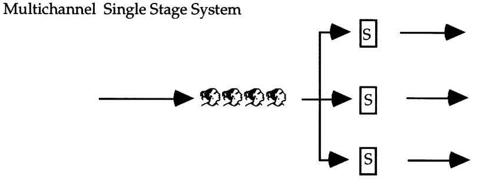
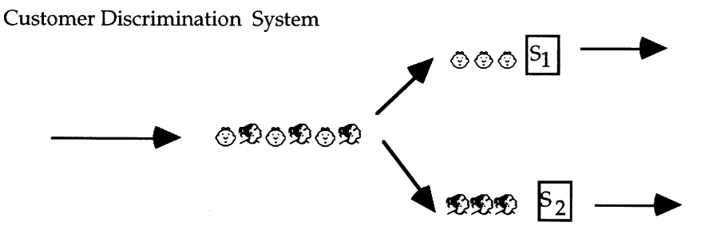
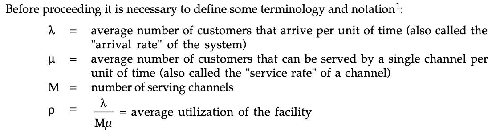
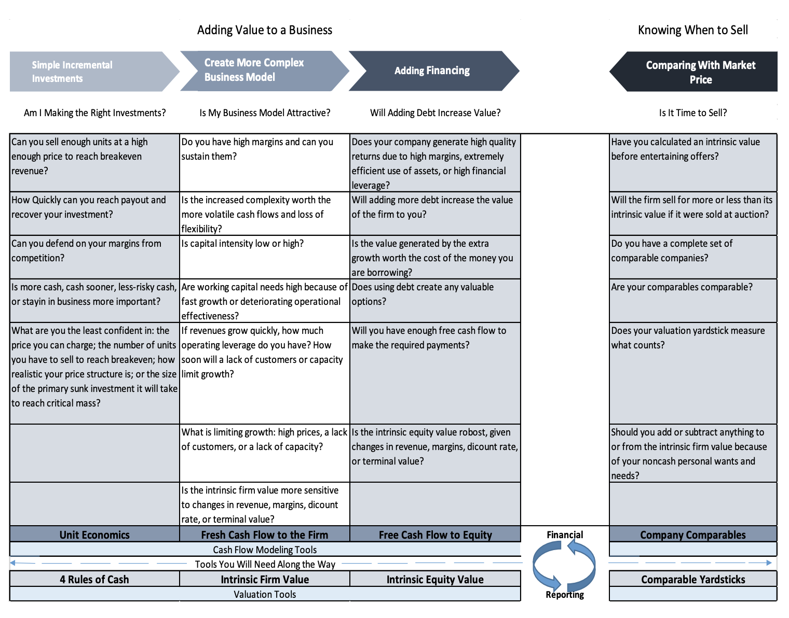
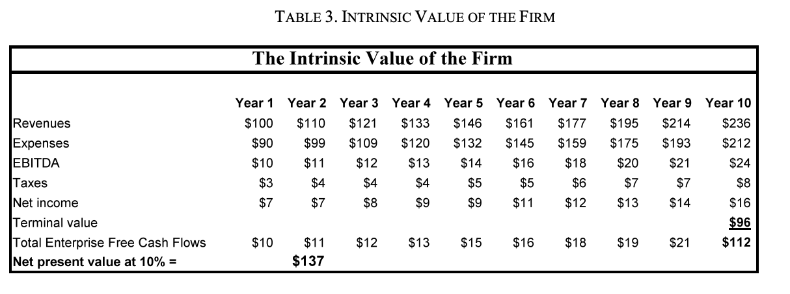

Table of Contents {#table-of-contents .TOCHeading}
=================

[Tools: Customers & Sales 3](#tools-customers-sales)

[1. Customers Framework 4](#_Toc9463684)

[2. Robo Rush 5](#_Toc9463685)

[3. Putting Yourself in the Customer's Shoes 6](#_Toc9463686)

[4. The Art of Haggling 7](#_Toc9463687)

[5. Getting Inside the Mind of Your Customer 8](#_Toc9463688)

[6. Observing Customer Behavior 9](#_Toc9463689)

[7. Dealing with Competition 10](#_Toc9463690)

[8. Targeting the Right Customers 11](#_Toc9463691)

[9. Pricing Strategies & The Seasons of Entrepreneurship
12](#_Toc9463692)

[10. The Art of Pricing Pt. 1 18](#_Toc9463693)

[11. The Art of Pricing Pt. 2 21](#_Toc9463694)

[12. The Sales Funnel 26](#_Toc9463695)

[13. Cha Ching! 29](#_Toc9463696)

[14. A Sales Funnel or Word of Mouth (WOM)? 30](#_Toc9463697)

[15. Answering a Question with a Question 35](#_Toc9463698)

[Tools: Operations 38](#tools-operations)

[Intro to Operations & Costs 39](#intro-to-operations-costs)

[5. Processes 101 43](#_Toc9463701)

[6. Making Incremental Improvements 54](#_Toc9463702)

[7. Operations Midpoint Reflection Pt. 1 59](#_Toc9463703)

[8. Operations Midpoint Reflection Pt. 2 60](#_Toc9463704)

[9. Surveying the Battlefield 61](#_Toc9463705)

[10. Root Beer Simulation 63](#_Toc9463706)

[11. Making a Big Bet in Operations 67](#_Toc9463707)

[Retrench to eliminate costly spare capacity 70](#_Toc9463708)

[Tools: Cash & Valuation 71](#tools-cash-valuation)

[1. Intro to Cash & Valuation Tools 72](#_Toc9463710)

[2. Searching for the Mythical Numbers Guru 76](#_Toc9463711)

[3. Principles of Cash and Valuation 78](#_Toc9463712)

[4. Pre-Tax Cash Flows, Breakeven, and Payout 79](#_Toc9463713)

[5. Monkey Ranch 1 83](#_Toc9463714)

[6. Simple Valuation 84](#_Toc9463715)

[7. Projecting Revenues 86](#_Toc9463716)

[9. Unit Economics in Action 93](#_Toc9463717)

[10. Operating Leverage 97](#_Toc9463718)

[11. Monkey Ranch 2 98](#_Toc9463719)

[12. Are You Smarter Than a 5^th^ Grader (Operating Leverage)
99](#_Toc9463720)

[13. Learning to Speak Financial Accounting 100](#_Toc9463721)

[14. Monkey Ranch 3 104](#_Toc9463722)

[15. Are You Smarter Than a 5^th^ Grader (COGS/SG&A) 105](#_Toc9463723)

[16. Standing In Between Demand & Supply 106](#_Toc9463724)

[17. Are You Smarter Than a 5^th^ Grader (EBITDA) 109](#_Toc9463725)

[18. Becoming a Financial Detective 110](#_Toc9463726)

[19. Are You Smarter Than a 5^th^ Grader (Costs) 113](#_Toc9463727)

[20. Monkey Ranch 4 114](#_Toc9463728)

[21. Counting Cash In A Simple Firm 115](#_Toc9463729)

[22. Are You Smarter Than a 5^th^ Grader (uFCFF) 121](#_Toc9463730)

[23. Estimating Discount Rates 122](#_Toc9463731)

[24. Estimating Terminal Values 132](#_Toc9463732)

[25. Are You Smarter Than a 5^th^ Grader (Discount Rate)
139](#_Toc9463733)

[26. Intrinsic Firm Value For a Simple Firm 140](#_Toc9463734)

[27. Adding Working Capital Pt. 1 143](#_Toc9463735)

[28. Monkey Ranch 5 146](#_Toc9463736)

[29. Are You Smarter Than A 5^th^ Grader (Terminal Value, IFV)
147](#_Toc9463737)

[30. Adding Working Capital Pt. 2 148](#_Toc9463738)

[31. Adding Debt Pt. 1 157](#_Toc9463739)

[32. Are You Smarter Than A 5^th^ Grader (Working Capital)
163](#are-you-smarter-than-a-5th-grader-working-capital)

[Discovery 163](#_Toc9463741)

[21. E-Myth (pt. 1 & 2) 164](#_Toc9463742)

[22. The War of Art (Resistance) 165](#_Toc9463743)

Tools: Customers & Sales 
=========================

1.  Customer Framework

2.  Robo Rush

3.  Putting Yourself in the Customer's Shoes

4.  The Art of Haggling

5.  Getting Inside the Mind of Your Customer

6.  Observing Customer Behavior

7.  Dealing With Competition

8.  Targeting the Right Customers

9.  Pricing Strategies & The Seasons of Entrepreneurship

10. The Art of Pricing Pt. 1

11. The Art of Pricing Pt. 2

12. The Sales Funnel

13. Cha-Ching

14. A Sales Funnel or Word of Mouth

15. Answering a Question with a Question

16. Conversational Rhythm

17. Dreading Sales

18. Personal Selling

<!-- -->

1.  []{#_Toc9463684 .anchor}[Customers Framework]{.underline}

{width="6.5in" height="7.472916666666666in"}

2.  []{#_Toc9463685 .anchor}[Robo Rush]{.underline}

3.  []{#_Toc9463686 .anchor}[Putting Yourself in the Customer's
    Shoes]{.underline}

-   **3 ways to put yourself in the customer's shoes:**

1.  Observe how customers make decisions about products or services that
    satisfy similar needs or desires.

2.  Ask insightful and probing questions.

3.  Run experiments to test the actual buying behavior of a customer.

-   These techniques can help you predict prices, unit volume, the
    length of the sales cycle, the timing and magnitude of revenue, and
    the cost of generating sales.

-   Too many would-be entrepreneurs believe, \"If I build it, they will
    come.\" Following this self-centered strategy yields a high
    probability of pouring lots of money into a dark hole.

-   A master entrepreneur takes every opportunity to observe the buying
    habits of potential customers and tries to form hypotheses about
    their motives. This leads to questions that help you dig more deeply
    into the emotions and habits that drive buying behavior.

-   Even carefully crafted and deeply probing questions have their
    limits. Some customers refuse to tell you the truth. Others change
    their minds. Many cannot articulate why they buy what they do.

-   The best way to get inside a customer\'s shoes is to design
    experiments that help you predict buyer behavior before you sink
    large amounts of money into irretrievable investments such as
    factories or direct sales forces.

-   **Observe. Draw conclusions. Question. Refine your theories. Run
    experiments. Do more of what works. Do all of these before you make
    large commitments of time and money. At its essence, this is what
    bootstrapping entrepreneurship is all about: adding value, one
    customer at a time.**

4.  []{#_Toc9463687 .anchor}[The Art of Haggling]{.underline}

**Practice RLC: Rat Like Cunning:**

-   **Practice Ferreting Out Self-Interest**: Promise yourself that, in
    the next fifty encounters, you will ask questions until you have
    uncovered someone's real self-interest in a decision

-   **Practice Being Told "No"**: Just start selling. Once you've been
    told "no" a hundred times while selling door-to-door, the hundred
    and first time won't hurt as much.

-   **Practice Haggling**: How do you become a master haggler? Next time
    you are in a store, just ask: "Is that the best you can do?" Pause.
    Don't say a word. Once you get an answer, repeat the question with
    more emphasis.

-   **Practice Not Paying Cash**: This one is a little harder to
    practice But gather up some things you don't want and head for a
    flea market. Spend a few hours finding things you like better than
    what you have, and try to negotiate a trade.

-   **Practice Limiting your Downside and Picking up Free Options**:
    Begin looking for opportunities to trade away risks to people who
    would rather bear them. Then ask for free options

-   **Practice Being Skeptical**: Next time you are tempted to take a
    position based on emotion, pause. Suspend judgment. Ask "why?" the
    person is taking a position. Listen. Request concrete evidence, then
    ask "why?" again and again as you drill towards the truth.

5.  []{#_Toc9463688 .anchor}[Getting Inside the Mind of Your
    Customer]{.underline}

Q: How do actual customers make decisions to buy a product or service?

A: They seldom make decisions on reason alone and are often emotionally
swayed.

6.  []{#_Toc9463689 .anchor}[Observing Customer Behavior]{.underline}

7.  []{#_Toc9463690 .anchor}[Dealing with Competition]{.underline}

-   Moral of the story: competition will arrive. Sooner than you think.
    That\'s the nature of creative destruction and a free economy.

-   The game is won through trial and error, one small operation
    experiment at a time. Rarely you'll see a way to change the entire
    competitive game, and build something even larger and more
    profitable.

8.  []{#_Toc9463691 .anchor}[Targeting the Right Customers]{.underline}

-   When we talk about "targeting," we're still talking about grouping
    customers, but as a trial and error" process, using a
    customer-by-customer series of experiments carried out by the sales
    department, carefully observing how and why customers buy, and
    creating provisional segmenting categories.

-   The ability to target the most attractive customers first, while
    efficiently expanding production capacity at the lowest risk
    possible, is one of the most important skills for any entrepreneur.
    There is little "science" to targeting. Rather, it is an art. You
    must observe and unearth needs, perform small experiments, and use
    these to correlate observable traits with unobservable internal
    needs, so that your business can focus on delivering exactly what
    your customers want, when they want it, and at a price and cost that
    allows you to make a healthy profit.

-   **Tips for Collecting, Organizing, and Displaying Customer Data**

    There is no magic formula for targeting and satisfying customers. In
    a competitive marketplace, companies are constantly looking for ways
    to identify and satisfy discrete groups of customers in ways that
    are difficult to copy. Finding such a strategy is a mixture of art
    and luck, often obvious only in hindsight.

-   **Tip One: Identify Customer Needs**

    -   Asking Potential Customers

    -   Observing Buyer Behavior

    -   Observing Usage Patterns

-   **Tip Two: Match Customer Needs to Observable Attributes**

-   **Tip Three: How Price, Location, and Messaging Affect Revenues per
    Segment**

-   **Tip Four: Identify the Most Profitable Customers (in the short
    run)**

-   **Tip Five: Identify the Most Profitable Customers (in the long
    run)**

    -   Customer Lifetime Value

    -   Evangelizing Customers

    -   Mapping Competitors and Substitutes

        []{#_Toc9463692 .anchor}[9. Pricing Strategies & The Seasons of
        Entrepreneurship]{.underline}

**Season One: Startup**

In startup season, just remaining in business is Priority One. What does
that mean? It means focusing on every single customer and every single
unit sold.

It's simple: You need revenue and you need it now---you've got
fixed-period costs (FPC) like rent and payroll to cover. And in order to
cover those costs effectively, you've got to get the price right.

Ask yourself, "Am I attracting an inferior group of customers who are
trained to ask for discounts?" And, "How will discounts like these
affect contribution to my fixed-period costs and my progress toward
breakeven?" Having to say "no" to any sale this early
is---obviously---tough. But it's necessary. And think about this, too:
How's the temptation to discount a symptom of a larger problem? Is the
real problem that you haven't found customers who are willing to pay for
the value you provide? If so, that needs to be addressed now, before you
go any farther.

{width="6.5in" height="1.94375in"}

**Season Two: Shifting Focus to the Segments That Make a Market**

Now your pricing strategy must shift its focus from individual units and
customers to segments: groups of customers who share common
characteristics. Pricing is no longer a matter of your judgment on a
case-by-case basis---you need more standardized policies that others can
execute.

Decision time: When you've divided customers into segments, which
segment should you commit your pricing strategy? The one that will pay
the most? The one that will buy the most? Both?

**Skim or penetrate?**

During startup, you priced high to reach breakeven quickly (or, in a
less likely and more risky scenario, you priced low to attract lots of
early customers to cover high fixed-period costs). But now it's time to
decide what your pricing strategy will look like long term.

Do you price high to skim the customer segments who place the highest
value on your product, or do you price low to penetrate, to capture as
much of the market as possible? Let's stick with the water example to
illustrate.

{width="3.597014435695538in"
height="2.079907042869641in"}

[Pricing High (Skimming)]{.underline}

By pricing high, you'd capture most of the value in serving a single
glass of water to the dying millionaire, but the price is far above the
value (maximum benefit) perceived by the other segments, so you'll only
sell one glass.

[Pricing Low (Penetrating)]{.underline}

By pricing low, you'll need to sell as many units as possible across all
the segments. But pricing low means giving the customers in segments A,
B, and C a disproportionately large amount of the value added.

{width="6.5in" height="2.6180555555555554in"}

**Why not just charge different segments different prices?**

Charging different customers different prices is easier if you are the
only salesperson, making snap judgments about each customer. It becomes
complicated and difficult to execute when you try to codify this
judgment to pass along to salesman and other employees.

**An important tradeoff this season: early payout or long-term
profits?**

Season two is about making strategic decisions, one segment at a time.
But reaching these segments---to advertise and educate them about the
benefits of your product---often requires expensive investments in
marketing and direct-sales forces, which in turn means charging higher
prices to fund these efforts. But, at the same time, you want to keep
prices low to encourage more early trial. But, without massive volume,
pricing low might not give you the cash you need to encourage early
trial to begin with.

But pricing low and spending a great deal on marketing means risking
large amounts of money to fund losses on a product that may never sell
enough units to reach breakeven or payout. Likewise, pricing high and
not investing in sales and marketing may lead to failure because
uneducated customers are unwilling to pay a high price for unknown
benefits

[The bottom line? As you segment and price, be sure to account for the
time and money it'll take to reach those segments.]{.underline}

{width="6.5in" height="1.9972222222222222in"}

**So, price aside, how should you go about segmenting?**

You could approach segmenting in two different ways: 1) by focusing your
portfolio of products and services and how they satisfy customers in
various ways, or 2) by targeting the customer buying experience

[Segmenting by Products and Services]{.underline}

Customer needs usually fall into the following categories. Ask yourself
how your product or services stacks up in each:

-   Performance. How well does your product or service deliver on
    particular promises in ways that can be measured?

-   Image. How does it change the way customers feel about themselves?

-   Risk. Does the buyer face any risk by purchasing your product? If
    so, how can this be lowered or eliminated?

-   Simplicity. Is your product easy to understand?

-   Convenience and availability. Is it easy to find and buy?

[The Customer Buying Experience]{.underline}

Another way to segment is through the way a customer buys and uses the
product and service. For example, your customer's experience with your
product is likely to include the following steps:

-   Research, costing, pricing, and planning a purchase

-   Purchasing/ordering

-   Delivery

-   Use

-   Billing

-   Post-sale services

No matter how well you segment your customers, soon competitors will
begin to court those at the margins, those who don't quite "fit." The
next section describes how to adapt your products and strategies
when---and hopefully before---competitors come knocking.

**Season Three: Maturity and Beyond**

It's no longer about the unit-by-unit, customer-by-customer focus of
startup. And it's no longer just about segmenting.

You're now at a precarious juncture when it comes to pricing. With
competitors and substitutes in the mix, your products or services will
begin to feel the magnetic tug toward commoditization---despite how good
and unique you think your products portfolio is. You could begin
discounting to regain or maintain customers who are beginning to look
elsewhere. But you faced a similar dilemma about discounting during
startup, didn't you?

It's time to take action. And that means revisiting your pricing and
segmenting strategies.

**The risk of marginal pricing**

There are at least three ways to resist commoditization and having to
price low, almost all of which require re-segmenting customers and
products and ranking them based on profitability.

1.  [Rank customers based on profitability]{.underline}

You can calculate the profitability of each customer, or even each
order, if you look for situations where you are delivering a high
benefit for a low price. Either raise prices on these already
high-profit customers or target more of them. And most importantly,
"fire" the low profitability customers to make way for more profitable
customers. This way you won't have to add capacity. Refocus your sales
on these more desirable customers: get close to them, build and renew
trust, provide them with more and more complex and important offerings.

2.  [Rank products and orders based on profitability]{.underline}

You can also look more closely at the buying process. Which of your
products is providing the most customer value, and where in its purchase
cycle is the value the highest? Once identified, improve upon those best
products and perfect the stages of the buying process that carry the
most value. Bring up to speed the stages that bring the lowest value.
And always try to move to deliver more for less

**Remember:** Pricing is not a matter of deciding what amount you want
to demand for a product or service, but a matter of creating and sharing
value with customers. You want to constantly look for ways to create
more value, not quibble over negotiating for a smaller and smaller share
of a shrinking value pie.

3.  [Rank channels based on profitability]{.underline}

Which channels are bringing the most profit and growth? Rank your most
profitable with your least---like you did with customer segments---and
focus on expanding the most profitable ones. Watch out: If increasing
sales are coming from a low-margin channel like Walmart, soon average
profits as a percentage of revenues will start to decline

{width="6.5in" height="2.066666666666667in"}

**Summary**

Your pricing strategy changes throughout the entrepreneurial seasons. In
the startup season, pricing is a matter of talking customer by customer
and measuring unit by unit the contribution that is made toward
fixed-period costs, all in a frantic effort to reach breakeven. If you
reach breakeven, the role of pricing changes. Now you have gathered
enough data on different customer segments to decide which segments to
pursue and in what order. Your goals shift from mere survival to
accelerating payout and maximizing profits (which often are in conflict)
and you now group individual customers into segments, so you can develop
standardized processes and routines to serve them more efficiently.

These processes and routines---built segment by segment through trial
and error---will become the source of your competitive advantage: your
differentiation. In the final season, you will face the entropy of
success: Complacency. Too much complexity. Growing overhead. Once again
it is time to refocus customer by customer, product by product,
experience by experience to look for areas to add a great deal of value,
for as little cost as possible.

10. []{#_Toc9463693 .anchor}[The Art of Pricing Pt. 1]{.underline}

**What is a Price?**

A price is really just a proxy, a number used to state one person's
subjective value of an object or service, stated in a currency, like
dollars and cents.

Most entrepreneurs think of price in one of three ways:

1.  **Cost-plus based pricing** takes the cost in time and materials to
    make and deliver a product and then adds a cushion of profit. The
    profit added may be a fixed amount or it may vary as a percentage of
    cost. Cost-plus pricing has the benefit of being relatively simple:
    It's fairly easy to calculate the cost of a product and add a margin
    of profit. The drawback to cost-plus pricing is that it doesn't
    consider the value added for customers, meaning you could be pricing
    far lower than necessary, and leaving substantial profits on the
    table.

2.  **Value-based pricing** focuses on the benefit perceived by
    customer. The advantage to value-based pricing is that it attempts
    to capture some or most of the value you create. The drawback is
    that it requires you to "put yourself in a customer's shoes" to
    discover how much value a customer places on your product or
    service. Since this is a subjective and ever-changing number, it is
    difficult to estimate for even one customer, much less a
    heterogeneous collection of customers.

3.  **Value-based pricing** focuses on the benefit perceived by
    customer. The advantage to value-based pricing is that it attempts
    to capture some or most of the value you create. The drawback is
    that it requires you to "put yourself in a customer's shoes" to
    discover how much value a customer places on your product or
    service. Since this is a subjective and ever-changing number, it is
    difficult to estimate for even one customer, much less a
    heterogeneous collection of customers.

**Pricing in the Real World: Sharing the Value You Create with
Customers**

So which of the three approaches to pricing is best? Actually, none of
them in isolation, all of them in concert. Each approach---cost-plus
pricing, value-based pricing, and competition-based pricing---has its
merits, but each is only a static way to think about pricing.

But pricing isn't a static concept. It's a dynamic conversation between
entrepreneurs and consumers, a way of dividing the value created by
trading, set amidst the competitive landscape of companies trying to
steal each other's most marginal customers.

**Three important observations about prices:**

1\. Setting a price determines how a company and its customer share the
value created in a transaction.

2\. Advertising and education can increase the overall value of a
transaction, allowing you to raise the price per unit.

3\. Competitive pressures can force you to lower prices, even to a point
that forces you into bankruptcy.

**What Is the "Right" Price?**

So price per unit can vary all the way between variable cost per unit
(at least in the short run) and the maximum benefit offered to the
customer, if the customer is fully aware of the benefit and has no other
alternatives (substitutes).

So where should you price in this continuum? Apart from any type of
legal constraints or consideration of competitors' pricing, the decision
largely depends on:

1.  [The type of product or service you are offering]{.underline}

    a.  **Impulse Needs** (Impulse items are products or services a
        customer buys largely because "they are there" when the mood
        strikes. Think of a candy bar or a child's toy or a magazine
        sold at the checkout aisle of the supermarket).\\

    b.  **Utilitarian or Functional Needs** (These typically involve a
        need where the value can be rationally computed by the customer.
        Think of consumers calculating the benefit of buying a lawnmower
        and mowing the yard themselves versus paying a landscaping
        service).

> {width="6.5in" height="3.1145833333333335in"}c.
> **Image or Complex Needs** (These usually say something about the
> user's identity (for consumer goods) or involve solving complex
> problems for business customers).

[2. Whether your strategy is to "skim" or "penetrate" a
market]{.underline}

Your financial and pricing strategy can often be simplified as a
decision to skim and price as high as possible, or to penetrate and
price low to capture a large share of a market quickly.

**Skimming** means pricing high to skim the highest need customers,
adding successive segments of increasingly lower-need customers to build
volume.

**Penetrating** means pricing low to attract as many customers as
quickly as possible, so you can spread large fixed-period costs over as
many units as possible.

{width="6.5in" height="1.68125in"}

**Summary**

Many take prices for granted, seeing them simply as the amount of money
you pay or receive for a product or service. But the savvy entrepreneur
sees prices, and the art of pricing, as a far more complex dance, the
creation and sharing of value between company and customer, performed in
the presence of competitors who are trying to steal customers.

One of the miracles of the free market is that, in the absence of fraud
or coercion, no sale ever takes place between a buyer and seller that
doesn't add value for both. Price is simply the result of an agreement
of how the rewards will be shared between the parties.

No matter what type of product and service you choose to make and
deliver, or whether you plan to skim or penetrate a market, pricing will
remain an art---subject to trial and error, practice and mastery---more
than a science of market studies and calculation.

Practicing this art, and continuing to look for new ways to add value to
customers, while avoiding the ruinous price wars that come from
competing on price alone, almost certainly may add to your profits, and
just may save your business.

11. []{#_Toc9463694 .anchor}[The Art of Pricing Pt. 2]{.underline}

{width="6.5in" height="2.6902777777777778in"}

**Start with Supply**

The danger of this "build it and they will come" approach is that it
often encourages people to build businesses that never attract
customers. Time and again we find entrepreneurs who make large sunk
investments, certain that customers will want their product, only to
find that a market never existed.

**Starting with the Customer **

How you have chosen your customer, your primary sunk investment, and the
"units" you produce and deliver, will be the difference between success
and failure. Unit Economics is a framework to help you make the very
best choices possible. An entrepreneur once defined profit as
"over-recovered" fixed cost. In Unit Economics, you learn to correctly
define the sunk investments and fixed costs your venture will require.
Then you will see if you are likely to attract enough customers who will
buy enough "units" at a high enough price to make the investment
worthwhile. And you will learn to do all of this before you make the
sunk investment.

**Bridging the Gap Between Demand and Supply **

An entrepreneur matches a set of needs with the specifications for a
product that satisfies that need. The glue that holds these two "units"
together is the benefit you offer to the customer when using your
product---a product that must be better, faster, or cheaper than any
other way of satisfying that need. The combination of the "unit of
desire" inside the customer, the "unit of production" given to the shop
foreman, and the benefit the customer gets from using the product,
successfully bridges the gap and forms the foundation of your business.
This is the framework of unit economics.

**Demand: Customers, Prices, and Volumes **

You always start with a customer need and what the customer is willing
to pay to satisfy it. But this answer is too simple. You cannot survey
every customer, ask them what they want, and customize a solution. The
cost of discovery and customization is too great. You need to find a
group of customers with relatively homogeneous needs.

[How do you determine a price?]{.underline}

1.  **Quantify the maximum value your customer places on your product**.

    This is the highest possible price you could charge (because no one
    would buy it after that).

2.  **Measure your costs per unit.**

    (Costs can vary depending on volume, but we'll get to that later.
    For now, choose a volume and measure cost per unit at that volume).
    The difference between the max value and the cost per unit is the
    "shared value," because it's the total value of the product that
    must get divided up between you and the customer.

3.  **Decide how much of the shared value you want to keep to yourself
    and how much you will give to the customer.**

    Your price will be based on how much value you want to keep and
    concede. All of this works beautifully, until one little problem
    arises: a competing product or substitute of the same value starts
    selling for less. With no apparent difference in the value received
    by the customer, no customer will pay more for your product. So your
    new ceiling price is the price of the substitute. Decide again how
    much shared value you want to offer the customer and how much you
    want to keep, and you've determined your new price.

{width="5.658536745406824in"
height="3.5287248468941383in"}

**Value **

But how does a customer decide on the value of a product? Value is
judged in the mind of an individual. The maximum price a customer will
pay is set inside the mind of each consumer as they make subjective and
sometimes irrational tradeoffs between the money they have, the
intensity of the desires they wish to satisfy,

{width="6.5in" height="3.2729166666666667in"}

**The Mistake of Using Costs to Set Prices **

Many people use a "cost-plus" approach to pricing because it is easier
to calculate the costs of production than to crawl inside the heads of
your customers to measure their whims. That is why this note started
with you stumbling onto an empty pipeline, and why so many people take a
"build it and hope they will come" approach. But setting prices based on
costs is a mistake. If costs lead you to price below what your customers
are willing to pay, you may give away too much value to the customer. If
costs lead you to price above what your customers are willing to pay,
you will not sell a single unit, and all of your costs will truly be
"sunk." Basing prices on costs can cause you to miss a lucrative
opportunity.

**What is a Primary Sunk Investment? **

A primary sunk investment is:

• The most important investment a company makes to satisfy its chosen
set of customers.

• Either the largest investment the company makes or the asset that
would be the most expensive to duplicate.

• A process or asset that allows a company to do the most important
tasks again and again in the most efficient way possible to deliver
exactly what the customer will pay for.

• The single most important investment to: (1) invent a new product or
create a new product; (2) attract customers; (3) manufacture a product;
or (4) deliver a product. 15 It typically serves every customer in the
same way.

{width="6.5in" height="4.685416666666667in"}

**Summary**

Unit economics is about making sunk investments---primary sunk
investments---where you are confident you can "over-recover" the
investment to make a profit. When you start your business, it is
critical to have defined your primary sunk investment, and the "units"
its standardized process is designed to deliver. You must understand
that the key attributes of these "units of production" are critical for
satisfying the "units of desire" in your subset of customers, how many
of these customers are likely to buy and what price they will pay. You
then can calculate the variable and fixed period costs required to
attract, make, and deliver these units, and how long it will take to
recover your primary sunk investment and other start-up costs. All of
business---from water pipelines to theme parks---is a matter of making
and recovering sunk investments in a standardized set of processes. If
you are clear about the "units" you are selling, and the primary sunk
investment you have made, the chances are much higher that you will
"over recover" your fixed and sunk costs and survive.

12. []{#_Toc9463695 .anchor}The Sales Funnel

-   A sales funnel can help:

    -   1\. Predict how sales calls today will impact revenue later.

    -   2\. Calculate the average cost of making each sale and acquiring each
        customer.

    -   3\. Gauge the quality of prospects you attract, quantify the cost of each
        step of the sales process and note the number of potential customers who
        drop out at every step, so it becomes clear where you need to focus your
        efforts to improve your sales process.

-   Sales Funnel's vs. Production Lines

    -   Assembly lines are about doing the right thing. Sales funnels
        are about asking the right questions, offering the right
        choices, watching what customers do, and praying they decide to
        buy in the end. 1

-   Just How Difficult is it to Predict Customer Behavior?

    -   The actions of human beings are hard to predict and influence,
        but if you break down a sales process into discrete steps, pay
        close attention to why some prospects are more likely to close
        than others, and measure how many prospects defect at each step,
        you can begin to make the sales process more predictable.

-   The Value of a Quick "No"

    -   The only thing better than a quick "yes" in sales is a quick
        "no." A quick "no" from a disinterested prospect frees you up to
        search for a customer who truly needs what you are offering. The
        worst type of prospect is one that takes up an inordinate amount
        of your time and, only after a great deal of time, attention,
        and money has been spent, decides not to buy.

{width="4.72619094488189in"
height="4.199543963254593in"}

**Building a Sales Funnel**

-   **The Major Questions for Sales Funnel Design:** The design of your
    sales process will depend on whether your customers are:

> \(1) easy or hard to find,
>
> \(2) eager or reluctant to buy, and
>
> \(3) worth a lot or a little to close.

-   Customers who are easy to find, eager to buy, and valuable to close
    are an entrepreneur's dream. Customers who are difficult to find,
    hard to convince, and of little value to close are an entrepreneur's
    nightmare. It is with the "in-between" customers that the right
    sales process can make the difference between success and failure.

**The Major Decisions in Sales Funnel Design**

-   Do you want to grow quickly or slowly?

-   Will your campaign be broad or targeted?

-   Will you have an intense sales effort to convince prospects to buy,
    or a more restrained approach?

-   Will you go to your customer, or have them come to you?

-   Will you take all comers, or be selective about the customers you
    choose?

**What Is the Difference between a Lead, a Prospect, and a Qualified
Prospect?**

-   Unfortunately, we cannot tell from outward appearance when a
    customer moves from being a lead---someone who is mildly
    curious---to being a prospect who is more likely to close. We can
    ask our customers questions, but they do not always answer
    truthfully and often change their minds.

**Staging Investments**

-   We need to test as many sales funnel alternatives as possible before
    committing to large upfront and fixed-period costs.

-   Your initial estimates will likely be wrong. That is why it is
    important to stage, test, and carefully monitor the yield and costs
    at each step of the process. The longer your sales cycle and the
    faster you intend to grow, the more important it is to collect data
    early in the process so that you can adapt quickly

**Sizing the Funnel**

-   Once you've estimated how your sales cycle, the average costs per
    sale, and the capacity of the funnel varies for different sales
    funnel arrangements, you can compare your estimates of how quickly
    sales will increase to the overall size of the market.

-   You'll want to size the sales funnel so that you attract customers
    quickly enough to discourage competitors from entering your niche,
    but recover all of your costs and make a healthy profit before you
    run out of prospects.

**Some Tips on the Sales Process**

-   It is generally much cheaper to sort and qualify customers who are
    interested in buying than to try to interest and persuade customers
    (changing minds is expensive).

-   Each additional step in a sales funnel adds an exponential amount of
    complexity and cost. Communications and handoffs from one step in
    the process to another are expensive and difficult to execute.

-   Targeted approaches tend to work better than broad approaches.

-   Convincing customers to come to you is usually far more effective
    than having to go to them.

**Summary**

-   Designing and building a sales funnel is much more difficult than
    designing an assembly line. Using machines to cut and shape widgets
    is much easier than attracting, informing, sorting, and closing
    finicky potential customers.

-   The difficulty involved makes it even more important to design a
    sales funnel that fits with the type of customer we want to attract
    and the benefits we offer. Each time we spend money to attract,
    sort, or convince customers, we must measure the number and quality
    of the prospects that move to the next step. That way, over time, we
    will learn to predict how to turn customers' needs into revenue as
    quickly as possible, at the lowest possible cost per sale, and to
    recover the costs of our sales funnel long before we run out of
    potential customers.

13. []{#_Toc9463696 .anchor}Cha Ching!

**A Note**

-   Far too many mid-level managers and corporate executives spend far
    too much time with whitecollar marketers like themselves and far too
    little time on the salesroom floor with salespeople, carefully
    tracking leads as they move through the sales process to become
    customers and then repeat customers.

-   The best companies pay special attention to improving their sales
    funnels, but even in these companies, the ability to build (or
    rebuild) a sales funnel from scratch is missing, perhaps because the
    existing funnel is taken for granted.

-   That may be because sales funnels are built by founders initially,
    not in a deterministic way, but through careful trial and error, as
    the founding entrepreneur becomes too busy and has to begin
    standardizing and delegating tasks. At each step of building the
    sales funnel, an entrepreneur has to sell through trial and error by
    keenly observing the path that the most valuable customers take and
    by looking to improve the volume of sales and the quality of
    customers, while simultaneously lowering the average cost per sale.

-   This process of constructing an increasingly effective and efficient
    sales funnel requires careful experimentation, a keen eye, intuitive
    leaps, and a fair helping of luck to identify the processes, skills,
    and judgment needed to make a particular sales funnel more
    effective. Despite the difficulty, building an efficient and
    effective sales funnel is well worth the effort. It is often the key

14. []{#_Toc9463697 .anchor}A Sales Funnel or Word of Mouth (WOM)?

A. To design and create a Sales Funnel---a series of steps to attract,
qualify, educate, and close customers.

B. To work hard to delight your first few customers, so that these early
converts begin a Word of Mouth (WOM) movement that results in exploding
revenues.

A sales funnel sounds like a lot of work, but more scientific and
predictable. A word of mouth approach sounds like more fun and
potentially much more lucrative, but harder to predict.

So which is better for your business? The short answer: It depends.

{width="3.592600612423447in"
height="1.8690474628171478in"}

{width="4.013888888888889in"
height="2.6805555555555554in"}

**The Benefits and Drawbacks of Sales Funnels and Word of Mouth**

**Sales funnels**---when well built and implemented---provide a
systematic approach to increasing revenues. Under the right conditions,
every step of the process can be tested to see which messages and
techniques increase close rates, add to customer satisfaction, or
decrease costs. The drawbacks?

-   They're expensive to design and operate and, when done poorly, may
    make customers feel more like widgets on a factory assembly line
    than highly valued individuals. And the only way to increase sales
    is to pump more and better leads into the start of the funnel.

-   Sales funnels tend to work better for higher-priced functional
    products or simple image-based ones, where benefits can be explained
    and reluctant customers discarded at each step along the way.

**Word of Mouth (WOM)** has the advantage of rapid, often exponential
sales growth, at a very low cost. Plus, done properly, customers may
begin to develop a deep sense of belonging, making it hard for
competitors to lure them away.

-   Word of mouth is easy to recognize and fun to talk about, but
    unfortunately it's very hard to execute deliberately. In practice,
    it's difficult to ignite the right spark and keep enthusiasm at
    consistently high levels from one generation of customers to the
    next, because the technique depends largely on the emotions of
    crowds and societal trends.

-   Word of mouth sales also tend to work better for more complex
    "image" or "identity" products and services, or for faddish impulse
    items than for more mundane, functional products.

**How Do You Create and Execute a Successful Word of Mouth Campaign?**

1.  Start with a product that involves image or identity element of
    image or belonging---they say something about who you are, and they
    describe deep, important issues that you want to share with your
    "tribe."

2.  Create a message that's memorable and "sticky" so it spreads easily.

    a.  It is simple *"Get it there."*

    b.  It surprises you; it is unexpected *Tom's Shoes promises to
        donate a pair to a child in need.*

    c.  Concreteness Your senses are excited. Emotional words lead to
        something you can feel and touch

    d.  Credibility There are powerful testimonials from people who do
        not have any conflicts of interest.

    e.  Emotions You are touched deeply, often with a positive feeling
        like hope or gratitude

    f.  Story There is a simple, powerful, often redemptive, story

3.  Delight all your customers---capture, affirm, and arm the
    evangelical ones

    g.  Connectors know lots of people and enjoy bringing them together
        in constructive ways

    h.  Mavens are experts. They specialize in collecting and sharing
        information

    i.  Salespeople are persuaders. They convince people to take risks,
        to try something

    j.  they wouldn't ordinarily try

4.  Keep the conversation going -- make them feel valued part of a new
    movement and an important part of enlisting others in the cause

    k.  Once a customer engages, ask him or her for advice, and show
        that you take their ideas seriously and that you put those ideas
        to work.

    l.  Ask them to test and provide feedback on new products.

    m.  Even ask for suggestions for new products to introduce

5.  Provide incentives, but be careful not to try to purchase loyalty.

6.  Have strong "we believe" statements.

7.  Measure the right markers

    n.  Track what percentage of your customers says "yes" to the
        question, "Would you recommend this product or service to a
        friend?"

    o.  Measure how many new customers come from referrals.

    p.  Count the number of new product ideas submitted by customers.

8.  The right timing helps---a lot. Great stories and deep emotions are
    timeless. But context helps immensely too

No matter how exactly you plan to execute, keep these basic principles
from Seth Godin in mind.

a\. **Transparency.** Your customers aren't stupid. If they think for a
second that you're being inauthentic about your passion for your product
or service (and why should you be, really?), they'll bolt.

b\. **A movement bigger than you.** How does your product or service help
change the world in a significant way?

c\. **Movements that grow, thrive.** WOM is about more that short-term
tactics. How is today part of a growing, dynamic tomorrow?

d\. **Exclude outsiders.** How well have you chosen your customers and
followers so that you don't expend wasted effort elsewhere?

**So Which Is Better---a Sales Funnel or a Word of Mouth Campaign?**

So which is it? The truth is---you need them both.

{width="6.5in" height="2.071527777777778in"}

-   WOM campaigns sound exciting, but they're usually too unreliable and
    unpredictable of a technique on which to bet your future. That means
    that once you find the right customer niche, you need a
    well-designed sales funnel: a repeatable, scalable process that
    gives you a higher probability of surviving startup and the early
    years of the launch phase.

-   But if you have the right products, and sense the spark of delighted
    customers who want to tell their friends, it'd be foolish not to try
    to fan these sparks into a WOM wildfire that could turn your best
    customers not only into a free sales force, but into a tribe that no
    competitor could lead astray.

+-----------------------+-----------------------+-----------------------+
|                       | **Sales Funnel**      | **Word of Mouth**     |
+=======================+=======================+=======================+
| **Definition**        | The sales funnel      | -   viral marketing   |
|                       | breaks the sales      |                       |
|                       | process into the      | -   product or brand  |
|                       | discrete steps        |     evangelists---spr |
|                       | required to attract,  | ead                   |
|                       | educate, qualify, and |     the word to new   |
|                       | close customers       |     customers         |
|                       |                       |                       |
|                       |                       | -   Every step of the |
|                       |                       |     sales funnel      |
|                       |                       |     still occurs but  |
|                       |                       |     now customers are |
|                       |                       |     performing these  |
|                       |                       |     tasks (usually)   |
|                       |                       |     for free, as they |
|                       |                       |     spread the word   |
|                       |                       |     to friends and    |
|                       |                       |     family and        |
|                       |                       |     convince them to  |
|                       |                       |     buy               |
+-----------------------+-----------------------+-----------------------+
| **Benefits**          | -   When well-built   | -   rapid, often      |
|                       |     and               |     exponential sales |
|                       |     implemented---pro |     growth, at a very |
|                       | vide                  |     low cost          |
|                       |     a systematic      |                       |
|                       |     approach to       | -   done properly,    |
|                       |     increasing        |     customers may     |
|                       |     Revenues          |     begin to develop  |
|                       |                       |     a deep sense of   |
|                       | -   every step of the |     belonging, making |
|                       |     process can be    |     it hard for       |
|                       |     tested to see     |     competitors to    |
|                       |     which messages    |     lure them away    |
|                       |     and techniques    |                       |
|                       |     increase close    | -   tend to work      |
|                       |     rates, add to     |     better for more   |
|                       |     customer          |     complex "image"   |
|                       |     satisfaction, or  |     or "identity"     |
|                       |     decrease costs    |     products and      |
|                       |                       |     services, or for  |
|                       | -   work better for   |     faddish impulse   |
|                       |     higher-priced     |     items than for    |
|                       |     functional        |     more mundane,     |
|                       |     products or       |     functional        |
|                       |     simple            |     products          |
|                       |     image-based ones  |                       |
+-----------------------+-----------------------+-----------------------+
| **Drawbacks**         | -   expensive to      | -   very hard to      |
|                       |     design and        |     execute           |
|                       |     operate           |     deliberately      |
|                       |                       |                       |
|                       | -   when done poorly, | -   difficult to      |
|                       |     may make          |     ignite the right  |
|                       |     customers feel    |     spark and keep    |
|                       |     more like widgets |     enthusiasm at     |
|                       |     on a factory      |     consistently high |
|                       |     assembly line     |     levels from one   |
|                       |     than highly       |     generation of     |
|                       |     valued            |     customers to the  |
|                       |     individuals       |     next, because the |
|                       |                       |     technique depends |
|                       |                       |     largely on the    |
|                       |                       |     emotions of       |
|                       |                       |     crowds and        |
|                       |                       |     societal trends   |
|                       |                       |                       |
|                       |                       | -   usually too       |
|                       |                       |     unreliable and    |
|                       |                       |     unpredictable of  |
|                       |                       |     a                 |
|                       |                       |                       |
|                       |                       | -   technique on      |
|                       |                       |     which to bet your |
|                       |                       |     future            |
+-----------------------+-----------------------+-----------------------+
| **Sales process**     | "Attract-Educate-Qual | "Attract-Educate-Qual |
|                       | ify-Close,"           | ify-                  |
|                       |                       |                       |
|                       |                       | Close-Connect-Affirm- |
|                       |                       | Arm"                  |
+-----------------------+-----------------------+-----------------------+

**To spark powerful WOM:**

1.  An amazing and useful product or service

2.  Fierce passion for that product or service and for letting those who
    can benefit from it know about it.

**Basic principles from Seth Godin:**

1.  Transparency. Be authentic

2.  A movement bigger than you. How does your product or service help
    change the world in a significant way?

3.  Movements that grow, thrive. WOM is about more that short-term
    tactics. How is today

> part of a growing, dynamic tomorrow?

4.  Exclude outsiders. How well have you chosen your customers and
    followers so that you don't expend wasted effort elsewhere?

<!-- -->

15. []{#_Toc9463698 .anchor}Answering a Question with a Question

**There are four prime Answering a Question with a Question
situations:**

> 1\. Gathering information and testing the water
>
> 2\. Controlling the interview
>
> 3\. Situations you can't handle
>
> 4\. Dealing with stalls & objections

+-----------------------+-----------------------+-----------------------+
| **Types**             | **Objective**         | **Sample Questions**  |
+=======================+=======================+=======================+
| gathering information | Discover their needs, | -   That's an         |
| and testing the water | desires, and          |     interesting       |
|                       | potential problems    |     question . . .    |
|                       | upfront. This way,    |     why do you ask?   |
|                       | you won't walk into   |                       |
|                       | any traps later       | -   Good question . . |
|                       |                       |     . but why did you |
|                       |                       |     ask me that one   |
|                       |                       |     just now?         |
|                       |                       |                       |
|                       |                       | -   I get the feeling |
|                       |                       |     that . . . is     |
|                       |                       |     that a fair       |
|                       |                       |     statement? (If    |
|                       |                       |     the answer is no, |
|                       |                       |     ask why.)         |
|                       |                       |                       |
|                       |                       | -   We need to        |
|                       |                       |     discuss . . . is  |
|                       |                       |     that a fair       |
|                       |                       |     statement? . . .  |
|                       |                       |     fine. You start   |
|                       |                       |                       |
|                       |                       | -   Off the record,   |
|                       |                       |     what \[price,     |
|                       |                       |     features, etc.\]  |
|                       |                       |     were you looking  |
|                       |                       |     for?              |
|                       |                       |                       |
|                       |                       | -   If you had a      |
|                       |                       |     magic wand that   |
|                       |                       |     could produce the |
|                       |                       |     ideal solution to |
|                       |                       |     your problem,     |
|                       |                       |     what would it be? |
+-----------------------+-----------------------+-----------------------+
| controlling the       | strike a balance      | -   That's an         |
| interview             | between getting your  |     interesting       |
|                       | customer to talk and  |     question, but     |
|                       | helping you control   |     you're way ahead  |
|                       | the situation. Ask    |     of me. Can we     |
|                       | questions that will   |     back up for just  |
|                       | change the pace of    |     a moment?         |
|                       | the sales interview   |                       |
|                       | or will help you      | -   Let me see if I   |
|                       | focus on a certain    |     have this         |
|                       | point                 |     straight . .      |
|                       |                       |                       |
|                       |                       | -   I don't           |
|                       |                       |     understand. Can   |
|                       |                       |     you tell me more  |
|                       |                       |     about . . .? I'm  |
|                       |                       |     not sure. What do |
|                       |                       |     you think?        |
|                       |                       |                       |
|                       |                       | -   Help me with . .  |
|                       |                       |     . what does that  |
|                       |                       |     mean?             |
|                       |                       |                       |
|                       |                       | -   There must be a   |
|                       |                       |     reason you feel   |
|                       |                       |     that way . . .    |
|                       |                       |     what is it?       |
|                       |                       |                       |
|                       |                       | -   \[Name\], ask me  |
|                       |                       |     a question . . .  |
|                       |                       |     good question . . |
|                       |                       |     . why did you ask |
|                       |                       |     me that one just  |
|                       |                       |     now?              |
+-----------------------+-----------------------+-----------------------+
| navigating situations | Instead of making     | -   We have a problem |
| you can't handle      | promises you can't    |     . . . do you see  |
|                       | keep or shutting down |     a way we can      |
|                       | completely, ask       |     overcome this     |
|                       | questions. Your       |     problem?          |
|                       | prospect's answers    |                       |
|                       | will guide you out of | -   Do you mean to    |
|                       | dangerous territory   |     say . . .?        |
|                       |                       |                       |
|                       |                       | -   When you say . .  |
|                       |                       |     . what does that  |
|                       |                       |     mean?             |
+-----------------------+-----------------------+-----------------------+
| dealing with          | pre-empt any          | -   Sometimes when I  |
| objections            | objections that might |     talk to our       |
|                       | arise by asking an    |     customers---and   |
|                       | up-front question     |     it may not be the |
|                       |                       |     case here---they  |
|                       |                       |     tell me one of    |
|                       |                       |     the following . . |
|                       |                       |     . which of these, |
|                       |                       |     if any, is a      |
|                       |                       |     concern to you?   |
|                       |                       |                       |
|                       |                       | -   Really? I'm       |
|                       |                       |     surprised by your |
|                       |                       |     answer. Why did   |
|                       |                       |     you pick that     |
|                       |                       |     one?              |
|                       |                       |                       |
|                       |                       | -   Let me tell you   |
|                       |                       |     what I hear when  |
|                       |                       |     you say that      |
|                       |                       |     \[list            |
|                       |                       |     possibilities\] . |
|                       |                       |     . .which one of   |
|                       |                       |     these explains    |
|                       |                       |     your comment?     |
|                       |                       |                       |
|                       |                       | -   Do you mean to    |
|                       |                       |     say . . .?        |
+-----------------------+-----------------------+-----------------------+

Just remember these three rules:

1\. **Answering a Question with a Question is an ongoing process.** Don't
just ask a question for the sake of asking a question; use the
information you gather from your prospect's answers to inform your next
questions.

2\. **Never answer an unasked question.** Sometimes what sounds like a
question is actually just a statement. Don't make assumptions. Don't
answer what you think your prospect is asking---they could be confused
or thinking aloud. Ask for clarification. For example, "The price is too
high" is not a question. You could respond with, "Does that mean
that...?" in order to get the prospect to nail down their precise
problem.

3\. **If a prospect asks the same question twice, answer it.** If you
continue asking questions, you'll set the wrong tone for the meeting.
The prospect will think you're being coy or playing games.

Tools: Operations
=================

1.  Intro to Operations & Costs

2.  The Goal Pt. 1

3.  The Goal Pt. 2

4.  Scheduling and Sequencing Pt. 1

5.  Processes 101

6.  Making Incremental Improvements

7.  Operations Midpoint Reflection Pt. 1

8.  Operations Midpoint Reflection Pt. 2

9.  Surveying the Battlefield

10. Root Beer Simulation

11. Making a Big Bet in Operations

12. Incentives, Labor, and Human Variability

13. Intro to Queuing Theory

14. Making Tradeoffs in Operations

15. Scheduling and Sequencing Pt. 2

16. Practical Statistics and Probability

Intro to Operations & Costs
---------------------------

1.  [The overarching question of the Operations & Costs course
    is:]{.underline} How do you build a production---or
    service---delivery process that delivers exactly the right product
    or service, in the right quantities, at the right time, with the
    lowest cost per unit and the smallest upfront investment possible?

**Dealing with Bottlenecks:**

1.  Identify the bottleneck

2.  Exploit the bottleneck 

3.  Subordinate everything else to the above decision

4.  Elevate the bottleneck

5.  Go Back to the first step, and repeat

{width="4.608695319335083in"
height="6.193184601924759in"}

2.  The Goal Pt. 1

3.  The Goal Pt. 2

**What is the goal? **

To Increase throughput while simultaneously decreasing inventory and
operating expenses.

-   Throughput: the rate at which the system generates money through
    sales (the money coming in)

-   Inventory: all the money invested in things it intends to sell
    (money in the system)

-   Operating Expenses: the money spent to turn inventory into
    throughput (money you pay to make throughput happen)

**Five Focusing Steps for Continuous Improvement**:

1.  Find the bottleneck.

2.  Get more from the bottleneck's current resources.

3.  Redirect existing resources towards the bottleneck, don't produce
    more than it can or you'll build up inventory.

4.  Increase resources for the bottleneck ONLY once you've squeezed the
    most you can out of it.

5.  Find the new constraint and return to step 1, consider increasing
    resources to other areas to match the bottleneck's improvement.

You could think you're running an efficient system, but your thinking
might be wrong. **If you didn't increase sales, throughput, or decrease
costs, you didn't increase productivity**. 

If you don't know what the real goal is, which you could very well be
wrong about, then you can't figure out what to do to reach the goal.
And **the goal of any business is to make money**. 

If you keep everyone and everything working at full capacity, you'll
naturally build up inventory by creating excess work. A plant where
everyone is working all the time is very inefficient. You can't have a
"balanced plant" without doing excess work. 

Because of **dependent events** and **statistical fluctuations**, you'll
naturally run into **bottlenecks** in the system, kind of like the
fattest kid on a hike slowing everyone down. **The whole system only
moves as fast as the bottleneck**, so it makes sense to focus on
increasing the bottleneck's capacity and tying the rest of the system's
rate to the rate of the bottleneck. In the analogy, put the fat kid at
the front of the line, and make his backpack as light as possible so he
can walk faster. 

Since **output can only deviate up to the maximum level determined by
its dependent events**, but it can deviate down much lower, with
successive dependent events you'll get further and further negative
fluctuations. A kid can come to a halt, but he can only catch up as much
as the kid in front of him, he can never catch up past the point the
previous kid has already walked. 

**Bottleneck:** "A bottleneck is any resource whose capacity is equal to
or *less than* the demand placed upon it. And a non-bottleneck is any
resource whose capacity is greater than the demand placed on it."
\[139\]

**An easy way to find a bottleneck is to look and see what has a big
pile of work in front of it** \[144\]

**To optimize the system, make the flow through the bottleneck equal to
the demand from the market**. Or, a tiny bit less than the demand from
the market. \[139\]

**In most cases you'll have capacity that is hidden from you because
some of your thinking is incorrect**. The first thing you should always
do is see exactly how the bottlenecks are currently operating, and if
you can change how they're used to increase their capacity (before
simply hiring or buying more tools). \[152\]

**If you lose even one hour on the bottleneck, you have lost it forever.
You can't get it back somewhere else in the system**. Your throughput
for the entire system will be lower by whatever amount the bottleneck
produces in that time. \[153\]

Lost time on the bottleneck is lost throughput which means you've lost
the *total output of the whole system*. **If your whole plant earns
\$1,000 an hour, then an hour lost on the bottleneck is \$1,000 lost**.
Make sure it's time isn't wasted by: \[157 / 159\]

-   Sitting idle and not getting used during some break

-   For it to be spending time on output that's already defective

-   Making it work on something you don't need

-   

You can increase the capacity of the bottleneck by: \[159\]

-   Only making it work on what will increase throughput *today*

-   Taking some of the load off the bottleneck and giving it to
    non-bottlenecks

When you make a non-bottleneck do more work than the bottleneck, you
create excess inventory and thus lose money. \[210\]

What you have to do is **figure out how to release materials at the
start of the process exactly according to the capacity of the
bottleneck**. \[216\]

**If you** **reduce your batch size, you increase throughput** **by
reducing inventory held and reducing the amount of cash tied up at any
one time.** It also lets you move faster, since the gaps will be smaller
since the time to process a batch will be lowered as well, and your
total lead time on any project condenses. \[232\]

**Three simple questions:** What to change, what to change to, and how
to cause the change. \[337\]

4.  Scheduling & Sequencing Pt. 1

> **Gantt Chart Basics**

A Gantt chart is a horizontal bar graph used to visualize the sequence
and timing of tasks in a project or process.1 Gantt charts are a useful
planning instrument before a project starts and can be used during a
project to measure progress and make it easier for team members to
communicate.

{width="6.816735564304462in"
height="2.447761373578303in"}

> Creating a Gantt chart is like creating a puzzle. How you solve it
> will depend on your goals and constraints. For example, you may need
> to finish a project as fast as possible. Or you might want to finish a
> project with limited resources before a deadline. Developing a Gantt
> chart helps you visualize and confront scheduling challenges
> associated with your project or process. As you work to define the
> tasks and sequence them, you may need to gather information or
> assistance from your project team or customer. Once a project is
> underway, your Gantt chart can serve as a reminder of the tasks that
> need to be completed each day (or hour or minute) and as a checkpoint
> to make sure each task is being completed on time.

5.  []{#_Toc9463701 .anchor}Processes 101

**Processes**

-   Processes are important for entrepreneurs because dividing a more
    complex task into smaller steps enables the creation of value to be
    standardized---which allows an individual worker to specialize and
    learn to do an individual task better, cheaper, and faster over
    time. With each task in your process specialized, you can hire lower
    cost labor or even purchase a machine to automate the task.

-   Once you have established the specifications demanded by customers
    to satisfy their needs and desires and have decided what range of
    customer need you will serve (which determines how wide a
    variability your process will serve), you can begin to experiment
    with how finely to divide tasks and how to order them.

**Creating a Process**

1\. Define the Customer Need

2\. Designing: Choose which part of the process you will own

3\. Designing: Chart the steps you will control

4\. Execute your process in the real world

5\. Continually improve

**Process Mapping**

Being able to describe, order, chart, and measure individual tasks and
overall processes is a critical skill for entrepreneurs. That means
learning, practicing with, and becoming fluent in the symbols and
conventions of Process Flow Diagrams (or Process Maps), which allow you
to describe and measure a process on paper---and share it with managers
and others---before you try it for real.

Here's a brief vocabulary lesson in the language of Process Flow
Diagrams:

A rectangle represents a single **Task** in the process. A task is
completed at a **workstation** where energy or labor is used to
transform a material or deliver a service. Usually there is a worker in
charge of doing the work, sometimes with the aid of some equipment.
Sometimes tasks are **automated** and do not require a worker.

{width="1.9583333333333333in"
height="1.1527777777777777in"}
{width="5.694444444444445in"
height="1.1111111111111112in"}{width="6.069444444444445in"
height="1.2083333333333333in"}

{width="6.5in" height="1.8097222222222222in"}

1\. **Raw Materials** are inputs of material into the process.

2\. **Work in Process (WIP)** means units of production that have been
partially, but not completely, transformed from Raw Materials into
Finished Goods and are temporarily stored in a queue awaiting the next
step in the process.

3\. **Finished Goods (FGI)** are final products that have been completely
transformed by 8 the process and are ready for delivery to the customer.

**3 Types of Processes**

1.  **Serial Process**

2.  **Parallel Process**

3.  **Batch Process**

{width="6.5in" height="2.4680555555555554in"}

A **Parallel Process** is when the exact same task is done
simultaneously by two or more workstations at the same time, to divide
the flow into multiple streams. Parallel workstations make sense when
it's not cheaper to use a larger machine.

{width="5.0in" height="3.1191240157480316in"}

A **Batch Process** means that a group of products are all acted on by a
workstation at once, rather than one at a time.

**Process Metrics**

The most important measures of the performance of your operation are:

• Reliability. How effective are you at making units that meet
specification?

• Flexibility. How much variability can your process handle? • Capacity.
How many units can you produce in a given time period?

• Lead-time. How long does it take for a customer's order to be filled?

• Overall investment. How much money, including equipment, inventory,
etc., is tied up in the line?

**[Some Definitions]{.underline}**

**Capacity**

How many units (on average) could a given workstation transform in a
period of time? Capacity is important because the overall process
capacity will be constrained by the workstation with the lowest
capacity.

**Output**

How many actual units did a given workstation actually transform in a
period of time, given that the process didn't work exactly as expected?
Actual output is important because it shows how well the workstation is
performing in reality versus what it theoretically could produce.

**Process Time**

How long does it take to transform inputs into one unit of output at a
given workstation? The process time of a task is important because the
sum of all process times from start to finish, will determine how long a
customer must wait before their product is delivered.

**Cycle Time**

How frequently are units completed at a particular process stage? For a
workstation with two workers performing tasks in parallel, the cycle
time will be 50 percent of what it would be with only one worker
performing the task. In general, the equation for calculating cycle time
for a workstation is:

> (Task process time per unit) / (\# of Tasks in Parallel at
> Workstation)

Cycle time is important for an entrepreneur to understand, because cycle
time tells you for a given period of time how many units are being
produced at this workstation. The cycle time for the process as a whole
is the same as the cycle time of the individual component process (or
processes) with the greatest cycle time -- also known as the
"bottleneck" process.

{width="6.5in" height="3.10625in"}

**Idle Time**

A workstation which does not have any work-in-process inventory
available to be transformed is experiencing idle time. Idle time
represents unused capacity at the workstation. Too much idle time at a
workstation is a waste of resources. Depending on the needs of the
overall process, you might seek to increase the availability of
work-in-process inventory at the workstation so there is less idle time,
or you may reassign the idle worker to perform another task.

So when a workstation is experiencing idle time, it is operating at less
than 100 percent capacity (this isn't necessarily a bad thing). A useful
way to measure the productivity of a workstation is **capacity
utilization.**

-   To calculate the capacity utilization for a workstation for a given
    time period, simply divide the actual production output by the
    expected capacity. For example, if a workstation is capable of
    transforming 50 units per hour, but is only able to produce 30 units
    per hour due to idle time, then the capacity utilization for the
    workstation is: Capability Utilization = (Actual Output)/(Expected
    Capacity) = (30 units)/(50 units) = 0.60 = 60%

**Wait Time**

The amount of time that the unit being transformed has to wait in queue
prior to entering the next workstation is referred to as wait time. Wait
time is important to calculate because a unit waiting is a unit that is
not being converted into money from sales.

**Lead-Time**

Lead-time is an important measure of your process. The simplest
definition is that lead-time is the total elapsed time from when a
request is made to when the request is filled.

**Process Balance**

-   A process is balanced when the capacities of each process stage are
    closely matched, resulting in a minimum of idle time for the
    workstations and a minimum amount of wait time for WIP inventory.

-   However, once your line is up and running, balancing the capacities
    of each process stage is not a critical goal. Once your real-world
    line is running, you should focus on finding and eliminating
    bottlenecks.

**Bottlenecks: An Important Limiting Factor**

{width="6.5in" height="1.3444444444444446in"}

**Summary**

-   It's important as an entrepreneur to establish a clear goal for your
    operations to meet the specific requirements of a customer or
    defined group of customers. When you focus on a specific need and
    learn to say "no" to other distractions, you are better able to
    align all your processes to meet your customer's need better than
    your competitors.

-   Mapping and measuring your process helps you to identify,
    specialize, delegate, and optimize each step. First, you must be
    able to design and implement a process that adds value for
    customers. This means giving customers something they want,
    reliably, and for a cost they will accept.

-   The faster the rate (capacity) and quicker the speed (lead-time)
    that you can get the product into your customer's hands, the greater
    advantage you will have.

-   Unlike a paper process map, a real-world process is dynamic and
    sometimes difficult to handle. The better you understand the
    components of your process, the more able you will be to adjust as
    real-world forces nibble at your assumptions.

-   A process with flexibility will allow you over time to reconfigure
    the process and product to meet the ever-changing landscape of
    market forces. Operations is a never-ending quest to deliver the
    right product, at the right time, with the lowest cost per unit.

**3 Business Model Archetypes**

**Archetypes are only models and each has a different trade off between
risk and reward. The attractiveness of any particular business depends
not only on its model, but how well management executes, the reactions
of the competition, and the general business context.**

**Artisan**

Deliver highly customized products to customers who will pay for exactly
what they want

[Examples:]{.underline} portrait artist, tailor of handmade suits, tutor

**Job Shop**

**S**ome customers need a limited number of standardized products, too
many units to be made by hand, but not enough units from any one
customer to justify investments in expensive machinery. Job shops spread
the costs of machinery over a larger number of units by combining
customer orders and using production lines that can be reconfigured to
produce small batches of different products.

[Examples:]{.underline} small bakery producing a variety of items,
machine shop producing batches of different electrical components,
software programming company that customizes input screens while reusing
a core set of code

**Mass Production**

Mass production facilities produce large quantities of standardized
products (commodities) for customers who care more about price than
customization. Long production runs spread fixed period costs and
investments over a large number of units

[Examples:]{.underline} a commodity chemical factory, generic drug
manufacturer, automobile manufacturer

**Each archetype and every business model represents different
trade-offs between cash, risk and time. The attractiveness of any real
business will depend on how well you select and satisfy customers, how
well you match demand to the right production processes and how you
defend against competitors.** Each model has a characteristic pattern of
cash flows that are driven by it's unit economics.

It is good to compare these models by their [pre-tax operating
margin]{.underline}: the percentage of each dollar of revenue that
remains after operating expenses have been subtracted.

Each of the three archetypal business models has a different
relationship between price, unit volume, cost structures, and free cash
flows. One way to talk about these patters is in terms of pre-tax
operating margin. Pre-tax operating margin is the percentage of each
dollar of revenue that remains after operating expenses have been
subtracted.

To calculate pre-tax operating margin, divide the toal pre-tax cash flow
by the total revenue.

To estimate it, compare the amount of space taken up by the green bar
(pre-tax cash flow), as compared to the total height of the stacked bar
(revenue).

{width="2.8761286089238847in"
height="3.9535903324584427in"}
{width="3.0930008748906386in"
height="4.281165791776028in"}

{width="3.1014490376202977in"
height="4.351570428696413in"}{width="1.7361111111111112in"
height="0.8472222222222222in"}

{width="6.5in" height="4.597916666666666in"}

6.  []{#_Toc9463702 .anchor}Making Incremental Improvements

A busy entrepreneur must choose between one of four actions as the next
focus for improvements in operations:

1\. Create a new process.

2\. Incrementally improve an existing process.

3\. Make a large bet to leapfrog the current operational model.

4\. Make serious cost reductions to eliminate costly spare capacity.

{width="6.5in" height="5.143055555555556in"}

**Creating a Culture of Continuous Improvement**

1\. When your operations are running smoothly, encourage your people to
use downtime to look for improvements. Take that time to make minor
operational tweaks when the operation is below capacity--- you'll have
the time and attention to do so, which won't be true if the plant is
pushing 100- percent capacity.

2\. Encourage employees to continuously improve, standardize, and
delegate tasks. Make sure that all the steps in your process are
standardized, documented, and delegated to properly trained people. Take
another look at your production process. Are there tasks being done by
highly paid employees that have now become routine enough to be
performed by lower-cost labor, if only the steps were more simply
described? Could automation relieve an employee from a mundane task?

3\. Set measurable goals that are tied to incentives, and pay well for
exceptional performance. People work for many reasons besides money, but
you are foolish to ask them to do things against their own
self-interest. Set clear, measurable, objective goals---ambitious but
reachable---and pay your people well for exceeding them. You'll be
shocked at how many more excellent suggestions you get from workers on
the frontline than from newly minted MBAs.

4\. Make heroes of your top-performing employees and share their magic.
Look for your top-performing employees. What are they doing better than
the average employee? Can you make heroes of your top workers? Celebrate
them in some way? Ask them to create a manual or video that shows how a
task can be improved? Hold a contest to encourage additional
innovations? How can you capture the improvements in ways that spread
them across the company and encourage more innovation?

5\. Keep a close eye on your competitors. What about competitors? Have
you heard from your customers or suppliers about process improvements
that have been offered by competitors or new entrants? Has there been
some sort of technological leap that you've overlooked? Is there an easy
way to copy these?

6\. Make reducing waste a virtue. Praise those who eliminate waste. Are
there ways to use materials more efficiently? Are there extra process
steps that can be removed? Is there unnecessary movement of resources or
transportation of inventory? Can work-in-process inventories be reduced
to lessen inventory costs and improve throughput time? Where in the
process do rejects or rework appear? Are quality-control steps placed as
early in the process as possible, so that you aren't wasting time and
effort on products that will later be rejected because of an early flaw?
Can you trace rejects to a systemic flaw in procedures or some sort of
variation in the quality of raw materials?

7\. Look down the supply chain for gains Can you find suppliers that will
deliver materials faster or cheaper? Provide better terms? Are there
tasks you can outsource so that you can spend you most precious
resources on doing what your customers value most?

8\. Look up to your customers for ways to delight them. Ask the sales
department to let its salespeople speak directly to those on the shop
floor about your customers' needs. Is there something your customer
doesn't like doing that you could do for them?

{width="7.5151520122484685in"
height="4.542010061242345in"}

**Operational Hiccups**

{width="6.5in" height="3.3756944444444446in"}

**Little's Law**

{width="6.5in" height="6.256944444444445in"}

7.  []{#_Toc9463703 .anchor}Operations Midpoint Reflection Pt. 1

8.  []{#_Toc9463704 .anchor}Operations Midpoint Reflection Pt. 2

{width="6.5in" height="7.1819444444444445in"}

9.  []{#_Toc9463705 .anchor}Surveying the Battlefield

> Supply chain distribution network, normally of different firms to get
> supplies and materials from vendor to customer; e.g., from production
> to distribution to retailers and to customers

-   Each business in a supply chain also must make frequent decisions
    about how much inventory to carry to keep goods flowing smoothly

-   Bullwhip effect small changes in demand can rapidly build into sever
    problems for periods of variable or uncertain demands

-   The longer the supply chain, the less information that is exchanged
    between firms and the more uncertain demand, the higher the chance
    of a serious bullwhip effect problem

-   Any link in the supply chain with a bottleneck can affect the entire
    supply chain network

> Safety Stock excess inventory apart from demand, to make sure that
> inventory does not run out\
> Kanban a scheduling system for lean manufacturing and just-in-time
> manufacturing
>
> **How to avoid bullwhip effect** tracking more closer to the end
> customer can help better plan for future production levels with less
> variability and uncertainty (e.g., track monthly sales at the retail
> level)

a.  Large retailers or end users can try to keep demand as level as
    possible by relying on forecasts of future demand to set long term
    production schedules and contracts. Handling variations in demand by
    tolerating stockouts or reducing prices to get rid of excess FG
    inventory. Drawback: puts great pressure on end users to forecast
    accurately

b.  Large retailers or end users can either vertically integrate and
    share information internally between different production stages
    using a "Kanban" approach to send restocking signals or insist that
    independent firms can share demand information freely. Drawback:
    powerful end users can use control of the information system to
    demand concessions from smaller suppliers who might be excluded from
    the information system if they refuse to lower prices

  **Situation**                            **Action**
  ---------------------------------------- -------------------------------------------------------------------------------------------------------------------------------------------------------------------------
  When demand exceeds capacity             Produce at capacity until demand weakens
  When demand is unpredictable             Information sharing along the supply chain for shorter lead time in production and delivery, and better inventory management
  When there is competitive disadvantage   Information sharing won't be beneficial as somewhere along the supply chain, information may get "leaked" and competitors down the supply chain may be able to catch up
  When demand is predictable               Information sharing will be impractical. Instead, utilize all data you have and use historical data, market trends to make forecasts

> **When to maintain high inventory levels:**

1.  To maintain inventory buffer (safety stock) to avoid running out of
    FG and missing sales opportunities

2.  To take advantage of lower costs by purchasing in bulk

3.  To capture rare materials and create a supply bottleneck for
    competitors

> Generally, risk is reduced when you collaborate with more than one
> business at each step in the supply chain (e.g., have multiple sources
> of RM and distribution). Relying on single source can provide
> competitive advantage, but could shut down if the only provider also
> fails.

+-----------------------------------+-----------------------------------+
| **How to optimize supply chain?** |                                   |
+===================================+===================================+
| **Product flow**                  | -   Reduce the lead time for      |
|                                   |     products to flow through the  |
|                                   |     supply chain                  |
|                                   |                                   |
|                                   | -   Minimize the inventory in the |
|                                   |     system, while ensuring        |
|                                   |     effective flow and supply     |
|                                   |                                   |
|                                   | -   Set and maintain quality      |
|                                   |     standards                     |
|                                   |                                   |
|                                   | -   Reduce costs                  |
|                                   |                                   |
|                                   | -   When possible, use modular    |
|                                   |     (generic) components that are |
|                                   |     available from multiple       |
|                                   |     suppliers                     |
|                                   |                                   |
|                                   | -   Transfer costs and risks to   |
|                                   |     third parties by outsourcing  |
|                                   |     or pushing upstream           |
+-----------------------------------+-----------------------------------+
| **Information flow**              | -   Gather and transmit accurate  |
|                                   |     and timely information about  |
|                                   |     orders and delivery status    |
|                                   |                                   |
|                                   | -   Share forecast and actual     |
|                                   |     demand data needed to         |
|                                   |     collaboratively synchronize   |
|                                   |     product flow                  |
|                                   |                                   |
|                                   | -   Gather and share market data  |
|                                   |     that will lead to better      |
|                                   |     sales and profits             |
|                                   |                                   |
|                                   | -   Share quality data to enable  |
|                                   |     better quality control        |
+-----------------------------------+-----------------------------------+
| **Money flow**                    | -   Seek cash or short terms on   |
|                                   |     AR                            |
|                                   |                                   |
|                                   | -   Seek longer terms on AP       |
|                                   |                                   |
|                                   | -   When prudent, extend longer   |
|                                   |     terms on AR in exchange for   |
|                                   |     valuable cooperation: access  |
|                                   |     to market information or      |
|                                   |     preferred delivery schedules  |
+-----------------------------------+-----------------------------------+

+-----------------------------------+-----------------------------------+
| **Situation**                     | **Action**                        |
+===================================+===================================+
| When there are multiple vendors   | Rely on the market. Spot sourcing |
| than can efficiently solve supply | allows you to make individual     |
| or demand at right price          | transactions for the commodities  |
|                                   | without any ongoing relationship  |
+-----------------------------------+-----------------------------------+
| When starting towards supply      | Explore short-term or             |
| chain integration                 | project-based contracts with      |
|                                   | small reversible steps toward     |
|                                   | supply chain integration. This    |
|                                   | may enable you to secure better   |
|                                   | pricing, faster lead times, unit  |
|                                   | volume guarantees, among others   |
+-----------------------------------+-----------------------------------+
| When solving customer needs       | Create long-term partnerships to  |
| require to work closely with      | enable you to better manage       |
| another business over time        | inventories, reduce lead times,   |
|                                   | lower costs, or control scarce    |
|                                   | resources                         |
|                                   |                                   |
|                                   | Disadvantage: hard to structure   |
|                                   | and might get stuck in an adverse |
|                                   | situation, such as price or       |
|                                   | volume guarantees that become     |
|                                   | unfavorable over time             |
+-----------------------------------+-----------------------------------+
| To control a choke point in the   | Consider acquisitions (take       |
| supply chain                      | over). Although this may give     |
|                                   | more control over suppliers       |
|                                   | and/or distributors, it's also a  |
|                                   | big bet that should be carefully  |
|                                   | weighed.                          |
+-----------------------------------+-----------------------------------+

When deciding operational improvements related to supply chain, ask
these questions:

1.  How will this change help me serve my customer better, faster,
    cheaper?

2.  What will I need to give up to make this change in my process?

Will the benefits of the change outweigh the costs and risks of the
change?

10. []{#_Toc9463706 .anchor}Root Beer Simulation

Bullwhip effect

-   oscillation between amplification and lag

-   demand variability and time lag information lead to huge
    fluctuations in inventory and delivery

-   variabilities of an upstream site are always greater than those of
    the downstream site

-   misconceptions about inventory and demand information, may cause the
    bullwhip effect

Symptoms of variations (bullwhip effect):

1.  excessive inventory,

2.  poor product forecasts,

3.  insufficient or excessive capacities,

4.  poor customer service due to unavailable products or long backlogs,

5.  uncertain production planning (i.e., excessive revisions),

6.  and high costs for corrections, such as for expedited shipments and
    overtime

Four major causes of the bullwhip effect:

1.  **Demand forecast updating**

> Forecasting is often based on the order history from the company's
> immediate customers

2.  **Order batching**

> Demands come in, depleting inventory, but the company may not
> immediately place an order with its supplier. It often batches or
> accumulates demands before issuing an order. There are two forms of
> order batching: periodic ordering and push ordering.

a.  Periodic ordering: A company with slow-moving items may prefer to
    order on a regular cyclical basis because there may not be enough
    items consumed to warrant resupply if it orders more frequently.\
    \
    One common obstacle for a company that wants to order frequently is
    the economics of transportation

b.  Push ordering: a company experiences regular surges in demand. The
    company has orders "pushed" on it from customers periodically
    because salespeople are regularly measured, sometimes quarterly or
    annually, which causes end-of-quarter or end-of-year order surges\
    \
    For companies, the ordering pattern from their customers is more
    erratic than the consumption patterns that their customers
    experience. The "hockey stick" phenomenon is quite prevalent

> If all customers' order cycles were spread out evenly throughout the
> week, the bullwhip effect would be minimal

3.  **Price fluctuation**

> Forward buying results from price fluctuations in the marketplace.
> This is an arrangement in which items were bought in advance of
> requirements, usually because of a manufacturer's attractive price
> offer

4.  **Rationing and shortage gaming**

> When product demand exceeds supply, a manufacturer often rations its
> product to customers. The effect of "gaming" is that customers' orders
> give the supplier little information on the product's real demand, a
> particularly vexing problem for manufacturers in a product's early
> stages

**How to Counteract the Bullwhip Effect:**

1.  information sharing demand information at a downstream site is
    transmitted upstream in a timely fashion

2.  channel alignment coordination of pricing, transportation, inventory
    planning, and ownership between the upstream and downstream sites in
    a supply chain

3.  operational efficiency activities that improve performance, such as
    reduced costs and lead time

**Avoid Multiple Demand Forecast Updates**

1.  make demand data at a downstream site available to the upstream site
    electronic data interchange (EDI) to share data

2.  upstream site would have access to the demand and inventory
    information at the downstream site and update the necessary
    forecasts and resupply for the downstream site vendor-managed
    inventory (VMI) or a continuous replenishment program (CRP)

3.  Another approach is to try to get demand information about the
    downstream site by bypassing it direct to consumers

**Break Order Batches**

1.  smaller batches or more frequent resupply

2.  EDI can reduce the cost of the paperwork in generating an order

3.  distributors to order assortments of different products. Hence a
    truckload may contain different products from the same manufacturer
    instead of a full load of the same product

4.  use of third-party logistics companies also helps make small batch
    replenishments economical

5.  customers spread their periodic orders or replenishments evenly over
    time, they can reduce the negative effect of batching coordinate
    their resupply with their customers

**Stabilize prices**

1.  reduce both the frequency and the level of wholesale price
    discounting

2.  everyday low price (EDLP) or value pricing strategy

3.  Activity-based costing (ABC) systems enable companies to recognize
    the excessive costs of forward buying and diversions explicit
    accounting of the costs of inventory, storage, special handling,
    premium transportation, and so on that previously were hidden and
    often outweigh the benefits of promotions

**Eliminate Gaming in Shortage Situations**

1.  instead of allocating products based on orders, it can allocate in
    proportion to past sales records

2.  sharing of capacity and inventory information helps to alleviate
    customers' anxiety and, consequently, lessen their need to engage in
    gaming

3.  adjust production capacity or scheduling with better knowledge of
    product demand manufacturers work with customers to place orders
    well in advance of the sales season

4.  enforce more stringent cancellation policies to discourage
    exaggerating their needs and cancel orders which aggravates gaming

<!-- -->

11. []{#_Toc9463707 .anchor}Making a Big Bet in Operations

**Options in improving operations:**

1\. Create a new process

2\. Incrementally improve an existing process

3\. Make a large bet to leapfrog the current operational model

4\. Retrench to eliminate costly spare capacity

**Incrementally improve an existing process**

Fail early, cheaply and often great incremental path to success,
especially when it comes to building the right production process

**Make a large bet to leapfrog the current operational model**

Reasons to make a big bet:

1.  When equipment to standardize operations will greatly reduce overall
    costs

2.  When costs per unit decline as production volume increases

3.  When bundling tasks appeals to customers

4.  When size strengthens bargaining power with suppliers and customers

5.  When a large leap could discourage new entrants

6.  When the costs of a customer defecting are high

**Ways to Make a Large Operations Leap**

1\. Lower production costs for existing demand

2\. Remove several potential bottlenecks at once.

3\. Add an additional production line.

4\. Find a new primary process.

5\. Embrace a disruptive technology.

6\. Go up or down the value chain.

7\. Clone geographically.

8\. Embrace an entirely new business model.

**Danger Signs When Considering Big Bets**

1\. When there's no real advantages to size.

2\. When customers are easily lured away by competitors.

3\. When a leap adds complexity.

4\. When a price war is inevitable.

5\. When you have to take on debt.

**Alternatives to Making a Big Leap**

Don't feel compelled to take a large leap when it isn't necessary.
Outsourcing and refocusing provide alternatives to large, potentially
risky investments.

1.  Outsource as a Test: Often capacity additions can first be
    outsourced until demand, new processes or new technology are proven.
    Say you see a profitable opportunity to expand and don't want to let
    it pass you by, but the cost of the added capacity could sink the
    company if you bet wrong. Before you place that big order for
    machinery, look for a job shop, supplier, or customer with spare
    capacity. That way you can speed up response time and lower your
    risks until you have proven the process or market. Of course,
    outsourcing carries its own risks. Your external provider may not
    share your standards and commitment to quality. There may be risk in
    sharing your confidential processes and data. Your provider may drop
    the ball and fail to deliver on time, cost, and target. Know what
    you're getting into.

2.  Refocus: Some opportunities are ephemeral. In some cases, as your
    competitors rush to expand, you may be wise to go the other way and
    refocus. Is there a more profitable segment of your customers that
    you can focus on? Are there some unprofitable customers you need to
    fire? It's counterintuitive, but sometimes shrinking revenues leads
    to stronger and lower-risk free cash flows for you.

> {width="6.5in" height="1.8423611111111111in"}

Making the Decision:

1.  start with your current situation.

    a.  Given the current operational setup and constraints, how much
        free cash flow will your firm generate over the next few years
        if you forego the big bet to pursue an incremental approach?

    b.  Be sure to take into account how quickly your market is growing,
        the barriers you have to keep out competitors, and your ability
        to incrementally add capacity by removing bottlenecks

    c.  Factor in the increases in cash flow that might occur when you
        reach capacity if you raise prices or fire troublesome customers
        and replace them with more profitable ones, and conversely the
        likelihood and impact of luring in a new competitor

    d.  What is the likely net present value of the firm and your equity
        if you stick with the status quo?

2.  consider the effects of a big leap

    e.  How much potential profit can you make if demand materializes as
        you expect?

    f.  Is there a chance you can increase profits by using your larger
        size to force customers or suppliers to make concessions?

    g.  How long will it take to reach payout and recover your
        incremental investment?

    h.  Will the breakeven volumes be increased to dangerously high
        levels, or will cost improvements actually lower breakeven
        levels?

    i.  Will you be forced to take on high levels of debt that make the
        move even riskier?

    j.  Can a historical study of your industry or similar industries
        tell you something about the long-term implications of taking a
        big leap?

    k.  what is the likely net present value of the firm and your equity
        if you take the big leap, using both best---and worst---case
        estimates?

3.  pause and consider the intrinsic rewards and risks

    l.  Do you have the talent and drive to run a much larger business?

    m.  Are you willing to take the risks?

    n.  Does something about your personality draw you toward one
        solution or another?

[]{#_Toc9463708 .anchor}**Retrench to eliminate costly spare capacity**

Overcapacity isn't necessarily bad; it's a blessing if it allows you to
take advantage of a new

market or respond to peaks in demand. But when the costs of maintaining
that capacity are too

high, you may have to make some tough decisions to get your costs back
in line: layoffs,

mothballing facilities, or selling equipment, just to name a few

Rebalance capacity and customer demand:

1.  Minimize discretionary costs

2.  Idle and store equipment

3.  Stimulate demand to fill capacity

4.  Rent out your extra capacity

5.  Abandon excess capacity

Options in increasing value for business:

1.  Do nothing

2.  Expand at current location

3.  Refocus on a niche of your current market

4.  Clone the existing operations in a new location

5.  Integrate vertically (Improve your supply chain)

6.  Integrate horizontally (Take over a competition)

7.  Ramp up to mass production

8.  Spin off a new business

Tools: Cash & Valuation
=======================

1.  Intro to Cash & Valuation Tools

2.  Searching for the Mythical Numbers Guru

3.  Principles of Cash and Valuation

4.  Pre-Tax Cash Flows, Breakeven, and Payout

5.  Monkey Ranch 1

6.  Simple Valuation

7.  Projecting Revenues

8.  Are you Smarter than a 5^th^ Grader (Principles of C&V)

9.  Unit Economics in Action

10. Operating Leverage

11. Monkey Ranch 2

12. Are you Smarter than a 5^th^ Grader (Operating Leverage)

13. Learning to Speak Financial Accounting

14. Monkey Ranch 3

15. Are you Smarter than a 5^th^ Grader (COGS/SG&A)

16. Standing Between Demand and Supply

17. Are you Smarter than a 5^th^ Grader (EBITDA)

18. Becoming a Financial Detective

19. Are you Smarter than a 5^th^ Grader (Costs)

20. Monkey Ranch 4

21. Counting the Cash in a Simple Firm

22. Are you Smarter than a 5^th^ Grader (uFCFF)

23. Estimating Discount Rates

24. Estimating Terminal Values

25. Are you Smarter than a 5^th^ Grader (Discount Rates)

26. Intrinsic Firm Value for a Simple Firm

27. Adding Working Capital Pt. 1

28. Monkey Ranch 5

29. Are you Smarter than a 5^th^ Grader (Terminal Value, IFV)

30. Adding Working Capital Pt. 2

31. Adding Debt Pt. 1

32. Are you Smarter than a 5^th^ Grader (Working Capital)

33. Working Capital in Complex Businesses

34. Monkey Ranch 6

35. Are you Smarter than a 5^th^ Grader (Debt)

    1.  []{#_Toc9463710 .anchor}Intro to Cash & Valuation Tools

[The overarching question of the Cash and Valuation course
is]{.underline}: How do you make the right investment, operational, and
financial decisions to maximize the value of your firm and your equity
in it?

[Entrepreneurs need to do three things well:]{.underline}

1.  sell to customers

2.  make and deliver products or services

3.  count the cash that's left over at the end of the day

The Cash and Valuation Framework provides the questions you need to make
investment, operational, and financial decisions that will maximize the
value of the firm and your equity. The Framework is broken into two
major parts: 

**1. Adding value to your business**

-   Making incremental investments

-   Creating a more complex business model

-   Adding financing

**2. Knowing when to sell.**

{width="6.272224409448819in"
height="4.918604549431321in"}

**In a way, the progression of the C&V framework mirrors the evolution
of a business:**

1.  As an entrepreneur, you'll first make sunk investments for assets
    like machinery and commitments to fixed period costs like rent to
    get the business started. You will be eager to reach cash flow
    breakeven and payout as soon as possible.

2.  As the business grows, you may offer customer credit or add
    inventories or make new expenditures to grow, all of which create a
    more complex business model.

3.  Once the business model is proven, you may want to add debt to lower
    your cost of capital;

4.  If you have outside investors or run a public company, you'll need
    to use financial statements to report economic reality to outsiders;
    and

5.  One day, if someone offers you a market price that's more than you
    believe the business is worth, you may sell the business.

**Cash Flow Tools**

The most powerful way to visualize the attractiveness of a business is
to project the amount of cold, hard cash the business will produce over
time. An entrepreneur calls these cash flows.

**Valuation Tools**

Cash flows show you the story of the business's cash over time.The
valuation tools in the C&V Framework allow you to calculate the value of
a given business opportunity.

**Defining Value**

Value = Cash + Risk + Time

**Sahlman's Four Rules of Cash:**

1\) More cash is better than less cash.

2\) Cash sooner is better than cash later. 

3\) Less-risky cash is better than more-risky cash. 

4\) Never run out of cash.

**The Free Cash Flow to the Firm (FCFF) tool**

will allow you to compare different scenarios of revenue, investments,
and costs forecasts by visualizing how each decision will affect the
amount of cash your business will create over time.

**Intrinsic Firm Value**

measures the value of the firm you have created, based on the FCFF
discounted for the time value of money and risk.

**Free Cash Flow to the Equity (FCFE) models**

show how much free cash flow is left over for equity holders after
interest and principal payments to debtors have been paid.

**Intrinsic Equity Value**

the value of the equity based on your free cash flow to the firm
projections, is calculated by deducting the market value of the debt
from the intrinsic firm value

**Four Key Principles for the Cash and Valuation Course:**

1.  **Focus your analysis on counting real customers and tangible
    products.**

    Act like a financial detective, using the questions and tools in
    this framework to decipher what is happening on the factory floor or
    within the sales force. Count products and customers. Learn to think
    of inventory not as a number on a balance sheet but envision it 9 as
    piles of raw materials or semi-finished goods stacked on the factory
    floor. Imagine accounts receivable as individual IOUs written by
    customers.

2.  **Always begin with adding value to one customer at a time.**

    Start every analysis by determining how you add value, one customer
    and one sale at a time. The early questions and tools in this
    framework work best for simple businesses, but they also are the
    critical first steps for analyzing a highly complex business. You
    must master the simple tools and skills first before moving to the
    more complex.

3.  **Be clear about which question you are asking before you reach for
    a financial tool.** Often students will learn one financial tool and
    try to use it, no matter what the circumstances. The cash flow
    modeling and valuation tools presented in the course are each
    designed to answer specific questions. Do not choose an analytical
    tool until your goals and the question you are asking is crystal
    clear.

4.  **Decide how much weight to put on historical data to drive
    forecasts.**

    Projections require data. You either can forecast results based on
    trends in historical data from financial statements or from a
    bottom-up projection based on the customers, processes, and expected
    competitive environment in your business (unit economics). Your
    approach will likely depend on the quality of the data you have and
    whether you expect imbedded trends to continue or change.

**The Goal:** The main goal of the Cash & Valuation Framework is to help
you make the firm and your equity in it as valuable as possible, by
building an economic model for your business that is as attractive as
possible and can be executed by you in the real world.

2.  []{#_Toc9463711 .anchor}Searching for the Mythical Numbers Guru

[The overarching financial question for running your own entrepreneurial
business is]{.underline}: How do you maximize the long-term value of
your equity while minimizing the risk of running out of cash while
accurately reporting the results to outside parties?

**Why Can't You Just Hire a Numbers Guru?**

So why can't you just hire a "numbers guru" to handle all the financial
issues? This sounds appealing---until you realize that there are four
distinct numeracy skills that you need to run a business and that few
"financial gurus" are experts in more than one of these areas. Financial
gurus come in one of four basic flavors:

-   Auditors, who measure historical expenditures so you can reward the
    right employee behaviors and accurately report your results to third
    parties

-   Controllers, who project how changes in prices, sales volume, and
    fixed-period and variable costs will affect profits and (more
    importantly) free cash flows

-   Tax experts, who know how to use the intricacies of Internal Revenue
    Code to minimize tax bills

-   Money raisers, who persuade equity investors or banks to advance
    funds

You, as the entrepreneur, must understand the basics in each of these
areas so that you can ask the right questions to ensure you do not have
an auditor, a controller, a tax expert, or a money raiser in the wrong
position, leading you down a path to ruin.

**Learning the Hard Way "On the Job"**

As an entrepreneur, you have to stand between the sales department and
the operations department to make difficult choices about which
customers to serve, which process to use to serve them, and what prices
to charge. Solving the financial challenges you will face will require a
combination of financial accounting, cost accounting, tax, and
money-raising skills, so you cannot delegate them to someone who has
only mastered one set of tools. Numeracy is the ability to use numbers
to solve a problem in a business. You can pick these skills up through
on-the-job experience, with the caveat that you may bankrupt a company
in the process. Below is a description of how you can expect your
financial literacy to develop if you decide to learn at the "school of
hard knocks."

**You have three choices when it comes to numeracy:**

1)  You can avoid numerical literacy by sticking to small, cash-based
    businesses and grow them slowly, so unit economics is the only tool
    you will need.

2)  Or you can learn the lessons the hard way, risking bankruptcy if you
    lose track of the connection between operating decisions,
    profitability, and free cash flows to equity, a danger that
    increases the more quickly you grow or the more heavily you finance
    with debt.

3)  Or finally, you can put in the effort now to practice applying the
    tools of finance, first with simpler businesses and then with
    more-complex ones until you can run multiple scenarios to choose the
    one that adds the most value with the least risk.

**Never forget that your key objective in building a business is making
the tough operating decisions that maximize the value to you and the
other equity holders, while minimizing the risk of running out of cash.
If you are ever confused, default to Sahlman's four rules of cash.**

-   The key to making smart financial decisions is asking the right
    questions, questions that can be answered from the data you have
    available. Unit economics may suffice early in the life of a
    business. Later on, when production processes, sales funnels, and
    cash cycles become more complex, you will need unlevered free cash
    flow to the firm to accurately project free cash flows.

-   Free cash flows to the firm and intrinsic firm value come before
    intrinsic equity value and free cash flows to equity. Free cash
    flows to the firm depict cash flow projections for the whole pie and
    intrinsic firm value is the discounted present value of the whole
    pie. You must bake the pie before you divide it.

-   Intrinsic equity value is the value of the pie that remains for
    owners, after the costs of debt have been subtracted. Free cash
    flows to equity tell you if there will be enough cash flow to
    satisfy fixed debt repayment obligations for interest and principal
    repayment that comes from debt. Intrinsic value comes before market
    price. You must know what something is worth to you before you
    contemplate selling it to someone else.

-   Always seek to maximize the intrinsic value of the firm first. Then
    see how financing can increase the intrinsic value of your equity.
    Then, and only then, see if the market will pay you a price that is
    more than you think the future cash flows are worth. Even with the
    best financial modeling skills, predicting the future is an inexact
    science.

-   Your balance sheets should balance and your cash flow projections
    should be mathematically correct. But far more important than
    precision is asking the right questions and using judgment to get
    "close enough." This is no excuse for sloppy work. But, likewise,
    modeling skills are no substitute for the far rarer and more
    valuable gift of business judgment. You most have both modeling
    skills and real-world judgment.

    3.  []{#_Toc9463712 .anchor}Principles of Cash and Valuation

In this note, you will be introduced to Sahlman's Three Principles of
Valuation:

**Principle One:**

Value = Cash + Risk + Time

**Principle Two:**

Sahlman's Four Rules of Cash

1\. More cash is better than less cash.

2\. Cash sooner is better than cash later.

3\. Less-risky cash is better than more-risky cash.

4\. NEVER run out of cash.

**Principle Three:**

Your goal in a valuation is to "narrow the region of darkness," not
calculate a precise value (which is impossible). Hard work and attention
to your customers will close any gap between what you pay to acquire and
develop an opportunity and what it's worth when you sell it.

Remember, your goal in a valuation is not precision---it is setting a
reasonable range of possible values. Hard work and satisfied customers
will overcome any minor mistakes. Stick with Sahlman's Three Principles
of Valuation, and you will never be fooled by frothy markets or
fast-talking investment bankers

4.  []{#_Toc9463713 .anchor}Pre-Tax Cash Flows, Breakeven, and Payout

Do you want to know the secret to staying in business? Sell a unit for
more than it costs you to make by performing Unit Economics. *That\'s
it?* That\'s it. Or at least it\'s an important first step. 

**Contribution Per Unit**

The amount of cash you have left over after selling a unit and paying
for its cost is called your \"contribution per unit.\"

**Fixed Period Costs & Reaching Breakeven**

But, you argue, what about rent or salary? If you have these recurring
costs---called fixed-period costs---you\'ll need to sell enough units to
pay your monthly bills. That\'s called \"reaching breakeven.\" And it\'s
the second most important step in entrepreneurial finance, because now
you can stay in business.

**Payout**

What about the machine you bought? Yes, you do need to recover that
investment. So estimate how much in pre-tax cash flows you\'ll be making
each month once you reach critical mass, and you can calculate how many
months it will take to get your money back. That\'s called
\"payout." Any cash you earn over and above payout is pure gravy.

**How to Calculate Pre-Tax Cash Flow:** (all the pictures below express
the same method)

{width="6.5in" height="1.926388888888889in"}

{width="3.400326990376203in"
height="1.5606364829396326in"}{width="3.0853663604549433in"
height="0.8060870516185477in"}

{width="6.5in" height="2.954861111111111in"}

**How to Calculate Breakeven:**

{width="6.5in" height="3.439583333333333in"}

**How to Calculate Payout:**

{width="6.5in" height="3.926388888888889in"}

5.  []{#_Toc9463714 .anchor}Monkey Ranch 1

6.  []{#_Toc9463715 .anchor}Simple Valuation

**The Simplest Valuation of All: A Multiple of Pre-Tax Cash Flows from
Unit Economics**

**The Goal of a Valuation:** To approximate what the business is worth
to you and the market.

**Define Unit Economics: **

Unit economics is a financial tool that shows the relationship between
annual pre-tax cash flows and changes in revenues, variable costs and
fixed-period expenses, like rent and salaries. In other words, for
simple businesses, it shows how changes in unit volume will affect
revenues, expenses, profits and free cash flows.

{width="6.484564741907262in"
height="4.953488626421697in"}

**Which multiple do I use:**

5x annual pre-tax cash flow is not always the right multiple depending
on the predictability of the cash flows, interest rates, taxes, and a
host of other factors. A multiple of five, however, is a good starting
place.

A multiple of pre-tax cash flows is an excellent proxy for valuation for
a simple business, in normal times, but can give misleading results if:

1.  A firm's revenues are growing quickly, and the business model of the
    firm requires reinvesting operating cash flows in working capital or
    capital expenditures to support continued revenue growth.

2.  A firm has substantial fixed assets that are depreciating---in other
    words, wearing out as items are produced or deteriorating with the
    passage of time.

3.  A firm has a legal form resulting in tax rates that differ from
    those of alternative investments.

4.  The goal is to value the equity (owner's share) of a firm with debt
    rather than the entire firm itself.

    7.  []{#_Toc9463716 .anchor}Projecting Revenues

Two Fundamental Choices:

1.  **Projecting Past Sales Trends or**

2.  **Using Market Analysis and Unit Economics**

-   You have two choices when it comes to projecting revenues in an
    established business: You can mechanically extrapolate past sales
    trends into the future. Or you can deeply examine the different
    needs of each customer segment, count the number of customers in
    each segment, and use a sales funnel to predict how quickly leads
    will turn into paying customers. Projecting future revenues by
    extrapolating past sales has its advantages.

-   Sales in previous years may reflect deeply embedded customer habits
    that are likely to continue. Unfortunately, such trends can be
    difficult to decipher if sales have been erratic. Do you use the
    past ten years as the basis for your predictions? The past five?
    Perhaps just the past two?

-   Without understanding the reasons why customers buy your products,
    it is difficult to explain aberrations in historical data or to know
    which trends should be honored. Your own optimism (or pessimism) or
    some preconceived idea may affect which data you pay attention to
    instead of the trend that best predicts future performance.

-   Understanding what drives the behavior of your customers, dividing
    them into segments that reflect different needs, counting how many
    are in each market, and building the right sales funnel to move them
    along in the sales process can provide far more accurate short-term
    sales predictions. It is the only choice you have in a start-up
    business when there are no trends to project.

-   The drawback to such a thorough study, however, is that it is
    difficult to query large numbers of customers. Also, projections
    that extend beyond the leads and prospects already in your sales
    funnel can be little more than educated guesses.

    **Projecting the Past: Extrapolating Historical Results**

{width="6.5in" height="8.50763888888889in"}

{width="5.581395450568679in"
height="7.3130588363954505in"}

As you can see, the data you choose to include has a dramatic effect on
projections and can be influenced by your level of optimism, which has
nothing to do with the choices that will be made by real customers.

{width="6.5in" height="5.250694444444444in"}

**Using Unit Economics to Project Revenues**

If forecasting future revenues by extrapolating past sales is like
bombing from 30,000 feet, unit economics is like hand-to-hand combat.
With unit economics, you try to crawl inside the head of your customers
to predict why they will buy. This gives you a better understanding of
the relationship between markets, price per unit, and unit volume, which
may lead to more-accurate revenue predictions.

**Step One: Judging the Intensity of a Need**

**Step Two: Measuring the Tradeoffs Between Substitutes**

{width="4.799458661417323in"
height="3.383720472440945in"}

**Step Three: Judging the Size of and Penetration Rates for Your
Market**

**Step Four: Using Sales Funnels to Forecast Revenues**

**Summary:**

-   Projecting revenues, even when done well, often is little more than
    an educated guess. Projecting revenues is easier when you have a
    long string of year over year sales increases, showing strong
    evidence of hordes of customers with deeply ingrained habits that
    will keep them coming back time and again. You feel more confident
    when you have a deep understanding of your market, so you understand
    on a customer-by-customer basis what each person values, which
    substitutes are available, and the optimum price point that will
    contribute the maximum contribution per dollar at risk.

-   But even firms with the best market research and most loyal
    customers can be pleasantly surprised by consumer fads or long
    periods of economic prosperity. Even firms with the most transparent
    and forward-looking sales funnels are blindsided by disruptive
    technologies, irrational moves by competitors, or unexpected
    downturns in the economy.

-   Learning to make reasonable projections of future revenues, either
    by projecting past results into the future or building sales
    projections unit by unit through unit economics (or preferably
    both), will allow you to compare the commitments you must make to
    build capacity and assess the risk of not having enough revenues to
    cover your fixed-period costs and recover your investments.

-   The best defense against the unpredictability of revenues is to
    stage investments whenever possible, making the minimum sunk
    investments and fixed-period commitments for different levels of
    production, provided you allow enough time to add additional
    capacity when necessary.

    8.  Are you Smarter than a 5^th^ Grader (Principles of C&V)

    9.  []{#_Toc9463717 .anchor}Unit Economics in Action

{width="6.5in" height="2.6902777777777778in"}

**Start with Supply**

The danger of this "build it and they will come" approach is that it
often encourages people to build businesses that never attract
customers. Time and again we find entrepreneurs who make large sunk
investments, certain that customers will want their product, only to
find that a market never existed.

**Starting with the Customer **

How you have chosen your customer, your primary sunk investment, and the
"units" you produce and deliver, will be the difference between success
and failure. Unit Economics is a framework to help you make the very
best choices possible. An entrepreneur once defined profit as
"over-recovered" fixed cost. In Unit Economics, you learn to correctly
define the sunk investments and fixed costs your venture will require.
Then you will see if you are likely to attract enough customers who will
buy enough "units" at a high enough price to make the investment
worthwhile. And you will learn to do all of this before you make the
sunk investment.

**Bridging the Gap Between Demand and Supply **

An entrepreneur matches a set of needs with the specifications for a
product that satisfies that need. The glue that holds these two "units"
together is the benefit you offer to the customer when using your
product---a product that must be better, faster, or cheaper than any
other way of satisfying that need. The combination of the "unit of
desire" inside the customer, the "unit of production" given to the shop
foreman, and the benefit the customer gets from using the product,
successfully bridges the gap and forms the foundation of your business.
This is the framework of unit economics.

**Demand: Customers, Prices, and Volumes **

You always start with a customer need and what the customer is willing
to pay to satisfy it. But this answer is too simple. You cannot survey
every customer, ask them what they want, and customize a solution. The
cost of discovery and customization is too great. You need to find a
group of customers with relatively homogeneous needs.

[How do you determine a price?]{.underline}

1.  **Quantify the maximum value your customer places on your product**.

    This is the highest possible price you could charge (because no one
    would buy it after that).

2.  **Measure your costs per unit.**

    (Costs can vary depending on volume, but we'll get to that later.
    For now, choose a volume and measure cost per unit at that volume).
    The difference between the max value and the cost per unit is the
    "shared value," because it's the total value of the product that
    must get divided up between you and the customer.

3.  **Decide how much of the shared value you want to keep to yourself
    and how much you will give to the customer.**

    Your price will be based on how much value you want to keep and
    concede. All of this works beautifully, until one little problem
    arises: a competing product or substitute of the same value starts
    selling for less. With no apparent difference in the value received
    by the customer, no customer will pay more for your product. So your
    new ceiling price is the price of the substitute. Decide again how
    much shared value you want to offer the customer and how much you
    want to keep, and you've determined your new price.

{width="5.658536745406824in"
height="3.5287248468941383in"}

**Value **

But how does a customer decide on the value of a product? Value is
judged in the mind of an individual. The maximum price a customer will
pay is set inside the mind of each consumer as they make subjective and
sometimes irrational tradeoffs between the money they have, the
intensity of the desires they wish to satisfy,

{width="6.5in" height="3.2729166666666667in"}

**The Mistake of Using Costs to Set Prices **

Many people use a "cost-plus" approach to pricing because it is easier
to calculate the costs of production than to crawl inside the heads of
your customers to measure their whims. That is why this note started
with you stumbling onto an empty pipeline, and why so many people take a
"build it and hope they will come" approach. But setting prices based on
costs is a mistake. If costs lead you to price below what your customers
are willing to pay, you may give away too much value to the customer. If
costs lead you to price above what your customers are willing to pay,
you will not sell a single unit, and all of your costs will truly be
"sunk." Basing prices on costs can cause you to miss a lucrative
opportunity.

**What is a Primary Sunk Investment? **

A primary sunk investment is:

• The most important investment a company makes to satisfy its chosen
set of customers.

• Either the largest investment the company makes or the asset that
would be the most expensive to duplicate.

• A process or asset that allows a company to do the most important
tasks again and again in the most efficient way possible to deliver
exactly what the customer will pay for.

• The single most important investment to: (1) invent a new product or
create a new product; (2) attract customers; (3) manufacture a product;
or (4) deliver a product. 15 It typically serves every customer in the
same way.

{width="6.5in" height="4.685416666666667in"}

**Summary**

Unit economics is about making sunk investments---primary sunk
investments---where you are confident you can "over-recover" the
investment to make a profit. When you start your business, it is
critical to have defined your primary sunk investment, and the "units"
its standardized process is designed to deliver. You must understand
that the key attributes of these "units of production" are critical for
satisfying the "units of desire" in your subset of customers, how many
of these customers are likely to buy and what price they will pay. You
then can calculate the variable and fixed period costs required to
attract, make, and deliver these units, and how long it will take to
recover your primary sunk investment and other start-up costs. All of
business---from water pipelines to theme parks---is a matter of making
and recovering sunk investments in a standardized set of processes. If
you are clear about the "units" you are selling, and the primary sunk
investment you have made, the chances are much higher that you will
"over recover" your fixed and sunk costs and survive.

10. []{#_Toc9463718 .anchor}Operating Leverage

Understanding how operating leverage works will help you make better
decisions with regard to sunk investments and fixed-period commitments.
Look for opportunities to bootstrap your operations by keeping most
costs variable until demand is proven. Doing this greatly lowers the
risk of investing in fixed assets and making fixed-period commitments to
add capacity or increase efficiency.

Understanding how financial leverage works can help you add enough
low-cost debt to boost equity returns, without adding so much that you
risk bankrupting your company. Master the use of leverage and, like
Archimedes, you'll have one more tool to help you change the world.

**Operating & Financial Leverage:** "Leverage" in business describes the
relationship between changes in revenues and changes in free cash flows,
usually the result of a business model where every sale contributes a
large amount toward high fixed period costs.

-   **Operating leverage**

    Where as a result of the business model chosen, small changes in
    revenue will lead to large changes in operating profits and
    operating cash flows. Operating leverage can supercharge free cash
    flows if revenue's grow with the risk of bankrupting the firm if
    they don't. 

-   **Financial leverage**

    Where because of debt added to a firm, small changes in revenue will
    lead to large changes in net profits and free cash flows,
    independent of changes caused by operating leverage.

**Still don't understand operating leverage?**

Operating leverage describes how the addition of fixed-period costs in
your business model makes operating profits and cash flows more
sensitive to changes in revenue. If you choose to keep most costs
variable, and fixed-period costs like salary and rent low, your business
will survive periods of low sales for as long as you are willing to
survive on little to no pay. Unfortunately, your ability to greatly
expand sales will be severely limited and the contribution per sale (the
amount left over from every sale once variable costs have been paid)
will be low

11. []{#_Toc9463719 .anchor}Monkey Ranch 2

12. []{#_Toc9463720 .anchor}Are You Smarter Than a 5^th^ Grader
    (Operating Leverage)

13. []{#_Toc9463721 .anchor}Learning to Speak Financial Accounting

**Components of an Income Statement:**

{width="2.9069772528433946in"
height="1.8087860892388452in"}

**COGS**

COGS stands for "Cost of Goods Sold." This line reports all costs
directly attributable to the production of the company's product. COGS
includes raw material inputs as well as "direct labor," labor applied to
making the product. Most of the data from the manufacturing process
winds up on this line.

**Gross Profit**

Subtracting COGS from Sales leaves **Gross Profit.** The company must
cover its sales, general, and administrative costs out of this
difference between total revenue and production costs.

**SG&A, or Sales, General, and Administrative**

These expenses, include costs associated with all sales and marketing
activities---salaries for salespeople, advertising, and so on---as well
as salaries for the company managers and other administrative expenses
not directly attributable to sales or manufacturing operations.

**EBITDA**

Subtracting SG&A from Gross Profit leaves a measure of company profit
called **EBITDA**---an acronym that stands for "earnings before
interest, taxes, depreciation, and amortization." For a simple business
with no debt or financing, no depreciation on tools, and no taxes,
EBITDA is the same thing as cash left over after all inputs, workers,
managers, and suppliers have been paid. Put another way, EBITDA is the
same thing as the unit economics pre-tax cash flow.

**Summary**

When you're considering an increase in sales or a new product launch or
a big investment in production capacity, you'll want to do unit
economics analysis---that is, to calculate contribution per unit to FPC,
sales volume to breakeven on FPC, and how long it will take to recover
the money spent on new equipment. Since businesses don't usually report
costs and revenue in simple unit economics form, you must learn to get
the numbers you need from financial reports, like the income statement.
As you dig into an income statement to learn about a business, keep in
mind that income statements typically organize information by
division---that is, all costs associated with manufacturing will show up
under COGS and all costs associated with sales (as well as general and
administrative costs) will be under SG&A. Income statements do not
distinguish variable from fixed period costs---the information you need
to do unit economic analysis. Managers sometimes act as if COGS were
"variable costs" and 8 SG&A were "fixed costs." While COGS includes all
the variable costs of making the product, it may also include fixed
period costs such as labor or utilities directly related to
manufacturing. In the same way SG&A may include variable costs---sales
commissions, for instance---associated with selling the product. If you
want to separate the fixed and variable components of COGS (and SG&A),
you'll have to take a closer look at how the reported expenses change as
sales volume changes.

{width="7.157370953630796in"
height="6.8953488626421695in"}

{width="6.461919291338583in"
height="1.8604647856517935in"}

{width="4.277777777777778in"
height="5.208333333333333in"}

14. []{#_Toc9463722 .anchor}Monkey Ranch 3

15. []{#_Toc9463723 .anchor}Are You Smarter Than a 5^th^ Grader
    (COGS/SG&A)

16. []{#_Toc9463724 .anchor}Standing In Between Demand & Supply

**The Emergence of Business Archetypes**

Over time, the combination of an entrepreneur's DNA, luck, and the
decisions made early in the life of a business, begin to come together
to form patterns in the way a business operates. In his Note on
Developing Start-up Strategies, Professor Amar Bhide identifies seven
cash flow "archetypes" that describe the risk and reward characteristics
and sustainability of most opportunities. Businesses don't generally
"choose" one of these strategies; they are developed through trial and
error. But by studying the history of businesses that have similar
archetypes, you may learn something about what to expect for your own
choice of customers, "units" and primary sunk investment.

[Solo Contracting Ventures]{.underline}

A Solo Contracting business has little in the way of a primary sunk
investment, differentiation from competitors or barriers to competition.
Initial investments and risks are low; as are profit margins and
rewards, and the profits continue only as long as the entrepreneur
continues to "hustle." It is difficult for an entrepreneur to sell a
solo contracting business because it depends so much on the talents and
energy of the entrepreneur to survive. In many ways, the entrepreneur
does not own the business. It owns him. Lawn services, hairdressers, and
other sole proprietors fit this archetype. Most entrepreneurial ventures
in the United States are Solo Contracting businesses.

[Revolutionary Ventures]{.underline}

The Revolutionary archetype is the polar opposite of the Solo
Contracting venture. Founders of Revolutionary Ventures typically make a
very large primary sunk investment to deliver something radically
different to a large group of customers. The risks are enormous and
successes rare, but the potential rewards from a Federal Express or
Compaq are large as well. Venture capitalists tend to fund Revolutionary
Ventures.

Other archetypes that fall between Solo Contracting and Revolutionary
Ventures on the risk and reward spectrum are:

[Institutional Hustle]{.underline}

Institutionalized Hustle businesses include law firms, accounting firms,
consulting firms, venture capitalists, and investment banking. This
archetype is similar to the Solo Contracting archetype, except that
there are marginal reasons for practitioners to band together, such as
building a reputation or rent sharing. In rare cases, such as McKinsey &
Co., there are work processes and training and recruiting protocols that
qualify as primary sunk investments. Nevertheless, in most cases,
investments and risks are low and profits limited when compared to other
archetypes. 31 Like Solo Contractors, those in Institutionalized Hustle
businesses thrive mainly because of their individual energy and talent.

[Syndication Ventures]{.underline}

The Syndication archetype relies on an entrepreneur to bring together
various buyers or sellers to create a more efficient market. The size of
the primary sunk investment depends on the size and breadth of the
market being served. Risk varies depending on how difficult it is to
find and convince players to participate.

[Trading and Speculation Ventures]{.underline}

The Trading and Speculation archetype applies to such industries as oil
and gas, real estate, and securities trading. There is a large sunk
investment, but it is typically not made in a primary sunk investment to
service customers. Instead, entrepreneurs usually make short-term,
contrary bets to profit from imbalances in commodity-like markets.

[Speed Ventures]{.underline}

Speed ventures involve the race to capture a new market created by
rapidly changing consumer tastes or technology. Primary sunk investments
must be made quickly with little information and few chances to perform
methodical "trial and error" tests. Sustainability may also be low if
the turbulence that led to the first opportunity continues and allows
new entrants to leapfrog current competitors.

[Niche Ventures]{.underline}

In Niche Ventures, the entrepreneur chooses customers with unusual
desires that aren't being well served by more standardized competitors.
Primary sunk investments are usually limited because production runs and
total market size are smaller. The potential rewards are lower than a
Revolutionary Venture but may be sustained for long periods if
competitors find the small market size unattractive. The best Niche
Ventures are those that create sunk assets or processes that may be
applied to other segments to create new opportunities.

**Wrapping Up**

Unit economics is about making sunk investments---primary sunk
investments---where you are confident you can "over-recover" the
investment to make a profit. When you start your business, it is
critical to have defined your primary sunk investment, and the "units"
its standardized process is designed to deliver. You must understand
that the key attributes of these "units of production" are critical for
satisfying the "units of desire" in your subset of customers, how many
of these customers are likely to buy and what price they will pay. You
then can calculate the variable and fixed period costs required to
attract, make, and deliver these units, and how long it will take to
recover your primary sunk investment and other start-up costs. All of
business---from water pipelines to theme parks---is a matter of making
and recovering sunk investments in a standardized set of processes. If
you are clear about the "units" you are selling, and the primary sunk
investment you have made, the chances are much higher that you will
"overrecover" your fixed and sunk costs and survive.

{width="6.5in" height="2.723611111111111in"}

The following questions will guide you through these decisions with your
own business:

• What is the "unit of desire?" How do customers measure it? What are
the key physical attributes that satisfy it?

• What price per unit are they willing to pay?

• How difficult will it be to find these customers and convince them to
buy? 23

• What is my Primary Sunk Investment? How will it create value for my
customers and a return for my investors?

• How many customers can be reached or serviced by what my Primary Sunk
Investment can deliver?

• What are the variable costs to produce each "unit?"

• How much in fixed period costs will it take to operate?

• How long does it take to recover my investment?

• How long can I keep competition from reducing my margins?

• What options does this investment give me to make other attractive
investments?

17. []{#_Toc9463725 .anchor}Are You Smarter Than a 5^th^ Grader (EBITDA)

18. []{#_Toc9463726 .anchor}Becoming a Financial Detective

**Three of the most important questions in business are:**

• How much cash will you need to invest in your business in the early
years?

• How much in excess free cash flow (cash that can be distributed to you
and your investors) will your business produce in later years?

• Will the cumulative value of the free cash flows provide enough reward
for the time, energy, and investment you've put at risk?

**Historical Financial Statements**

The primary purposes of historical financial statements are to: (1)
accurately report the financial performance of a business to third
parties, and (2) collect a record of transactions so you can reward
employees and detect fraud.

Financial statements have three main parts:

1)  **Income statements**

    which capture revenues and expenses so you can calculate and track
    gross and net profits over a period of time.

2)  **Balance sheets**

    which record investments in assets and liabilities (financial
    promises) at a particular point in time.

3)  **Statements of cash flow**

    which show how much cash has been generated by (or used in)
    operations, how much cash was used (or generated) by investing in
    (or selling) assets, and how much cash was provided by (or used to
    pay off) financings over a certain period of time

Historical financial statements are designed to provide a financial
record of what has happened in a business. So before you try to use them
to make future projections, it's important to understand their drawbacks
and limitations. For example:

1.  **The past is no guarantee of the future.** Past results cannot take
    into account changing customer preferences, surges in raw material
    costs, or irrational acts by competitors. Use the past to predict
    the future at your own risk.

2.  **Historical revenues and expenses on the income statement are
    reported by function or department.** Revenues and expenses on
    financial statements are collected based on the total expenditures
    by function or department, so there is no way to directly measure
    how unit volume, price per unit, variable costs, and fixed-period
    costs will affect profits and free cash flows. For example: a.
    Rising prices per unit may create short-term revenue gains, but they
    often mean that fewer customers will choose to buy in the future.
    Because the revenue line on an income statement merely reports
    dollars, there is no way to see how price per unit and unit volume
    are related.

3.  **The relationship between decisions on the factory floor and
    showroom and working capital are obscured.** Historical trends in
    working capital can show you how changes in credit extended to
    customers (accounts receivable), credit extended by suppliers to the
    company (accounts payable), or the raw materials requirements to
    keep the factory running were related to changes in revenues in the
    past but do not show how underlying economic relationships will
    drive future results.

4.  **GAAP depreciation does not necessarily reflect economic reality.**

    While GAAP conventions standardize reporting between companies and
    make it easier to compare one company's financials to another's, the
    GAAP depreciation show on your company's financial statements may
    not reflect the actual wear and tear that's occurring with your
    fixed assets.

**A Step-by-Step Guide for Creating an Unlevered Free Cash Flow to the
Firm Model From Historical Financial Statements**

**Step 1: Projecting Revenues**

No matter how much information you have, predicting future revenues is
the most difficult task you face, because you have to forecast the
actions of fickle customers and whether competitors will be successful
in luring those customers away.

{width="6.104477252843394in"
height="4.725752405949256in"}

If you use all the data points, sales appear to be gently climbing. If
you use the last four years of data, sales are flat. If you assume the
dip in sales in 2006 was an aberration and use the data only from 2004
and 2005, sales seem to be rising quickly. Use only the data from the
last two years and sales seem to be plunging.

**Step 2: Projecting Cost of Goods Sold (COGS) and Sales, General, and
Administrative (SG&A) Expenses**

Of course, you would prefer to know more about Wiley's sales funnel,
manufacturing process and general administrative functions, so you could
project how the total average cost per unit actually change with unit
volume. 5 But if all you have are historical financial statements, the
best you can do is infer relationships between revenue and fixed-period
and variable costs from previous years, function by function.

[There are three steps for projecting future expenses based on
historical financial statements:]{.underline}

**1. Restate revenue increases in terms of annual percentage increases
and common sizing expenses.**

**2. Tease out fixed-period and variable cost relationships.** There are
two approaches for estimating the fixed-period and variable cost
relationships from historical data when both are present:

> 1\. Graphically (Draw a best-fit curve that describes the relationship
> between revenues and expenses).

2\. The High-Low method (which takes revenue and expense readings at two
different points in time and mathematically describes a fixed-period and
variable relationship between the two points).

**3. Project expenses as a percentage of future revenues.**

**Step 3: Calculating Gross Profits and EBITDA**

At this point, you decide that Wiley's historical revenues are just too
volatile to make any reliable projections of the future. Roadrunner
Enterprises seem much more predictable, so you decide to proceed with
making unlevered free cash flow to the firm projections for Roadrunner
(you remind yourself that Roadrunner's smooth historical growth in
revenues is no guarantee of the future, and resolve to dig more deeply
into its customer needs and markets before making any sort of offer.)

{width="6.5in" height="2.171527777777778in"}

The next step in projecting free cash flows to the firm is deducting
COGS from revenues to calculate gross profits, and then subtracting SG&A
from gross profits to determine the firm's EBITDA (earnings before
interest, taxes, depreciation and amortization). Note that EBITDA is the
same as the annual pre-tax cash flow from unit economics, except that
for unit economics the expenses are tracked by variable and fixed-period
costs rather than department and function.

19. []{#_Toc9463727 .anchor}Are You Smarter Than a 5^th^ Grader (Costs)

20. []{#_Toc9463728 .anchor}**Monkey Ranch 4**

MR 4 - Excel walkthrough
[link](https://drive.google.com/open?id=1rsHCaavrAcnoJnzs_eisKId7X8OfsUBP)

21. []{#_Toc9463729 .anchor}Counting Cash In A Simple Firm

**Step 4: Estimating Depreciation**{width="6.5in"
height="3.827777777777778in"}

Another option is to make adjustments on your financial statements for
the "depreciation," or loss in value of the asset, that has occurred.
Since you haven't yet spent any money on a new machine, this is a
"noncash charge." In other words, you are making a note to remind
yourself that profits aren't as large as EBITDA suggests and that
eventually you will have to buy a new machine.

Remember, however, that GAAP has designed financial statements so that
the profits from one business can be compared with another's. Allowing
each business owner to make a different estimate for depreciation leaves
too many chances to manipulate profits, so GAAP has decided how much
depreciation you can deduct for certain assets. Unfortunately, these
GAAP conventions may bear only a passing relationship to real (economic)
depreciation, so your financial statements li

{width="6.5in" height="5.565972222222222in"}

{width="6.5in" height="1.3770833333333334in"}

**Step 5: Estimating Federal Income
Taxes**{width="6.2717694663167105in"
height="4.802325021872266in"}
{width="5.650608048993876in"
height="5.476744313210848in"}

**Step 6: Checking Trends in Revenue Growth, Gross Margins, and Net
Margins for the Effects of Competition**

It's time to step back from the projections of revenues and costs to
take an explicit look at revenue growth rates and gross and net margins.
How have revenues and gross and net margins historically changed over
time? How do your projections suggest they will change in the future?

{width="4.883720472440945in"
height="2.3312445319335082in"}

{width="6.5in" height="4.475in"}

Of course, at this point you wish you had a competitive analysis and a
deep understanding of unit economics to more fully inform your
projections, but you don't. All you have are trends from the past.

22. []{#_Toc9463730 .anchor}Are You Smarter Than a 5^th^ Grader (uFCFF)

23. []{#_Toc9463731 .anchor}Estimating Discount Rates

**Introduction**

The value of a dollar in hand today is worth more than the promise of a
dollar tomorrow. If you have a dollar today, you can invest it and earn
interest, leaving you with more than a dollar tomorrow. Plus, there's
always the chance that tomorrow's dollar may not arrive as promised.

The higher the interest rate and the greater the risk, the more valuable
the dollar today is by comparison to a dollar tomorrow. An entrepreneur
needs to learn to value a business by projecting revenues, expenses, and
investments into the future using unlevered Free Cash Flow to the Firm
(uFCFF) models. The pattern and timing of the annual free cash flows of
a firm will give you a general sense of the value of a business but, if
you want a direct way to compare two opportunities, you will need a
mathematical formula to weigh the value of a dollar of cash flow in
future years with the value of a dollar today.

This note describes how to choose a discount rate that will allow you to
systematically adjust the value of the Future Free Cash Flows of a Firm
to account for the time value of money and the risk that the cash flows
will not appear.

What's the right discount rate to use for a firm's free cash flows? That
depends on how much interest you could earn from an alternative "risk
free" investment and the added risk of the particular business.
Calculating the right discount rate is as much an art as a science and
will take you many years to master, but this note will give you some
rules of thumb to use as you gain real­world experience.

+-----------------+-----------------+-----------------+-----------------+
|                 | **Capital Asset | **Venture       | **Buffet's 9%** |
|                 | Pricing Model   | Capital         |                 |
|                 | (CAPM)**        | Valuation       |                 |
|                 |                 | Method**        |                 |
+=================+=================+=================+=================+
| Definition      | Uses the past   | Use multiples\* | Flat 9%         |
|                 | instability of  | from initial    | discount rate,  |
|                 | the prices of a | investment      | regardless of   |
|                 | publicly traded | (e.g., 10x,     |                 |
|                 | stock as a      | 20x, 30x) at    | current         |
|                 | proxy for       | time of exit    | interest rates, |
|                 | future risk and |                 | inflation       |
|                 | uses this to    | \*The           | expectations,   |
|                 | adjust the      | price-earnings  | or the risk     |
|                 | risk-free rate  | multiple is the | associated with |
|                 | to determine a  | value that the  | an investment   |
|                 | discount rate   | public markets  |                 |
|                 |                 | place on the    | Over the long   |
|                 |                 | earnings of a   | run, annual     |
|                 |                 | company. It is  | real returns    |
|                 |                 | computed by     | and inflation   |
|                 |                 | observing the   | have averaged   |
|                 |                 | multiples paid  |                 |
|                 |                 | for similar     | approximately   |
|                 |                 | companies with  | 3% each         |
|                 |                 | comparable      |                 |
|                 |                 | businesses and  |                 |
|                 |                 | earnings        |                 |
|                 |                 | streams         |                 |
|                 |                 |                 |                 |
|                 |                 | For an accurate |                 |
|                 |                 | comparison, you |                 |
|                 |                 | must adjust for |                 |
|                 |                 | differences in  |                 |
|                 |                 | liquidity,      |                 |
|                 |                 | size, and       |                 |
|                 |                 | innumerable     |                 |
|                 |                 |                 |                 |
|                 |                 | other factors   |                 |
|                 |                 |                 |                 |
|                 |                 | Tools for       |                 |
|                 |                 | calculation:    |                 |
|                 |                 | [[Link]{.underl |                 |
|                 |                 | ine}](https://v |                 |
|                 |                 | cmethod.com/)   |                 |
+-----------------+-----------------+-----------------+-----------------+
| Advantages      | -   CAPM        | -   Securing    | -   In using a  |
|                 |     (Capital    |     high rates  |     9% discount |
|                 |     Asset       |     of return   |     rate,       |
|                 |     Pricing     |     in exchange |     Buffett is  |
|                 |     Model)      |     of risks    |     saying that |
|                 |     takes into  |     for the     |     in the long |
|                 |     account the |     value of    |     run he      |
|                 |     systematic  |     the firm at |     believes    |
|                 |     risk as the |     exit (e.g., |     that        |
|                 |     unsystemati |     75% or      |     nominal     |
|                 | c               |     multiples)  |     rates will  |
|                 |     risk can be |                 |     average 6%  |
|                 |     diversified |                 |     and he      |
|                 | .               |                 |     wants to    |
|                 |                 |                 |     make an     |
|                 | -   It creates  |                 |     additional  |
|                 |     a           |                 |     3% return   |
|                 |     theoretical |                 |     to          |
|                 |     relationshi |                 |     compensate  |
|                 | p               |                 |     him for his |
|                 |     between     |                 |     investing   |
|                 |     risk and    |                 |     genius      |
|                 |     rate of     |                 |                 |
|                 |     return from |                 | -   Excludes    |
|                 |     a           |                 |     any         |
|                 |     portfolio.  |                 |     speculative |
|                 |                 |                 |     and         |
|                 |                 |                 |     subjective  |
|                 |                 |                 |     projections |
|                 |                 |                 | .               |
|                 |                 |                 |     Assumes no  |
|                 |                 |                 |     growth      |
|                 |                 |                 |     because     |
|                 |                 |                 |     realistical |
|                 |                 |                 | ly              |
|                 |                 |                 |     nobody      |
|                 |                 |                 |     knows what  |
|                 |                 |                 |     will happen |
|                 |                 |                 |     in the      |
|                 |                 |                 |     future      |
|                 |                 |                 |                 |
|                 |                 |                 | -   Best case   |
|                 |                 |                 |     and         |
|                 |                 |                 |     worst-case  |
|                 |                 |                 |     scenario    |
|                 |                 |                 |     includes    |
|                 |                 |                 |     safety net: |
|                 |                 |                 |     best case   |
|                 |                 |                 |     -- finds    |
|                 |                 |                 |     opportunity |
|                 |                 |                 |     by using an |
|                 |                 |                 |     extremely   |
|                 |                 |                 |     high rate   |
|                 |                 |                 |     to screen   |
|                 |                 |                 |     bad         |
|                 |                 |                 |     investment  |
|                 |                 |                 |     until only  |
|                 |                 |                 |     the most    |
|                 |                 |                 |     undervalued |
|                 |                 |                 |     companies   |
|                 |                 |                 |     are left;   |
|                 |                 |                 |     worst case  |
|                 |                 |                 |     includes    |
|                 |                 |                 |     margin of   |
|                 |                 |                 |     safety to   |
|                 |                 |                 |     be          |
|                 |                 |                 |     aggressive, |
|                 |                 |                 |     and since   |
|                 |                 |                 |     there will  |
|                 |                 |                 |     be few      |
|                 |                 |                 |     other       |
|                 |                 |                 |     bidders, he |
|                 |                 |                 |     will have   |
|                 |                 |                 |     his pick of |
|                 |                 |                 |     investments |
|                 |                 |                 |     that give   |
|                 |                 |                 |     him the     |
|                 |                 |                 |     highest net |
|                 |                 |                 |     present     |
|                 |                 |                 |     value at a  |
|                 |                 |                 |     9% discount |
|                 |                 |                 |     rate        |
|                 |                 |                 |                 |
|                 |                 |                 | -   Adjusts for |
|                 |                 |                 |     risk by     |
|                 |                 |                 |     projecting  |
|                 |                 |                 |     more-accura |
|                 |                 |                 | te              |
|                 |                 |                 |     free cash   |
|                 |                 |                 |     flows,      |
|                 |                 |                 |     running     |
|                 |                 |                 |     multiple    |
|                 |                 |                 |     scenarios,  |
|                 |                 |                 |     and using   |
|                 |                 |                 |     debt and    |
|                 |                 |                 |     options to  |
|                 |                 |                 |     make sure   |
|                 |                 |                 |     that in all |
|                 |                 |                 |     but the     |
|                 |                 |                 |     worst-case  |
|                 |                 |                 |     scenarios,  |
|                 |                 |                 |     he is       |
|                 |                 |                 |     likely to   |
|                 |                 |                 |     recover his |
|                 |                 |                 |     investment  |
+-----------------+-----------------+-----------------+-----------------+
| Disadvantages   | -   The fact    | -   Reliance on | -   If you use  |
|                 |     that a      |     projected   |     a 9%        |
|                 |     stock was   |     growth and  |     discount    |
|                 |     stable or   |     future      |     rate and    |
|                 |     erratic in  |     revenues    |     are unable  |
|                 |     the past    |     (difficult  |     to adjust   |
|                 |     may have    |     and         |     overly      |
|                 |     little      |     speculative |     optimistic  |
|                 |     relevance   | )               |     cash flows  |
|                 |     in          |                 |     back to     |
|                 |     predicting  | -   Discount    |     reality,    |
|                 |     its future  |     rate of     |     you will    |
|                 |     performance |     return or   |     tend to     |
|                 |                 |     multiple is |     overvalue   |
|                 | -   more        |     subjective  |     opportuniti |
|                 |     difficult   |     determinati | es              |
|                 |     to use for  | on              |                 |
|                 |     private     |     based upon  |                 |
|                 |     companies   |     perceived   |                 |
|                 |     or discrete |     risk. There |                 |
|                 |     projects    |     is no fixed |                 |
|                 |     because you |     method for  |                 |
|                 |     first must  |     assessing   |                 |
|                 |     find a      |     risk        |                 |
|                 |     public      |     associated  |                 |
|                 |     company     |     with the    |                 |
|                 |     whose beta  |     subject of  |                 |
|                 |     will act as |     business    |                 |
|                 |     a proxy for |                 |                 |
|                 |     the risk of | -   Using high  |                 |
|                 |     the         |     discount    |                 |
|                 |     non-public  |     rates to    |                 |
|                 |     venture     |     adjust for  |                 |
|                 |                 |     risk and    |                 |
|                 |                 |     ambiguity   |                 |
|                 |                 |     can lead to |                 |
|                 |                 |     misleading  |                 |
|                 |                 |     valuations  |                 |
|                 |                 |     because the |                 |
|                 |                 |     compounding |                 |
|                 |                 |     effect of   |                 |
|                 |                 |     extremely   |                 |
|                 |                 |     high        |                 |
|                 |                 |     discount    |                 |
|                 |                 |     rates       |                 |
|                 |                 |     severely    |                 |
|                 |                 |     penalizes   |                 |
|                 |                 |     cash flows  |                 |
|                 |                 |     in later    |                 |
|                 |                 |     years       |                 |
|                 |                 |                 |                 |
|                 |                 | -   rewards     |                 |
|                 |                 |     short-term  |                 |
|                 |                 |     speculative |                 |
|                 |                 |     ventures    |                 |
|                 |                 |     that can    |                 |
|                 |                 |     reach the   |                 |
|                 |                 |     IPO stage   |                 |
|                 |                 |     quickly and |                 |
|                 |                 |     harshly     |                 |
|                 |                 |     penalizes   |                 |
|                 |                 |     longer-term |                 |
|                 |                 |     ventures    |                 |
+-----------------+-----------------+-----------------+-----------------+
| Mitigation of   | -   For an      | To compensate   | -   In "good    |
| risks           |     accurate    | for the large   |     times,"     |
|                 |     comparison, | risks and       |     when        |
|                 |     you must    | uncertainties   |     inflation   |
|                 |     adjust for  | involved,       |     is low and  |
|                 |     differences |                 |     too much    |
|                 |     in          | venture         |     money is    |
|                 |     liquidity,  | capitalists use |     chasing     |
|                 |     size, and   | extraordinarily |     deals,      |
|                 |     innumerable | high discount   |     Buffett's   |
|                 |     other       | rates,          |     discount    |
|                 |     factors     | sometimes as    |     rate will   |
|                 |                 | high as 75%     |     be too      |
|                 |                 |                 |     high, and   |
|                 |                 |                 |     he will be  |
|                 |                 |                 |     unable to   |
|                 |                 |                 |     find any    |
|                 |                 |                 |     interesting |
|                 |                 |                 |     investments |
|                 |                 |                 |     because     |
|                 |                 |                 |     others will |
|                 |                 |                 |     outbid him  |
|                 |                 |                 |                 |
|                 |                 |                 | -   In times    |
|                 |                 |                 |     when        |
|                 |                 |                 |     inflation   |
|                 |                 |                 |     is high or  |
|                 |                 |                 |     money is    |
|                 |                 |                 |     hard to     |
|                 |                 |                 |     find,       |
|                 |                 |                 |     Buffett's   |
|                 |                 |                 |     9% discount |
|                 |                 |                 |     rate will   |
|                 |                 |                 |     lead him to |
|                 |                 |                 |     be          |
|                 |                 |                 |     aggressive, |
|                 |                 |                 |     and since   |
|                 |                 |                 |     there will  |
|                 |                 |                 |     be few      |
|                 |                 |                 |     other       |
|                 |                 |                 |     bidders, he |
|                 |                 |                 |     will have   |
|                 |                 |                 |     his pick of |
|                 |                 |                 |     investments |
|                 |                 |                 |     that give   |
|                 |                 |                 |     him the     |
|                 |                 |                 |     highest net |
|                 |                 |                 |     present     |
|                 |                 |                 |     value at a  |
|                 |                 |                 |     9% discount |
|                 |                 |                 |     rate        |
|                 |                 |                 |     adjusts for |
|                 |                 |                 |     risk by     |
|                 |                 |                 |     projecting  |
|                 |                 |                 |     more-accura |
|                 |                 |                 | te              |
|                 |                 |                 |     free cash   |
|                 |                 |                 |     flows,      |
|                 |                 |                 |     running     |
|                 |                 |                 |     multiple    |
|                 |                 |                 |     scenarios,  |
|                 |                 |                 |     and using   |
|                 |                 |                 |     debt and    |
|                 |                 |                 |     options to  |
|                 |                 |                 |     make sure   |
|                 |                 |                 |     that in all |
|                 |                 |                 |     but the     |
|                 |                 |                 |     worst-case  |
|                 |                 |                 |     scenarios,  |
|                 |                 |                 |     he is       |
|                 |                 |                 |     likely to   |
|                 |                 |                 |     recover his |
|                 |                 |                 |     investment  |
+-----------------+-----------------+-----------------+-----------------+
| Calculation of  | -   risk is     | Large "fudge    | Flat 9%,        |
| risk            |     calculated  | factor" used to | instead:        |
|                 |     based on    | capture         |                 |
|                 |     the         |                 | -   Understand  |
|                 |     historical  | everything from |     the         |
|                 |     instability | the             |     fundamental |
|                 |     of a public | overconfidence  | s               |
|                 |     stock price | of              |     of a        |
|                 |                 | entrepreneurs   |     business.   |
|                 | Cost of equity  | to the          |     Run         |
|                 | = Risk free     | fickleness of   |     multiple    |
|                 | rate + Beta X   | public markets  |     free cash   |
|                 | Risk premium    |                 |     flow        |
|                 |                 | Return on       |     projections |
|                 |                 | Investment      |                 |
|                 |                 | (ROI) =         | -   admonition  |
|                 |                 | Terminal (or    |     to learn    |
|                 |                 | Harvest) Value  |     more about  |
|                 |                 | ÷ Post-money    |     the         |
|                 |                 | Valuation       |     customers,  |
|                 |                 |                 |     cost        |
|                 |                 | Post-money      |     structure,  |
|                 |                 | Valuation =     |     and         |
|                 |                 | Terminal Value  |     competitive |
|                 |                 | ÷ Anticipated   |     environment |
|                 |                 | ROI             |     of the      |
|                 |                 |                 |     business    |
|                 |                 |                 |     you are     |
|                 |                 |                 |     studying    |
+-----------------+-----------------+-----------------+-----------------+

> **Discount Rate --**

1.  first part of a discount rate---**the "real" rate of
    return**---compensates investors for putting money to work instead
    of spending it (approx. 3% per year)

2.  second part of a discount rate is an adjustment for the **expected
    rate of inflation** (approx. 3% per year)

3.  third component of a discount rate compensates the investor for
    taking **risk**. It is the premium over nominal returns that an
    investor should expect to receive for bearing the risk of an
    investment

**What Is a Discount Rate?**

A discount rate can be defined as "the rate of return required by an
investor to accept the risks of a certain investment." Unfortunately,
this becomes a circular definition if you want to use discounted cash
flow analysis to value a firm because you will not have good market
comparables to calculate the returns required by investors.

This means you must use a variety of ways to estimate the returns that
an investor might demand.

**The Preferred Method: Adding a Risk Premium to a Risk­Free Rate**

The simplest and most direct method for calculating a discount rate is
to estimate separately the risk­free rate alternatives available to an
investor and the risk premium that he or she might require to choose
this particular investment opportunity.

**The Risk­ Free Rate**

A close proxy for a risk ­free rate is the return offered by a US
government security that has the same time horizon as the investment in
question. If you expect the cash flows from a business to last for five
years, look up the five­year U.S. Treasury bond yield in the Wall Street
Journal. If the investment has a ten­ year time horizon, use the yield
on ten­ year Treasury bonds.

**Adjusting for Risk**

Adjusting for risk is more difficult because it's hard to find exact
comparables. One method, and a rather inexact one, is to add a fixed
discount rate premium that differs depending on the predictability of
the cash flows of the business. The discount rate for the uFCFF of a
large stable company might suggest adding 5% to the risk ­free rate
while the discount rate for the uFCFF for a small, risky start­up might
require a 15% or larger risk premium. Additional risk premiums may be
needed to adjust for private 2 (illiquid) companies, industry ­specific
risks and the risks to individual companies

{width="4.527777777777778in"
height="2.5555555555555554in"}

**Warning!** This approach for estimating discount rates is little more
than a rough guess. Some large companies can have fickle customers. Some
have high fixed ­period operating costs, where even modest drops in
revenues can lead to dramatic reductions in free cash flow. In others,
intense competition can lead to rapidly shrinking margins.

The uFCFF projections of such businesses, whether large, midsized or
small, would be highly uncertain and would require adding higher risk
premiums than shown in the table above. Unfortunately, until you have
analyzed the unlevered FCFF patterns of scores of businesses in a number
of contextual environments, vague approximations like those above will
have to do.

**Don't Compare Apples to Oranges when Matching Discount Rates to Free
Cash Flows**

-   One of the biggest mistakes when discounting free cash flows is to
    choose a discount rate that doesn't match the character of the cash
    flows you are discounting. For example, uFCFF discount rates, by
    definition, are designed to measure the risk of a firm with no debt.
    It is incorrect to apply a discount rate designed to measure the
    risk of the cash flows of a firm to the riskier stream of cash flows
    for the equity owners after preferential payments to debt holders
    have been made.

-   When you add debt to a company, debt holders usually demand to
    receive interest and principal payments before equity holders
    receive a share of cash flows. Adding large fixed payments of
    interest and principal (financial leverage) means that even small
    changes in revenues can lead to large swings in equity free cash
    flows (particularly if the firm also has high fixed period operating
    costs).

-   So discount rates for a firm's unlevered cash flows cannot be used
    to value an owner's equity free cash flows after debt payments have
    been subtracted. In fact, equity discount rates for highly leveraged
    transactions are often so high that the compounding effect of the
    risk premium begins to distort the value of free cash flows in later
    years. As a result, when trying to calculate the intrinsic value of
    equity, it is generally better to discount the uFCFF, add the
    discounted value of the tax shield, and then subtract the market
    value of the debt.

-   For calculating equity values for 4 companies with extreme amounts
    of debt, it may even make sense to treat the equity value as an
    option that has value only in the event that the firm survives a
    crippling debt load

**Comparing the Combined Discount Rate With Other Market Proxies**

-   The discount rate used to discount the unlevered free cash flows for
    your firm, calculated by adding a risk premium to the risk­free
    rate, can be compared with the returns demanded for similarly risky
    investments as a sanity check. For example, assume you are trying to
    value a medium­sized company with a ten­year time horizon.

-   You note that risk­free rates for ten­year Treasury bonds are
    trading at a 5% yield so, 4 The Internal Revenue Service treats
    interest expenses as a tax­deductible expense. This means that tax
    payments go down as interest payments rise. The value created by
    these foregone tax payments is called the "tax shield." 3 following
    the preceding example, you add a 10% risk premium to calculate a 15%
    discount rate for the firm's unlevered free cash flows.

-   But then you note that the senior secured bonds of similar companies
    are trading at a 15% yield. 5 Since the senior debt holders must be
    paid first, the senior secured bonds should have a lower interest
    rate than the discount rate for the unlevered company, so there must
    be more operating risk in the company than you assumed.

-   Likewise, adding 15% to the 5% yield offered by Treasuries for a
    small high­tech startup may not be enough of a risk premium if the
    NASDAQ has just crashed and it is next to impossible to raise new
    funds for such companies.

**Other Approaches to Discount Rates**

**Weighted Average Cost of Capital (WACC)**

The Weighted Average Cost of Capital method (WACC) was developed to give
employees in large firms a common discount rate for evaluating internal
investment opportunities. Without WACC, each division manager would have
to set his or her own discount rate for internal projects, leading to a
haphazard internal allocation of capital. WACC estimates the portion of
a firm's internal cost of funds attributable to debt and equity
separately and then combines them. For the debt portion, WACC uses the
average interest rate paid by the firm for debt, adjusted for the value
of the tax shield and weighted for the amount of debt in the company.
For the equity contribution to the discount rate, WACC takes the equity
returns demanded by stockholders, weighted by the amount of equity in
the company's capital structure. For example, a company with a 34% tax
rate and debt equal to 40% of its firm value, paying a 10% interest
rate, with a cost of equity of 20%, would have a WACC of 15%.

{width="3.837209098862642in"
height="1.9488659230096237in"}

WACC works as a discount rate proxy for the internal investment
decisions of large firms with stable capital structures. Because it
requires an estimate of the cost of equity, which is difficult to 5 Junk
bonds are high­risk, unsecured loans that are similar in risk profile to
equity for highly leveraged companies. 4 determine for non­public
companies, it is less useful for choosing discount rates for levered
Free Cash Flows to the Firm for companies with debt in their capital
structure.

**Capital Asset Pricing Model (CAPM)**

The Capital Asset Pricing Model estimates the discount rates for assets
based on the historical relationship between the volatility of stock
prices and the subsequent returns for investors in these stocks.

CAPM is based on the risk­free rate demanded by investors, the risk
premium investors require to invest in the market, and an added risk
premium that reflects the riskiness of an individual company.

**CAPM Discount Rate = Risk­free rate + Beta (Market rate -- Risk­free
rate)**

For CAPM, the risk premium associated with an individual company, called
Beta, is based on the historical volatility of the company's stock
price. CAPM is widely used in academia but shunned by most in the real
world. The idea of using past volatility to forecast future risk doesn't
make sense if you are an entrepreneur who has an in ­depth understanding
of their customers, cost structure, and competitors. Using the logic of
CAPM, if the stock of an excellent company with strong cash flows had
recently fallen 90%, it would now be more risky, and thus a worse
investment, than before its stock price fell.

**Summary**

Discount rates offer a way to adjust the value of future annual free
cash flows to the present, taking into account the time value of money
and risk. As with most valuation issues, the key to discount rates is to
get "close enough" and to make reasonable assumptions about future free
cash flows.

Discount rates can be estimated as a combination of a risk­free rate to
compensate investors for the time value of their money and a risk
premium that investors will demand in order to invest in a firm like
yours (a firm with your customers, your operating leverage and your
competitors). 6 A discount rate must be matched to the character of the
cash flows that are being discounted.

Discount rates for uFCFF cannot be used to discount the firm value or
equity of a firm that has debt. Because of the volatility of equity cash
flows and the distorting effect of extreme discount rates on later year
cash flows, it is generally better to estimate an intrinsic equity value
by first discounting the uFCFF, then adding back the tax shield savings
as a result of interest payments and subtracting the market value of the
debt. Other discount rate approaches, like WACC and CAPM, are not
intended for estimating the future value of an entrepreneurial firm and
should not be used for this purpose.

In general, use discount rates that reflect (as closely as possible) the
returns your investors will demand to invest in your business. Then,
seek to "narrow the region of darkness" to estimate the Intrinsic Value
of your firm by running various revenue and cost projections of the
uFCFF (including different terminal values) and discount these to the
present to compare the present value of the firm under different
scenarios.

**Warren Buffet's 9% Discount Rate**

The famous long-term investor Warren Buffett reportedly uses a 9%
discount rate, regardless of current interest rates, inflation
expectations, or the risk associated with an investment. On the surface,
this seems preposterous; especially since long-term interest rates and
inflation expectations fluctuate widely.

Further inspection shows that wisdom often comes in simple packages.
Buffett knows that over the long run, annual real returns and inflation
have averaged approximately 3% each. In using a 9% discount rate,
Buffett is saying that in the long run he believes that nominal rates
will average 6% and he wants to make an additional 3% return to
compensate him for his investing genius.

Buffett uses a consistent discount rate to tell him when to invest and
when to sit on the sidelines. In "good times," when inflation is low and
too much money is chasing deals, Buffett's discount rate will be too
high, and he will be unable to find any interesting investments because
others will outbid him.

In times when inflation is high or money is hard to find, Buffett's 9%
discount rate will lead him to be aggressive, and since there will be
few other bidders, he will have his pick of investments that give him
the highest net present value at a 9% discount rate.

**Buffett's Secret: Reflecting Risk on His Free Cash Flow Projections**

Staying with a 9% discount rate allows Buffett to avoid speculative
booms and take advantage of the inevitable speculative busts that
follow.

Unlike with the Venture Capital Method, by using only a small premium
over real interest rates and inflation, Buffett does not use discount
rates as a proxy for risk. Instead, he adjusts for risk by projecting
more-accurate free cash flows, running multiple scenarios, and using
debt and options to make sure that in all but the worst-case scenarios,
he is likely to recover his investment.

Those who use the CAPM or the Venture Capital Method are estimating
risks from 30,000 feet, using analytical cleverness to avoid
understanding the nuts and bolts of a business. Buffett revels in the
nuts and bolts, understanding in simple terms why customers buy, how
products are made and delivered, and how competitors can be kept at bay.

If Buffett can make a 6% real rate of return over a long period of time,
he will own an even larger piece of the world than he does now.

**A Warning About Using A 9% Discount Rate**

Remember that Warren Buffett has a lifelong track record of
understanding the fundamental risks of a business. He avoids businesses
that he does not understand or that do not allow him to adjust for the
overconfidence of the forecaster.

If you use a 9% discount rate and are unable to adjust overly optimistic
cash flows back to reality, you will tend to overvalue opportunities.
Buffett's method is not an excuse to blindly increase your valuation by
using a low discount rate but instead is an admonition to learn more
about the customers, cost structure, and competitive environment of the
business you are studying

**Summary**

High-powered analysts run endless spreadsheets to calculate betas.
Reportedly gifted venture capitalists use discount rates of 50% to 75%
to value an opportunity. Could such approaches be misguided?

There is a difference between cleverness and wisdom. Fancy theories and
mathematical formulas may make you feel smarter, but they are dangerous
tools when used to avoid a common sense understanding of the opportunity
you are analyzing.

Warren Buffett's reported use of a 9% discount rate is simple, but not
simplistic. It gives him an unwavering sense of whether markets are
exuberant or depressed and---provided that his analysis of fundamental
cash flows is sound---provides an accurate estimate of value. Understand
the fundamentals of a business. Run multiple free cash flow projections.

Use convertible debt or other types of options to protect yourself from
downside cases and invest only when the market is pessimistic about the
future---and you can be wise too.

24. []{#_Toc9463732 .anchor}Estimating Terminal Values

**What Is a Terminal Value?**

-   This note introduces the concept of a terminal value, a way to
    combine the later year cash flows of a business into a single lump
    sum, so you can more easily determine the value of the business
    today.

-   As the owner of a business, you are entitled to the free cash flows
    of a business in perpetuity. But, practically speaking, after a
    certain point your projections seem to be little more than a wild
    guess. You don't want to give away these final years of your firm's
    free cash flows for nothing, but you aren't quite sure how to
    include them in your valuation model.

-   Terminal Values help with this dilemma by giving you a short hand
    way to lump the free cash flows beyond a certain date into the final
    year of your free cash flow projections. This lump sum is then
    discounted back to the present to determine its value to you today.

-   Terminal Values are---at best---an educated guess, but even if your
    crystal ball is cloudy, the free cash flows that occur beyond your
    projection period will likely be worth something. It's your job to
    account for this value as best you can.

+-----------------------+-----------------------+-----------------------+
|                       | **EBITDA multiple     | **Perpetuity with     |
|                       | method**              | Growth (PWG) method** |
|                       |                       |                       |
|                       | **(multiple free cash | **(extrapolating      |
|                       | flows)**              | stable CF growth far  |
|                       |                       | into the future)**    |
+=======================+=======================+=======================+
| **Definition**        | Uses a proxy for the  | Terminal value is     |
|                       | free cash flow        | calculated by taking  |
|                       | generating capacity   | the UFCFF in the year |
|                       | of the firm (EBITDA)  | following the         |
|                       | in the terminal       | terminal year and     |
|                       |                       | dividing it by the    |
|                       | year, and multiplies  | difference between    |
|                       | it by a number meant  | the discount rate and |
|                       | to represent what a   | the annual expected   |
|                       | buyer at that point   | growth rate of the    |
|                       | in time might         | after-tax             |
|                       |                       |                       |
|                       | pay for the right to  | uFCFF                 |
|                       | all free cash flows   |                       |
|                       | to come               | Terminal Value (PWG)  |
|                       |                       | = (Annual Free Cash   |
|                       | Terminal value        | Flow to the Firm the  |
|                       | (EBITDA multiple) =   | year after the        |
|                       | EBITDA multiple X the | terminal year) /      |
|                       | EBITDA in the         |                       |
|                       | terminal year         | (After-Tax Discount   |
|                       |                       | Rate -- Stabilized    |
|                       |                       | Growth Rate of the    |
|                       |                       | firm's free cash      |
|                       |                       | flows)                |
+-----------------------+-----------------------+-----------------------+
| **Multiples**         | -   If your business  | -   Perpetual value   |
|                       |     is predicted to   |     of a stream of    |
|                       |     have reasonably   |     after-tax cash    |
|                       |     strong            |     flows, rising at  |
|                       |     competitive       |     a **steady        |
|                       |     barriers and      |     rate**, relative  |
|                       |     steady sales, in  |     to the after-tax  |
|                       |     a normal interest |     cost of funds     |
|                       |     rate environment  |     (the discount     |
|                       |     a multiple of 5X  |     rate)             |
|                       |     EBITDA might be   |                       |
|                       |     reasonable        |                       |
|                       |                       |                       |
|                       | -   If your company   |                       |
|                       |     is a service      |                       |
|                       |     business with few |                       |
|                       |     barriers and      |                       |
|                       |     interest rates    |                       |
|                       |     are abnormally    |                       |
|                       |     high, a multiple  |                       |
|                       |     of as little as   |                       |
|                       |     2X to 3X EBITDA   |                       |
|                       |     may be reasonable |                       |
|                       |                       |                       |
|                       | -   If interest rates |                       |
|                       |     are low and the   |                       |
|                       |     company has       |                       |
|                       |     extremely high    |                       |
|                       |     barriers to       |                       |
|                       |     competition, some |                       |
|                       |     analysts use      |                       |
|                       |     EBITDA multiples  |                       |
|                       |     of 8X to 10X or   |                       |
|                       |     even higher       |                       |
+-----------------------+-----------------------+-----------------------+
| **Advantages**        | -   Work best for     | -   Straightforward   |
|                       |     > estimating a    |     approach using    |
|                       |     > terminal value  |     steady rate       |
|                       |     > for businesses  |     assumption which  |
|                       |     > that have       |     shall continue in |
|                       |     > **[stable       |     perpetuity        |
|                       |     > revenues and    |     (forever)         |
|                       |     > margins]{.under |                       |
|                       | line}**               | -   Takes into        |
|                       |                       |     consideration the |
|                       |                       |     growth rate and   |
|                       |                       |     discount rate to  |
|                       |                       |     arrive at the     |
|                       |                       |     terminal values   |
+-----------------------+-----------------------+-----------------------+
| **Disadvantages**     | -   Speculative by    | -   Will deliver      |
|                       |     using the         |     absurdly high     |
|                       |     multiples of what |     terminal values   |
|                       |     the owner "feels" |     if you use a      |
|                       |     that the buyer is |     standardized      |
|                       |     willing to pay    |     growth rate that  |
|                       |                       |     is higher than    |
|                       |                       |     the historical    |
|                       |                       |     growth rate for   |
|                       |                       |     the general       |
|                       |                       |     economy or a      |
|                       |                       |     discount rate     |
|                       |                       |     based on          |
|                       |                       |     historically low  |
|                       |                       |     risk-free rates   |
+-----------------------+-----------------------+-----------------------+
| **When best to use**  | -   Buying - EBITDA   | -   Selling -         |
|                       |     Multiple method   |     Perpetuity with   |
|                       |     with low          |     Growth method     |
|                       |     multiples when    |     with high growth  |
|                       |     buying (because   |     rates and low     |
|                       |     the terminal      |     discount rates    |
|                       |     value will be     |     when selling      |
|                       |     conservative)     |     (because the      |
|                       |                       |     terminal value    |
|                       | -   Use only if the   |     will be           |
|                       |     free cash flow in |     aggressive)       |
|                       |     the Terminal Year |                       |
|                       |     has slowed to at  | -   Use only if the   |
|                       |     or below the      |     free cash flow in |
|                       |     growth rate of    |     the Terminal Year |
|                       |     the overall       |     has slowed to at  |
|                       |     economy           |     or below the      |
|                       |                       |     growth rate of    |
|                       |                       |     the overall       |
|                       |                       |     economy           |
+-----------------------+-----------------------+-----------------------+
| **When not to use**   | It does not work well | -   Does not work     |
|                       | for fast-growing      |     well for          |
|                       | businesses,           |     businesses with a |
|                       | particularly those    |     high degree of    |
|                       | with operating        |     operating         |
|                       | leverage, heavy       |     leverage, since   |
|                       | working capital       |     small changes in  |
|                       | investments or        |     revenues can lead |
|                       | recurring capital     |     to explosive      |
|                       | expenditures          |     growth (or        |
|                       |                       |     decline) in free  |
|                       |                       |     cash flows,       |
|                       |                       |     rather than the   |
|                       |                       |     steady changes    |
|                       |                       |     assumed by the    |
|                       |                       |     PWG formula       |
|                       |                       |                       |
|                       |                       | -   Business with     |
|                       |                       |     rapid revenue     |
|                       |                       |     growth, operating |
|                       |                       |     leverage, or      |
|                       |                       |     heavy working     |
|                       |                       |     capital and       |
|                       |                       |     capital           |
|                       |                       |     expenditure       |
|                       |                       |     investments)      |
+-----------------------+-----------------------+-----------------------+
| **Taxes**             | Since you are selling | Since the formula     |
|                       | the company in the    | assumes that the      |
|                       | final year, any taxes | growth rate in        |
|                       | will be paid by       | after-tax cash flows  |
|                       | individual            | will continue forever |
|                       | shareholders and      | (in perpetuity) and   |
|                       | **not the company**,  | that the discount     |
|                       | so taxes do not need  | rate is based on      |
|                       | to be deducted from   | reasonable risk-free  |
|                       | the company's free    | rates                 |
|                       | cash flows to the     |                       |
|                       | firm                  |                       |
+-----------------------+-----------------------+-----------------------+

**How Far Should You Project Cash Flows before Calculating a Terminal
Value?**

There is no easy answer to the question of how far you should project
the free cash flows of a firm before you stop to estimate a terminal
value. Theoretically, you would prefer to forecast the individual
components of revenue, expenses, and investments until you have
saturated your market and your revenue growth tracks the growth rate of
the overall economy.

In practice, however, few businesses survive that long without
experiencing some shock due to contextual changes or competition, so
long-lived cash flow projections may be unrealistic. So once you reach
the limits of your ability to make credible estimates of revenues,
expenses, and investments (the terminal year), it is time to stop making
discrete forecasts of annual free cash flows and instead lump all cash
flows beyond the final year into a single "terminal value" that can be
added to the final year's operating cash flow.

As shown in the example below, if a business (Business A) is well
established with loyal customers, a large potential market, few
substitutes, a stable cost structure, and benign competitive pressures,
you may project free cash flows for as long as ten years before summing
all subsequent free cash flows into a terminal value.

In other cases (Business B) you may believe that you will saturate a
market and reach a point of diminishing returns on sales growth within
five years or less, so your terminal value calculation may come much
sooner.

{width="5.779069335083115in"
height="3.982988845144357in"}

**What Methods Can You Use to Compute a Terminal Value?**

There are several different approaches you can take for estimating a
terminal value. All implicitly take into account the future growth in
revenues, expenses, and investments and prevailing interest rates in the
terminal year. Two of the most popular approaches are using a multiple
of free cash flows (the EBITDA Multiple method) and extrapolating stable
cash flow growth far into the future (the Perpetuity with Growth
method.)

**EBITDA Multiple Method**

-   The EBITDA Multiple method uses a proxy for the free cash flow
    generating capacity of the firm (EBITDA - earnings before interest,
    taxes, depreciation, and amortization) in the terminal year, and
    multiplies it by a number meant to represent what a buyer at that
    point in time might pay for the right to all free cash flows to
    come.

-   Terminal value (EBITDA multiple) = EBITDA multiple X the EBITDA in
    the terminal year.

-   How large a multiple is reasonable? It depends on how long you
    expect the cash flows to continue at the current rate. If your
    business is predicted to have reasonably strong competitive barriers
    and steady sales, in a normal interest rate environment a multiple
    of 5X EBITDA might be reasonable.

-   In other words, a buyer might pay you five times the pre-tax cash
    flow to the firm in the final year of the projections because he or
    she believes that the cash flows would continue at this level (or
    higher) for enough time (at least five years) for the investment to
    be attractive.

-   If your company is a service business with few barriers and interest
    rates are abnormally high, a multiple of as little as 2X to 3X
    EBITDA may be reasonable. In this case, a buyer may believe that the
    cash flows are so fragile that they may not continue beyond a few
    years or so.

-   Likewise, if interest rates are low and the company has extremely
    high barriers to competition, some analysts use EBITDA multiples of
    8X to 10X or even higher. Here, the cash flows from the business
    look so steady, and the returns from alternative investment choices
    are so low, that a buyer will place a much higher value on the
    terminal year cash flow.
    {width="4.383720472440945in"
    height="2.0530096237970255in"}

-   **Warning:** EBITDA multiples work best for estimating a terminal
    value for businesses that have stable revenues and margins. It does
    not work well for fast-growing businesses, particularly those with
    operating leverage, heavy working capital investments or recurring
    capital expenditures.

**Perpetuity With Growth Method (PWG)**

With the Perpetuity with Growth method, the terminal value is calculated
by taking the Unlevered Free Cash Flow to the Firm in the year following
the terminal year and dividing it by the difference between the discount
rate and the annual expected growth rate of the after-tax uFCFF.

Terminal Value (PWG) = (Annual Free Cash Flow to the Firm the year after
the terminal year) / (After-Tax Discount Rate -- Stabilized Growth Rate
of the firm's free cash flows)

In essence, this formula is calculating the perpetual value of a stream
of after-tax cash flows, rising at a steady rate, relative to the
after-tax cost of funds (the discount rate).

For example, assume your firm's after-tax cash flow stream from a
business was \$1 million in the year after the terminal year. You
believe that the after-tax free cash flows to the firm will grow at 5% a
year forever and that the correct after-tax discount rate is 10%.
Terminal Value (PWG) = \$1 million / (.10 -- .05) = \$1 million / .05 =
\$20 million

**Warning:** The Perpetuity with Growth formula assumes that the growth
rate in aftertax cash flows will continue forever (in perpetuity) and
that the discount rate is based on reasonable risk-free rates. The PWG
method will deliver absurdly high terminal values if you use a
standardized growth rate that is higher than the historical growth rate
for the general economy or a discount rate based on historically low
risk-free rates.

In other words, your business cannot grow faster than the general
economy forever or eventually it will represent 100% of the world's GNP.
Likewise, abnormally low interest rates will eventually revert to
historical means.

Ignoring these caveats will result in absurdly high terminal values. The
PWG method also does not work well for businesses with a high degree of
operating leverage, since small changes in revenues can lead to
explosive growth (or decline) in free cash flows, rather than the steady
changes assumed by the PWG formula.

**How Do You Calculate a Terminal Value for a Business That Has Rapid
Free Cash Flow Growth or Other Complications?**

How do you calculate a terminal value for a business with rapid revenue
growth, high operating leverage, or continued heavy working capital and
fixed asset investments? Quite simply, there is [no accurate way to
calculate a value under these circumstances.]{.underline}

You must run the UFCFF projections long enough to saturate your market
until the growth in free cash flows begins to approximate the growth of
the overall economy.

**Choosing Between Terminal Value Methods**

How do you choose between methods? Entrepreneurs tend to use the [EBITDA
Multiple method with low multiples when buying]{.underline} (because the
terminal value will be conservative) and the [Perpetuity with Growth
method with high growth rates and low discount rates when
selling]{.underline} (because the terminal value will be aggressive).

Academics seem to prefer the more complex Perpetuity with Growth method.
The most important thing to remember is that all terminal value methods
rely on uncertain projections made far into the future, and so any
terminal value is little more than an educated guess.

**Discounting a Terminal Value as Part of Calculating Intrinsic Firm
Value**

The whole purpose of estimating a terminal value is to use it to
determine your Intrinsic Firm Value, the value of your estimated future
free cash flows to you. This means that you must add this figure to the
final year's annual unlevered Free Cash Flow to the Firm (uFCFF) and
discount all of the annual cash flows back to the present.

It also is important to decide whether or not you need to deduct taxes
from the terminal value in the final year. With the PWG method, you are
extrapolating the value of the after-tax free cash flows, so there is no
need to deduct taxes as if the company was sold in the final year.

Likewise with the EBITDA method, where you are selling the company in
the final year, any taxes will be paid by individual shareholders and
not the company, so taxes do not need to be deducted from the company's
free cash flows to the firm.

{width="6.5in" height="2.4305555555555554in"}

The only time taxes need to be deducted from a terminal value is if it
is assumed that the firm's assets will be liquidated and taxes are paid
on any gains.

**Summary**

As the owner of a business, you are entitled to its free cash flows in
perpetuity. So while your ability to accurately project free cash flows
diminishes with time, you do want to receive value in a harvest for the
cash flows beyond the terminal years of your projections.

Terminal values provide a way to capture the value of free cash flows
that occur beyond the final year of your projections, so you can add
this value to the final year of your Unlevered Free Cash Flow to the
Firm projections to determine the Intrinsic Firm Value today.

Use the EBITDA Multiple method or the Perpetuity with Growth methods to
estimate a Terminal Value only if the free cash flow in the Terminal
Year has slowed to at or below the growth rate of the overall economy.
You cannot use the PWG or the EBITDA methods for a business with rapid
revenue growth, operating leverage, or heavy working capital and capital
expenditure investments.

Above all, never forget that however you arrive at a terminal value, it
is at best an imprecise and imperfect look into the future. Those who
buy businesses based on large terminal values that lie far into the
future are, by definition, making a risky bet on events far beyond their
vision or control.

25. []{#_Toc9463733 .anchor}Are You Smarter Than a 5^th^ Grader
    (Discount Rate)

26. []{#_Toc9463734 .anchor}Intrinsic Firm Value For a Simple Firm

{width="2.6882283464566927in"
height="3.0864829396325457in"}
{width="2.861365923009624in"
height="3.085787401574803in"}
{width="2.7666010498687665in"
height="2.0777285651793527in"}{width="4.709302274715661in"
height="1.8601749781277341in"}
{width="4.669093394575678in"
height="2.1293121172353455in"}
{width="7.446020341207349in"
height="1.9219641294838146in"}

27. []{#_Toc9463735 .anchor}Adding Working Capital Pt. 1

**An Example of the Difference that Working Capital Requirements Make**

Consider a business that has no long-term assets, starts with \$50,000
in cash and is profitable from its first day. How long would you expect
it to take for this company to turn cash flow positive? Unfortunately,
you cannot answer this question without understanding the working
capital requirements.

If the business, as in the following example, is steadily increasing
sales, must pay its suppliers cash on delivery, gives its customers 120
days to pay debts, and keeps 30 days of inventory on hand, it will not
be until the third year that the business will turn cash flow positive.
[If you do not understand how working capital affects free cash flows,
you can find yourself running a very profitable business that runs out
of cash and dies.]{.underline}

**Components of Working Capital**

**Accounts Receivable**

-   Accounts receivable is credit extended to a customer so he or she
    can take delivery of a product today and pay later. For a lemonade
    stand, this is the money owed to you by your big brother and his
    friends because they bought lemonade on credit, promising to pay you
    in seven days when they get their allowance.

<!-- -->

-   While waiting for your brother and his friends to pay, your lemonade
    stand may show a profit but be losing cash. You want to keep your
    accounts receivable days as short as possible, because you need the
    cash coming in the door from customers to pay workers, suppliers,
    banks, taxes, etc. To calculate accounts receivable, you first
    determine what terms you will offer your customers (30-day terms
    would mean that they can take the lemonade now, provided they pay
    you within thirty days).

-   Next, you determine how much you are selling per day (i.e. sales /
    days in period). Last, you multiply the sales per day by the payment
    terms you have given your customers: Accounts Receivable = (Total
    Revenue / Days in Period) x Days Receivable

-   So if you earned \$1,000,000 in revenue for the year, and had 30-day
    payment terms with your customers, your accounts receivable would
    be: (1,000,000 / 365) x 30 = \$82,192

-   There is a delicate balance in managing accounts receivable that can
    be obscured by gross generalizations like the calculations above. On
    one hand, you do not want to tie up valuable cash by extending
    credit to customers who don't demand it; and you especially want to
    avoid extending credit to deadbeat customers who later will refuse
    to pay. On the other hand, there may be some customers who will pay
    a far higher price per unit, and buy in large volumes, if only you
    will extend credit for a short period of time. For these reasons,
    you cannot afford to look at accounts receivable simply as a line
    item on a balance sheet. Rather, it should be viewed as a
    customer-by-customer investment that must be weighed individually,
    based on the long-term value of a particular customer relationship.

**Inventory**

-   Inventory describes the stocks of raw materials, work in process,
    and finished goods you must keep on hand to maintain a smooth flow
    of salable goods for your customers. Inventory is an inherently
    forward-looking calculation (how much lemonade do I need on hand to
    serve all of my customers today?). As such, projected inventory
    should be based on the amount of product you anticipate selling in
    the upcoming period.

-   Inventory = (Inventory Days x COGS) / 365. So, if your COGS for next
    year is projected to be \$4,000,000, and you want 15 days of
    inventory on hand, your inventory at the end of this year is:
    **(\$4,000,000 / 365) x 15 = \$164,384**

-   In general, the less inventory a business needs, the better.
    Inventory ties up valuable cash. It can also spoil, go obsolete or
    become lost, damaged or stolen while waiting to be purchased.
    Unfortunately, here too, there is a delicate balance. If you scrimp
    too much on inventory, shortages may occur at different places in
    your assembly line, leading to a less efficient use of manufacturing
    assets. Likewise, a lack of finished goods inventory may lead to
    stock outs of popular items and cause impatient customers to go
    elsewhere.

**Accounts Payable**

-   Accounts payable describes the credit extended to you by suppliers.
    In a way, accounts receivable is the reverse of accounts payable,
    because now you are the one who can buy today and pay tomorrow.
    Another way to think about accounts payable is that it describes the
    portion of your inventory that suppliers are willing to finance, in
    return for you agreeing to be their customer.

-   Businesses like to have payable days as large as possible, as that
    means they are essentially getting a short-term, interest-free loan
    from their vendors. To calculate accounts payable, you would use a
    formula very similar to the accounts receivable calculation, but
    instead of calculating sales per day, you calculate COGS per day:

-   Accounts Payable = (Total Cost of Goods Sold / Days in Period) x
    Payable Days2 If the COGS for the year were \$500,000 and you had
    30-day payment terms with your suppliers, your accounts payable
    would be: (500,000 / 365) x 30 = \$41,096

-   Here too, there is a balancing act. You want to stretch your credit
    with suppliers as far as possible, but not so far that they start to
    demand higher prices or offer inferior service. Like accounts
    receivable, accounts payable should not be considered simply another
    line on the balance sheet, but rather a series of
    supplier-by-supplier negotiations, where the amount of credit
    demanded depends on the service required and amount of leverage you
    have with the individual supplier.

**Example 1: How Working Capital Can Make Life Harder**

The company described earlier is a young manufacturing firm. Because it
has no credit history, its suppliers demand cash payments. The market is
already quite crowded, so to attract customers, it must offer 120-day
payment terms. To further sweeten the deal for new customers, the firm
has guaranteed product availability, which in this case means it must
keep 30 days of inventory on hand. The company is profitable from Day 1
but, because of the working capital requirements, it is cash flow
negative for the first two years.

**Example 2: How Working Capital Can Make Life Easier**

The second company we will look at is in a very different situation.
This is Acme-Mart, the largest discount retailer in the world. All of
its customers pay in cash. Because it is so large and powerful in
comparison to any one vendor, it can command 120-day payment terms from
its suppliers. It also has very rigid delivery timelines with its
suppliers and so only has to keep five days of inventory on hand (all
numbers are in tens of billions).

**Conclusion**

-   Working capital is every bit as real an investment as the purchase
    of a building or an assembly line machine. The amount of working
    capital your business will need will depend on the length and
    complexity of your assembly line or service delivery process, the
    amount of credit your customers demand, and the willingness of
    suppliers to extend credit.

-   Working capital is not simply a series of lines on a balance sheet,
    but a reflection of trade-offs made in the production process and
    selection of customers and vendors.

-   As your business grows, its margins narrow, and your needs for
    working capital intensify, your ability to anticipate and manage
    working capital will have a growing impact on your subsequent free
    cash flows.

    28. []{#_Toc9463736 .anchor}**Monkey Ranch 5**

**MR 5 - Excel walkthrough**

[Video 1](https://www.loom.com/share/d75d87841fef46528905a6da32f489db)
**IFV: EBITDA and PWG Method + Sensitivity Analysis**

[Video 2](https://www.loom.com/share/c123f4707755450fb515ed6170c922b9)
**Sensitivity Analysis -- conditional Formatting**

**Excel sheet used (embedded file):**

29. []{#_Toc9463737 .anchor}Are You Smarter Than A 5^th^ Grader
    (Terminal Value, IFV)

30. []{#_Toc9463738 .anchor}Adding Working Capital Pt. 2

Step 7: Determining Working Capital Intensity and Fixed-Asset Intensity
and Projecting Incremental Investments in Working Capital and Fixed
Assets Needed to Support Revenue Growth

{width="6.5in" height="6.38125in"}

{width="6.5in"
height="5.9840277777777775in"}{width="6.690077646544182in"
height="2.357250656167979in"}

{width="6.829183070866142in"
height="1.8889698162729658in"}

{width="6.5in" height="6.376388888888889in"}

**Working Capital**

The amount of working capital your business will need will depend on the
length and complexity of your assembly line or service delivery process,
the amount of credit your customers demand, and the willingness of
suppliers to extend credit.

-   reflection of trade-offs made in the production process and
    selection of customers and vendors

-   As your business grows, its margins narrow, and your needs for
    working capital intensify: your ability to anticipate and manage
    working capital will have a growing impact on your subsequent free
    cash flows.

Thinking in terms of cash days:

1.  It is intuitive (days vs. balance)

2.  make such a difference is in finding hidden cash for growth

Thinking about your company's working capital, order processing,
fulfillment, billing, and inventory management systems in terms of
cash-days can have a powerful impact, not only to protect your firm from
running out of cash but also to find hidden cash to

support your growth, without that trip to the bank.

+-----------------+-----------------+-----------------+-----------------+
|                 | **Accounts      | **Inventory**   | **Accounts      |
|                 | Receivable**    |                 | Payable**       |
+=================+=================+=================+=================+
| Definition      | -   credit      | -   stocks of   | -   credit      |
|                 |     extended to |     raw         |     extended to |
|                 |     a customer  |     materials,  |     you by      |
|                 |     so he or    |     work in     |     suppliers   |
|                 |     she can     |     process,    |     (buy today  |
|                 |     take        |     and         |                 |
|                 |     delivery of |     finished    | > and pay       |
|                 |     a product   |     goods on    | > tomorrow)     |
|                 |     today and   |     hand        |                 |
|                 |     pay later   |                 | -   the portion |
|                 |                 | -   accounts    |     of your     |
|                 | -   accounts    |     payable     |     inventory   |
|                 |     receivable  |     (what you   |     that        |
|                 |     (what your  |     owe your    |     suppliers   |
|                 |     customers   |     suppliers   |     are willing |
|                 |     owe you for |     for what    |     to finance, |
|                 |                 |     you\'ve     |     in return   |
|                 | > what you\'ve  |     bought but  |     for you     |
|                 | > sold them)    |     not yet     |     agreeing to |
|                 |                 |     paid for)   |     be their    |
|                 |                 |                 |     customer    |
|                 |                 |                 |                 |
|                 |                 |                 | -   inventory   |
|                 |                 |                 |     to support  |
|                 |                 |                 |     tomorrow\'s |
|                 |                 |                 |     sales       |
|                 |                 |                 |     (materials, |
|                 |                 |                 |     work-in-pro |
|                 |                 |                 | cess,           |
|                 |                 |                 |     and         |
|                 |                 |                 |     finished    |
|                 |                 |                 |     goods on    |
|                 |                 |                 |     hand for    |
|                 |                 |                 |     manufacturi |
|                 |                 |                 | ng              |
|                 |                 |                 |     and         |
|                 |                 |                 |     distributio |
|                 |                 |                 | n               |
|                 |                 |                 |     companies;  |
|                 |                 |                 |                 |
|                 |                 |                 | -   or unbilled |
|                 |                 |                 |     services    |
|                 |                 |                 |     for work    |
|                 |                 |                 |     already     |
|                 |                 |                 |     performed   |
|                 |                 |                 |     but not yet |
|                 |                 |                 |     invoiced    |
|                 |                 |                 |     for service |
|                 |                 |                 |     firms)      |
+-----------------+-----------------+-----------------+-----------------+
| What determines | the pace at     | the cost of     | the cost of     |
| level?          | which the       | producing goods | producing goods |
|                 | company         | or services     | or services     |
|                 | generates       | that are sold,  | that are sold,  |
|                 | revenues, and   | and the speed   | and the speed   |
|                 | the speed at    | at which the    | at which the    |
|                 | which customers | inventory is    | bills are paid  |
|                 | pay.            | used            |                 |
+-----------------+-----------------+-----------------+-----------------+
| Calculation     | Accounts        | Inventory =     | Accounts        |
|                 | Receivable =    | (Inventory Days | Payable =       |
|                 | (Total Revenue  | x COGS) / 365   | (Total Cost of  |
|                 | / Days in       |                 | Goods Sold /    |
|                 | Period) x Days  |                 | Days in Period) |
|                 | Receivable      |                 | x Payable Days2 |
+-----------------+-----------------+-----------------+-----------------+
| Cash Days       | Cash days = AR  | Cash days =     | Cash days = AP  |
|                 | / (Revenue /    | Inventory /     | / (COGS / 365   |
|                 | 365 days)       | (COGS / 365     | days)           |
|                 |                 | days)           |                 |
+-----------------+-----------------+-----------------+-----------------+
| Good practice   | -   Cash later  | less inventory  | Stretch your    |
|                 |     higher      | a business      | credit with     |
|                 |     price per   | needs, the      | suppliers as    |
|                 |     unit or buy | better          | far as possible |
|                 |     in large    |                 | (short-term,    |
|                 |     volumes     |                 | interest-free   |
|                 |                 |                 | loan from their |
|                 | -   Cash sooner |                 | vendors)        |
|                 |     lower price |                 |                 |
|                 |     per unit or |                 |                 |
|                 |     cash        |                 |                 |
|                 |     discounts   |                 |                 |
+-----------------+-----------------+-----------------+-----------------+
| Avoid           | -   extending   | -   can also    | Stretch credit  |
|                 |     credit to   |     spoil, go   | as far as       |
|                 |     customers   |     obsolete or | possible but    |
|                 |     who don't   |     become      | not so far that |
|                 |     demand it   |     lost,       | they start to   |
|                 |                 |     damaged or  | demand higher   |
|                 | -   extending   |     stolen      | prices or offer |
|                 |     credit to   |     while       | inferior        |
|                 |     deadbeat    |     waiting to  | service         |
|                 |     customers   |     be          |                 |
|                 |     who later   |     purchased   |                 |
|                 |     will refuse |                 |                 |
|                 |     to pay      | -   If you      |                 |
|                 |                 |     scrimp too  |                 |
|                 |                 |     much on     |                 |
|                 |                 |     inventory,  |                 |
|                 |                 |     shortages   |                 |
|                 |                 |     may occur   |                 |
|                 |                 |     at          |                 |
|                 |                 |     different   |                 |
|                 |                 |     places in   |                 |
|                 |                 |     your        |                 |
|                 |                 |     assembly    |                 |
|                 |                 |     line,       |                 |
|                 |                 |     leading to  |                 |
|                 |                 |     a less      |                 |
|                 |                 |     efficient   |                 |
|                 |                 |     use of      |                 |
|                 |                 |     manufacturi |                 |
|                 |                 | ng              |                 |
|                 |                 |     assets      |                 |
|                 |                 |                 |                 |
|                 |                 | -   a lack of   |                 |
|                 |                 |     finished    |                 |
|                 |                 |     goods       |                 |
|                 |                 |     inventory   |                 |
|                 |                 |     may lead to |                 |
|                 |                 |     stock outs  |                 |
|                 |                 |     of popular  |                 |
|                 |                 |     items and   |                 |
|                 |                 |     cause       |                 |
|                 |                 |     impatient   |                 |
|                 |                 |     customers   |                 |
|                 |                 |     to go       |                 |
|                 |                 |     elsewhere   |                 |
+-----------------+-----------------+-----------------+-----------------+
| Monitoring      | -   customer-by |                 | series of       |
| (other than a   | -customer       |                 | supplier-by-sup |
| B/S line item)  |     investment  |                 | plier           |
|                 |     that must   |                 | negotiations,   |
|                 |     be weighed  |                 | where the       |
|                 |     individuall |                 | amount of       |
|                 | y,              |                 | credit          |
|                 |     based on    |                 |                 |
|                 |     the         |                 | demanded        |
|                 |     long-term   |                 | depends on the  |
|                 |     value of a  |                 | service         |
|                 |     particular  |                 | required and    |
|                 |     customer    |                 | amount of       |
|                 |     relationshi |                 | leverage you    |
|                 | p               |                 | have with the   |
|                 |                 |                 | individual      |
|                 |                 |                 |                 |
|                 |                 |                 | supplier        |
+-----------------+-----------------+-----------------+-----------------+

{width="6.5in"
height="4.584722222222222in"}{width="6.5in"
height="3.9340277777777777in"}

{width="6.5in" height="5.423611111111111in"}

{width="6.5in" height="2.115972222222222in"}

{width="6.5in" height="7.899305555555555in"}

31. []{#_Toc9463739 .anchor}Adding Debt Pt. 1

**A Primer: What Is Debt?**

-   When is borrowing money for your business a good idea? When is it
    dangerous? These questions may seem simple, but many entrepreneurs
    get into trouble precisely because they fail to ask the most
    fundamental questions about borrowing money.

<!-- -->

-   The nature of some entrepreneurs is to pursue growth at all costs,
    borrowing as much as possible; others are so risk averse that they
    refuse to even consider debt, even when it would substantially lower
    their cost of capital. You need to grasp the basics of debt, or you
    risk that your company's debt levels will be determined by your
    personal feelings about money, rather than what's right for the
    business.

-   The right approach is to consider external financing as just another
    asset---you can either "rent" money by borrowing it or "buy" it by
    selling some of your equity. The right amount of debt for your
    company will depend on whether or not the profits from additional
    growth exceed the costs, risks, and loss of control that come from
    promising fixed payments of interests and principal to debtors.

-   This note describes the basics of debt, its advantages,
    disadvantages, and dangers so you can decide how much debt, if any,
    is right for your company.

**What is Debt?**

-   Debt is money advanced by a third party (a lender) in return for a
    promise by the borrower to pay rent (interest) for the use of the
    funds and repay the amount loaned (principal). The loan repayment
    usually occurs in a single payment or a series of set payments,
    either on a set date or on a series of dates.

-   In other words, a lender says to you, "You can use my money as long
    as you pay me 'rent' for the privilege of using it and agree to
    return it when you are finished."

-   Debt can be thought of as being just like any other asset rented by
    a business. Borrowing a pile of cash is comparable to signing a
    lease on an office building. Interest, calculated as a percentage of
    the unpaid debt,2 is the rent you pay to use someone else's money

-   One final issue: Typically debtors have priority over the equity
    rights of owners, which means debtors get paid first and the owners
    of a business (the equity holders) get paid only after all
    obligations to debtors have been satisfied.

**The Advantages of Debt**

There are five main reasons to use debt when financing a business:

1\. You need to provide funds for working capital or fixed assets for a
rapidly growing business that cannot be financed from its own internal
free cash flows but does have assets (like inventory and accounts
receivable) that can easily be resold

2\. Debt is cheaper than equity.

3\. Interest payments are subsidized by the federal government.

4\. The financial leverage of a loan disproportionately increases returns
if your business is

5\. Nonrecourse debt creates option value.

**The Dangers of Debt**

Many of the advantages of debt for a business that does well become
disadvantages---sometimes even fatal mistakes---if a business stumbles
or muddles.

1\. Compulsory principal and interest payments increase fixed-period
costs and require higher sales to reach breakeven cash flows.

2\. Even low interest rates can consume most of the profits of a
low-margin, capital- intensive business or a business that muddles.

3\. The first rights to cash flow and covenants ("thou shall nots")
required by debt holders can reduce flexibility

**Summary**

All too often, an entrepreneur's appetite for debt is based more on
personality traits than cold, hard analysis. Some entrepreneurs will
borrow as much money as possible to finance skyrocketing growth, only to
later lose their companies because the high interest expenses eliminated
profit margins, resulting in the inability of free cash flows to service
the debt. Conversely, other entrepreneurs are so risk averse that they
refuse to even consider debt, even when it would substantially lower
their cost of capital.

The decision of whether to take on debt is the same as the decision to
acquire any asset in a business. Do your projections of free cash flows
suggest that the profits from additional growth and lowering the costs
of financing (including the benefits of tax-deductible interest
payments) exceed the costs and risks from higher fixed-period costs and
a loss of operating control and flexibility?

If so, consider debt. If not, avoid it.

**[Basis for priority]{.underline}:**

1.  **During normal operations**:

    a.  Royalties or commissions generally come "off the top" and are
        paid first, even if the business is operating at a loss.

    b.  Next, operating expenses and taxes are paid.

    c.  Then debt holders have a right to specified payments of interest
        and principal repayment.

    d.  Finally, equity holders (owners) have the right to all remaining
        cash flows after royalties and commissions, operating expenses,
        taxes, and debt have been paid.

    e.  Hybrid securities may have characteristics of both debt and
        equity and can include an option to convert debt-like rights to
        equity-like rights, depending on the performance of the
        business.

> {width="6.25in" height="0.9604166666666667in"}

1.  **In bankruptcy**:

    f.  Holders of senior secured debt may seize assets that have been
        pledged as security and sell them to satisfy claims.

    g.  If any value remains, holders of senior debt are then paid.

    h.  Unsecured creditors are next in line to be paid, in descending
        order of priority as defined by loan agreements.

    i.  Preferred shareholders are paid only if there is value left over
        after unsecured creditors have been paid.

    j.  Common shareholders are paid only after everyone else has been
        satisfied.

{width="6.25in" height="3.36875in"}

*[Debt Holders]{.underline}*:

1.  Holders of senior secured debt have a mortgage on certain assets and
    > may seize these assets, sell them, and take as much cash as
    > necessary to satisfy their claims. If anything is left over, it is
    > passed to the group with the next highest priority.

2.  Those holding senior unsecured debt have the first right to excess
    > proceeds from the sale of secured assets and the proceeds from the
    > sale of unsecured assets.

3.  The claims of subordinated debt are explicitly placed behind those
    > of more senior classes of debt

*[Equity Holders]{.underline}:*

1.  Preferred stockholders have the right to receive a stated stream of
    dividend payments before common shareholders receive any dividends.
    In a bankruptcy, preferred stockholders are paid before common
    stockholders.

2.  Common stockholders are paid last but have the right to all the cash
    that is left over after all prior claims are paid.

3.  Warrant and option holders have the right, but not the obligation,
    to buy a defined number of shares of common stock at a set price.
    These rights are not likely to be exercised unless the stock is
    trading above the set exercise price

Schedule of priority:

1.  Create amortization tables

2.  Estimate the Free Cash Flow to the Firm Under Various Scenarios

3.  Calculate Payments Available for Debt and Equity Holders in Each
    > Scenario

4.  Show Returns to Debt and Equity by Class

5.  Calculating an Expected Value assign a probability for each
    > scenario, calculate NPV

The key to unraveling priority is to clearly understand where each
investor stands by asking questions such as:

1.  During normal operations, how are free cash flows shared? Are
    distributions at the discretion of management or are they mandatory?

2.  Is each payment defined as a share of sales, a percentage of
    profits, or a set amount of interest or principal?

3.  If there isn't enough cash to satisfy all obligations, who stands at
    the front of the line?

The amortization table will allow you to:

1.  Translate the written terms of a loan contract into a table showing
    > the dollars in interest and principal you will be required to pay
    > and when they will be due.

2.  Add these interest and principal payments to a projection of uFCFF
    > to convert it to an after debt FCFE.

3.  Run several different revenue and cost scenarios to see how far
    > sales can decline before you'll have difficulty making required
    > interest and principal payments if your firm doesn't perform as
    > well as you expect.

**Other Ways Principal Can Be Repaid:**

+-----------------+-----------------+-----------------+-----------------+
|                 | **Definition**  | **Advantage**   | **Disadvantage* |
|                 |                 |                 | *               |
+=================+=================+=================+=================+
| Bullet loan     | also known as a | -   Principal   | lenders demand  |
|                 | balloon loan,   |     payments    | higher interest |
|                 | is an extreme   |     are         | payments in     |
|                 | example where   |     deferred    | return for the  |
|                 | all the         |                 | risk of         |
|                 | principal       | -   Up until    | deferring       |
|                 | payments are    |     the end of  | principal       |
|                 | moved to a lump |     the loan    | payments until  |
|                 | sum at the end  |     period,     | the end         |
|                 | of the term     |     only        |                 |
|                 |                 |     interest is |                 |
|                 |                 |     due         |                 |
+-----------------+-----------------+-----------------+-----------------+
| PIK ("payment   | similar to      | no payments of  | loan principal  |
| in kind")       | bullet loans    | either          | is actually     |
|                 | except that     | principal or    | increasing as   |
|                 | there are no    | interest until  | the interest    |
|                 | payments of     | the loan ends   | gets added to   |
|                 | either          |                 | it each year    |
|                 | principal or    |                 |                 |
|                 | interest until  |                 |                 |
|                 | the loan ends   |                 |                 |
+-----------------+-----------------+-----------------+-----------------+

{width="5.151113298337708in"
height="4.393323490813648in"}

**Loans with Intra-Year Payments:**

Average Balance x Interest Rate = Interest Payment

OR

\[(Starting Balance + Ending Balance) / 2\] x Interest Rate

32. Are You Smarter Than A 5^th^ Grader (Working Capital)
---------------------------------------------------------

[]{#_Toc9463741 .anchor}**Discovery**

1.  Intro to Discovery/Personal Transformation

2.  Know Thyself

3.  Your Hero's Journey at Acton

4.  Finding and Harnessing Flow

5.  Gifts and Innate Strengths

6.  Self-Authoring Your Future

7.  Heroes

8.  Eulogy and Epitaph

9.  Irresistible Opportunities and Great Injustices

10. Stars and Steppingstones Introduction

11. The Time Paradox

12. Self Authoring

13. See Yourself in a New Way

14. Self-Authoring Your Past

15. Mastery

16. Bootstrap Tortoises, Asset Foxes and MBA Hares

17. Telling Your Story

18. Stars and Steppingstones Interview 1

19. The Critic

20. Are You a Hoarder or a Spender Pt. 1

21. **E-Myth Pt. 1**

22. The Number

23. Stars and Steppingstones Interview 2

24. Are You a Hoarder or a Spender Pt. 2

25. E-Myth Pt. 2 (see pt. 1)

26. Stars and Steppingstones Interview 3

27. Stars and Steppingstones Interview 4

28. The War of Art (Resistance)

29. Setting Goals

30. Stars and Steppingstones Interview 5

31. Life, Liberty, and the Pursuit of Happiness

32. A Message to Garcia

33. Ethical Frameworks

34. Intro to the Steppingstone Process

35. Make Your Hero Board

36. Your Shadow

<!-- -->

21. []{#_Toc9463742 .anchor}E-Myth (pt. 1 & 2)

We have all three inside us.  If we can balance all three roles, we'd be
incredibly competent.

[Entrepreneur:]{.underline} Lives in the future. The dreamer that keeps
the project moving at all costs, the inner visionary.

[Manager:]{.underline} Lives in the past. Creates order and routine out
of chaos, plans, orders, predictability.

[Technician:]{.underline} Lives in the present. Is the doer, "if you
want it don't right, do it yourself.\"

-   **The Principle of Life:** Your business is a way to get more out of
    your life.  It is more than just a job you have created for
    yourself, but rather, it is there to serve you.

-   **The Law of Objectivization:** View your business as separate from
    you - as a product of you - and you will be able to reinvent it.  It
    is about taking a step outside of your business and looking at it
    objectively.

-   **Working ON it not IN it:** The business as a whole is the product,
    not the things or the services the business produces.  You need to
    be focused on building your business, not merely cranking out
    products or services.

-   **Systemization:**  View your business as an integrated system.  The
    system does the work, and people run the system.

-   **Business Development Cycle:**  The task of the owner is continuous
    development of the business through the ongoing process of
    innovation, quantification, and orchestration.

-   **Having great technical skills does not mean you know how to run a
    business.**

-   **Think of your business as a national franchise, then start with
    one store.**

-   **Build a system of systems, so your business doesn't rely on
    people's skills.**

22. []{#_Toc9463743 .anchor}The War of Art (Resistance)

***"Most of us have two lives: The life we live, and the unlived life within us. Between the
two stands Resistance."***

Everyone has the capacity to be creative and produce original work, but very few do.
Resistance stops them. 

**Resistance:**

1.  Kills creative spirit and prevent from realizing full potential

2.  Fills head with self-doubt and fear

3.  Urges you to give into cravings and forget your creative aspirations
    (procrastination)

4.  Convince you to do the most idiotic things to avoid doing creative work

**How do we defeat Resistance? **

1.  **Embrace it**  "If you\'re feeling massive Resistance, the good
    news is, it means there\'s tremendous love there too. If you didn\'t
    love the project that is terrifying you,
    you wouldn\'t feel anything. **The opposite of love isn\'t hate; it\'s indifference**.
    The more resistance you experience, the more important your unmanifested art
    project or enterprise is to you, and the more gratification you will
    feel when you finally do it." 

    a.  When you feel lost, Resistance is your guiding compass. Listen to that little
        voice in your heart, 

    b.  Seek out projects that interest you, and then gauge the amount of Resistance you feel. 

    c.  The more Resistance, the better. 

2.  **Face it** When you commit to sitting with your Resistance for a
    set amount of time every day, something magical happens; a divine
    power rewards your efforts. It's as though you're given an angel for
    the day to show you way forward

> **[Traits of the professional]{.underline}:**

1.  2.  We show up every day

3.  We show up no matter what

4.  We stay on the job all day

5.  We are committed in the long haul

6.  The stakes of us are high and real

7.  We accept remuneration for our labor

8.  We do not overidentify with our jobs

9.  We master the technique of our jobs

10. We have a sense of humor on our jobs

11. We receive praise or blame in our works

> ***"The more you love your art/calling/enterprise, the more important
> its accomplishment is to the evolution of your soul, the more you will
> fear it and the more resistance you will experience feeling it."***
>
> **[Characteristics of a professional]{.underline}:**

1.  2.  Patient

3.  Seeks order

4.  Demystifies concentrates on techniques than inspiration

5.  Acts in face of fear

6.  Accepts no excuses

7.  Plays it as it lays

8.  Is prepared

9.  Does not show off

10. Dedicates himself to mastering techniques

11. Does not hesitate to ask help

12. Distances herself from her instrument

13. Does not take failure (or success) personally

14. Endures adversity

15. Self-validates

16. Recognizes her limitations

17. Reinvents himself

18. Recognized by other professionals

> ***"If you were meant to cure cancer or write a symphony or crack cold fusion and
> you don\'t do it, you not only hurt yourself, even destroy yourself.
> You hurt your children. You hurt me. You hurt the planet. Creative
> work is not a selfish act or a bid for attention on the part of the
> actor. It\'s a gift to the world and every being in it. Don\'t cheat
> us of your contribution. Give us what you\'ve got."***
