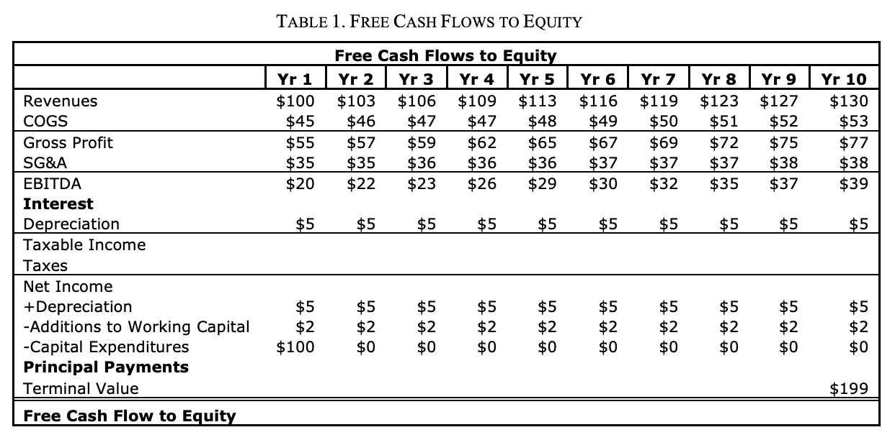

# Adding Debt

**A Primer: What Is Debt?**

When is borrowing money for your business a good idea? When is it
dangerous? These questions may seem simple, but many entrepreneurs get
into trouble precisely because they fail to ask the most fundamental
questions about borrowing money.

The nature of some entrepreneurs is to pursue growth at all costs,
borrowing as much as possible; others are so risk averse that they
refuse to even consider debt, even when it would substantially lower
their cost of capital. You need to grasp the basics of debt, or you risk
that your company’s debt levels will be determined by your personal
feelings about money, rather than what’s right for the business.

\*The right approach is to consider external financing as just another
asset—you can either “rent” money by borrowing
it or “buy” it by selling some of your equity. The right amount
of debt for your company will depend on whether or not the profits from
additional growth exceed the costs, risks, and loss of control that come
from promising fixed payments of interests and principal to debtors.

This note describes the basics of debt, its advantages, disadvantages,
and dangers so you can decide how much debt, if any, is right for your
company.

**What is Debt?**

Debt is money advanced by a third party (a lender) in return for a
promise by the borrower to pay rent (interest) for the use of the funds
and repay the amount loaned (principal). The loan repayment usually
occurs in a single payment or a series of set payments, either on a set
date or on a series of dates.

\*In other words, a lender says to you, “You can use my money as long as
you pay me ‘rent’ for the privilege of using it and agree to return it
when you are finished.”

Debt can be thought of as being just like any other asset rented by a
business. Borrowing a pile of cash is comparable to signing a lease on
an office building. Interest, calculated as a percentage of the unpaid
debt, is the rent you pay to use someone else’s money

One final issue: Typically debtors have priority over the equity rights
of owners, which means debtors get paid first and the owners of a
business (the equity holders) get paid only after all obligations to
debtors have been satisfied.

**The Advantages of Debt**

There are five main reasons to use debt when financing a business:

1\. You need to provide funds for working capital or fixed assets for a
rapidly growing business that cannot be financed from its own internal
free cash flows but does have assets (like inventory and accounts
receivable) that can easily be resold

2\. Debt is cheaper than equity.

3\. Interest payments are subsidized by the federal government.

4\. The financial leverage of a loan disproportionately increases
returns if your business is successful.

5\. Nonrecourse debt creates option value.

**The Dangers of Debt**

Many of the advantages of debt for a business that does well become
disadvantages—sometimes even fatal mistakes—if a business stumbles or
muddles.

1\. Compulsory principal and interest payments increase fixed-period
costs and require higher sales to reach breakeven cash flows.

2\. Even low interest rates can consume most of the profits of a
low-margin, capital- intensive business or a business that muddles.

3\. The first rights to cash flow and covenants (“thou shall nots”)
required by debt holders can reduce flexibility

**Summary**

All too often, an entrepreneur’s appetite for debt is based more on
personality traits than cold, hard analysis. Some entrepreneurs will
borrow as much money as possible to finance skyrocketing growth, only to
later lose their companies because the high interest expenses eliminated
profit margins, resulting in the inability of free cash flows to service
the debt.

Conversely, other entrepreneurs are so risk averse that they refuse to
even consider debt, even when it would substantially lower their cost of
capital.

The decision of whether to take on debt is the same as the decision to
acquire any asset in a business. Do your projections of free cash flows
suggest that the profits from additional growth and lowering the costs
of financing (including the benefits of tax-deductible interest
payments) exceed the costs and risks from higher fixed-period costs and
a loss of operating control and flexibility? If so, consider debt. If
not, avoid it.

**Who Gets Paid First - Some Basics About Priority**

All issues of priority depend on the fine print in the contracts between
each investor and a company, but there are some general rules. During
normal operations:

  - Royalties or commissions generally come “off the top” and are paid
    first, even if the business is operating at a loss.

  - Next, operating expenses and taxes are paid.

  - Then debt holders have a right to specified payments of interest and
    principal repayment.

  - Finally, equity holders (owners) have the right to all remaining
    cash flows after royalties and commissions, operating expenses,
    taxes, and debt have been paid.

  - Hybrid securities may have characteristics of both debt and equity
    and can include an option to convert debt-like rights to equity-like
    rights, depending on the performance of the business.

*In a bankruptcy:*

  - Holders of senior secured debt may seize assets that have been
    pledged as security and sell them to satisfy claims.

  - If any value remains, holders of senior debt are then paid.

  - Unsecured creditors are next in line to be paid, in descending order
    of priority as defined by loan agreements.

  - Preferred shareholders are paid only if there is value left over
    after unsecured creditors have been paid.

  - Common shareholders are paid only after everyone else has been
    satisfied.

**Debt Amortization Tables**

You believe that adding debt to your firm will make your equity more
valuable. But how can you make sure that the required interest and
principal payments won’t bankrupt the firm?

This note teaches you how to construct amortization tables—a side
calculation that shows the principal and interest payments required by a
particular loan. With an amortization table and a projection of
unlevered free cash flows to the firm (uFCFF) you can create a
projection of free cash flows to equity (FCFE).

A model of FCFE allows you to run scenarios for your business to see
just how far revenues can drop before the principal and interest
payments required to repay the debt cause you to default on the loan and
lose control of your firm.

**The Goal of an Amortization Table and Free Cash Flow to Equity**

The amortization table will allow you to:

1\) Translate the written terms of a loan contract into a table showing
the dollars in interest and principal you will be required to pay and
when they will be due.

2\) Add these interest and principal payments to a projection of uFCFF
to convert it to an after debt FCFE.

3\) Run several different revenue and cost scenarios to see how far
sales can decline before you’ll have difficulty making required interest
and principal payments if your firm doesn’t perform as well as you
expect. Note: Each loan is different. You must always read the fine
print to make sure you understand the payment schedules described by the
contract.

**Why Debt Amortization Tables Matter**

Assume below that you are converting projections of uFCFF to projections
of FCFE. The only difference between the two sets of projections are
cash outflows for the repayment of debt:

(1) interest payments, which are tax-deductible expenses and thus
subtracted before taxable income is calculated, and

(2) principal repayments, which are not tax deductible and thus
subtracted after taxable income has been calculated. In other words, all
the table below needs are the interest and principal payments required
by the debt.

But how do you decide what numbers to use in the FCFE projection for
interest and principal? For that, you need to construct an amortization
table.

So if you took out a loan for $100 with an 8% interest rate and
principal payments that are due in five equal installments, your
amortization table would look like this:

**How to Plug Debt Payments into a Projection of FCFF to Create a
Projection of FCFE**

Now that you have calculated how much interest and principal you will
need to pay each year, let’s look at how to plug debt payments into a
FCFF to see if FCFE remains positive. A negative FCFE shows that your
business cannot service the loan and that you will be in danger of
losing control of the business.

***Interest Payments***

Interest payments are treated as a tax-deductible expense, so they are
subtracted prior to the calculation of taxable income.

***Principal Payments***

Principal payments represent the return of money borrowed to lenders, so
they are not tax deductible. As a result, principal payments are
subtracted after taxable income.

**Other Ways Principal Can Be Repaid**

While principal payments often are spread equally over the life of a
loan, usually in monthly or annual payments, this doesn’t have to be the
case. Three alternatives shown below are a bullet loan, a Payment in
Kind (PIK) loan, and a loan with intra-year payments.

***A Bullet Loan***

Sometimes a firm will not have enough cash flow in early years to make
principal payments, so in return for a higher interest rate, a lender
may agree to move a large portion of the principal payments into the
later years.

A bullet loan, also known as a balloon loan, is an extreme example where
all of the principal payments are moved to a lump sum at the end of the
term. Up until the end of the loan period, only interest is due. The
table below shows a payment schedule for a bullet.

The terms “bullet” and “balloon” are used because the last payment seems
far away at first, but comes at you like a bullet and balloons at the
end, often with deadly consequences if you haven’t been stockpiling cash
and cannot refinance.

The benefit of a bullet loan is that principal payments are deferred.
The drawbacks of a bullet loan are that lenders demand higher interest
payments in return for the risk of deferring principal payments until
the end. The higher interest rate and compounding effect on a large sum
of unpaid principal means that your overall interest payments will be
higher than with a more conventional loan.

***PIK Loans***

PIK (“payment in kind”) loans are similar to bullet loans except that
there are no payments of either principal or interest until the loan
ends. Each year the interest that would be due is added to the
principal.

***Loans With Intra-Year Payments***

All of the examples above assume that any loan payments are made at the
end of the year, and so interest is calculated on the principal balance
at the start of the year. Many loans require intra-year principal
payments. The amount of interest owed depends on when, during the year,
you are making your loan payments.

The formula for intra-year loans is: Average
Balance x Interest Rate = Interest Payment

**Summary**

Correctly calculating an amortization table requires reading the fine
print in your loan documents. In this note we looked at four loans. All
were for $100 paid over 5 years, with an 8% interest rate, and yet there
is a significant difference in the amount of cash required to pay back
the loans and when that cash is needed.

Carefully analyze the schedule of principal payments and interest terms
in your loan documents. Use these to build a debt amortization table and
plug the required interest payments (before taxable income is
calculated) and principal repayments (after taxable income has been
calculated) to make sure that even if revenue grows more slowly than
expected, you will have a positive FCFE and enough money to make all
required debt payments.

