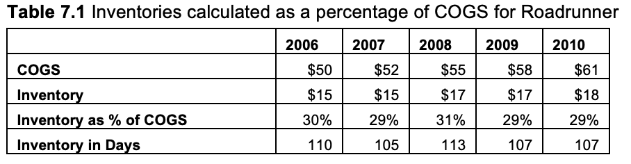
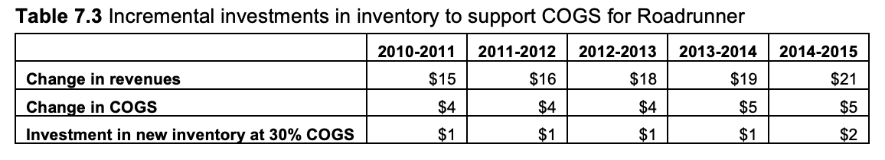
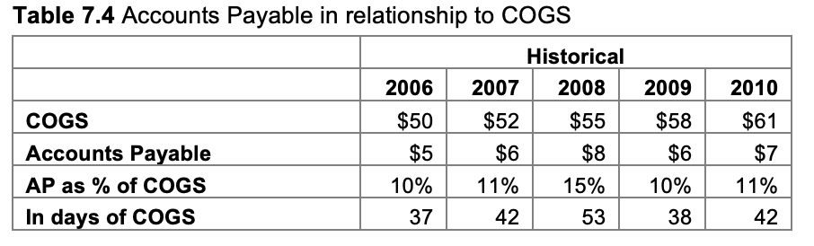
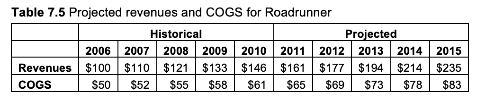
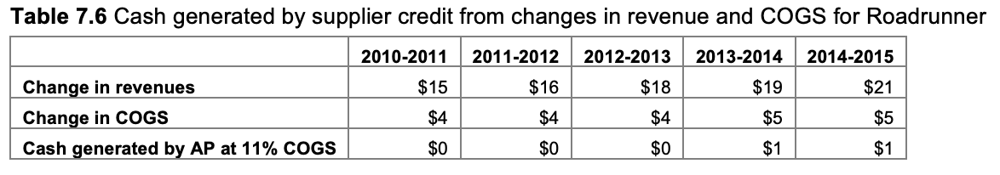
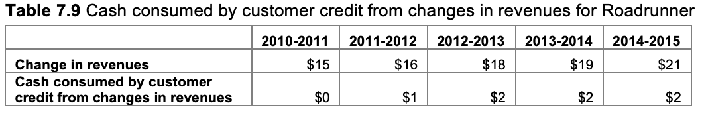
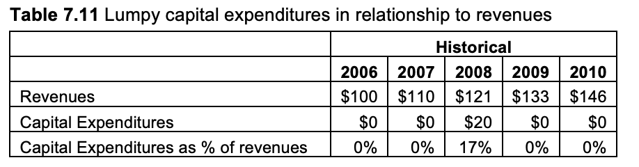

# Adding Working Capital

**Working Capital**

The money that must be invested by a business in assets like
inventory or
customer credit
(accounts receivable) that are required
to support a certain level of sales is called working capital.
Working capital requirements are reduced by the
amount of credit that suppliers are willing to extend the
business.

**An Example of the Difference that Working Capital Requirements Make**

Consider a business that has no long-term assets, starts with $50,000 in
cash and is profitable from its first day. How long would you expect it
to take for this company to turn cash flow positive? Unfortunately, you
cannot answer this question without understanding the working capital
requirements.

If the business, as in the following example, is steadily increasing
sales, must pay its suppliers cash on delivery, gives its customers 120
days to pay debts, and keeps 30 days of inventory on hand, it will not
be until the third year that the business will turn cash flow positive.
If you do not understand how working capital
affects free cash flows, you can find yourself running a very profitable
business that runs out of cash and dies.

**Components of Working Capital**

**Accounts Receivable**

  - Accounts receivable is credit extended to a customer so he or she
    can take delivery of a product today and pay later. For a lemonade
    stand, this is the money owed to you by your big brother and his
    friends because they bought lemonade on credit, promising to pay you
    in seven days when they get their allowance.

<!-- end list -->

  - While waiting for your brother and his friends to pay, your lemonade
    stand may show a profit but be losing cash. You want to keep your
    accounts receivable days as short as possible, because you need the
    cash coming in the door from customers to pay workers, suppliers,
    banks, taxes, etc. To calculate accounts receivable, you first
    determine what terms you will offer your customers (30-day terms
    would mean that they can take the lemonade now, provided they pay
    you within thirty days).

  - Next, you determine how much you are selling per day (i.e. sales /
    days in period). Last, you multiply the sales per day by the payment
    terms you have given your customers: Accounts Receivable = (Total
    Revenue / Days in Period) x Days Receivable

  - So if you earned $1,000,000 in revenue for the year, and had 30-day
    payment terms with your customers, your accounts receivable would
    be: (1,000,000 / 365) x 30 = $82,192

  - There is a delicate balance in managing accounts receivable that can
    be obscured by gross generalizations like the calculations above. On
    one hand, you do not want to tie up valuable cash by extending
    credit to customers who don’t demand it; and you especially want to
    avoid extending credit to deadbeat customers who later will refuse
    to pay. On the other hand, there may be some customers who will pay
    a far higher price per unit, and buy in large volumes, if only you
    will extend credit for a short period of time. For these reasons,
    you cannot afford to look at accounts receivable simply as a line
    item on a balance sheet. Rather, it should be viewed as a
    customer-by-customer investment that must be weighed individually,
    based on the long-term value of a particular customer relationship.

**Inventory**

  - Inventory describes the stocks of raw materials, work in process,
    and finished goods you must keep on hand to maintain a smooth flow
    of salable goods for your customers. Inventory is an inherently
    forward-looking calculation (how much lemonade do I need on hand to
    serve all of my customers today?). As such, projected inventory
    should be based on the amount of product you anticipate selling in
    the upcoming period.

  - Inventory = (Inventory Days x COGS) / 365. So, if your COGS for next
    year is projected to be $4,000,000, and you want 15 days of
    inventory on hand, your inventory at the end of this year is:
    **($4,000,000 / 365) x 15 = $164,384**

  - In general, the less inventory a business needs, the better.
    Inventory ties up valuable cash. It can also spoil, go obsolete or
    become lost, damaged or stolen while waiting to be purchased.
    Unfortunately, here too, there is a delicate balance. If you scrimp
    too much on inventory, shortages may occur at different places in
    your assembly line, leading to a less efficient use of manufacturing
    assets. Likewise, a lack of finished goods inventory may lead to
    stock outs of popular items and cause impatient customers to go
    elsewhere.

**Accounts Payable**

  - Accounts payable describes the credit extended to you by suppliers.
    In a way, accounts receivable is the reverse of accounts payable,
    because now you are the one who can buy today and pay tomorrow.
    Another way to think about accounts payable is that it describes the
    portion of your inventory that suppliers are willing to finance, in
    return for you agreeing to be their customer.

  - Businesses like to have payable days as large as possible, as that
    means they are essentially getting a short-term, interest-free loan
    from their vendors. To calculate accounts payable, you would use a
    formula very similar to the accounts receivable calculation, but
    instead of calculating sales per day, you calculate COGS per day:

  - Accounts Payable = (Total Cost of Goods Sold / Days in Period) x
    Payable Days. If the COGS for the year were $500,000 and you had
    30-day payment terms with your suppliers, your accounts payable
    would be: (500,000 / 365) x 30 = $41,096

  - Here too, there is a balancing act. You want to stretch your credit
    with suppliers as far as possible, but not so far that they start to
    demand higher prices or offer inferior service. Like accounts
    receivable, accounts payable should not be considered simply another
    line on the balance sheet, but rather a series of
    supplier-by-supplier negotiations, where the amount of credit
    demanded depends on the service required and amount of leverage you
    have with the individual supplier.

**Example 1: How Working Capital Can Make Life Harder**

The company described earlier is a young manufacturing firm. Because it
has no credit history, its suppliers demand cash payments. The market is
already quite crowded, so to attract customers, it must offer 120-day
payment terms. To further sweeten the deal for new customers, the firm
has guaranteed product availability, which in this case means it must
keep 30 days of inventory on hand. The company is profitable from Day 1
but, because of the working capital requirements, it is cash flow
negative for the first two years.

**Example 2: How Working Capital Can Make Life Easier**

The second company we will look at is in a very different situation.
This is Acme-Mart, the largest discount retailer in the world. All of
its customers pay in cash. Because it is so large and powerful in
comparison to any one vendor, it can command 120-day payment terms from
its suppliers. It also has very rigid delivery timelines with its
suppliers and so only has to keep five days of inventory on hand (all
numbers are in tens of billions).

**Conclusion**

  - Working capital is every bit as real an investment as the purchase
    of a building or an assembly line machine. The amount of working
    capital your business will need will depend on the length and
    complexity of your assembly line or service delivery process, the
    amount of credit your customers demand, and the willingness of
    suppliers to extend credit.

  - Working capital is not simply a series of lines on a balance sheet,
    but a reflection of trade-offs made in the production process and
    selection of customers and vendors.

  - As your business grows, its margins narrow, and your needs for
    working capital intensify, your ability to anticipate and manage
    working capital will have a growing impact on your subsequent free
    cash flows.

W11: Monkey Ranch 5

W12: Adding Working Capital Pt. 2

**Step 7: Determining Working Capital Intensity and Fixed-Asset
Intensity and Projecting Incremental Investments in Working Capital and
Fixed Assets Needed to Support Revenue Growth**

Increasing capacity and efficiency requires investments in
assets—working capital for inventory to keep assembly lines running
smoothly and customer credit so sales continue to rise, as well as fixed
assets like plants and machinery.

Up until now, you have been focused on the income statement, analyzing
and projecting profits and cash flows from operations. Now it’s time to
focus on changes to assets (found in financial statements on the balance
sheet), where you analyze and project the investments needed to support
a certain sales level.

The three steps to projecting the needed cash investments are:

1\. Analyze the historical asset intensity—the amount of dollars in
investments in working capital and fixed assets to support each sale.

2\. Measure the expected increase in revenues (or another proxy for
revenues) for the period.

3\. Project what investments will be needed to support these incremental
sales.

**Investments in Working Capital**

\*The first task is to project the investments you will need to fund
increases in working capital to support higher production and revenue
levels. Working capital requirements come in two forms, **inventory**
and **accounts receivable**. *These investments may be offset by
**accounts payable** (credit extended to the firm by your suppliers).*

**Inventory**

Every production process needs inventory to “prime the pump” and keep
the production line moving without delay. All things being equal, the
amount of inventory in the production pipeline is directly proportional
to the amount of product being produced, which, if prices remain
constant, is proportional to sales.

You would prefer to understand the supply chain and production process
and map it step by step, to calculate the optimum amount of inventory
needed for your supply chain and production process, but if all you have
is historical financial information, the best you can do is assume that
past relationships between revenue and inventory will remain constant.

Income statements represent the profits of a business over a certain
period of time. Balance sheets represent the amount of assets owned and
liabilities owed by a business at a certain period of time.

**1.** **The first step in calculating how much investment will be
needed in new inventory is to look at the inventory asset
intensity**—the inventories required to support revenues in previous
periods. To determine this, first look at the historical relationship
between COGS and inventories.

Here we see that given the way operations were structured in the past,
it appears that inventories equal to around 30% of COGS were required to
keep production lines running smoothly. Why use a percentage of COGS
instead of a percentage of revenues? Because there is more of a direct
physical relationship between the costs of production and inventory than
between revenue and inventory.

For example, raising the price per unit might increase revenues without
having any effect on inventories. In the example above, inventory as a
percentage of COGS has stayed stable. Note that inventory as stated in
terms of days of COGS is simply the same calculation, stated as a
fraction of the number of days in a year.

Warning: In some cases, COGS may have
imbedded costs (say, a fixed-period charge for rent for a factory) that
may not vary proportionately with inventory.

**2. The second step is to project revenues and COGS.**

**3. The final step is to project the incremental investment in
inventories to support an incremental investment in revenues and COGS.**

In other words, the goal will be to run more products through the
assembly line. Your assumption is that this will take incrementally more
inventories, so you need to measure how revenues and COGS will change
from year to year to project how inventories will increase.

Above are the expected increases in revenues and COGS and how much
additional investment in inventory will be needed if every new dollar of
COGS requires 30 cents of additional inventory. An alternative approach
would be to calculate the inventory at year-end (as shown on a balance
sheet) for each revenue level and then determine the change in
inventories between years. Either approach arrives at the same result.

**Accounts Payable**

The same steps for inventory could be repeated for accounts payable—the
cash inflows that would result from increases in supplier credit on new
purchases of inventory.

**1. The first step is calculating how many dollars of credit are
created for each dollar of COGS. To determine this, first look at the
historical relationship between COGS and accounts payable.**

Here the relationship between supplier credit (accounts payable) and
COGS varies between 10% and 15% of COGS, presumably as different amounts
of raw materials are purchased from different suppliers with different
payment terms. You would prefer to have a firm grasp on how changes in
suppliers and production methods will affect cash available to you, but
with nothing more than historical data, you simply have to make your
best guess. In this case, 11% has been chosen.

**2. Now project how revenues and COGS will change in the future.**

**3. The final step is to project the incremental amounts of supplier
credit that will come from an increase in purchases for COGS to support
increased production and sales.**

Another approach would have been to calculate the accounts payable on
the balance sheet at the end of each year and calculate the changes
between years to determine the amount added to (if more supplies are
bought on credit) or subtracted from (if the amount of credit decreases)
the free cash flows to the firm. The result would have been exactly the
same.

**Accounts Receivable**

Some customers want to buy from you today and pay you later. Accounts
receivable captures the investments you must make as revenues increase
to provide credit to your customers. It may help to picture each
customer paying with an IOU that later will be redeemed for cash. In the
interim, you record this IOU as accounts receivable.

**1. The first step is to analyze the relationship between revenues and
the dollars of customer credit.**

You would prefer to see a list of customers ranked by size of account,
showing the prices paid per unit and total contributions made by each
customer. You could then advance credit to only those customers who were
paying a high enough price, for a large enough volume of sales, to
justify such treatment. 6 Without such detailed information, however,
all you can do is use historical trends to project how much more cash
you will have to set aside (invest) to provide credit (accounts
receivable) for your customers. Above, accounts receivable varies
between 8% and 10% of revenues.

**2. Next you return to your revenue projections.**

**3. Finally, you project the incremental amounts of customer credit
that will be required to support increased revenues.**

You would prefer to have a firm grasp on how changes in customer credit
will affect revenue, but with nothing more than historical data, you
simply have to make your best guess. In this case, 9% of revenues has
been chosen.

**Summing Up Changes in Working Capital for the
uFCFF**

The next step is to sum all the changes in working capital investments,
to include in the uFCFF statement.

**Investments in Fixed Assets**

The second part of Step 7 is determining fixed-asset intensity and
projecting the incremental investments in fixed assets needed to support
revenue growth:

Expenditures for fixed assets, also known as capital expenditures or
plant, property and equipment (PP\&E), may be required either to replace
old or worn out equipment or to add new capacity to support continued
revenue growth. Of course, you would prefer to have a schedule from the
operations department showing when fixed-asset investments would be
made.

But if all you have are financial statements, you will need to analyze
past capital expenditures in hopes that you can use those to predict
future investments. Unfortunately, capital expenditures are, by their
nature, sporadic. Given the historical relationship below between
revenues and capital expenditures, should you project an average capital
investment of 3% of revenues each year (17% divided over 5 years), or
should you assume expenditures for PP\&E occur every other year or even
more frequently?

You may go a decade without making any investments as shown in table
7.11 below and then need to replace an entire factory. Without an
in-depth understanding of the physical processes and the condition of
equipment and buildings of your particular business, it will be
difficult for you to estimate future expenditures.

You decide to settle on 3% of revenues as an estimate for annual capital
expenditure requirements.

