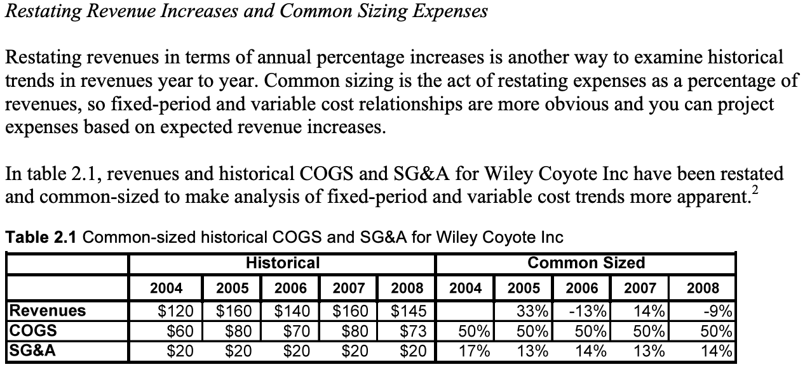
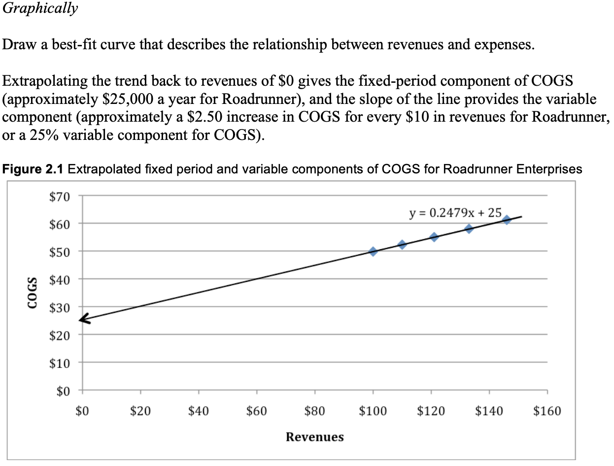
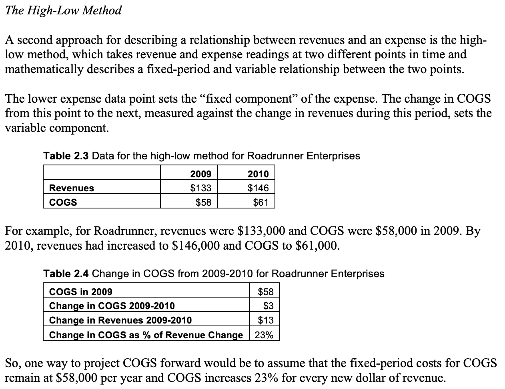
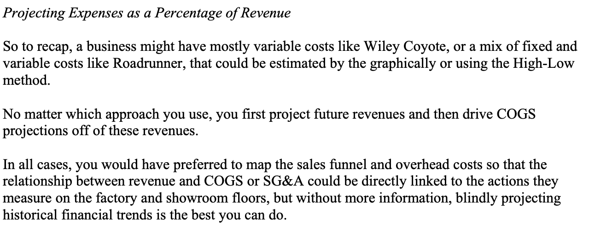

# Becoming A Financial Detective

**Forecasting and Valuing Unlevered Free Cash Flows to the Firm Using
Historical Financial Statements**

**Three of the most important questions in business are:**

• How much cash will you need to invest in your business in the early
years?

• How much in excess free cash flow (cash that can be distributed to you
and your investors) will your business produce in later years?

• Will the cumulative value of the free cash flows provide enough reward
for the time, energy, and investment you’ve put at risk?

**Historical Financial Statements**

The primary purposes of historical financial statements are to: (1)
accurately report the financial performance of a business to third
parties, and (2) collect a record of transactions so you can reward
employees and detect fraud.

Financial statements have three main parts:

1)  **Income statements**
    
    which capture revenues and expenses so you can calculate and track
    gross and net profits over a period of time.

2)  **Balance sheets**
    
    which record investments in assets and liabilities (financial
    promises) at a particular point in time.

3)  **Statements of cash flow**
    
    which show how much cash has been generated by (or used in)
    operations, how much cash was used (or generated) by investing in
    (or selling) assets, and how much cash was provided by (or used to
    pay off) financings over a certain period of time

Historical financial statements are designed to provide a financial
record of what has happened in a business. So before you try to use them
to make future projections, it’s important to understand their drawbacks
and limitations. For example:

1.  **The past is no guarantee of the future.** Past results cannot take
    into account changing customer preferences, surges in raw material
    costs, or irrational acts by competitors. Use the past to predict
    the future at your own risk.

2.  **Historical revenues and expenses on the income statement are
    reported by function or department.** Revenues and expenses on
    financial statements are collected based on the total expenditures
    by function or department, so there is no way to directly measure
    how unit volume, price per unit, variable costs, and fixed-period
    costs will affect profits and free cash flows. For example: Rising
    prices per unit may create short-term revenue gains, but they often
    mean that fewer customers will choose to buy in the future. Because
    the revenue line on an income statement merely reports dollars,
    there is no way to see how price per unit and unit volume are
    related.

3.  **The relationship between decisions on the factory floor and
    showroom and working capital are obscured.** Historical trends in
    working capital can show you how changes in credit extended to
    customers (accounts receivable), credit extended by suppliers to the
    company (accounts payable), or the raw materials requirements to
    keep the factory running were related to changes in revenues in the
    past but do not show how underlying economic relationships will
    drive future results.

4.  **GAAP depreciation does not necessarily reflect economic reality.**
    
    While GAAP conventions standardize reporting between companies and
    make it easier to compare one company’s financials to another’s, the
    GAAP depreciation show on your company’s financial statements may
    not reflect the actual wear and tear that’s occurring with your
    fixed assets.

**A Step-by-Step Guide for Creating an Unlevered Free Cash Flow to the
Firm Model From Historical Financial Statements**

**Step 1: Projecting Revenues**

No matter how much information you have, predicting future revenues is
the most difficult task you face, because you have to forecast the
actions of fickle customers and whether competitors will be successful
in luring those customers away.

If you use all the data points, sales appear to be gently climbing. If
you use the last four years of data, sales are flat. If you assume the
dip in sales in 2006 was an aberration and use the data only from 2004
and 2005, sales seem to be rising quickly. Use only the data from the
last two years and sales seem to be plunging.

**Step 2: Projecting Cost of Goods Sold (COGS) and Sales, General, and
Administrative (SG\&A) Expenses**

Of course, you would prefer to know more about Wiley’s sales funnel,
manufacturing process and general administrative functions, so you could
project how the total average cost per unit actually change with unit
volume. 5 But if all you have are historical financial statements, the
best you can do is infer relationships between revenue and fixed-period
and variable costs from previous years, function by function.

There are three steps for projecting future
expenses based on historical financial statements:

**1. Restate revenue increases in terms of annual percentage increases
and common sizing expenses.**

**2. Tease out fixed-period and variable cost relationships.** There are
two approaches for estimating the fixed-period and variable cost
relationships from historical data when both are present:

> 1\. Graphically (Draw a best-fit curve that describes the relationship
> between revenues and expenses).
> 
> 

2\. The High-Low method (which takes revenue and expense readings at two
different points in time and mathematically describes a fixed-period and
variable relationship between the two points).

> 

**3. Project expenses as a percentage of future revenues.**

**Step 3: Calculating Gross Profits and EBITDA**

At this point, you decide that Wiley’s historical revenues are just too
volatile to make any reliable projections of the future. Roadrunner
Enterprises seem much more predictable, so you decide to proceed with
making unlevered free cash flow to the firm projections for Roadrunner
(you remind yourself that Roadrunner’s smooth historical growth in
revenues is no guarantee of the future, and resolve to dig more deeply
into its customer needs and markets before making any sort of offer.)

The next step in projecting free cash flows to the firm is deducting
COGS from revenues to calculate gross profits, and then subtracting
SG\&A from gross profits to determine the firm’s EBITDA (earnings before
interest, taxes, depreciation and amortization). Note that EBITDA is the
same as the annual pre-tax cash flow from unit economics, except that
for unit economics the expenses are tracked by variable and fixed-period
costs rather than department and function.

**How Do Costs & Profits Vary With
Sales**

A manager must pay attention to how costs change when the business
increases its sales and output. One mustn’t naively assume that costs
increase, proportionally with sales. A business may be able to increase
output over a wide range by adding only variable inputs. Eventually,
however, it will run into a capacity constraint. If it wants to grow
past the constraint, it must modify its manufacturing process (and/or
its sales process). Having relieved the bottleneck, the business has
entered a new range over which it can expand output by changing only its
variable costs. When it wants to grow beyond that range, it must incur
the cost of relieving another bottleneck. Because of these
“discontinuities”—that is, the discrete, step-up in costs required to
get past a capacity constraint—the ratio of COGS to Sales (or of SG\&A
to Sales) will vary as output (sales) varies.

You’ll sometimes see pro forma projections that assume that costs
increase, at the same rate as sales, as the business grows. You can see
why this approach is naïve. While some components of costs (variable)
increase proportionately with sales, other components step-up
discontinuously as output passes certain critical levels. Good pro forma
projections make use of everything the manager knows about the
manufacturing and sales processes—including the succession of
bottlenecks the processes will encounter, the output levels at which the
respective constraints begin binding, and what it will cost to relieve
the bottleneck and further expand capacity in each case.

**Summary**

Far too many entrepreneurs believe that all growth is good, regardless
of whether expanding revenues means more profits or not. Other
entrepreneurs rely on mechanical spreadsheet extrapolations that naively
hold current expenses constant with growth, or blindly project current
ratios far into the future. Savvy entrepreneurs take the time to
understand how expanding sales and operations will affect future
expenses and profits, analyzing historical trends and the effects of
process changes, so variable costs accurately increase proportionately
with sales, and fixed period expenses stay constant, until capacity
additions transform them into “chunky costs.” Having an income statement
that accurately reflects how profits will change as revenues increase
makes it much easier to see if the profits from investing time, energy,
and money in expanding sales are worth the costs and risks.

