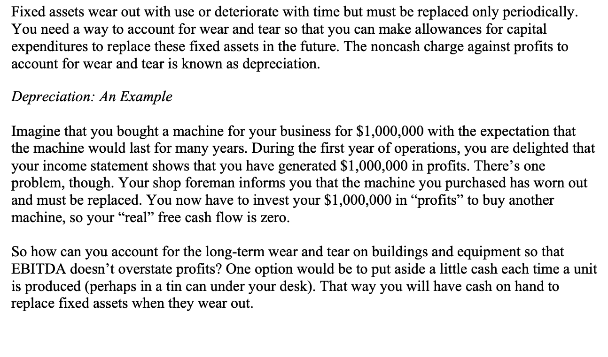
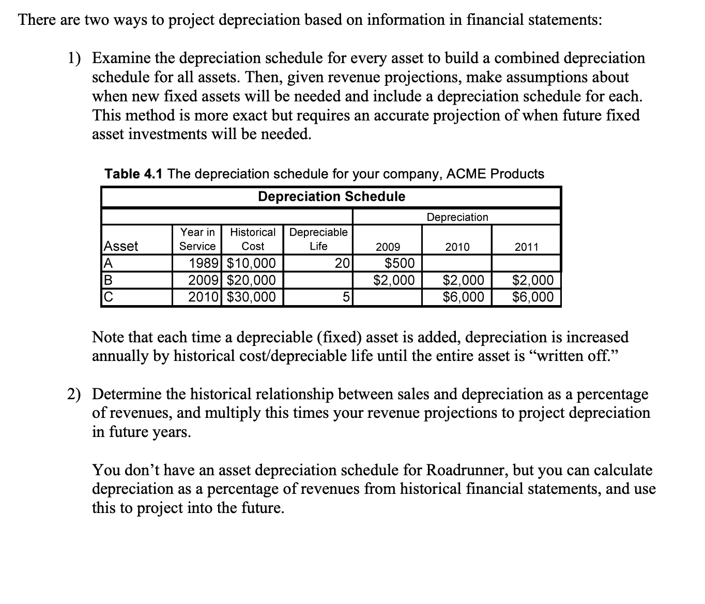
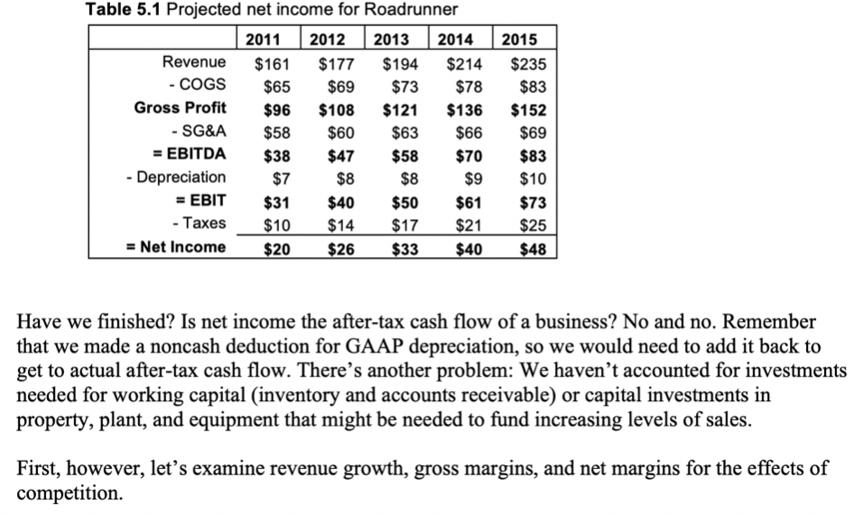
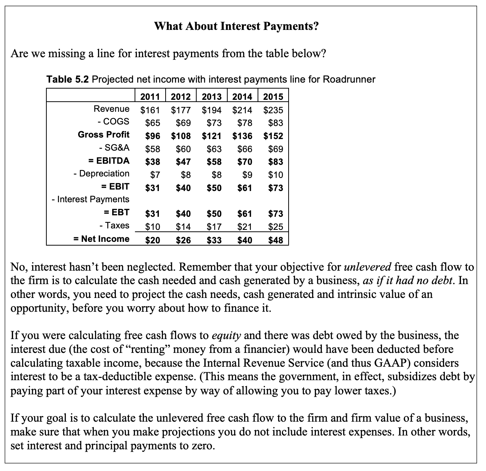
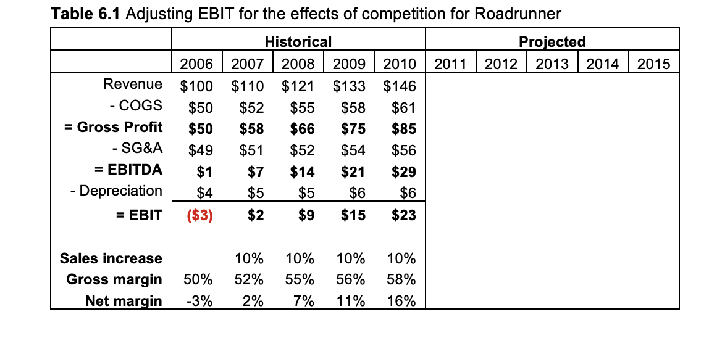

# Counting the Cash in a Simple Firm

**Step 4: Estimating Depreciation**

Another option is to make adjustments on your financial statements for
the “depreciation,” or loss in value of the asset, that has occurred.
Since you haven’t yet spent any money on a new machine, this is a
“noncash charge.” In other words, you are making a note to remind
yourself that profits aren’t as large as EBITDA suggests and that
eventually you will have to buy a new machine.

Remember, however, that GAAP has designed financial statements so that
the profits from one business can be compared with another’s. Allowing
each business owner to make a different estimate for depreciation leaves
too many chances to manipulate profits, so GAAP has decided how much
depreciation you can deduct for certain assets. Unfortunately, these
GAAP conventions may bear only a passing relationship to real (economic)
depreciation, so your financial statements likely do not reflect the
true economic depreciation that has occurred in your particular
business.

**Step 5: Estimating Federal Income Taxes**

GAAP accounting conventions allow you to deduct depreciation (GAAP
depreciation) as an expense before calculating taxable income. You then
calculate federal taxes as a set percentage of taxable income and
subtract taxes from taxable income to obtain net income. Net income is a
GAAP measure that allows the profits of one business to be compared with
another’s.

**Step 6: Checking Trends in Revenue Growth, Gross Margins, and Net
Margins for the Effects of Competition**

It’s time to step back from the projections of revenues and costs to
take an explicit look at revenue growth rates and gross and net margins.
How have revenues and gross and net margins historically changed over
time? How do your projections suggest they will change in the future?

Of course, at this point you wish you had a competitive analysis and a
deep understanding of unit economics to more fully inform your
projections, but you don’t. All you have are trends from the past.

