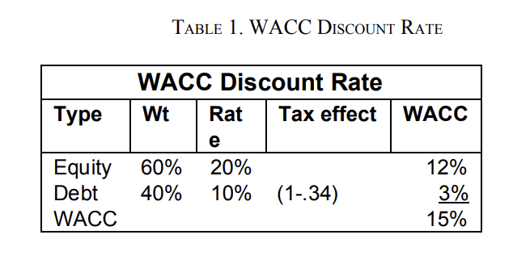

# Estimating Discount Rates

**Introduction**

The value of a dollar in hand today is worth more than the promise of a
dollar tomorrow. If you have a dollar today, you can invest it and earn
interest, leaving you with more than a dollar tomorrow. Plus, there’s
always the chance that tomorrow’s dollar may not arrive as promised.

The higher the interest rate and the greater the risk, the more valuable
the dollar today is by comparison to a dollar tomorrow. An entrepreneur
needs to learn to value a business by projecting revenues, expenses, and
investments into the future using unlevered Free Cash Flow to the Firm
(uFCFF) models. The pattern and timing of the annual free cash flows of
a firm will give you a general sense of the value of a business but, if
you want a direct way to compare two opportunities, you will need a
mathematical formula to weigh the value of a dollar of cash flow in
future years with the value of a dollar today.

This note describes how to choose a discount rate that will allow you to
systematically adjust the value of the Future Free Cash Flows of a Firm
to account for the time value of money and the risk that the cash flows
will not appear.

What’s the right discount rate to use for a firm’s free cash flows? That
depends on how much interest you could earn from an alternative “risk
free” investment and the added risk of the particular business.
Calculating the right discount rate is as much an art as a science and
will take you many years to master, but this note will give you some
rules of thumb to use as you gain real­world experience.

**What Is a Discount Rate?**

A discount rate can be defined as “the rate of return required by an
investor to accept the risks of a certain investment.” Unfortunately,
this becomes a circular definition if you want to use discounted cash
flow analysis to value a firm because you will not have good market
comparables to calculate the returns required by investors.

This means you must use a variety of ways to estimate the returns that
an investor might demand.

**The Preferred Method: Adding a Risk Premium to a Risk­ Free Rate**

The simplest and most direct method for calculating a discount rate is
to estimate separately the risk ­free rate alternatives available to an
investor and the risk premium that he or she might require to choose
this particular investment opportunity.

**The Risk­ Free Rate**

A close proxy for a risk ­free rate is the return offered by a US
government security that has the same time horizon as the investment in
question. If you expect the cash flows from a business to last for five
years, look up the five­ year U.S. Treasury bond yield in the Wall
Street Journal. If the investment has a ten­ year time horizon, use the
yield on ten­ year Treasury bonds.

**Adjusting for Risk**

Adjusting for risk is more difficult because it’s hard to find exact
comparables. One method, and a rather inexact one, is to add a fixed
discount rate premium that differs depending on the predictability of
the cash flows of the business. The discount rate for the uFCFF of a
large stable company might suggest adding 5% to the risk ­free rate
while the discount rate for the uFCFF for a small, risky start­up might
require a 15% or larger risk premium. Additional risk premiums may be
needed to adjust for private 2 (illiquid) companies, industry ­specific
risks and the risks to individual companies

**Warning\!** This approach for estimating discount rates is little more
than a rough guess. Some large companies can have fickle customers. Some
have high fixed ­period operating costs, where even modest drops in
revenues can lead to dramatic reductions in free cash flow. In others,
intense competition can lead to rapidly shrinking margins.

The uFCFF projections of such businesses, whether large, midsized or
small, would be highly uncertain and would require adding higher risk
premiums than shown in the table above. Unfortunately, until you have
analyzed the unlevered FCFF patterns of scores of businesses in a number
of contextual environments, vague approximations like those above will
have to do.

**Don’t Compare Apples to Oranges when Matching Discount Rates to Free
Cash Flows**

  - One of the biggest mistakes when discounting free cash flows is to
    choose a discount rate that doesn’t match the character of the cash
    flows you are discounting. For example, uFCFF discount rates, by
    definition, are designed to measure the risk of a firm with no debt.
    It is incorrect to apply a discount rate designed to measure the
    risk of the cash flows of a firm to the riskier stream of cash flows
    for the equity owners after preferential payments to debt holders
    have been made.

  - When you add debt to a company, debt holders usually demand to
    receive interest and principal payments before equity holders
    receive a share of cash flows. Adding large fixed payments of
    interest and principal (financial leverage) means that even small
    changes in revenues can lead to large swings in equity free cash
    flows (particularly if the firm also has high fixed period operating
    costs).

  - So discount rates for a firm’s unlevered cash flows cannot be used
    to value an owner’s equity free cash flows after debt payments have
    been subtracted. In fact, equity discount rates for highly leveraged
    transactions are often so high that the compounding effect of the
    risk premium begins to distort the value of free cash flows in later
    years. As a result, when trying to calculate the intrinsic value of
    equity, it is generally better to discount the uFCFF, add the
    discounted value of the tax shield, and then subtract the market
    value of the debt.

  - For calculating equity values for 4 companies with extreme amounts
    of debt, it may even make sense to treat the equity value as an
    option that has value only in the event that the firm survives a
    crippling debt load

**Comparing the Combined Discount Rate With Other Market Proxies**

  - The discount rate used to discount the unlevered free cash flows for
    your firm, calculated by adding a risk premium to the risk­free
    rate, can be compared with the returns demanded for similarly risky
    investments as a sanity check. For example, assume you are trying to
    value a medium­sized company with a ten­year time horizon.

  - You note that risk­free rates for ten­year Treasury bonds are
    trading at a 5% yield so, 4 The Internal Revenue Service treats
    interest expenses as a tax­deductible expense. This means that tax
    payments go down as interest payments rise. The value created by
    these foregone tax payments is called the “tax shield.” 3 following
    the preceding example, you add a 10% risk premium to calculate a 15%
    discount rate for the firm’s unlevered free cash flows.

  - But then you note that the senior secured bonds of similar companies
    are trading at a 15% yield. 5 Since the senior debt holders must be
    paid first, the senior secured bonds should have a lower interest
    rate than the discount rate for the unlevered company, so there must
    be more operating risk in the company than you assumed.

  - Likewise, adding 15% to the 5% yield offered by Treasuries for a
    small high­tech startup may not be enough of a risk premium if the
    NASDAQ has just crashed and it is next to impossible to raise new
    funds for such companies.

**Other Approaches to Discount Rates**

**Weighted Average Cost of Capital (WACC)**

The Weighted Average Cost of Capital method (WACC) was developed to give
employees in large firms a common discount rate for evaluating internal
investment opportunities. Without WACC, each division manager would have
to set his or her own discount rate for internal projects, leading to a
haphazard internal allocation of capital. WACC estimates the portion of
a firm’s internal cost of funds attributable to debt and equity
separately and then combines them. For the debt portion, WACC uses the
average interest rate paid by the firm for debt, adjusted for the value
of the tax shield and weighted for the amount of debt in the company.
For the equity contribution to the discount rate, WACC takes the equity
returns demanded by stockholders, weighted by the amount of equity in
the company’s capital structure. For example, a company with a 34% tax
rate and debt equal to 40% of its firm value, paying a 10% interest
rate, with a cost of equity of 20%, would have a WACC of 15%.

WACC works as a discount rate proxy for the internal investment
decisions of large firms with stable capital structures. Because it
requires an estimate of the cost of equity, which is difficult to 5 Junk
bonds are high­risk, unsecured loans that are similar in risk profile to
equity for highly leveraged companies. 4 determine for non­public
companies, it is less useful for choosing discount rates for levered
Free Cash Flows to the Firm for companies with debt in their capital
structure.

**Capital Asset Pricing Model (CAPM)**

The Capital Asset Pricing Model estimates the discount rates for assets
based on the historical relationship between the volatility of stock
prices and the subsequent returns for investors in these stocks.

CAPM is based on the risk­free rate demanded by investors, the risk
premium investors require to invest in the market, and an added risk
premium that reflects the riskiness of an individual company.

**CAPM Discount Rate = Risk­free rate + Beta (Market rate – Risk­free
rate)**

For CAPM, the risk premium associated with an individual company, called
Beta, is based on the historical volatility of the company’s stock
price. CAPM is widely used in academia but shunned by most in the real
world. The idea of using past volatility to forecast future risk doesn’t
make sense if you are an entrepreneur who has an in ­depth understanding
of their customers, cost structure, and competitors. Using the logic of
CAPM, if the stock of an excellent company with strong cash flows had
recently fallen 90%, it would now be more risky, and thus a worse
investment, than before its stock price fell.

**Summary**

Discount rates offer a way to adjust the value of future annual free
cash flows to the present, taking into account the time value of money
and risk. As with most valuation issues, the key to discount rates is to
get “close enough” and to make reasonable assumptions about future free
cash flows.

Discount rates can be estimated as a combination of a risk­free rate to
compensate investors for the time value of their money and a risk
premium that investors will demand in order to invest in a firm like
yours (a firm with your customers, your operating leverage and your
competitors). 6 A discount rate must be matched to the character of the
cash flows that are being discounted.

Discount rates for uFCFF cannot be used to discount the firm value or
equity of a firm that has debt. Because of the volatility of equity cash
flows and the distorting effect of extreme discount rates on later year
cash flows, it is generally better to estimate an intrinsic equity value
by first discounting the uFCFF, then adding back the tax shield savings
as a result of interest payments and subtracting the market value of the
debt. Other discount rate approaches, like WACC and CAPM, are not
intended for estimating the future value of an entrepreneurial firm and
should not be used for this purpose.

In general, use discount rates that reflect (as closely as possible) the
returns your investors will demand to invest in your business. Then,
seek to “narrow the region of darkness” to estimate the Intrinsic Value
of your firm by running various revenue and cost projections of the
uFCFF (including different terminal values) and discount these to the
present to compare the present value of the firm under different
scenarios.

**Warren Buffet’s 9% Discount Rate**

The famous long-term investor Warren Buffett reportedly uses a 9%
discount rate, regardless of current interest rates, inflation
expectations, or the risk associated with an investment. On the surface,
this seems preposterous; especially since long-term interest rates and
inflation expectations fluctuate widely.

Further inspection shows that wisdom often comes in simple packages.
Buffett knows that over the long run, annual real returns and inflation
have averaged approximately 3% each. In using a 9% discount rate,
Buffett is saying that in the long run he believes that nominal rates
will average 6% and he wants to make an additional 3% return to
compensate him for his investing genius.

Buffett uses a consistent discount rate to tell him when to invest and
when to sit on the sidelines. In “good times,” when inflation is low and
too much money is chasing deals, Buffett’s discount rate will be too
high, and he will be unable to find any interesting investments because
others will outbid him.

In times when inflation is high or money is hard to find, Buffett’s 9%
discount rate will lead him to be aggressive, and since there will be
few other bidders, he will have his pick of investments that give him
the highest net present value at a 9% discount rate.

**Buffett’s Secret: Reflecting Risk on His Free Cash Flow Projections**

Staying with a 9% discount rate allows Buffett to avoid speculative
booms and take advantage of the inevitable speculative busts that
follow.

Unlike with the Venture Capital Method, by using only a small premium
over real interest rates and inflation, Buffett does not use discount
rates as a proxy for risk. Instead, he adjusts for risk by projecting
more-accurate free cash flows, running multiple scenarios, and using
debt and options to make sure that in all but the worst-case scenarios,
he is likely to recover his investment.

Those who use the CAPM or the Venture Capital Method are estimating
risks from 30,000 feet, using analytical cleverness to avoid
understanding the nuts and bolts of a business. Buffett revels in the
nuts and bolts, understanding in simple terms why customers buy, how
products are made and delivered, and how competitors can be kept at bay.

If Buffett can make a 6% real rate of return over a long period of time,
he will own an even larger piece of the world than he does now.

**A Warning About Using A 9% Discount Rate**

Remember that Warren Buffett has a lifelong track record of
understanding the fundamental risks of a business. He avoids businesses
that he does not understand or that do not allow him to adjust for the
overconfidence of the forecaster.

If you use a 9% discount rate and are unable to adjust overly optimistic
cash flows back to reality, you will tend to overvalue opportunities.
Buffett’s method is not an excuse to blindly increase your valuation by
using a low discount rate but instead is an admonition to learn more
about the customers, cost structure, and competitive environment of the
business you are studying

**Summary**

High-powered analysts run endless spreadsheets to calculate betas.
Reportedly gifted venture capitalists use discount rates of 50% to 75%
to value an opportunity. Could such approaches be misguided?

There is a difference between cleverness and wisdom. Fancy theories and
mathematical formulas may make you feel smarter, but they are dangerous
tools when used to avoid a common sense understanding of the opportunity
you are analyzing.

Warren Buffett’s reported use of a 9% discount rate is simple, but not
simplistic. It gives him an unwavering sense of whether markets are
exuberant or depressed and—provided that his analysis of fundamental
cash flows is sound—provides an accurate estimate of value. Understand
the fundamentals of a business. Run multiple free cash flow projections.

Use convertible debt or other types of options to protect yourself from
downside cases and invest only when the market is pessimistic about the
future—and you can be wise too.

