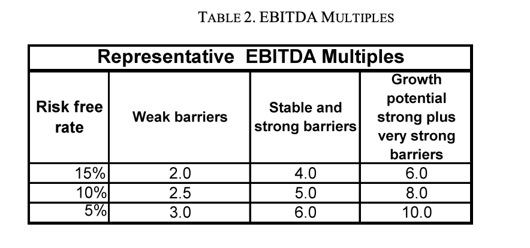

# Estimating Terminal Values

**What Is a Terminal Value?**

  - This note introduces the concept of a terminal value, a way to
    combine the later year cash flows of a business into a single lump
    sum, so you can more easily determine the value of the business
    today.

  - As the owner of a business, you are entitled to the free cash flows
    of a business in perpetuity. But, practically speaking, after a
    certain point your projections seem to be little more than a wild
    guess. You don’t want to give away these final years of your firm’s
    free cash flows for nothing, but you aren’t quite sure how to
    include them in your valuation model.

  - Terminal Values help with this dilemma by giving you a short hand
    way to lump the free cash flows beyond a certain date into the final
    year of your free cash flow projections. This lump sum is then
    discounted back to the present to determine its value to you today.

  - Terminal Values are—at best—an educated guess, but even if your
    crystal ball is cloudy, the free cash flows that occur beyond your
    projection period will likely be worth something. It’s your job to
    account for this value as best you can.

**How Far Should You Project Cash Flows before Calculating a Terminal
Value?**

There is no easy answer to the question of how far you should project
the free cash flows of a firm before you stop to estimate a terminal
value. Theoretically, you would prefer to forecast the individual
components of revenue, expenses, and investments until you have
saturated your market and your revenue growth tracks the growth rate of
the overall economy.

In practice, however, few businesses survive that long without
experiencing some shock due to contextual changes or competition, so
long-lived cash flow projections may be unrealistic. So once you reach
the limits of your ability to make credible estimates of revenues,
expenses, and investments (the terminal year), it is time to stop making
discrete forecasts of annual free cash flows and instead lump all cash
flows beyond the final year into a single “terminal value” that can be
added to the final year’s operating cash flow.

As shown in the example below, if a business (Business A) is well
established with loyal customers, a large potential market, few
substitutes, a stable cost structure, and benign competitive pressures,
you may project free cash flows for as long as ten years before summing
all subsequent free cash flows into a terminal value.

In other cases (Business B) you may believe that you will saturate a
market and reach a point of diminishing returns on sales growth within
five years or less, so your terminal value calculation may come much
sooner.

**What Methods Can You Use to Compute a Terminal Value?**

There are several different approaches you can take for estimating a
terminal value. All implicitly take into account the future growth in
revenues, expenses, and investments and prevailing interest rates in the
terminal year. Two of the most popular approaches are using a multiple
of free cash flows (the EBITDA Multiple method) and extrapolating stable
cash flow growth far into the future (the Perpetuity with Growth
method.)

**EBITDA Multiple Method**

  - The EBITDA Multiple method uses a proxy for the free cash flow
    generating capacity of the firm (EBITDA - earnings before interest,
    taxes, depreciation, and amortization) in the terminal year, and
    multiplies it by a number meant to represent what a buyer at that
    point in time might pay for the right to all free cash flows to
    come.

  - Terminal value (EBITDA multiple) = EBITDA multiple X the EBITDA in
    the terminal year.

  - How large a multiple is reasonable? It depends on how long you
    expect the cash flows to continue at the current rate. If your
    business is predicted to have reasonably strong competitive barriers
    and steady sales, in a normal interest rate environment a multiple
    of 5X EBITDA might be reasonable.

  - In other words, a buyer might pay you five times the pre-tax cash
    flow to the firm in the final year of the projections because he or
    she believes that the cash flows would continue at this level (or
    higher) for enough time (at least five years) for the investment to
    be attractive.

  - If your company is a service business with few barriers and interest
    rates are abnormally high, a multiple of as little as 2X to 3X
    EBITDA may be reasonable. In this case, a buyer may believe that the
    cash flows are so fragile that they may not continue beyond a few
    years or so.

  - Likewise, if interest rates are low and the company has extremely
    high barriers to competition, some analysts use EBITDA multiples of
    8X to 10X or even higher. Here, the cash flows from the business
    look so steady, and the returns from alternative investment choices
    are so low, that a buyer will place a much higher value on the
    terminal year cash flow. 

  - **Warning:** EBITDA multiples work best for estimating a terminal
    value for businesses that have stable revenues and margins. It does
    not work well for fast-growing businesses, particularly those with
    operating leverage, heavy working capital investments or recurring
    capital expenditures.

**Perpetuity With Growth Method (PWG)**

With the Perpetuity with Growth method, the terminal value is calculated
by taking the Unlevered Free Cash Flow to the Firm in the year following
the terminal year and dividing it by the difference between the discount
rate and the annual expected growth rate of the after-tax uFCFF.

Terminal Value (PWG) = (Annual Free Cash Flow to the Firm the year after
the terminal year) / (After-Tax Discount Rate – Stabilized Growth Rate
of the firm’s free cash flows)

In essence, this formula is calculating the perpetual value of a stream
of after-tax cash flows, rising at a steady rate, relative to the
after-tax cost of funds (the discount rate).

For example, assume your firm’s after-tax cash flow stream from a
business was $1 million in the year after the terminal year. You believe
that the after-tax free cash flows to the firm will grow at 5% a year
forever and that the correct after-tax discount rate is 10%. Terminal
Value (PWG) = $1 million / (.10 – .05) = $1 million / .05 = $20 million

**Warning:** The Perpetuity with Growth formula assumes that the growth
rate in aftertax cash flows will continue forever (in perpetuity) and
that the discount rate is based on reasonable risk-free rates. The PWG
method will deliver absurdly high terminal values if you use a
standardized growth rate that is higher than the historical growth rate
for the general economy or a discount rate based on historically low
risk-free rates.

In other words, your business cannot grow faster than the general
economy forever or eventually it will represent 100% of the world’s GNP.
Likewise, abnormally low interest rates will eventually revert to
historical means.

Ignoring these caveats will result in absurdly high terminal values. The
PWG method also does not work well for businesses with a high degree of
operating leverage, since small changes in revenues can lead to
explosive growth (or decline) in free cash flows, rather than the steady
changes assumed by the PWG formula.

**How Do You Calculate a Terminal Value for a Business That Has Rapid
Free Cash Flow Growth or Other Complications?**

How do you calculate a terminal value for a business with rapid revenue
growth, high operating leverage, or continued heavy working capital and
fixed asset investments? Quite simply, there is
no accurate way to calculate a value under these
circumstances.

You must run the UFCFF projections long enough to saturate your market
until the growth in free cash flows begins to approximate the growth of
the overall economy.

**Choosing Between Terminal Value Methods**

How do you choose between methods? Entrepreneurs tend to use the
EBITDA Multiple method with low multiples when
buying (because the terminal value will be conservative) and the
Perpetuity with Growth method with high growth
rates and low discount rates when selling (because the terminal
value will be aggressive).

Academics seem to prefer the more complex Perpetuity with Growth method.
The most important thing to remember is that all terminal value methods
rely on uncertain projections made far into the future, and so any
terminal value is little more than an educated guess.

**Discounting a Terminal Value as Part of Calculating Intrinsic Firm
Value**

The whole purpose of estimating a terminal value is to use it to
determine your Intrinsic Firm Value, the value of your estimated future
free cash flows to you. This means that you must add this figure to the
final year’s annual unlevered Free Cash Flow to the Firm (uFCFF) and
discount all of the annual cash flows back to the present.

It also is important to decide whether or not you need to deduct taxes
from the terminal value in the final year. With the PWG method, you are
extrapolating the value of the after-tax free cash flows, so there is no
need to deduct taxes as if the company was sold in the final year.

Likewise with the EBITDA method, where you are selling the company in
the final year, any taxes will be paid by individual shareholders and
not the company, so taxes do not need to be deducted from the company’s
free cash flows to the firm.

The only time taxes need to be deducted from a terminal value is if it
is assumed that the firm’s assets will be liquidated and taxes are paid
on any gains.

**Summary**

As the owner of a business, you are entitled to its free cash flows in
perpetuity. So while your ability to accurately project free cash flows
diminishes with time, you do want to receive value in a harvest for the
cash flows beyond the terminal years of your projections.

Terminal values provide a way to capture the value of free cash flows
that occur beyond the final year of your projections, so you can add
this value to the final year of your Unlevered Free Cash Flow to the
Firm projections to determine the Intrinsic Firm Value today.

Use the EBITDA Multiple method or the Perpetuity with Growth methods to
estimate a Terminal Value only if the free cash flow in the Terminal
Year has slowed to at or below the growth rate of the overall economy.
You cannot use the PWG or the EBITDA methods for a business with rapid
revenue growth, operating leverage, or heavy working capital and capital
expenditure investments.

Above all, never forget that however you arrive at a terminal value, it
is at best an imprecise and imperfect look into the future. Those who
buy businesses based on large terminal values that lie far into the
future are, by definition, making a risky bet on events far beyond their
vision or control.

