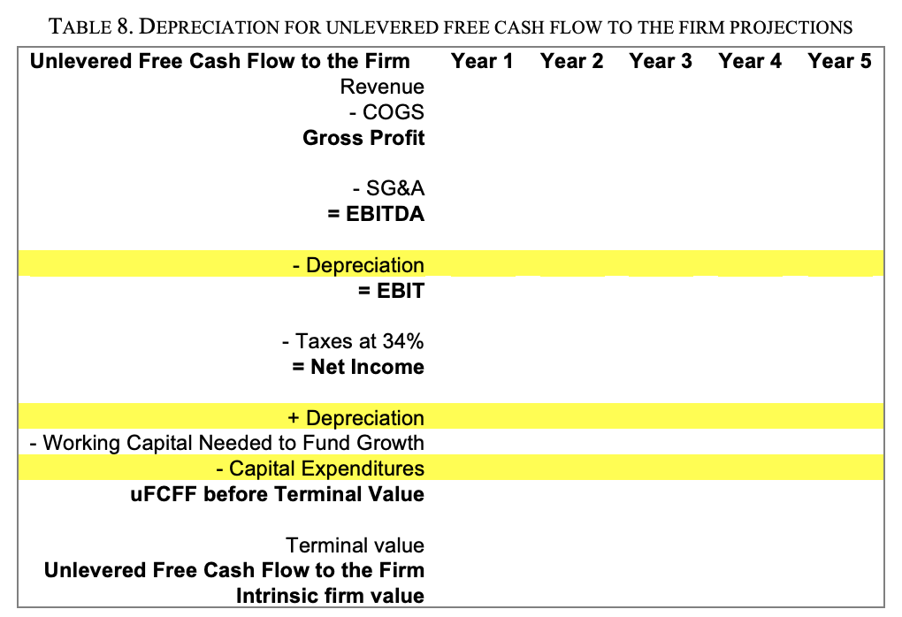
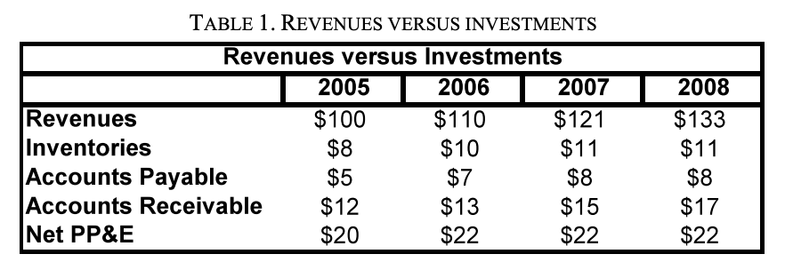
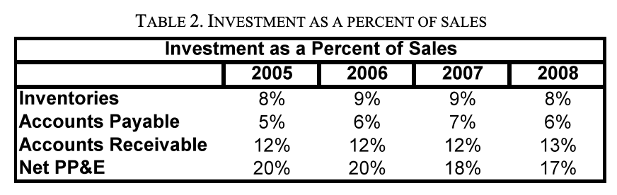
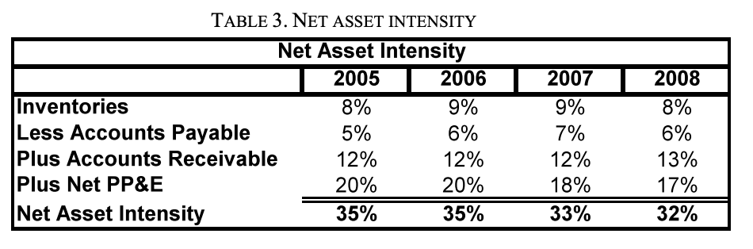

# Free Cash Flow in a Complex Business

***Using Unlevered Free Cash Flow to the Firm and Intrinsic Firm Value
for More Complex Businesses***

**What Are Unlevered Free Cash Flow to the Firm and Intrinsic Firm
Value?**

Unlevered free cash flow to the firm is
the amount of cash produced (or consumed) by a business’s basic
operations without respect to how the business is financed, that is, as
if the company had no debt (i.e., “unlevered”).

Unlevered free cash flow to the firm is
the cash produced by a business with no debt—that is “free” (available)
for uses other than maintaining basic operations. For example, this free
cash might be used to pay a dividend to shareholders or simply be added
to the company’s cash balance.

Intrinsic firm value is the value of the
discounted uFCFF based on your projections of revenues, expenses, and
investments and the appropriate terminal value and discount rate. IFV
is, in essence, the value of a firm’s cash flows to you.

**Why Are Unlevered Free Cash Flow to the Firm and Intrinsic Firm Value
so Important?**

The primary objective for an entrepreneur is to make money by satisfying
one customer at a time. Unlevered free cash flow to the firm is a
mathematical expression of the value created by the basic operations of
your business over time, and intrinsic firm value is the value to you of
the firm’s potential, discounted to today’s dollars.

One common misconception is that a business that makes an accounting
profit is making money and has a positive value.2 Accounting profit is
not the same as free cash flow. In fact, a business can simultaneously
be making a profit and have basic operations that are consuming large
amounts of cash (negative free cash flow).
\*While a large positive profit number may look
good on paper, you cannot spend a dollar of profit; you can only spend a
dollar of cash. The survival of the business ultimately depends
on what happens to its cash.

**How Do You Build an Unlevered Free Cash Flow
to the Firm Model?**

To build an uFCFF model, follow the eight steps below:

1\. Project revenue as far into the future as is reasonable, using an
extrapolation of historical revenue trends, unit economics, or
(preferably) both. If possible, project until you expect sales efforts
to reach a point of diminishing returns, after which revenues will grow
no faster than the overall economy.

2\. Based on expected revenues, project the variable and fixed-period
costs you expect both for costs of goods sold (COGS) and sales, general,
and administrative costs (SG\&A).

3\. For each year, start with revenues and subtract COGS to get gross
profits. Subtract SG\&A from gross profits to get EBITDA.

4\. Subtract depreciation to get taxable income. Multiply by the
company’s statutory tax rate to calculate federal income taxes (FIT).
Subtract FIT from taxable income to get net income. (Note that for uFCFF
there is no debt and therefore no interest to deduct.)

5\. Add back any non-cash items, such as depreciation. “Depreciation” is
a non-cash adjustment for wear and tear on equipment that can be
deducted from profits before determining taxable income. Because it is a
non-cash item, it must be added back to determine uFCFF.

6\. Subtract any changes in working capital necessary to support
increasing sales. Also subtract any capital expenditures (investments in
fixed assets) that are needed to support sales.

7\. Add the non-cash charges, subtract the changes in working capital
and changes in capital expenditures to net income to calculate the
annual uFCFF.

8\. In the terminal year (the last year of your projections) calculate a
terminal value, a lump sum meant to capture all the remaining value of
free cash flows past the forecast period, and add this to the uFCFF for
that year. Choose a discount rate and discount the uFCFF to get the IFV.

**Summary**

Many entrepreneurs fail to appreciate the difference between profits and
free cash flows until they discover that cash is disappearing at an
alarming rate from a business that seems profitable and healthy.

Unit economics is a powerful tool for a
simple business and incremental investment decisions, but businesses
with customer credit, working capital, and longer payouts require more
complex tools.

Use uFCFF and IFV to model the impact of operating decisions on free
cash flows and value before you begin to consider the effects of
financing. After all, it is more important to first “make the pie
bigger” before you start exploring how to divide it between equity
owners and debtors.

**Depreciation**

When you ask, “How much depreciation did you incur in year five?” the
question is incomplete. As an entrepreneur, what you really care about
is the cash your company will need to invest to seize an opportunity and
the free cash flows those investments will generate for you and your
investors. Unfortunately, GAAP income statements and IRS tax returns are
two entirely different sets of books, neither of which was designed to
measure the economic reality or full potential of your business1 .

***Two Sets of Accounting Books?***

All companies keep two sets of financial records. The first set of
“books,” compiled under GAAP, is designed to standardize the reporting
of historical financial transactions so that outside parties can compare
the profits of one company with another.

The second set of books, kept for the benefit of the IRS, is used to
determine your company’s tax liability. The depreciation of an asset for
tax purposes—in other words, “tax depreciation”—is set by Congress. For
example, in order to help the construction industry, Congress may decide
that buildings can be “written off” over five years, even if they will
last fifty years or longer.

**Deferred Taxes**

When GAAP book depreciation is different from IRS tax depreciation, it
creates a problem. When GAAP book depreciation is deducted as an expense
on the income statement and taxes are calculated as a percentage of GAAP
profits, the amount of taxes shown differs from the taxes paid in cash
to the IRS, because IRS determines taxable income using tax
depreciation.

This difference between tax obligations shown by GAAP on income
statements and the taxes the IRS calculates (current taxes) is shown as
deferred taxes on the GAAP balance sheet.

The deferred tax account will increase early in the life of an asset if
a more-aggressive tax depreciation schedule means that actual cash tax
payments are lower than those shown on the GAAP financial statements.
Later, as the remaining tax basis of an asset approaches zero, book
depreciation will become higher than tax depreciation and the deferred
tax account will shrink, eventually reaching zero when both the book and
tax basis of an asset reach zero. Remember, though, that neither of
these financial conventions says anything about the remaining economic
value of the asset, which still might be quite high.

**Economic Reality**

If book depreciation is a GAAP convention and tax depreciation is set by
the IRS, then where do we look to find out how quickly a fixed asset is
wearing out in real life? Here’s the irony—real economic depreciation
isn’t recorded anywhere.

So why is economic depreciation even
important?

Let’s assume you own 100% of a simple widget business. Because you don’t
have to report to anyone, you decide to forgo financial statements and
just use your checkbook to keep track of cash flows and profits. You
invest $1 million in a widget machine that will produce 100,000 widgets
per year at $10 per unit in total (i.e. fixed-period plus variable)
costs per unit at this production level. You sell each widget for $20. 2
Cynical observers may note a correlation between accelerated
depreciation schedules and campaign contributions.

You are pleased that you bring in $2 million in revenues in the first
year against costs of only $1 million, thus showing $1 million in
profits. Unfortunately, you find that the widget machine has been
completely worn out and must be replaced.

How much in profits did you really make? Zero. That’s right. You created
$1 million in contributions, but in the process wore out $1 million
worth of machine. For all your effort, the cumulative free cash flow is
zero.

The next year, you pledge that for every widget you make and sell, you
will take $10 and put it in a coffee can underneath your desk. This way
you will have the money you need to replace the machine when it wears
out. You decide you will count only the cash that is left over after you
have made your coffee can deposits as profits.

Finally, you have a system that measures real economic depreciation (as
long as you are right about the useful life of the asset).
Unfortunately, none of this shows up in your financial or tax
statements.

**Using Capital Expenditures in a Free Cash Flow to the Firm Model to
Approximate True Economic Depreciation**

If you restate the information in financial statements into a free cash
flow template, you can compare capital investments and depreciation over
time as an approximation for real economic depreciation—provided you are
careful to note the caveats below.

If capital expenditures equal GAAP depreciation then, for once, GAAP
depreciation really does reflect economic reality.

If depreciation is much higher than capital expenditures, either the
owners are not reinvesting in capital equipment or the GAAP depreciation
is more aggressive than economic reality. Likewise, if depreciation is
much lower than capital expenditures, there is a chance that there is
more economic depreciation of fixed assets than indicated on the
financial statements and profits may be overstated.

These conclusions only apply if

1.  you are looking over a sufficiently long enough period of time to
    observe the regular replacement of fixed assets;

2.  there is no attempt to hide deferred maintenance

3.  the capital expenditure levels are not being distorted by large
    investments in additional capacity.

**Summary**

One of the key challenges in finance is making sure that the numbers you
collect and analyze reflect economic reality. As an entrepreneur, you
want, first, not to run out of cash and, second, to generate free cash
flows far in excess of the cash investments you make. This means that
your primary interest is the true economic profits of your business.

GAAP financial statements, book net income, and book depreciation help
regulators, investors, and analysts compare one company with another.
Tax statements, taxable income, and tax depreciation help you determine
how much in taxes you must pay to the IRS. Unfortunately, none of these
will give you the hard-edged answer you need to accurately project free
cash flows.

For this, you must estimate how quickly fixed assets will lose their
value in the real world, forecast the capital expenditures that will be
needed to keep your factory and buildings in good repair, and project
the free cash flows of the business.

Understanding the differences between GAAP, tax, and economic
depreciation and knowing how to use each when discussing and analyzing
financial results will help you maximize real economic profits and never
run out of cash.

**A Closer Look At The Assets In Your
Firm**

**Assets: What a Company Owns**

Assets are anything that your business owns—the cash in your firm,
buildings, machines— anything of economic value owned by the firm. Think
of assets as items that generate cash for the firm, can be sold and
turned into cash, or simply are cash.

***Current Assets***

Some assets are used up or turned into cash relatively quickly—within a
year. These assets— customer IOUs, inventories, and the cash in your
firm—are known as current assets. A large holding of current assets make
a firm more attractive to bankers and investors because the more current
assets a firm has that quickly can be turned into cash, the more options
and time that firm has to keep making payments if something goes wrong.

***Fixed Assets***

Other assets are more long-term. Machines, buildings, land, and other
assets that are expected to generate value for more than a year are
known as fixed assets. Because these assets are used for

more than a year, their value is adjusted each year to reflect their
wear and tear. As we’ll discuss later on, there is more than one way of
measuring “wear and tear,” also known as depreciation. Economic
depreciation is the reduction of value of an asset. GAAP depreciation is
an accounting convention used to estimate the reduction of value of an
asset in a way that makes it easier to compare one firm’s financial
statements to another.

Fixed assets can lose economic value because they either wear out over
time (i.e. machines), run out over time (i.e. natural resources), or
neither run out nor wear out (i.e. land).

***Other Assets***

Firms can also own items of value that can’t be touched or seen.
Resources such as copyrights, patents, and other forms of intellectual
property are considered intangible assets. These assets lose value in a
process similar to depreciation called amortization.

**Keeping Track of Assets**

There are a number of reasons to keep track of the costs, wear and tear,
and value of your assets: so you can run your business better; so you
can report to investors and to properly deduct the wear and tear of
machines to lower your tax bill; and so you can sell assets you no
longer need.

Every time you keep track of or value your business and what’s inside of
it, ask yourself, do I want this information in order to: • Run my
business better and produce more free cash flows • Report to investors
and compare my firm with others • Determine how much I should pay in
taxes • Sell unneeded assets The answer to this question will decide
which approach you take and the values you come up with.

***Running Your Business Better***

Unless you keep track of your assets and how quickly they wear out or
become obsolete, you won’t know if your business is profitable or not,
and you won’t be able to plan ahead to make sure you have enough cash on
hand to buy a new machine when you need one.

***Reporting to Investors***

It’s also important to keep track of costs and wear and tear so you can
report accurately to investors. In the example above, if an investor
assumed that a machine would last indefinitely, she might think that the
extra $100,000 of free cash flow it generates is pure profit, leading to
a higher valuation on the business.

If in fact, the machine lasted less than 2.5 years, there would be no
profit at all. An unscrupulous business owner could defraud investors by
purposefully understating wear and tear, obsolescence, or replacement
costs.

***Lowering Your Tax Bill***

The Internal Revenue Service allows you to deduct wear and tear (called
“tax depreciation”) from your profits before you calculate your tax
bill. While the IRS tax depreciation may be different than the economic
depreciation that tracks how quickly a machine will wear out, it’s an
important step towards minimizing your tax bill.

***Selling Unwanted Assets***  
Business models change. That means from time to time, you’ll have
unneeded assets in your company. These assets can be sold and converted
into cash, which can be used for more productive uses or returned to
owners.

**Accounting for Book Depreciation**

Accounting for book depreciation is relatively easy for the assets in
your business. You 1) find the historical cost of the asset; 2) estimate
its useful life; 3) estimate its salvage value at the end of its useful
life; 4) decide on a depreciation method, and 5) create a depreciation
schedule for the asset.

**Projecting Future Capital Expenditures**

With the asset schedule for a firm, the economic depreciation schedules
of those assets, and knowledge of the unit economics of the firm, you
can create capital expenditure projections in order to predict when new
investments will need to be made to maintain or replace worn out assets
or increase capacity to support revenue growth.

If all you have to project capital expenditures is historical
statements, you can analyze the relationship between past capital
expenditures and revenues in hopes that you can use that to predict
future investments. However, because capital expenditures are, by their
nature, sporadic, these estimates can be very difficult to predict. But
if all you have are financial statements, it’s the best you can do.

**Using Book Depreciation and Capital
Expenditures to Forecast uFCFF**

As an owner, you need a way to keep track of historical costs. And your
banker or investors may want you to have GAAP financial statements. But
what you really care about is predicting future free cash flows, so you
can make future operating decisions.

To do that, you create an unlevered free cash flow to the firm model.
Ideally, an entrepreneur would use the economic depreciation schedule
for each asset created by the shop foreman to estimate free cash flows.
But because an accurate economic depreciation schedule can be nearly
impossible to predict, using book depreciation to create your uFCFF
projections often serves as a rough estimate.

Together with capital expenditure projections, the book depreciation
schedule allows you to complete an unlevered free cash flow to the firm
model. To include your assets in your uFCFF projections, you:

1\. Subtract the deprecation that occurs in each year after you have
calculated the firm’s EBITDA (earnings before interest, taxes, and
depreciation).

2\. After you have calculated taxes, add back depreciation from that
year. Because depreciation is tax deductible, it is removed from your
free cash flow to the firm projections before calculating income taxes,
and then added back after taxes have been calculated.

3\. Include investments in capital expenditures after changes in working
capital.

4\. Calculate your unlevered free cash flow to the firm.

You now have a more precise estimate of how your assets will affect the
amount of cash your business will produce. Ask yourself, “Will these
assets allow me to serve more customers and add more value to the firm
to me?” If not, reconsider the investment.

**A Note On Asset Intensity**

This note provides a step-by-step guide for analyzing the asset
intensity of your business, so you minimize the investments needed and
anticipate how large a cash investment is required to grow revenues.

***Working Capital in More Complex Businesses***

In more complex businesses, profit does not equate to cash flow. Keeping
a lengthy production process running smoothly requires buffers (piles of
raw materials or semi-finished goods). In addition, customers may wish
to buy a product or service today but delay payment until later. As the
business grows, unless it becomes far more efficient, incremental
investments will be needed in working capital, inventories, and customer
credit to support increased revenues. Thankfully, suppliers may be
willing to let you buy today and pay tomorrow, which may offset some of
the working capital needs.

***Capital Expenditures in More Complex Businesses***

Businesses that require large investments in fixed assets must, at a
minimum, replace fixed assets as they wear out with use or deteriorate
with age. If the business is projecting growing revenues, plans must be
made to build capacity in advance of needing it, in large enough chunks
so that operations become more and more efficient.

***Calculating Asset Intensity***

Asset intensity is the measure of how many dollars of working capital
investment and fixed-cost investment it takes to support one dollar of
revenue.

The first step to calculate asset intensity is to compare historical
revenues from the income statement to historical investments for working
capital (inventories, accounts receivable for customer credit, and
accounts payable for credit extended by suppliers) and fixed-asset
investments, net of previous depreciation (net plant, property, and
equipment).

Notice that inventories, accounts payable, accounts receivable, and
plant, property, and equipment have been increasing together with sales.
If you divide the accounts above by revenues, you can show how many
dollars in investments are required for each dollar in revenues (or, in
the case of accounts payable, how many dollars are provided by suppliers
extending credit to you).

Table 3 sums the assets that require investments as revenues grow
(inventory, accounts receivable, and net PP\&E) and subtracts accounts
payable (supplier credit), which supplies cash as revenues grow, to
provide the net asset intensity of a business. This is the amount of
investment needed to support each dollar of sales.

In Table 3, the average net asset intensity has been declining over
time, suggesting that the firm is getting more efficient as revenues
increase. A closer examination, however, shows that most of the increase
in efficiency comes from declining Net PP\&E, which suggests that there
may have been excess capacity in the production process so that, at
least for a while, increasing numbers of goods could be delivered
without investing in additional fixed assets. If this is true, it is
possible that a large “chunky” investment in PP\&E may be needed soon to
add additional capacity

Above all, it is helpful to note that, for every dollar added in
revenues, it is reasonable to assume that $.32 to $.35 in new
investments must either come from operating cash flows or outside
investors.

**Summary**

Projecting free cash flows for simple businesses is straightforward.
Projecting free cash flows for companies that require heavy investments
in working capital and fixed assets is much more difficult.

Working capital is not simply a series of lines on a balance sheet, but
a reflection of trade-offs made in the production process and selection
of customers and vendors. The amount of working capital your business
will need will depend on the length and complexity of your production
process or service delivery process, the amount of credit your customers
demand and the willingness of suppliers to extend you credit. Learning
to tie activity on the shop floor to a company’s cash flows—and how
increases in revenue will drive inventory, accounts receivable, accounts
payable and investments in fixed assets—is a critical skill for
accurately forecasting free cash flows to the firm.

The faster your business grows, the narrower its margins, and the more
intensive its net working capital needs, the more important it will be
to anticipate how working capital needs will impact your free cash
flows.

Likewise, modeling the size and timing of fixed asset investments is a
fundamental skill, as is learning to run various revenue scenarios to
see how cash flows will change if added sales volumes do not appear.

**Forecasting and Valuing Unlevered Free Cash Flows to the Firm Using
Historical Financial Statements**

