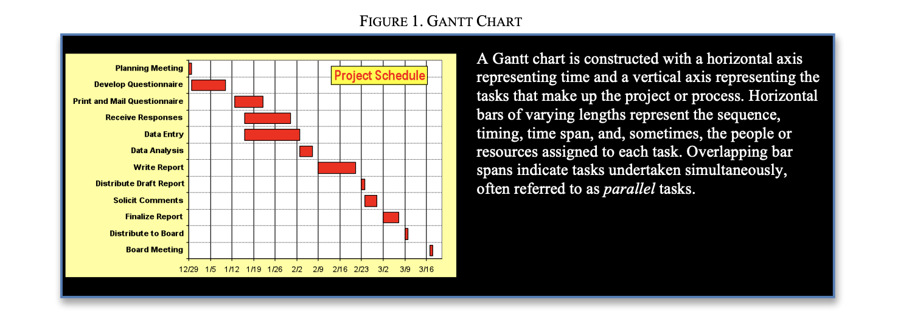

# Scheduling & Sequencing Pt. 1

> ## Gantt Chart Basics

A Gantt chart is a horizontal bar graph used to visualize the sequence
and timing of tasks in a project or process.1 Gantt charts are a useful
planning instrument before a project starts and can be used during a
project to measure progress and make it easier for team members to
communicate. Developing a Gantt chart helps you visualize and confront
scheduling challenges associated with your project or process. As you
work to define the tasks and sequence them, you may need to gather
information or assistance from your project team or customer. Once a
project is underway, your Gantt chart can serve as a reminder of the
tasks that need to be completed each day (or hour or minute) and as a
checkpoint to make sure each task is being completed on
time.{width="6.816735564304462in"
height="2.447761373578303in"}

