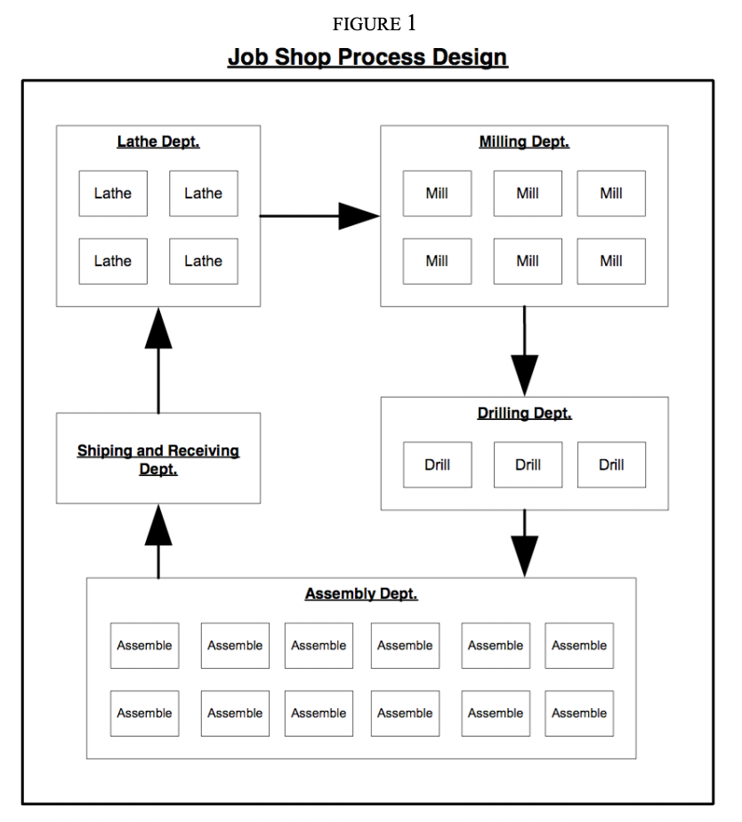
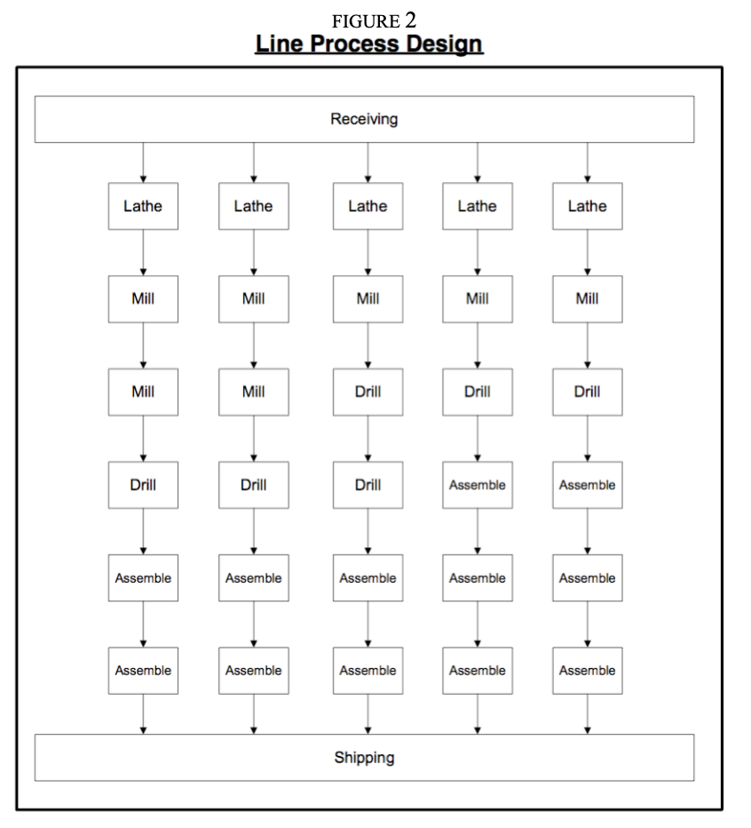
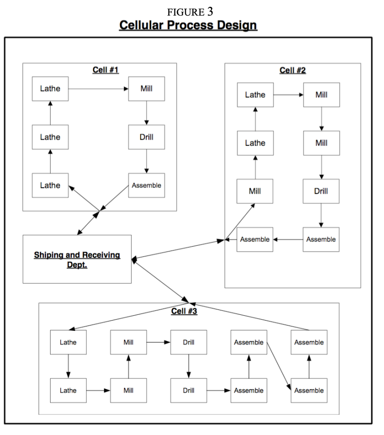
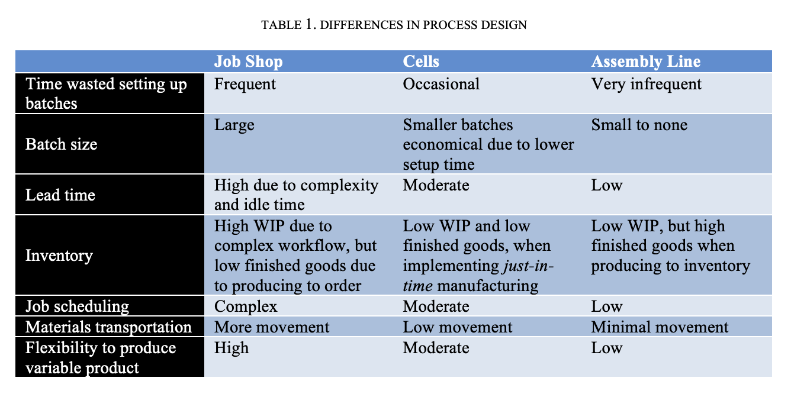

# Incentives, Labor, & Human Variability

**Summary**

Successful entrepreneurs know how to use all the analytical and
simulation-based tools to build a process. It is important to track the
cost of inputs, throughput rates, and the quality of output.

But focusing on process and machines can blind you to the fact that any
production process— and especially one with service or knowledge
workers—really relies on real people to run and improve it. Don’t
think of your employees as “human resources” (what a dehumanizing
phrase, right?), but as living, breathing marvels every bit as important
as you. Real people, when properly motivated, will seek out trial and
error experiments, standardize and simplify tasks, and find new ways to
serve customers better, faster, and cheaper.

Treating workers like partners, inspiring them with a powerful vision
and mission, rewarding them for adding value, helping them discover and
improve their talents, and setting clear boundaries to protect from
disastrous mistakes is at least as important as getting the operational
mechanics right.

**Fundamental Questions About Reward Systems**

Don’t make the mistake that so many entrepreneurs do and dive (or
stumble) into the details of a pay and incentive system before
addressing the most fundamental questions about how risks and rewards
will be shared. And it’s not all subjective, either. There are a few
absolute wrong or right answers, because the tradeoffs you will be
forced to make will vary depending on four things:

1\. Your views about money and human nature.

2\. The opportunity you have chosen.

3\. How quickly you plan to grow the company.

4\. The context: what’s happening in the world around you, and future
events that cannot be foreseen, much less controlled.

**The Foundations of a Successful Rewards System**

Before you jump into the deep end of compensation and rewards, consider
these five philosophical questions:

1\. Do you believe others should receive a large or small share of the
value that is created?

2\. Do you believe that rewards should be shared with everyone, or just
those at the top?

3\. Do you believe that everyone who receives an incentive should be
rewarded equally, or that some individuals deserve more than others?

4\. Should every person receive the same form of incentive, or should
different positions have incentives tailored to them?

5\. Are most people motivated by money or non-monetary compensation?

**An Action Plan for Using these Fundamental Questions to Design a
Compensation Plan**

1\. Check your personal beliefs against the opportunity.

2\. Decide how quickly you plan to grow the company.

3\. Check your fundamental premises against the external context.

**Summary**

Most entrepreneurs launch a company with little thought about pay and
incentives. They default to unexamined personal preferences, and adjust
on the fly depending on the cash on hand, who needs to be hired, and
negotiations with individual employees.

That is not a compensation system. It’s a disaster waiting to unfold.
Resolve now to deeply investigate your own views about money and human
nature. Then examine the key success factors for your opportunity and
the roles you need to fill. Then consider how quickly you will grow and
how the context may affect the rewards you want to offer.

At each step, use the five fundamental philosophical questions about pay
and incentive systems to look for fundamental misalignments so that you
can take action before the wrong compensation system cripples your
company

**Levers of Control**

The mechanics of business are straightforward. Find an unfilled need.
Discover a way to make and deliver a solution. If the price your
customer is willing to pay to satisfy the need is greater than what it
costs you to make and deliver a solution, you have the beginnings of a
business. Repeat over and over again.

The hard part of business is people—attracting new employees, screening
them, motivating them, and keeping them all moving in the same
direction. You will spend your lifetime trying to understand human
nature and will, more often than not, fail.

How do you transform a group of individuals into a team? Is it better to
lead from on high, to exercise iron-fisted control and try to program
every move until you have built a finely tuned machine? Or, should you
give people extraordinary freedom, so as to unleash their passion and
creativity? Somehow neither the rigid bureaucracies of the Fortune 500
nor the chaos of the dotcoms seem to be appealing models

This note is about a third approach—Levers of Control (LOC)—that appeals
to the deepest longings of human nature and offers a system of checks
and balances that will keep you and your people aligned with your
mission.

LOC both empowers employees and holds them accountable. It inspires
people to rally around a mission that matters while setting reasonable
limits on individual actions. It helps keep everyone striving for the
same goals while treating each person as a valued individual. Perhaps
most importantly, it does all of this with minimal costs and
bureaucracy.

**The False Choice: Top-Down Control or Unrestricted Freedom**

Most of us long for one of two management utopias. Engineers and
accountants want crispness and predictability, wishing people could be
more like machines. Visionary types like salespeople and artists want to
reach for the sky; they long for unbridled freedom, released from the
constraints of reality.

***An Engineer’s Dream: People as Machines***

Machines are simple to program and control. Twist a knob. Write a few
lines of code. Flip a lever and a machine will run hour after hour in a
predictable fashion. Want to change a specification? Simply rewrite the
code or buy a new machine.

Machines are simple to program and control. Twist a knob. Write a few
lines of code. Flip a lever and a machine will run hour after hour in a
predictable fashion. Want to change a specification? Simply rewrite the
code or buy a new machine. Those of us who are engineers or accountants
find people frustrating. People cannot be standardized. People become
bored if you ask them to repeat the same tasks over and over again
without explanation. People become demoralized and surly if you try to
control them. Some of us wish people could be more like machines.

Of course, people are not machines. To treat them as such overlooks the
creative power and resourcefulness of people who refuse to give up.
Markets exist to serve people and allow individuals to contribute their
unique gifts to others. The freedom to choose is a part of our DNA. We
forget that rules can become straightjackets and hierarchies that often
collapse under their own weight.

**A Visionary’s Dream: Unbridled Creativity**

A world without limits is the dream of visionaries, artists, and
salespeople. In this fantasyland, every customer says “yes.” Supply is
as unlimited as demand. The sky’s the limit. Imagine it and you can
build it. Build it and they will come.

To the visionary, engineers and accountants are non-believers and
naysayers. Even the slightest restriction is viewed as stifling,
unnecessary, and unreasonable. Skeptics are viewed as cynics who “just
don’t get it.”

Of course, “trees do not grow into the sky.” Markets and science do have
limits. Most improvements are incremental, not revolutionary. Unfocused
energy is usually frittered away in an orgy of wastefulness. We forget
that actions do have consequences; promises must be kept; that true
creativity begins not with imagination, but constraint, and that even
large bank accounts will run dry if not replenished by paying customers.

***True Leadership***

True leadership, then, does not rest on a foundation of control or
unrestricted freedom. The essence of leadership is to attract and
inspire the right people, with the right gifts to serve a select group
of customers better than anyone else—and to serve them over and over
again in a consistent fashion. The essence of leadership is to unleash
the incredible creativity inside every person and stoke his or her
desire to make a difference until serving becomes a passion.

The goal is not to transform people into machines. Rather, we seek to
find those who want to join a mission, and by asking them to contribute
their gifts, to serve others (customers, investors, and other employees)
in a quest that serves a need and, in the best-case scenario, changes
the world in some important way. We need to instill habits that make our
service more predictable and easier to execute—habits so embedded in
behavior that they come to represent the character of our teams and the
cultures of our companies. If we can accomplish this, we do not need to
make people into machines; we simply reward them for doing the right
things and let character and culture become the destiny of the
organization.

These are your jobs as an entrepreneur. To find a compelling need that
begs to be satisfied. Assemble people with the gifts to fulfill that
need and organize them to do so. Arouse a passion for excellence and
create a sense of predictability and purpose out of the chaos that is
the real world. But how do you do these things in a systematic way?

**The Four Levers of Control**

The Levers of Control framework gives you four “levers” to inspire,
reward, lead, and guide individuals so that each person can contribute
something meaningful toward a common goal. These four systems are in
natural tension, acting as checks and balances rather than directives or
rigid rules.

**The four levers are: (1) Belief Systems, (2) Boundary Systems, (3)
Diagnostic Systems, and (4) Interactive Systems.**

Belief Systems say: “Dare to be great\!
We are doing something that matters.”

Boundary Systems say: “You have a great
deal of freedom, as long as you stay between these lines.”

Diagnostic Systems say: “These are the
numbers you need to hit to be rewarded.”

Interactive Systems say: “You are
important as an individual. Your talents and interests deserve to be
nurtured, and you deserved to be coached so that you can reach your full
potential.”

**Why LOC Works**

Explicit beliefs, boundaries, and incentives that are aligned with an
inspiring mission are the recipe for a successful and enduring company,
particularly if they foster strong personal relationships between people
dedicated to a common cause.

The four levers work because they inspire and reward the right
individual behavior in a way that coordinates activity without
counterproductive bureaucratic interference. They are a system of checks
and balances on human behavior, a system of rewards and consequences
that instills the right habits and coordinates the choices of a freely
assembled set of employees.

***Levers of Control for Individuals***

Levers of Control speak to the deepest desires that make us human. We
want to make a difference in the world. We look to authority to tell us
the difference between right and wrong. We enjoy the positive feedback
that comes from reaching a goal. And we want to know that we are
understood and cared for as an individual.

These desires sometimes conflict. Should I do the right thing or the one
that makes the most money? Should I dare to do something grand or stay
focused? Do I care more about a relationship or my own needs? Competing
priorities and loyalties push and pull on each person. Levers of Control
provide guidance for difficult decisions, so making tough choices in a
consistent way becomes a habit.

***Levers of Control for the Company***

Levers of Control send clear signals about who should join in the
mission of a company and who should not. It aligns behavior without
becoming overly prescriptive. It instills good habits and routines
without dampening creativity. It encourages employees to dare to do
important things, without granting a license to charge off in
unproductive directions.

The Levers of Control are like invisible rubber bands on every person
that keep everyone headed in relatively the right direction. If someone
begins to place too much emphasis on individual rewards, the importance
of belief systems begins to tug. Too much emphasis on conformity and
interactive systems remind each person of the importance of their
personal contribution. Stray too far beyond the common mission and
boundary lines appear.

In the best companies, all four levers are aligned. The mission and
belief systems complement each other, thus helping to attract the right
people and organize them in a way that makes sense to satisfy a need.
The boundaries crisply define where energy will be focused and prevent
it from being spent on customers better served by others. The
diagnostics focus the attention on results that show customers are being
satisfied as cheaply as possible, with a strong return to investors.
Interactive systems help each individual find his or her right place,
now and in the long run.

***Levers of Control for the Leader***

Starting and leading a company is like being a parent. In the very best
companies, the essence of the company emerges from the DNA of a founder
who is well matched to a mission that matters. Beliefs are deeply felt
and describe a clear course.

As the company grows, the founder has to delegate. If the company is
small, you can do so with a great degree of authority and control. The
right individuals are attracted, nurtured, and become part of a
close-knit team.

When the company reaches adolescence, you must relax controls and allow
people to make their own decisions—within reasonable boundaries—as the
costs of coordinating their activities becomes too high. But how do you
set limits so that employees can learn from mistakes and grow, without
destroying the company?

Over time, with explicitly defined levers, strong systems and a
well-developed culture allow the company to separate itself from the
founder. This is just what a healthy parent would want for a son or
daughter.

***Adapting LOC for a Particular Company and Time***

Different companies may pull harder on particular levers. Companies that
rely on a motivated sales force, for example, need regular doses of
inspiration, whereas a petroleum refinery that could explode if certain
procedures are not followed requires a good deal more control. Other
companies need more collaboration than individual effort.

Most companies go through periods in which they temporarily need more
emphasis in one control area. By pulling harder on one lever than on
another, a leader can move the company in one direction without making
an irrevocable change in the company’s culture.

***How Levers Change as a Company Grows***

Over time, some levers change more than others. Mission statements and
belief statements rarely change, because such values are deeply held.
Boundary systems may be relaxed as a company develops new skills that
can be used to serve a different kind of customer. Diagnostics can
change frequently. A change in the context or competitive environment
may require a company to focus on different short-term goals. As a
business grows and its processes and markets mature, new targets may
need to be set. Interactive systems will change as different individual
needs arise and the company’s workforce becomes more diverse in talent
or age.

**Summary**

Levers of Control are more efficient than old style command-and-control
systems that eventually collapse under their own weight. They are more
focused on results than “new age” organizational systems in which
anything goes.

If clearly drawn, Levers of Control helps customers, employees, and
investors decide if they want to join in a company’s mission. They
describe which habits will be encouraged and which behaviors will not be
tolerated. They balance positive and personal feedback with constraints
and compliance. They provide consistent, gentle feedback so that the
right actions become habits. It is difficult to define a clear strategy.

It is much harder to attract and inspire the right people. And it is
even more difficult to balance individual needs with those of the
company. The hardest task of all is to instill in people good habits
that become the character of a company, and eventually its destiny.

Levers of Control help you explicitly examine these tensions between
individuality and common goals, between control and inspiration, so your
employees have a sense of the purpose, direction, milestones, and
individual freedom they need to change the world.

**Cellular Process Design Basics Lean workplace design that maximizes
flexibility and productivity**

What if you want both the efficiency of an assembly line and the
flexibility of a job shop?

The answer is cellular process design. It’s a lean manufacturing
technique used to maximize productivity when customized products need to
be produced in relatively low volume. 1 It involves organizing all the
workstations and resources needed to complete a product (or modular
product component) into one group or location, called a cell.

This note will compare assembly line, job shop, and cellular process
layout and highlight when and why a cellular process design is worth
considering.

**The Job Shop**

Job shops produce a wide variety of customized product batches. They are
organized for maximum flexibility, with the ability to reconfigure a
processing sequence through workstations with general capabilities to
the specifications of each batch. This is often called a functional
layout, since workstations are organized in groups according to the
function they serve. Job shops are very common. They often emerge as the
original manufacturing process for a startup because they lack
specialization—allowing a business to experiment with many different
customers, processes, and products.

Each order spends a significant amount of time waiting for availability,
setup, and transportation between workstations. Orders are produced in
batches to make production more economical, but this leads to a large
amount of work-in-process inventory. As a result, lead times are long
and cost per unit of production is relatively high due to wasted time,
inventory, and transportation.

For instance, in a job shop that produces many different industrial
parts, the shop floor might be organized into lathe, mill, drill, and
assembly “departments” (Figure 1). Each varied order (batch) will move
from one department to another according to the unique specifications of
that part.

**The Assembly Line**

Another common process design is the assembly line, where one or more
“lines” of production produce standardized products in high volume
using a fixed sequence of workstations. Line processes are not very
flexible, but can be very efficient.

Imagine that the industrial-parts manufacturer has focused its efforts.
In their experiments making custom parts for a variety of customers, the
owners have recognized that they can standardize three products and sell
them to many customers. As a result, they decide to specialize on
producing only these three parts. They reorganize the layout of their
floor to dedicate each workstation on a line for one specific product.
They set up five different lines in three configurations to handle the
specifications of three standardized products (two products have two
dedicated lines).

The advantage is that each machine is set up once and then runs
continuously. Since work-inprocess flows directly from one workstation
to the next in sequence, there is very little wasted time or
transportation as inventory flows smoothly through each line. Since cost
per unit of product is reduced, customers are attracted by the lower
prices and faster delivery of standardized parts. However, because
workstations are now dedicated to producing standard parts on a line,
this manufacturer must now say “no” to all custom part orders.

**A Cellular Layout**

Cellular design is a hybrid of the job shop and line process design,
where all the resources (people, raw materials, and equipment) required
to produce a product (or complete a specific service task) are grouped
together in close proximity with each other. A cell, or work cell, is a
group of workstations smaller than a typical job shop department,
typically with between three and fifteen people and machines in a
compact arrangement. In contrast to a job shop department, a cell
contains different types of workstations with all the necessary
resources and equipment to produce a narrow range of highly similar
products. Now our industrial parts manufacturer discovers that demand
for its three standardized products isn’t as strong as it had expected.
To reach more customers, it needs to provide more customization, which
means being able to respond quickly to design changes suggested by
customers. So rather than return to a job shop environment, they
reconfigure their layout into three cells. Each cell completes all the
steps required to produce one type of product. On the last step of the
process, standardized parts are assembled into various product options
per cell.

As a result of reorganizing into cells, the manufacturer gets some of
the physical advantages (and disadvantages) of both an assembly line and
a job shop.

The potential physical advantages of cellular processes are clear: by
combining some of the flexibility of a job shop with some of the
efficiencies of an assembly line, you achieve a reasonably effective
operation that can more quickly produce products that meet evolving
customer demand. But there is another powerful advantage that a cellular
process can have in your operation . . .

**The Cellular Process “X” Factor**

So what is this “x” factor that can supercharge a cell process? **In a
word—people.** Think of each cell as a tiger team of specialists
organized and given autonomy to meet a specific customer need.

In a job shop, workers tend to be relatively skilled due to the variable
demands of the work. And in assembly lines, workers tend to be low paid,
unskilled, and bored with the repetitive nature of their work. When an
operation becomes highly dependent on an assembly line, workers become
less connected with customer needs and less capable of solving simple
problems. This is one reason larger companies that mass-produce have
more trouble innovating new products and methods.

In contrast, cellular processes provide a very useful framework for
motivating people to higher levels of performance, problem solving, and
profitability. When these cells (or teams) clearly understand their
goals and have proper incentives, they can take on greater
accountability for the success of their work.

Workers in a cell need a broader range of skills than workers on an
assembly line. Often workers cross-train, so each can operate various
workstations within the cell as needs arise.

These workers use not only hard technical skills, but also interpersonal
skills. Because cells are small and concentrated, communication and
movement of work-in-process is simple and fast. If a quality problem
arises, the team can solve it directly, without relying on another
department. When a new customer need is identified, the team can adapt
its processes to deliver more value, more quickly to each customer.

A work cell is measured by several weekly, daily, or even hourly
productivity metrics. When the team meets and exceeds established goals,
team members receive financial incentives for their performance. Beyond
the financial incentives, workers in a cell benefit from pride of
accomplishment. Rather than being a cog in an anonymous wheel, workers
are proud members of a tight-knit, cross-functional team.

Now, certainly these people advantages are not automatic when you
implement a cell process. Developing self-sufficient teams will take a
significant amount of time and commitment in clarifying goals,
communicating effectively, and establishing proper incentives. However,
beyond the physical advantages of a cell layout, a cellular process can
be a useful workflow design to motivate your workers to use their innate
flexibility to make you more lean and agile as a business.

**Summary**

Cellular process, like any process design, is not a silver-bullet
solution. It is a great option to consider when you need more efficiency
than a job shop offers, yet requires more customization and flexibility
than an assembly line allows. It is also a structure you can use to
optimize the flexibility and motivation of the workers in your
operation.

