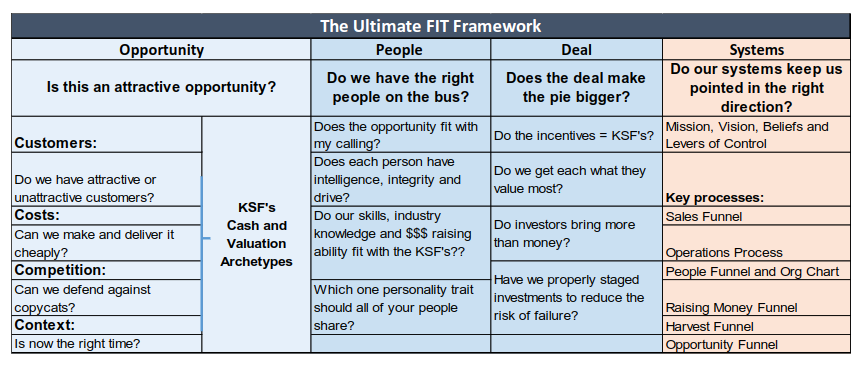

# Welcome to the 2019 Acton Review

Use the menu on the left or the search box to get started.

<map name="image-map">
    <area target="_blank" alt="Cash and Valuation Archetypes" title="Cash and Valuation Archetypes" href="cv-archetypes.md" coords="204,117,310,353" shape="rect">
    <area target="_blank" alt="Levers of Control" title="Levers of Control" href="leversofcontrol.md" coords="664,118,851,152" shape="rect">
    <area target="_blank" alt="Is this an attractive opportunity?" title="Is this an attractive opportunity?" href="opportunity-recognition-framework.md" coords="13,40,310,114" shape="rect">
    <area target="_blank" alt="Customers Framework" title="Customers Framework" href="customersframework.md" coords="11,118,200,150" shape="rect">
    <area target="_blank" alt="Do we have attractive customers?" title="Do we have attractive customers?" href="do-we-have-attractive-customers.md" coords="14,155,199,204" shape="rect">
    <area target="_blank" alt="Costs Framework" title="Costs Framework" href="costs-framework.md" coords="13,208,200,224" shape="rect">
    <area target="_blank" alt="Can we make and deliver it cheaply?" title="Can we make and deliver it cheaply?" href="can-we-make-and-deliver-it-cheaply.md" coords="14,228,198,258" shape="rect">
    <area target="_blank" alt="Competition Framework" title="Competition Framework" href="competition-framework.md" coords="13,264,198,313" shape="rect">
    <area target="_blank" alt="Context: Is now the right time?" title="Context: Is now the right time?" href="context.md" coords="14,317,199,349" shape="rect">
    <area target="_blank" alt="People Framework" title="People Framework" href="people-framework.md" coords="314,40,489,351" shape="rect">
    <area target="_blank" alt="Deals" title="Deals" href="deal-framework.md" coords="494,40,661,350" shape="rect">
    <area target="_blank" alt="Understanding and Serving Your Customers" title="Understanding and Serving Your Customers" href="serving-your-customers-framework.md" coords="663,208,849,223" shape="rect">
    <area target="_blank" alt="The Operations and Costs Framework" title="The Operations and Costs Framework" href="operations-and-costs-framework.md" coords="664,226,849,260" shape="rect">
    <area target="_blank" alt="Hiring Funnel and People Note" title="Hiring Funnel and People Note" href="hiring-funnel.md" coords="664,262,849,278" shape="rect">
    <area target="_blank" alt="Raising Money Framework" title="Raising Money Framework" href="raising-money-framework.md" coords="665,282,850,314" shape="rect">
    <area target="_blank" alt="Harvest Funnel" title="Harvest Funnel" href="harvestfunnel.md" coords="665,318,849,334" shape="rect">
    <area target="_blank" alt="Opportunity Recognition Framework" title="Opportunity Recognition Framework" href="opportunity-recognition-framework.md" coords="662,336,847,352" shape="rect">
</map>

## Latest Updates
June 12th: Added [Cash & Val: Internal or Finance](internalorfinance.md)

June 12th: Cleaned up [Putting Yourself in The Customers Shoes](customersshoes.md)

June 3rd: Added Monkey Ranch 5 Parts 1 and 2

May 29th: Added [The Goal](thegoal.md) & [The War of Art](thewarofart.md) sections

May 29th: Completed [Introduction to Customers](./intro-to-customers.md)

May 29th: Added [Frameworks page](./frameworks.md)

May 29th: Added Videos for Monkey Ranch #1, #2, #3, #4, and #6

May 28th: Added Monkey Ranch section

## Todo

- Operations
- Cash and Valuation
- Discovery
