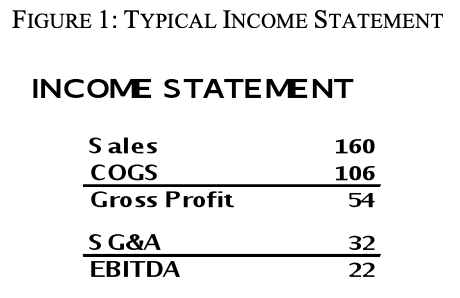
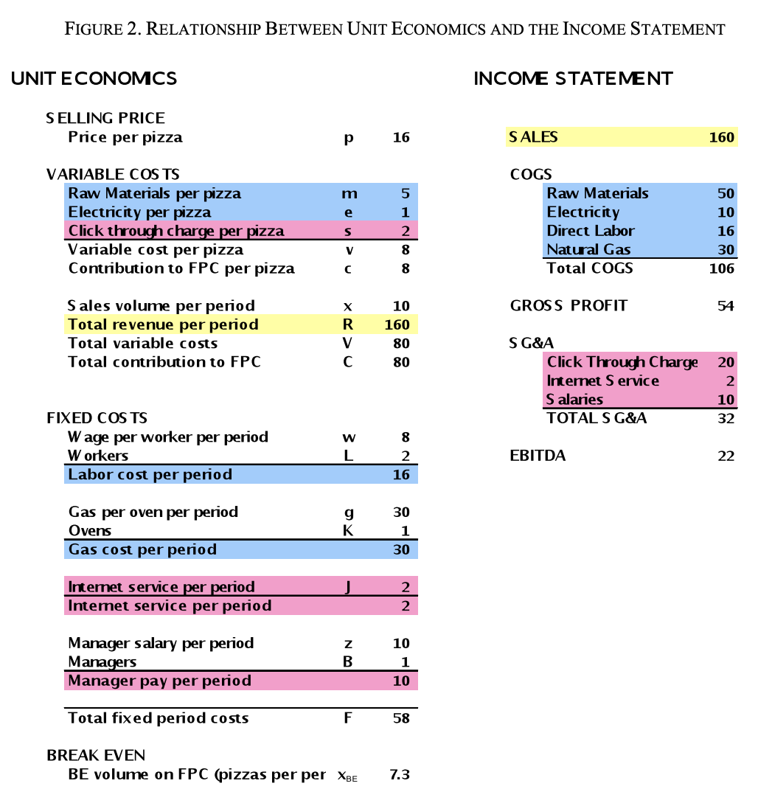
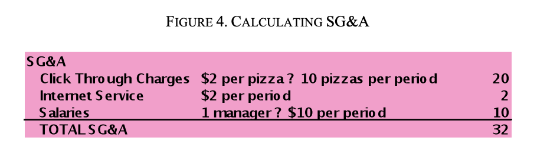
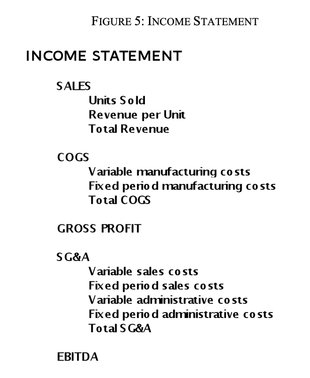

# Learning to Speak Financial Accounting

**The unit economics summary** collects all variable (unit) costs, no
matter where in the business (sales activities or manufacturing
activities) they are incurred, and separates them from the fixed period
costs (again, collected from all parts of the business) so that the
entrepreneur or manager can calculate breakevens and more effectively
measure the trade-offs between price, unit volume (sales), and costs and
calculate the value of new investments or other changes in the business.

**The income statement**, on the other hand, organizes information by
activity—operations, sales, general, and administrative. The income
statement is a financial record that helps the owner track expenses by
category, recognize trends, and hold managers accountable for their
respective areas of responsibility.

**COGS**

COGS stands for “Cost of Goods Sold.” This line reports all costs
directly attributable to the production of the company’s product. COGS
includes raw material inputs as well as “direct labor,” labor applied to
making the product. Most of the data from the manufacturing process
winds up on this line.

**Gross Profit**

Subtracting COGS from Sales leaves **Gross Profit.** The company must
cover its sales, general, and administrative costs out of this
difference between total revenue and production costs.

**SG\&A, or Sales, General, and Administrative**

These expenses, include costs associated with all sales and marketing
activities—salaries for salespeople, advertising, and so on—as well as
salaries for the company managers and other administrative expenses not
directly attributable to sales or manufacturing operations.

**EBITDA**

Subtracting SG\&A from Gross Profit leaves a measure of company profit
called **EBITDA**—an acronym that stands for “earnings before interest,
taxes, depreciation, and amortization.” For a simple business with no
debt or financing, no depreciation on tools, and no taxes, EBITDA is the
same thing as cash left over after all inputs, workers, managers, and
suppliers have been paid. Put another way, EBITDA is the same thing as
the unit economics pre-tax cash flow.

**Summary**

When you’re considering an increase in sales or a new product launch or
a big investment in production capacity, you’ll want to do unit
economics analysis—that is, to calculate contribution per unit to FPC,
sales volume to breakeven on FPC, and how long it will take to recover
the money spent on new equipment. Since businesses don’t usually report
costs and revenue in simple unit economics form, you must learn to get
the numbers you need from financial reports, like the income statement.
As you dig into an income statement to learn about a business, keep in
mind that income statements typically organize information by
division—that is, all costs associated with manufacturing will show up
under COGS and all costs associated with sales (as well as general and
administrative costs) will be under SG\&A. Income statements do not
distinguish variable from fixed period costs—the information you need to
do unit economic analysis. Managers sometimes act as if COGS were
“variable costs” and 8 SG\&A were “fixed costs.” While COGS includes
all the variable costs of making the product, it may also include fixed
period costs such as labor or utilities directly related to
manufacturing. In the same way SG\&A may include variable costs—sales
commissions, for instance—associated with selling the product. If you
want to separate the fixed and variable components of COGS (and SG\&A),
you’ll have to take a closer look at how the reported expenses change as
sales volume changes.

