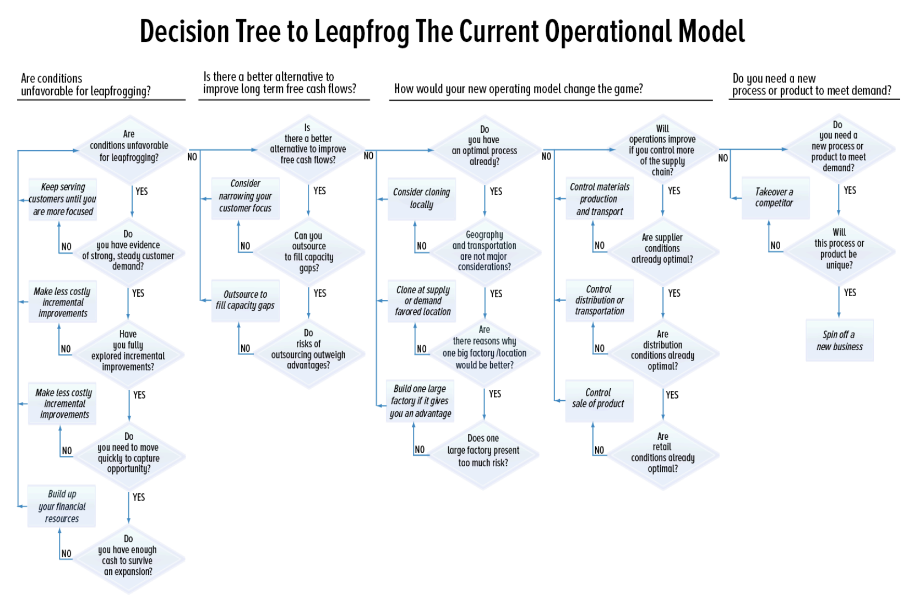
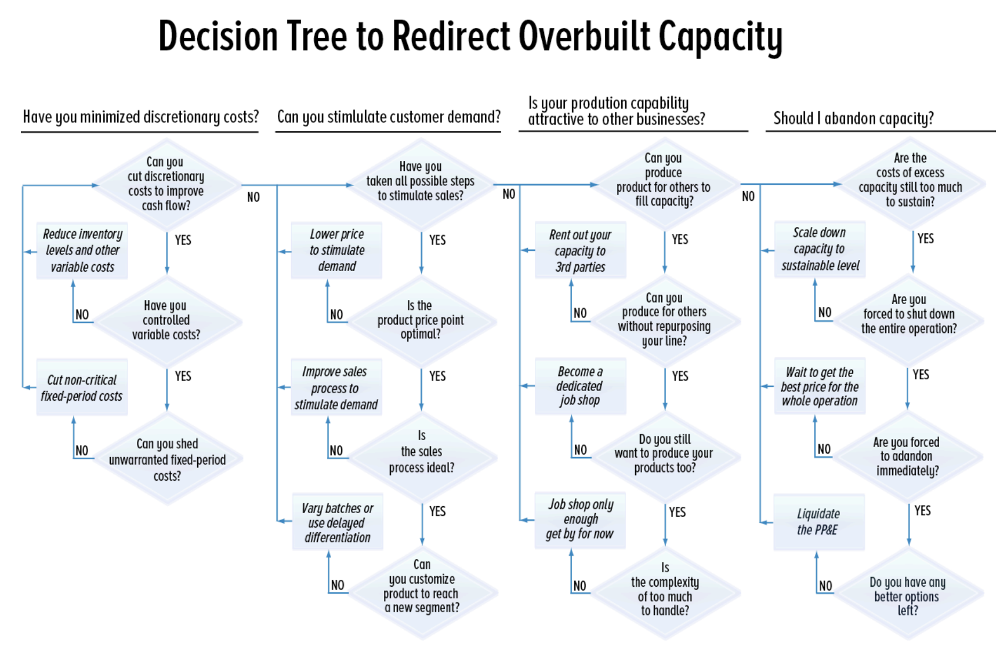

# Making A Big Bet In Operations

A busy entrepreneur must choose between one of four actions as the next
focus for improvements in operations:

1\. Create a new process.

2\. Incrementally improve an existing process.

3\. Make a large bet to leapfrog the current operational model.

4\. Make serious cost reductions to eliminate costly spare capacity.

*This note focuses on Step 3, making a large bet to leapfrog the
operational model.*

Incremental, trial and error experiments with your operations are
important. They’re cheap, they’re quick, and they’re low-risk. The best
entrepreneurial companies, large and small, are committed to continual
improvement. Toyota and Google make thousands of little tweaks to their
operations each year. (The Japanese have a name for this, by the way:
**kaizen—just means continual improvement by getting rid of waste)**. If
your operational philosophy doesn’t include your own version of kaizen,
it should, because you can bet one of your competitors is looking for
that next tweak, right now

**Reasons to Make a Big Bet**

When should you think about making big bets in your operations? Start
with these six scenarios.

**1. When equipment to standardize operations will greatly reduce
overall costs**

Often a company will start out using artisans to accomplish a task.
Expanding capacity simply means adding another low-capacity artisan.
After a while, though, trial and error custom work may reveal routines
and practices that have become so standardized that a machine could more
efficiently do them.

Example: In its early years, Honda
replaced a large group of artisan workers, who produced motorcycles by
hand, with an automated plant that allowed it to leapfrog its
competition and greatly reduce the cost per motorcycle made.

**2. When costs per unit decline as production volume increases**

In some operational processes (though fewer than most people think), the
costs per unit may decline as production volume increases because of the
nature of the process. The larger the throughput, the lower the cost per
unit.

Example: A spherical vessel transforms
crude oil into gasoline in the petroleum refining industry. A larger
vessel refines its contents much more cost efficiently than a smaller
one. But larger ones require an expensive upfront investment. Bigger
vessels also require bigger plants. Expanding a plant means making a big
bet that there’s demand for the output of the larger spherical vessel.

**3. When bundling tasks appeals to customers**

You achieve an economy of scope when you reduce the long-term average
cost per unit of production by offering a wider range of goods or
services.

Example: Large communications service
providers bundle multiple services. It is difficult and very costly to
acquire a new communications customer. So a phone company with a large
number of subscribers may want to make a big bet to buy a television
cable company and an Internet provider to offer additional services
without the cost of acquiring new customers.

**4.** **When size strengthens bargaining power with suppliers and
customers**

In some cases, owning a large share of a market will give you more
bargaining power with suppliers and customers, but only if you have a
relatively large and valuable share of their business, and if they have
few alternatives.

Example: In the fast-growing personal
computer market, Dell used its size as a negotiating advantage over
smaller component manufacturers, forcing them to hold inventory, which
helped Dell finance rapid growth and lowered the risk of having
components held in inventory become obsolete.

**5. When a large leap could discourage new entrants**

If you have a large, growing market with attractive margins, you may
need to preemptively add (or at least announce) large amounts of new
capacity to keep new entrants and competitors at bay.

Example: Aluminum manufacturing is a
highly capital-intensive business. Often manufacturers will announce
large additions of capacity in advance when margins are high, in the
hopes of discouraging competitors from adding capacity.

**6. When the costs of a customer defecting are high**

Large additions of capacity make more sense if you are confident that
once you attract a customer, he or she will remain loyal and find it
difficult to defect to a competitor.

Example: Once workers have been trained
to use one type of computer interface, it can be difficult to convince
them to switch and endure a new round of training. In cases like this,
large investments in sales and marketing may make sense.

**Ways to Make a Large Operations Leap**

1\. Lower production costs for existing demand

2\. Remove several potential bottlenecks at once.

3\. Add an additional production line.

4\. Find a new primary process.

5\. Embrace a disruptive technology.

6\. Go up or down the value chain.

7\. Clone geographically.

8\. Embrace an entirely new business model.

**Danger Signs When Considering Big Bets**

1\. When there’s no real advantages to size.

2\. When customers are easily lured away by competitors.

3\. When a leap adds complexity.

4\. When a price war is inevitable.

5\. When you have to take on debt.

**Alternatives to Making a Big Leap**

Don’t feel compelled to take a large leap when it isn’t necessary.
Outsourcing and refocusing provide alternatives to large, potentially
risky investments.

1.  Outsource as a Test: Often capacity
    additions can first be outsourced until demand, new processes or new
    technology are proven. Say you see a profitable opportunity to
    expand and don’t want to let it pass you by, but the cost of the
    added capacity could sink the company if you bet wrong. Before you
    place that big order for machinery, look for a job shop, supplier,
    or customer with spare capacity. That way you can speed up response
    time and lower your risks until you have proven the process or
    market. Of course, outsourcing carries its own risks. Your external
    provider may not share your standards and commitment to quality.
    There may be risk in sharing your confidential processes and data.
    Your provider may drop the ball and fail to deliver on time, cost,
    and target. Know what you’re getting into.

2.  Refocus: Some opportunities are
    ephemeral. In some cases, as your competitors rush to expand, you
    may be wise to go the other way and refocus. Is there a more
    profitable segment of your customers that you can focus on? Are
    there some unprofitable customers you need to fire? It’s
    counterintuitive, but sometimes shrinking revenues leads to stronger
    and lower-risk free cash flows for you.

**Making the Decision**

In the end, the decision will be relatively simple. Given the
opportunity and your personal talents and goals, will making the big bet
be worth the risk or not?

First, start with your current situation. Given the current operational
setup and constraints, how much free cash flow will your firm generate
over the next few years if you forego the big bet to pursue an
incremental approach?

Be sure to take into account how quickly your market is growing, the
barriers you have to keep out competitors, and your ability to
incrementally add capacity by removing bottlenecks. Also factor in the
increases in cash flow that might occur when you reach capacity if you
raise prices or fire troublesome customers and replace them with more
profitable ones, and conversely the likelihood and impact of luring in a
new competitor.

What is the likely net present value of the firm and your equity if you
stick with the status quo?

Now consider the effects of a big leap. How much potential profit can
you make if demand materializes as you expect? Is there a chance you can
increase profits by using your larger size to force customers or
suppliers to make concessions? How long will it take to reach payout and
recover your incremental investment? Will the breakeven volumes be
increased to dangerously high levels, or will cost improvements actually
lower breakeven levels? Will you be forced to take on high levels of
debt that make the move even riskier? Can a historical study of your
industry or similar industries tell you something about the long-term
implications of taking a big leap?

Now what is the likely net present value of the firm and your equity if
you take the big leap, using both best—and worst—case estimates? In the
final step, pause and consider the intrinsic rewards and risks.

Do you have the talent and drive to run a much larger business? Are you
willing to take the risks? Does something about your personality draw
you toward one solution or another?

Now make the decision. Because, as the owner, the decision to make a big
leap or not will always belong to you.

**Eliminating Excess Capacity**

A busy entrepreneur must choose between one of four actions as the next
focus for improvements in operations:

1\. Create a new process.

2\. Incrementally improve an existing process.

3\. Make a large bet to leapfrog the current operational model.

4\. Make serious cost reductions to eliminate costly spare capacity.

*This note focuses on Step 4, retrenching when you have too much
capacity.*

You decided to make a big bet to leapfrog the competition. Maybe you
wanted to discourage new entrants, or maybe you wanted to increase the
scope of your offerings to meet or stimulate demand.

Whatever your reasons, now it’s clear you bet wrong, or at least
prematurely. Now that extra capacity feels like a millstone around your
neck. You ask yourself: Will it just take some time for demand to catch
up with capacity or should I cut my losses and retrench?

Overcapacity isn’t necessarily bad; it’s a blessing if it allows you to
take advantage of a new market or respond to peaks in demand. But when
the costs of maintaining that capacity are too high, you may have to
make some tough decisions to get your costs back in line: layoffs,
mothballing facilities, or selling equipment, just to name a few. It’s
time to make a decision, because all that unused capacity is draining
away cash and profits.

**Rebalancing Capacity and Customer Demand: Step
by Step**

There are five steps you can take to help rebalance capacity and
customer demand:

1\. Minimize discretionary costs

2\. Idle and store equipment

3\. Stimulate demand to fill capacity

4\. Rent out your extra capacity

5\. Abandon excess capacity

Let’s look at those steps one by one.

***1. Minimize Discretionary Expenses***

First, stop ordering new supplies until raw material, work-in-process,
and finished goods inventory match current expected demand. If
necessary, hold fire sales to reduce inventory levels. Next, examine
your payroll. Laying off people isn’t any fun, but most companies handle
staff reductions poorly. They wait too long. They make across the board
cuts that demoralize everyone. It’s far better to take a scalpel
approach than a hatchet one: eliminate redundant workers and make a
measured series of small cuts.

***2. Idle and Store Equipment***

Consider idling certain machines or lines. Pay particular attention to
the cost of mothballing and storage: How quickly will it take for your
equipment to begin to rust or decay? If stored, how long would it take
to extract and restore that equipment when you need it again? With
“warm” storage, you pay more each month in maintenance to be able to
bring capacity back into service quickly. In “cold” storage, you pack
more equipment upfront for an extended period of time, in return for
less expensive monthly upkeep.

***3. Stimulate Demand to Fill Capacity***

Instead of cutting your expenses, you can focus on stimulating demand by
improving the sales process, lowering the price, or offering a more
compelling product. Improving the sales process to reach new markets
requires investment and time, which you may not have. But a close
examination of prospects in your sales funnel you haven’t closed yet may
reveal ways to accelerate sales or redesign key steps and techniques.
You can appeal to more customers by customizing the product to reach a
new market segment. In a batching operation you can run varied batches
to offer customers more choices (e.g., different flavored cookies). On
an assembly line, customize at the end of the line to efficiently create
different product options (e.g., different cookie toppings). The
simplest way to increase unit demand may be to cut prices. But you must
be sure that reduced prices will lead to enough incremental sales to
make up for lost profits, and take care not to start a ruinous price
war.

***4. Rent Out Your Extra Capacity***

If your products are not in demand, you may be able to fill your
production capacity by renting it out. For example, you could use your
existing operation to produce a product for another company. When this
leads you to repurpose your resources and reconfigure your line, then
you will be operating, at least part of the time, as a job shop. One
advantage is that you will only be producing product and will not need
to design and market the product yourself. So renting out your
production capacity could more quickly improve your free cash flows than
redesigning your own product for a new market segment. On the downside,
running a job shop will be more complex. The challenges of operating as
a job shop will hamper your ability to thrive with your own product(s).
In the long run, you will need to decide if you are job shopping to fill
a temporary capacity gap or if you are really transitioning to become a
dedicated job shop. If it’s the latter, then you may need to make other
significant changes to your business.

***5. Abandon Excess Capacity***

If you are managing to operate at breakeven or better, then you have
more options. You still have an opportunity to retrench and redirect
your overbuilt capacity.

If your ongoing cost commitments—fixed-period costs and debt service—are
not sustainable, then you will be forced to abandon capacity. Ideally,
if you have some flexibility, you can abandon some part of your capacity
to bring your costs down to a sustainable level. This might be a machine
that is expensive to operate or maintain, or more employees, or, if you
have multiple locations, you may need to shut down an entire location.

If you need to sell unneeded fixed assets, differentiate between assets
that are hard to replace and would bring little at auction and those
that are easy to sell and can easily be added back if demand rebounds.
Sometimes you might feel compelled to abandon the entire business.

If you run out of cash, you will be forced to liquidate your assets at
fire-sale prices.

If you have loyal customers and a significant investment in process and
product design, you will be able to get a better return on your
investment by selling your entire ongoing operation. You may, for
example, find a competitor eager to access your customers and production
capabilities.

**Conclusion**

It is rare for customer demand to perfectly align with your operational
capacity. Generally, your profit per unit will be highest when you are
operating at maximum capacity and lowest when operating at breakeven
volumes. Higher utilization of resources leads to better free cash
flows.

So you must constantly make adjustments to keep your capacity filled
while serving customers reliably. Big bets can take your business to the
next level, or big bets can destroy your business. That’s why it’s
important to analyze the risks and costs of eliminating spare capacity,
before you make the decision to build it.

