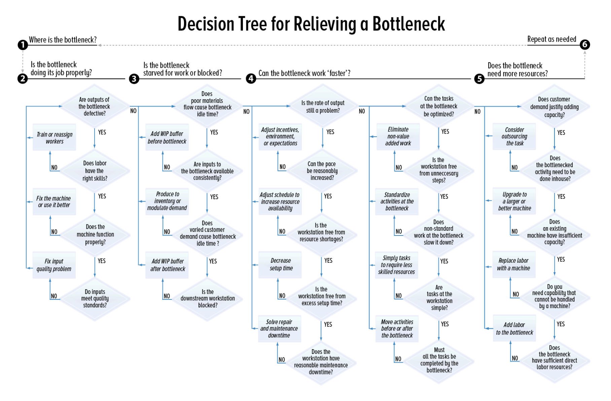
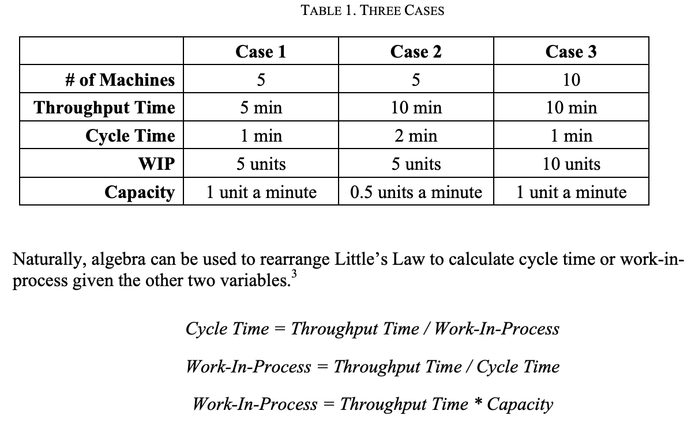
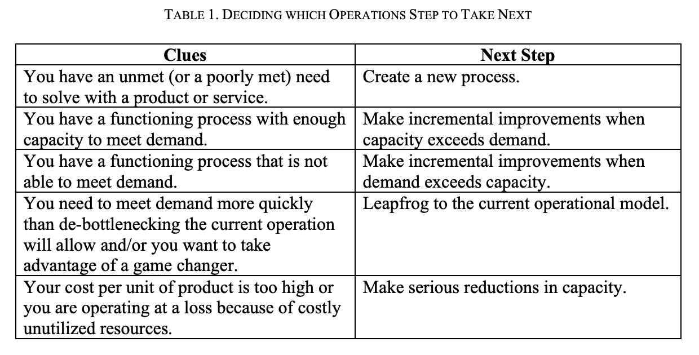
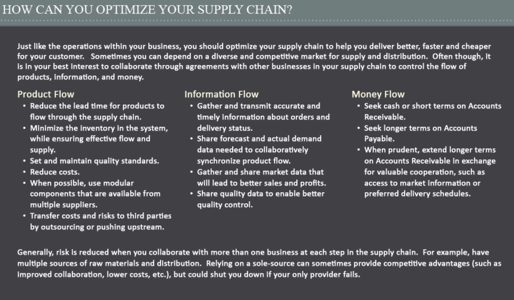
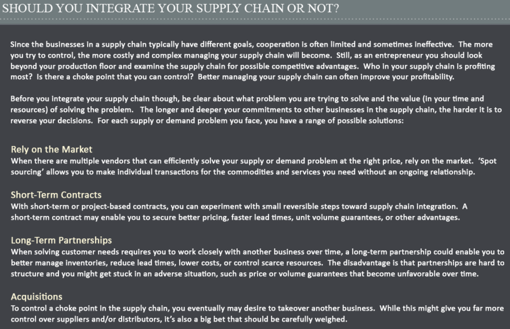
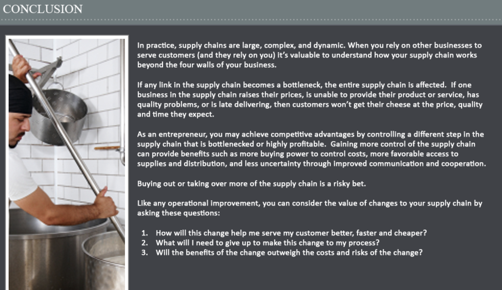

# Making Incremental Improvements

A busy entrepreneur must choose between one of four actions as the next
focus for improvements in operations:

1\. Create a new process.

2\. Incrementally improve an existing process.

3\. Make a large bet to leapfrog the current operational model.

4\. Make serious cost reductions to eliminate costly spare capacity.

*This note focuses on step 2: the methods to incrementally improve a
process.*

The Basics of Bottlenecks

A bottleneck is the step in your process that has the lowest capacity.
It’s the “tight spot” that keeps you from producing and selling more
product. It’s the place where work begins to “stack up.” The throughput
of your entire business is limited by this critical resource.

You can spend all the time you want adding capacity to other steps in
your process but, until you fix the bottleneck, throughput will not
increase. When customer demand exceeds your ability to throughput
product, then it’s time to get serious about relieving your operational
bottleneck.

Ask these important questions in this order:

1\. Where is the bottleneck?

2\. Is the bottlenecked workstation doing its job properly?

3\. Is the bottleneck starved for work?

4\. Can the bottleneck work “faster”?

5\. Does the bottleneck need more resources to keep up with customer
demand?

6\. (Repeat as needed.)

***Debottlenecking Step 1: Where is the bottleneck?***

Before you can fix the bottleneck, you must find it. Remember, a task is
not necessarily the bottleneck just because it takes a longer amount of
time or it has fewer resources or capabilities. Map and then measure
each step in the process. Look for the workstation with the lowest
capacity, that’s your bottleneck. Depending on the complexity of your
process, identifying the bottleneck may be easy or difficult. In a
simple process with standardized products or services 3 being delivered
at a constant rate (limited variability), spotting the bottleneck may be
as simple as seeing where unfinished product (work-in-process or WIP) is
piling up. No matter how well you map your process, bottlenecks can
surprise you. Sometimes a new bottleneck will emerge unexpectedly when a
machine breaks down or a critical staff member calls in sick. Remember:
all efforts to increase your throughput should begin at the bottleneck.

***Debottlenecking Step 2: Is the bottlenecked workstation doing its job
properly?***

Before you can complete any task faster and cheaper (more efficiently)
you must first be able to do it correctly (effectively). Is the person
or machine assigned to the bottlenecked workstation making too many
mistakes and outputting defective products? Or are the inputs entering
the workstation already defective, causing this step in the process to
fail? Reduce Defective Outputs Defective product is a waste of time and
materials that can quickly clog your process. Find out what is causing
defective product and fix it.

Lessons learned: • Make quality repeatable by having clear, measurable
quality standards and standardizing and documenting tasks so you
consistently meet or exceed those standards. • If a worker lacks the
skill to complete a task, then train the worker or reassign the task to
a more skilled worker. • If a machine is not functioning properly, fix
the machine or change procedures to use the machine more effectively.

***Control Quality Earlier to Reduce Defective Inputs***

Sometimes defects in work-in-process are not immediately obvious. A
defective unit might proceed through many steps in your process before
it is rejected. It is critical waste to have your bottleneck working on
units that will be rejected later. So it’s important to make sure that
WIP entering your bottleneck is not defective. Inspect inputs before
they enter the bottleneck. Rejects should be put into scrap or re-worked
to standard before they enter the bottleneck. Of course, inspection
doesn’t solve the root cause of the defect. Nor does inspection add
value to the unit, though it may keep you from wasting further time and
effort on a defective unit. It may be that an upstream workstation is
causing a quality problem or it could be that the raw materials are
defective before you even start working on them. In the long run, you
will want to identify why the defect is occurring, fix the root cause of
the problem, and, if possible, eliminate the need to inspect.

Lessons learned: • If the bottleneck step seems to be doing its job, but
still not producing quality outputs, then check the quality of the
inputs.

***Debottlenecking Step 3: Is the bottleneck starved for work or
blocked?***

The bottleneck can’t be doing work if it doesn’t have anything to work
on. The output of a bottlenecked workstation suffering from starvation
can be readily improved by providing a consistent supply of inputs.

***Add a Work-in-Process (WIP) Buffer Before the Bottleneck to Eliminate
Idle Time***

In other words, keep a stack of materials constantly waiting to enter
the bottlenecked station to make sure it’s always busy.

Lessons learned: • If the variability of upstream workstations causes
the bottleneck to run out of inputs, solve this problem by adding a
work-in-process (WIP) inventory buffer before the bottleneck. • Keep the
buffer stocked with quality WIP in sufficient supply so that the
bottleneck never has to wait for inputs.

***Produce to Inventory to Better Utilize Capacity***

A business often produces to order—manufacturing units only when
customer orders are being filled. Because of this inconsistent demand, a
bottlenecked workstation will remain idle and starved for inputs until a
new order is ready to be processed. During production, if this
workstation becomes overburdened by demand, then the capacity of the
entire process is limited. In this case, you could produce more output
by running the operation consistently even when demand is inconsistent.
The result is Finished Goods Inventory (FGI) awaiting sale.

Lessons learned: • Producing to inventory is one way to utilize more of
your production capability. • One advantage of producing to inventory is
that it can drastically reduce customer wait time. • When possible,
reorganize your production line so that customization is completed at
the end of your process, after the bottlenecked workstation.

***Smooth Demand To Better Utilize Capacity***

Another way to reduce idle time on your bottleneck is to smooth out
customer demand so that your process runs more evenly. If you must
produce to order due to the customized nature of your product, you can
take steps to require customers to order in a way that makes the rate of
production less variable.

Example 1: A medical clinic levels demand
by requiring patients to make an appointment. As a result, customer
demand is matched to availability of appropriate medical staff.

Lessons learned: • Customers may be willing to order and wait until you
can serve them. • You can use incentives (better or cheaper service) to
encourage customers to order at times that are more convenient for you.
• These tactics allow you to utilize your resources more consistently,
which can lower your average cost per unit.

***Eliminate Blocking***

Blocking occurs when a downstream workstation is busy and cannot accept
inputs from an upstream workstation. Unless there is sufficient WIP
buffer between workstations, blocking can back up a line, slowing
everything down. Bear in mind that a blocked workstation is a
bottleneck, but it may not be the bottleneck with the lowest capacity on
the line.

Lessons learned: • Add a WIP buffer after the bottlenecked workstation
if output from your critical resource is being blocked by downstream
workstations.

***Debottlenecking Step 4: Can the bottleneck work “faster?”***

You have made sure that the bottleneck is capable of doing its job
properly and you have also created a smoother flow of materials to
reduce idle time at the bottleneck. Next you should look again at the
bottleneck workstation itself to see if it can output more units. Is
there any down time that can be eliminated? Can the workstation tasks be
optimized?

***Increase the Pace***

At this point, we assume the worker or machine is capable of performing
the task, but the output may not be as fast or consistent as desired. In
some cases, it may be possible to increase the pace of worker output by,
for example, increasing motivation and incentives, offering additional
training, or adjusting environmental conditions. While there may be
little possibility for reasonably increasing worker speed on an already
fast-paced factory floor, the productivity of 8 salaried professionals
can often be improved with clear expectations, motivation, incentives,
and other environment improvements.

***Reduce Resource Shortages***

Lack of worker availability can cause downtime at the bottleneck.
Workers need to take breaks. They may call in sick, take vacation time,
or spend too much time in unproductive meetings. Whether a task is 100
percent direct labor or a combination of machines and labor, schedule
staff rotations to minimize bottleneck task downtime. Train backup
workers who can fill in on critical tasks when the usual workers are
unavailable.

***Setup Time***

Often a workstation that handles batches requires setup or change over
time to reset the machine or process from running one product to
another. The traditional approach to minimize setup times for batches
has been to run large batches for a long period. This means fewer setups
are required. However, smaller batches give you more flexibility and
responsiveness to variable customer demand and help you keep
inventory-holding costs down. So you may need to balance tradeoffs
between batch size, batch frequency, batch characteristics, and downtime
for setup.

Lessons learned: • Setup time is downtime when your bottleneck is not
producing throughput. • Moving resources to the bottleneck to reduce
setup time increases the amount of time that your bottleneck can be
adding value for customers.

***Maintenance and Repair Time***

Machines must be maintained to operate properly. For example, during a
period of peak demand, a machine may be operated continuously without
routine maintenance to increase output. Sometimes this is a worthwhile
risk, though in the long run operating a machine without proper
maintenance can lead to a variety of negative outcomes.

Lessons learned: • Proper maintenance keeps your operation safe and
productive. • Plan for downtime and have backup resources. • Integrate
maintenance into regular operations to ensure maximum uptime.

***Eliminate Unnecessary Steps***

Examine all the activities conducted at the bottleneck. The fewer tasks
the better.

Lessons learned: •Excess movement of workers and transportation of
materials is waste. •Minimize non-value-adding activities to decrease
cost and lead-time.

***Standardize and De-Skill the Task***

Sometimes the bottleneck workstation includes several complex activities
that lack standardization and are difficult to repeat reliably. Look to
decompose the bottleneck workstation task to its simplest elements.

Lessons learned: • Standardized tasks require less capability (skill and
experience) from your machines and laborers. • Standardized tasks are
less complex, easier to repeat, and less costly.

***Move Work Away from the Bottleneck***

Once you have standardized and de-skilled the task, it may be possible
to simplify the workstation task by moving activities to upstream or
downstream workstations that have more capacity.

Lessons learned: •Moving work away from the bottleneck increases
throughput. •Before you can move work away from the bottleneck, you must
be able to break the task down into its simplest component parts.

**The Right Place for a Bottleneck**

Remember that every process will have a bottleneck. A process without
any bottlenecks would have enormous excess capacity. If you already have
the operational capacity to make more units of production than you can
sell, then the factor limiting the throughput of your business is your
sales process. In this case, increasing the capacity of your sales
process should be a higher priority than adding to your ability to
produce units that would be unsold.

When customer demand is not sufficient to risk the cost of adding
capacity, it generally makes sense to locate the operational bottleneck
at the workstation that would require the greatest capital expense to
add a parallel resource. In other words, use all the techniques
discussed above as needed to optimize your process to use your most
costly resource as intensively as possible.

After you have used these techniques to improve the throughput of your
bottleneck, your bottleneck may still be in the same place. If so, you
will want to consider elevating the capacity of this critical resource,
which will increase your costs. “Elevating the capacity” simply means
spending money to add more resources (workers or machines) to increase
the rate at which you can perform the bottlenecked task.

Before you do this you must ask: What is the
value of relieving this bottleneck?

To find the answer, determine what the costs and expected revenue will
be after you add a resource at your bottleneck. Estimate the worst,
expected, and best-case scenarios for sales and the operational
throughput with your new process.

You may need to give up free cash flow in the short-term to add
resources (either capital investments or additional fixed-period cost
commitments). Additional resources will likely increase your monthly
breakeven point, too. The additional revenue generated by the new
resource must be more than the cost of adding the resource. Adding a
resource to the bottleneck is not worthwhile unless it adds to your free
cash flow in the long term. When your projection demonstrates that a
long-term improvement to free cash flow is questionable with an
additional resource, you might be better off raising your prices or
focusing on a smaller segment of the market instead. If you identify
more than one way to relieve the bottleneck, you should run projections
for each debottlenecking solution to determine which will return the
highest free cash flow over time.

***A Fifth Debottlenecking Step: Does the Bottleneck Need More
Resources?***

If you find that your critical resource is still limiting your
throughput, you may need to elevate this bottleneck to a higher level of
capacity. A capital investment or additional fixed-period cost
commitment may be required to achieve a marginal throughput improvement
at this workstation. So before you make the additional commitment, be
sure that the cost of additional capacity will be offset by increased
customer demand.

***Consider Outsourcing the Task***

Before you invest in additional capacity, consider outsourcing the task.

Lessons learned: • Outsourcing can lower costs and improve quality. •
Capacity is increased and you can also instantly become more capable,
flexible, and reliable by partnering with an expert service provider.

***Upgrade to Larger or Better Equipment***

When your operation is limited by the capacity of a piece of equipment,
you have several options. You could replace the current machine with a
new machine that has greater capacity. This upgraded machine might be
larger or faster at producing outputs. It might even be more reliable at
producing outputs with higher quality. Alternatively, you could purchase
an identical machine and operate both machines in parallel to accomplish
the same task. Also, when purchasing new equipment, you are the
customer. So be sure to consider how this equipment will be better,
faster, or cheaper for you. A faster machine will do more in less time,
decreasing your lead-time and increasing your capacity. That’s probably
what you need simply to relieve the bottleneck. However, you might find
that a newer or larger machine could cost less per unit to operate.
Finally, you might find a machine that has additional capabilities,
which gives you more flexibility in your process or product mix. Be
careful, though: making a big equipment change might require you to
redesign your entire process.

Lessons learned: • Upgrading your equipment can impact both your
capacity and your capability. • You must anticipate how adding a bigger
or faster machine will impact the flow with other workstations in your
operation. • You must decide if two machines in parallel are better than
one bigger/faster machine. • A more efficient machine may lower your
cost per unit. • A more flexible machine may allow you to do new things.

***Replace Labor with a Machine***

Some tasks can be completed faster and more reliably with a machine.

Lessons learned: • Generally, a machine can only do one thing, but do it
really well. • Machines can be dramatically faster than labor for some
tasks. • While machines have to be maintained, they don’t get tired or
distracted. So results can be more consistent and reliable than with
direct labor.

***Add Labor to the Bottleneck***

Often, the quickest, most intuitive way to add capacity to a bottleneck
is to add people to the task. Whether adding more operators to a
machine, adding more laborers to a pure labor task, or asking workers to
work overtime, laborers can be very flexible and resourceful in getting
the job done. However, skilled workers aren’t always readily available.
They are costly and often finicky. Unskilled workers may take a long
time to ramp up and might be ineffective for some time. Adding direct
labor may be a quick fix but, in the long run, it can also be the most
costly approach to relieving a bottleneck.

**Creating a Culture of Continuous
Improvement**

After reading the steps about bottlenecks above, you might believe that
running an operation is simply a matter of rational “whack-a-mole”
debottlenecking, where the boss walks through a plant and points out
which bottleneck needs to be relieved next.

Nothing could be further from the truth. Real human beings run factories
and service-delivery systems—not computer-controlled machines. And there
is no substitute for a group of people who are continually looking for
ways to improve a system. Plus, customer demand is always changing,
which means production processes should change too, in many small ways,
to adapt. But most companies don’t inspire employees to embrace
continuous improvement and often fall behind more innovative
competitors.

Yes, it makes sense to inspire everyone to look for and try to relieve
bottlenecks, but often they may be hard to spot or move around in
unpredictable ways. And it often takes a long time to retrain workers or
order new machinery and, at times, workers will discover an entirely new
way to execute a process that costs very little and leads to great jumps
in efficiency.

So, as you continue your relentless analysis of bottlenecks, reserve a
great deal of time to follow the eight rules below to inspire and equip
your workers, and they will repay you in a thousand unseen ways.

*1. When your operations are running smoothly, encourage your people to
use downtime to look for improvements.*

Take that time to make minor operational tweaks when the operation is
below capacity— you’ll have the time and attention to do so, which won’t
be true if the plant is pushing 100- percent capacity.

2\. *Encourage employees to continuously improve, standardize, and
delegate tasks.*

Make sure that all the steps in your process are standardized,
documented, and delegated to properly trained people. Take another look
at your production process. Are there tasks being done by highly paid
employees that have now become routine enough to be performed by
lower-cost labor, if only the steps were more simply described? Could
automation relieve an employee from a mundane task?

*3. Set measurable goals that are tied to incentives, and pay well for
exceptional performance.* People work for many reasons besides money,
but you are foolish to ask them to do things against their own
self-interest. Set clear, measurable, objective goals—ambitious but
reachable—and pay your people well for exceeding them. You’ll be shocked
at how many 16 more excellent suggestions you get from workers on the
frontline than from newly minted MBAs.

*4. Make heroes of your top-performing employees and share their magic.*

Look for your top-performing employees. What are they doing better than
the average employee? Can you make heroes of your top workers? Celebrate
them in some way? Ask them to create a manual or video that shows how a
task can be improved? Hold a contest to encourage additional
innovations? How can you capture the improvements in ways that spread
them across the company and encourage more innovation?

*5. Keep a close eye on your competitors.*

What about competitors? Have you heard from your customers or suppliers
about process improvements that have been offered by competitors or new
entrants? Has there been some sort of technological leap that you’ve
overlooked? Is there an easy way to copy these?

*6. Make reducing waste a virtue.*

Praise those who eliminate waste. Are there ways to use materials more
efficiently? Are there extra process steps that can be removed? Is there
unnecessary movement of resources or transportation of inventory? Can
work-in-process inventories be reduced to lessen inventory costs and
improve throughput time? Where in the process do rejects or rework
appear? Are quality-control steps placed as early in the process as
possible, so that you aren’t wasting time and effort on products that
will later be rejected because of an early flaw? Can you trace rejects
to a systemic flaw in procedures or some sort of variation in the
quality of raw materials?

*7. Look down the supply chain for gains.*

Can you find suppliers that will deliver materials faster or cheaper?
Provide better terms? Are there tasks you can outsource so that you can
spend you most precious resources on doing what your customers value
most?

*8. Look up to your customers for ways to delight them.*

Ask the sales department to let its salespeople speak directly to those
on the shop floor about your customers’ needs. Is there something your
customer doesn’t like doing that you could do for them? Make and test a
new version of your product. Experiment with small batches of differing
materials. Enhance your customers’ experience by simplifying the
ordering process or making queuing more pleasant. Look particularly
close at ways to customize your product that only require small changes—
like different colors or flavorings—and that can be added at the end of
the production process without reducing overall production efficiency.

Identifying and relieving bottlenecks in an orderly, systematic manner
is a virtue. But never forget that your frontline employees are the
eyes, ears, hands, legs—and most importantly—the heart and soul of your
production process. If you can inspire your people to embrace continuous
improvement, to hunt for small incremental improvements, long-term
learning, and the removal of bottlenecks—and occasionally even insights
that will allow you to leapfrog the competition—you’ll never wake up to
find that a competitor is gaining on you, because a motivated workforce
is a competitive advantage few can copy.

**Conclusion**

The best entrepreneurs never rest. They are never satisfied with an
operation, and they are always looking for incremental improvements that
will add more value for customers at a lower cost. Incremental
improvements begin with identifying—and, where profitable—removing
bottlenecks in a deliberate and systematic way.

But continuous operational improvement is never as cut and dry as
analysis makes it seem. Flesh-and-blood human beings—each with his or
her own ambitions and dreams—run factories and service-delivery
processes. If you can hire the right people, and inspire them to embrace
continuous improvement, you’ll be building an operational advantage that
no other company can copy.

**Operational Hiccups**

How to recognize and fix the variability and inconsistency in your
processes

Whenever something in your operations seems out of whack, these are the
three questions you should be asking:

1\. How uniformly are my employees and production processes working?

2\. Are my customers’ needs changing, am I effectively measuring that
change, and am I adjusting my processes to meet those needs?

3\. How sensitive are my customers to variation in product quality, and
how should I adjust my processes and sales funnel accordingly?

No matter how hard you try, the real world will never fit neatly into
your operational flow charts and diagrams and forecasts. Employees
aren’t machines. Their work paces vary, they get sick, and some of
them just underperform. Customers’ desires change. Some of your products
will be duds, defective, inconsistently manufactured.

It’s inescapable. But that’s not to say it’s unmanageable. Aim to
recognize and minimize variability and inconsistency in your processes,
and the better off you’ll be.

**Little’s Law and the Fundamentals of Queuing**

Tools to help you better match demand and supply

***What Are Queues and Why Do They Matter to Entrepreneurs?***

A queue, or “line,” forms any time there is a wait to access a limited
resource. Raw cookie dough (work-in-process or WIP) waits to be baked
until the oven is available. Much like WIP inventory in a factory
waiting for the next workstation, customers stand in line to wait for
the next available bank teller.

A **queue** consists of an arrival process, a wait (a WIP area), a
service process with limited resources (workstation), and a departure.

***Little’s Law***

Little’s Law is a simple-looking equation with profound implications for
understanding the nature of a process. Depending on the arrangement of
the equation, it can tell you how large an average queue you can expect
to form, how long each person must wait to be satisfied (and in the same
vein, how long until you get paid), and how large of an investment you
can expect in workin-process inventory.

Understanding how to use Little’s Law is easy, because the equation is
simple. Grasping all the ways this versatile equation can be used
requires slogging through the examples below. Little’s Law states that
under steady conditions the average number of items in a queue equals
the average rate at which items arrive and enter the system multiplied
by the average amount of time the item spends in the queuing system
(including wait and service time).

> ***Number of items in queue = rate of arrival \* time in system***

At its simplest, this is nothing more complicated than a mathematical
way of estimating how many people will be waiting in line for a ride at
Disneyworld, given the rate at which tourists approach the ride and how
long it takes between when the tourists enter the line and the ride is
completed.

Example: A call center receives customer
calls at a rate of 30 per hour. The average time that it takes to serve
a customer call is 10 minutes. How many customer calls do you expect are
in line at any given time? To solve this problem you are probably
wondering many things, such as “How many workers are taking calls?”

The benefit of Little’s Law is that if you have two of the values of the
equation, you can calculate the third value without additional
information about the process.

So here’s how you use Little’s Law to solve this
problem:

Number of items in queue = rate of arrival \* time in system = (30 calls
an hour/60 minutes) \* 10 minutes = 0.5 calls per minute \* 10 minutes
Number of items in queue = 5 calls (on average)

**Two conditions apply for Little’s Law to be used accurately:**

• All units used in the formula must match. (Notice in the example “rate
of arrival” is converted to calls per minute instead of hour to be
consistent with average time in system in minutes.)

• All values used in the formula must represent averages of a stable
system over time.

***Case 1:***

It takes 5 minutes for the first unit entering the system to make its
way to the end of the line—1 minute at each of the 5 machines. Once the
system is primed, there are 5 units of work-in-process in the system at
all times—one at each machine. Because the machines each take exactly 1
minute (no variability in process times), no work-in-process builds-up
between machines. That is, this system is perfectly balanced.

Why do you care as an entrepreneur?
Because every minute of “priming time” is time that you aren’t making
sales. It’s “dead time” that becomes expensive if you’ve got a long
process to prime, and have to prime it frequently. Plus, you want to
know how much you’ll have to invest in work-in-process.

Like the first unit, all subsequent units require 5 minutes to move
through the entire system. Thus, the throughput time for every unit is 5
minutes. The cycle time of this system is 1 minute per unit after it is
fully primed—each minute one unit is completed (“falls off the end of
the line”).

Why do you care as an entrepreneur?
Because if a special order arises, a customer will need to wait five
minutes from the time the order is taken, until the order is complete.
And you’ll want to know that once primed, you can service one standard
customer order per minute—anymore than that and your queue will start to
grow.

Is there a constant relationship between cycle time, lead/throughput
time, and work-inprocess? A careful examination of the system shows that
there is such a relationship. At any instant, five units of
work-in-process are in the system. The last unit (the one just completed
by machine five) has been in the system 5 minutes. This is the essence
of Little’s Law.

***Case 2:***

If cycle time of each machine were 2 minutes instead of one, the cycle
time of the whole system would also be 2 minutes. In this case, there
would still be 5 units in the system at any instant, but the last unit
would have been in the system for 10 minutes instead of 5. In other
words, the throughput time would double if the cycle time doubles. Thus,
there is a 1:1 relationship between cycle time and throughput time.
Double the cycle time and the throughput time also doubles.
Why do you care as an entrepreneur?
Because you’ll want to know how the effect of changing the line will
have an impact on capacity and the lead-time for special-order
customers.

***Case 3:***

Conversely, if the cycle time of each machine remained at 1 minute, but
the length of the line was doubled to 10 machines, the cycle time of the
whole system (once primed) would remain 1 minute. However, in this
extended 10-machine line, there would be 10 units of work-in-process in
the system at any instant, twice the previous level. The last unit would
have been in the system 10 minutes instead of 5 like the previous
scenario. Thus, we can see there is a 1:1 relationship between
work-in-process and throughput time. Double the work-in-process (due to
lengthening the line) and the throughput time doubles.

Why do you care as an entrepreneur?
Because you’ll want to know how a change in the process will affect the
amount of money you’ll have to invest in work-in-process inventory.

Mathematically, this relationship can be expressed as:

> Throughput (Lead) Time = Cycle Time \* Work-in-Process

**Calculate WIP Given Throughput Time and Cycle
Time**

As an entrepreneur, you’ll be interested in how the setup of your
production line will impact work-in-process inventory.

Example: Suppose you run a factory that
builds motorcycles. It takes 120 hours of production from start to
finish to complete one motorcycle. Your process is fully primed and
operating steadily. Every 2 hours, on average, a finished motorcycle is
completed.

***On average, how many motorcycles must therefore be in process (WIP
inventory) at one time?*** Work-in-Process = Throughput Time / Cycle
Time = 120 hours / 2 hours per motorcycle

Work-in-Process = 60 motorcycles in production

Recall that capacity is the reciprocal of cycle time, so you can express
the capacity of this process as:

Capacity = 1/ Cycle time = 1 / (2 hours per motorcycle)

Capacity = 0.5 motorcycles per hour

\*It is useful to know the amount of work-in-process required by your
process. If, for example, you knew that the cost-of-goods (COGS) for
each motorcycle is $3,750, then you can quickly estimate the amount of
investment you have in WIP (60 motorcycles \* $3,750 each, so COGS =
$225,000 WIP).

**Calculate Cycle Time Given Throughput Time and
Work-in-Process**

You also may want to know how your production process will impact cycle
time and capacity.

Example: Your potato chip factory
operates nonstop. One bag takes 90 minutes to produce from start to
finish. In your operation, you have on average 4,500 bags in process at
a time.

***What is the rate (minutes per bag) at which finished potato chip bags
roll-off the line***?

Cycle Time = Throughput Time / Work-in-Process = 90 minutes lead time
for a bag / 4,500 bags in process

Cycle Time = 0.02 minutes per bag

Or you can express the capacity of your process as:

Capacity = 1/ Cycle time = 1 / (0.02 minutes per bag)

Capacity = 50 bags per minute

**Conclusion**

One of the most difficult jobs you will have as an entrepreneur will be
balancing demand and supply under quickly changing conditions.
Understanding the basics of queuing, and how the wait time for customers
is impacted by changes in the production process will be critical for
making the best tradeoffs between customer satisfaction and costs in
real time.

Little’s Law is a very useful formula for doing “quick-and-dirty”
calculations of process times and inventory requirements. It is
especially handy when one of the variables cannot be directly observed
or when you want to forecast “what if” operational scenarios.

Importantly, Little’s Law also clearly illustrates the constant
relationships between these fundamental process variables. You simply
cannot manage or control all three variables simultaneously; at best,
you can affect two of them and the third will mathematically be a given.
You need to decide for your business which process variable is most
important to manage in order to increase your free cash flows and better
meet customer needs.

\*Perhaps the most important lesson that Little’s Law can impart is that
the more work-in-process that you add to your process, the longer your
lead-time will be. For this reason, many companies use a variety

W10: Operations Midpoint Reflection 1&2

**Running the Business**

Four choices for improving the operational effectiveness and efficiency
of your business

Entrepreneurs always have too much to do. There’s courting new
customers, attracting the best employees and, when needed, finding the
right investors. Oh and, by the way, you also need to always, always be
making operational improvements to deliver the right product, at the
right time, at the lowest possible costs, because you can bet that your
competitors are hard at work doing the same thing.

\*Yet, as important as operational improvements are to the long-term
health and profitability of your business, how do you know which
operational task is the most urgent and important as you focus and shift
between priorities?

This is perhaps the most fundamental question in operations, the
question this note will answer. In short, you must choose between four
alternatives, each of which may need some attention, so your task is to
pick the most important and urgent between the following:

1\. Creating a new process

2\. Incrementally improving an existing process by adding incremental
capacity or changing the system to increase demand

3\. Making a large bet to leapfrog the current operational model

4\. Making serious cost reductions to eliminate costly spare capacity

This note gives a brief overview of each alternative.

***Create a New Process***

To create a new process (or redesign an existing process) you will need
to clearly define the customer and their needs, identify all the steps
of the process, and sequence them in the correct order.1 The most
important questions to answer to guide your process design are:

• Do I need a high-volume / low-customization process, or the opposite?

• How much operational capacity will be needed? If you are not certain
about the customer’s need or the steps in the process, you may need the
flexibility to conduct some process experiments before committing to a
high-volume process

***Incrementally Improve Effectiveness and Efficiency***

Most often you will be making small changes to continuously improve your
existing processes— maximizing your long-term free cash flows and slowly
growing the throughput of your business in sync with customer demand.
In your spare time, you should always be looking
for “free” ways to improve your process.

When capacity exceeds demand

When the capacity of your process exceeds the demand placed on it, look
for ways to attract incremental demand by making your product (goods or
services) better or cheaper. For example, standardize tasks to lower
costs (and prices), improve quality, or add customization at the end of
the process to reach a new market segment.

When demand exceeds capacity

When customer demand increases, the upper limits of your capacity will
be tested. Unless demand is growing at an exceptional rate, you can
usually add incremental throughput by relieving bottlenecks within your
existing process.

Sometimes you can make small incremental improvements without adding
costs, simply by finding clever ways to simplify and improve your
process. At some point, when “free” improvements have been exhausted,
you may need to make a marginal increase in capacity by adding resources
(labor or machines) at the bottleneck to improve your throughput.

Any change to your process that will significantly increase your
fixed-period costs (by 20 percent or more), or that will take more than
two years to pay off, should not be considered an incremental
improvement but should be analyzed as a leapfrog of the current
operational model.

***Leapfrog the Current Operational Model***

Occasionally you will consider a strategic opportunity to make a
significant new sunk investment to dramatically scale the capacity of
your business. Making such an investment is a big bet that customer
demand will be steady and large enough over time to make your investment
worthwhile.

Growing your output within your current process and cost model is
sustainable, but limited. At some point, customer demand will explode
and you will become frustrated with the slow and tedious process of
de-bottlenecking. A few new, big machines, a new branch office, or an
entirely new factory can quickly catapult you to a new level of
production.

Serving many more customers at the same price and cost per unit is
interesting, but probably not compelling enough to risk everything on.
When you significantly scale your business, seek to take advantage of
the following game changers:

• Lower the cost per unit of production by achieving economies of scale
or economies of scope.

• Be a first mover to grab customers and keep them away from
competitors.

• Take advantage of higher volumes of raw material purchases and
finished goods sales to gain power with suppliers and buyers.

• Clone (franchise) your operation to access new geographic locations
for customers and suppliers.

• Move up or down the supply chain to control a key chokepoint where
profit margins are higher. • Use your knowledge of customers and/or
suppliers to create an entirely new business.

Rapidly growing your capacity will involve new processes or equipment
that may force you to specialize or alter your product. The risk is that
if your customer demand does not meet your expectations, you could
quickly run out of cash with increased cost commitments.

***Serious Reductions in Capacity***

Customer demand can stagnate at any point. It may be that customer
demand never reaches the levels of capacity that you built, or that
once-high customer demand has waned. In any instance, when you have
costly operational capacity that is not being used, you will need to
make some tough decisions to maximize free cash flows and long-term
profits.

A moderate amount of extra capacity can be healthy, if it’s not too
costly to maintain and if it can increase throughput during periods of
peak demand. However, when you determine that you have excess capacity
that is hampering your free cash flows, you must take action.

Serious reductions in capacity might be avoided if you can quickly fill
capacity by:

• Customizing your product for a new market segment

• Lowering prices to stimulate enough customer demand 4

• Renting out your most expensive resources

Abandoning hard-earned capacity can be a difficult decision, but it may
be your best option if the fixed-period cost commitments are too high.

***How Do You Decide Which Step to Take?***

Examine your processes for the following clues. When you encounter one
of these conditions, take the next step indicated.

Remember that you can apply these methods to any process in your
business, not just your “product manufacturing” processes. Examine your
sales process, your ordering process, service and support processes,
etc. If you look closely, there will always be more opportunities for
improvement than you have time for.

So use the following hints to help you set
priorities:

• The top priorities are always to keep customers satisfied and to
maximize long-term free cash flows.

• The problem that seems most urgent may not be the most important
problem to solve.

• You must make a process effective (make it work right) before you can
make it more efficient (cheaper and faster).

• Sometimes you need to do two things at once—for example, focusing on
running your old process effectively while you design and implement the
next-generation process to replace it.

• Set clear goals and build a culture of continuous improvement so that
your employees can autonomously handle day-to-day improvements while you
focus on long-term strategic improvements.

**Conclusion**

You will be constantly making small tactical changes to marginally
increase free cash flows by making customers happier through better,
faster, and cheaper service. Rarely does capacity stay balanced with
demand for long.

You will always be adjusting your inventory and resources to serve
customers while controlling costs. The further out of balance your
operational capacity and customer demand becomes, the more serious and
urgent the need to bring balance.

At the same time, you are focusing on the day-to-day tactical decisions
that make your process hum, you will need to prepare for inevitable
shifts in strategic focus to keep up with changing conditions.
Occasionally, you may make a strategic, game-changing decision to
leapfrog to a new operating model.

Though as soon as you do change your operating model, you’ll be back in
the trenches making the detailed daily operational decisions on the path
to maximizing customer satisfaction and free cash flows.

W11: Surverying The Battlefield

The battle for profits is won or lost in the trenches, one customer at a
time. But occasionally it makes sense to rise above the fray to survey
the entire battlefield. When that happens, you’ll want to understand
supply chains.

A supply chain is formed when different companies work to transform raw
materials into products that are delivered to customers. One way to
think about a supply chain is as a long series of manufacturing,
logistical and distribution steps that are usually owned by separate
firms.

Mapping the steps in your supply chain can help you improve the
efficiency and effectiveness of your operations while highlighting
opportunities to capture incremental profits from suppliers, competitors
and distributors.

Seizing the “chokepoints” in a supply chain is only one reason to map
the steps and firms between the rawest of raw materials and the final
products delivered to end customers. Each business in a supply chain
also must make frequent decisions about how much inventory to carry to
keep goods flowing smoothly. In theory, this sounds simple, but during
periods of variable or uncertain demand, small changes in demand rapidly
can build into a severe problem known as the **bullwhip effect**.

Small variations are amplified through the supply chain.

The longer your supply chain, the less information that is exchanged
between firms and the more uncertain demand, the higher the chance of a
serious bullwhip effect problem.

There are two ways to lessen the impact of the bullwhip effect:

1.  Large retailers or end users can try to keep demand as level as
    possible, by relying on forecasts of future demand to set long term
    production schedules and contracts, handling variations in demand by
    tolerating stockouts (popular products simply aren’t available) or
    reducing prices to get rid of excess finished goods inventory.

*The drawback of this approach is that it puts a great deal of pressure
on end users to forecast accurately.*

2.  Large retailers or end users can either vertically integrate and
    share information internally between different production stages
    using a “Kanban” approach to send restocking signals to insist that
    independent firms in the supply chain share demand information
    freely.

*The drawback to this approach is that powerful end users can use
control of the information system to demand concessions from smaller
suppliers, who might be excluded from the information system if they
refuse to lower prices.*

