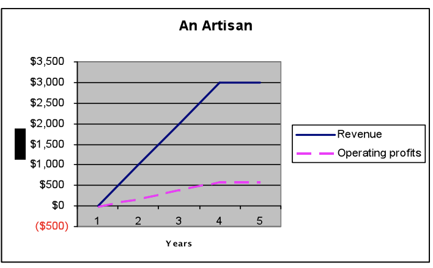
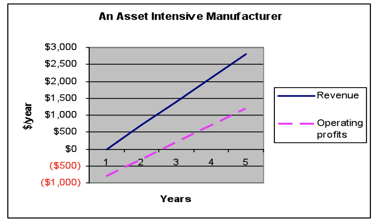

# Operating & Financial Leverage

What Is Leverage? Leverage occurs when a small force or movement in one
place leads to a much larger result in another place. In the ancient
Greek philosopher Archimedes’s case, he believed a small force
(himself), applied far enough away from a fulcrum, could move the earth.

**Operating & Financial Leverage:** “Leverage” in business describes the
relationship between changes in revenues and changes in free cash flows,
usually the result of a business model where every sale contributes a
large amount toward high fixed period costs.

  - **Operating leverage**
    
    Where as a result of the business model chosen, small changes in
    revenue will lead to large changes in operating profits and
    operating cash flows. Operating leverage can supercharge free cash
    flows if revenue’s grow with the risk of bankrupting the firm if
    they don’t. 

  - **Financial leverage**
    
    Where because of debt added to a firm, small changes in revenue will
    lead to large changes in net profits and free cash flows,
    independent of changes caused by operating leverage.

**Still don’t understand operating leverage?**

Operating leverage describes how the addition of fixed-period costs in
your business model makes operating profits and cash flows more
sensitive to changes in revenue. If you choose to keep most costs
variable, and fixed-period costs like salary and rent low, your business
will survive periods of low sales for as long as you are willing to
survive on little to no pay. Unfortunately, your ability to greatly
expand sales will be severely limited and the contribution per sale (the
amount left over from every sale once variable costs have been paid)
will be low

***An Artisan as an Example of a Business with Low Operating Leverage***

An artisan creating custom art in his or her home is an example of a
business with low operating leverage. Since each unit is made-to-order,
variable costs (if you exclude the artisan’s time) are a large
percentage of the total price per unit. Fortunately, there are few
fixed-period costs associated with the business and no sunk investment,
so the business can endure a long period of low sales volume.
Unfortunately, the production capacity (and thus sales growth) is
limited. Low contribution margins, combined with low fixed costs, lead
to low but stable operating margins

***An Asset-Intensive, High-Volume Manufacturer***

This is an example of a business with high operating leverage.
Conversely, a high-volume manufacturer with a high degree of automation
will typically have high operating leverage. Since most of the work is
done by a machine, variable costs will be a small percentage of the
total price per unit. Fixed-period costs to pay for the around-the-clock
labor to man the machine will be high, and a significant sunk investment
will be required to purchase the machine. Because variable costs will be
low, the contribution margin will be high. High contribution margins,
when combined with high fixed-period costs, mean a hefty operating loss
when volumes are low, and large and increasing profits once cash flow
breakeven volumes are exceeded. Because a machine can have a high
capacity in relation to breakeven volume, extraordinary profits and cash
flows are possible if unit sales continue to grow.

***The Best Strategy of All: Bootstrapping Your Way to Success***

The best of all strategies with regard to operating leverage is to
maintain low operating leverage (and losses) until sufficient demand is
proven and then invest to increase capacity and improve operational
efficiencies. By waiting to invest until demand is proven, and only then
committing sunk investments and fixed-period costs to add capacity and
increase efficiency, you greatly lower the risk of adding operating
leverage.

**What is Financial Leverage?**

Financial leverage is the act of adding debt to increase the returns to
an owner’s equity. In some cases, rather than making an investment with
your own cash, you may elect to borrow money. Because loans typically
must be repaid before equity owners receive a share of cash flows, the
Investments made in machinery Operating leverage added once sales reach
break even 7 presence of debt amplifies the effects of changes in
revenue on your profits and cash flows as an owner. Financial leverage
allows you to control larger assets for a lower upfront equity
investment. If you are right about your predictions of future revenues
and costs, the return on your smaller (equity) investment will be
magnified. Overestimate revenues or understate costs even slightly,
however, and

**Combining Operating and Financial Leverage**

Combining operating and financial leverage is a dangerous game, leaving
the world of fundamental investing for the world of speculative
investing, since the margin for error shrinks below what an entrepreneur
can hope to control.

**Summary**

Understanding how operating leverage works will help you make better
decisions with regard to sunk investments and fixed-period commitments.
Look for opportunities to bootstrap your operations by keeping most
costs variable until demand is proven. Doing this greatly lowers the
risk of investing in fixed assets and making fixed-period commitments to
add capacity or increase efficiency.

Understanding how financial leverage works can help you add enough
low-cost debt to boost equity returns, without adding so much that you
risk bankrupting your company. Master the use of leverage and, like
Archimedes, you’ll have one more tool to help you change the world.

