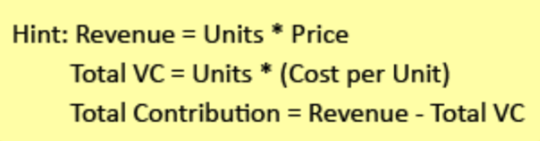

# Principles of Cash and Valuation

In this note, you will be introduced to Sahlman’s Three Principles of
Valuation:

**Principle One**

Value = Cash + Risk + Time

**Principle Two**

Sahlman’s Four Rules of Cash

1\. More cash is better than less cash.

2\. Cash sooner is better than cash later.

3\. Less-risky cash is better than more-risky cash.

4\. NEVER run out of cash.

**Principle Three**

Your goal in a valuation is to “narrow the region of darkness,” not
calculate a precise value (which is impossible). Hard work and attention
to your customers will close any gap between what you pay to acquire and
develop an opportunity and what it’s worth when you sell it.

Remember, your goal in a valuation is not precision—it is setting a
reasonable range of possible values. Hard work and satisfied customers
will overcome any minor mistakes. Stick with Sahlman’s Three Principles
of Valuation, and you will never be fooled by frothy markets or
fast-talking investment bankers

W3: Pre-Tax Cash Flows & Breakeven

Do you want to know the secret to staying in business? Sell a unit for
more than it costs you to make by performing Unit Economics. *That's
it?* That's it. Or at least it's an important first step. 

Understanding the Unit Economic model on which your firm is built is the
first crucial step in getting a grip on the finances of your simple
firm. With unit economics, you can calculate pre-tax cash flow and
calculate how much money you’ll have at the end of the month if you sell
a certain number of units. It can also give you a sense of whether
you’re spending money wisely – and charging a reasonable price for
your work.

**Contribution Per Unit**

The amount of cash you have left over after selling a unit and paying
for its cost is called your "contribution per unit."

**Fixed Period Costs & Reaching Breakeven**

But, you argue, what about rent or salary? If you have these recurring
costs—called fixed-period costs—you'll need to sell enough units to pay
your monthly bills. That's called "reaching breakeven." And it's the
second most important step in entrepreneurial finance, because now you
can stay in business.

**Payout**

What about the machine you bought? Yes, you do need to recover that
investment. So estimate how much in pre-tax cash flows you'll be making
each month once you reach critical mass, and you can calculate how many
months it will take to get your money back. That's called "payout.” Any
cash you earn over and above payout is pure gravy.

**How to Calculate Pre-Tax Cash Flow:** (all the pictures below express
the same method)

How to calculate breakeven:

How to calculate payout:

