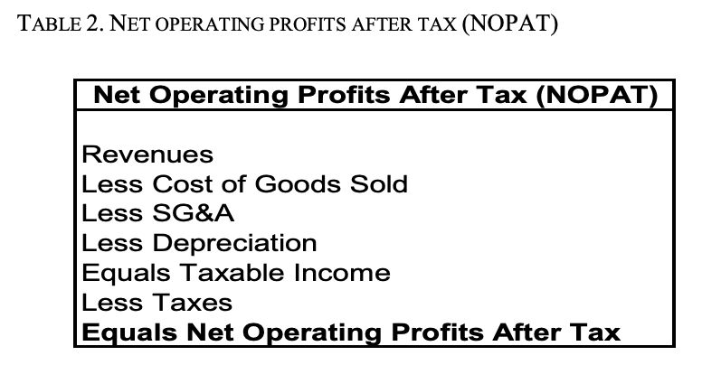

# How Fast Can Your Company Grow?

**Sustainable Growth Rate: How Fast Can Your
Company Grow?**

The sustainable growth rate (SGR) formula calculates how quickly you can
grow revenues by depending solely on internally generated free cash
flows to fund working capital and fixed asset investments. Calculating
the SGR requires only two inputs.

The sustainable growth rate (g) is a function of a company’s net
operating profits after taxes (NOPAT) margin (p) and net asset intensity
(a).

**g = p / (a – p)**

\*In other words, SGR shows how much free cash the company generates
that can be invested into future revenue growth versus how large of an
investment in working capital and fixed assets is required to generate
an additional dollar of revenue.

Net operating profits after tax margin is NOPAT—the amount of after-tax
cash your business will generate from operations—divided by revenues.
NOPAT margin is a measure of what portion of each dollar of revenues can
be used to fund the making and selling of an additional unit.

**Net Asset Intensity**

Net asset intensity measures how many cents of working capital and fixed
asset investments are needed to support each incremental dollar of
revenue.

Net asset intensity is composed of net working capital and fixed assets.
Incremental investments in net working capital may be needed as revenues
rise because you likely will need more inventory to keep a factory
running smoothly at higher production levels, and likely will need to
extend more credit (often described as “accounts receivable.”) The term
net asset intensity is used because inventory investments may be offset
by suppliers’ willingness to provide credit (often described as
“accounts payable”) or by others’ willingness to do work now and be
paid later (often described as “accrued expenses.”)

Incremental fixed asset investments may be needed in machinery or
buildings to support increased production levels. Warning: In the SGR
formula, increases in capital expenditures are assumed to be directly
proportional to increases in revenues, even though in reality such
investments frequently are sporadic or “lumpy” in nature.

**Net Operating Profits After Taxes (NOPAT)**

Net operating profits after taxes (NOPAT) measures how much cash flow is
produced from operations that can be used to fund investments needed to
support growth.

To find the NOPAT margin, you divide NOPAT by revenues.

**NOPAT Margin = NOPAT / Revenues**

**Depreciation and the Calculation of
Incremental Fixed Asset Investments**

Remember that your goal is to measure how quickly your business can grow
revenues using only internally generated cash flow. Depreciation is
subtracted from revenues in NOPAT to adjust for the wear and tear of
buildings and machinery as a tax-deductible expense. Gross capital
expenditures in any one year can be assumed to be composed of two parts:
investments needed to replace worn out machinery (depreciation) and
investments in additional plant and equipment needed to fund growth.

To correctly account for the asset intensity of a business, you need to
deduct the cost of replacing worn out machinery (depreciation) from the
gross capital expenditures to avoid double counting the repair cost and
only capture the incremental investment needed in fixed assets required
to increase production (and thus sales).

Since depreciation is a non-cash adjustment used for accounting purposes
to approximate actual wear and tear of fixed assets, the SGR may be
pessimistic in the short-term if your company isn’t replacing worn-out
equipment. Of course, sooner or later, this failure to do proper
maintenance will affect production levels.

**Advanced Techniques**

***Companies with Financial Leverage***

For companies that have debt, the internal cash flows available to fund
revenue growth are reduced by required principal payments and interest
expense, net of the tax shield.4 The SGR for a business with financial
leverage is reached when its free cash flow to the equity (as opposed to
the free cash flow to the firm for a debt-free company) falls to $0.
Thus, the SGR formula must be modified slightly to take the cost of debt
service into account:

**g = {p – \[(d + i – t) / s\]} / (a – p)**

The revised formula is similar to the original SGR formula, but
introduces four new terms: d, i, t and s. The variables d, i and t
symbolize principal payments, the interest expense, and the interest tax
shield, respectively, for the coming year. The variable s represents the
current year’s sales. The company in Exhibit A with $50,000 in required
annual principal payments and a projected after-tax cost of interest of
$21,000 would see its sustainable growth rate decline from 43% to about
14%.

***Companies with Operating Leverage***

The SGR formula presupposes that operating margins will remain constant
going forward, but this does not hold true for companies that have
operating leverage, where small increases in revenues lead to large
changes in free cash flows because of high contribution margins and high
fixed period operating expenses. In these businesses, margins will
improve as sales increase, assuming no step-up in fixed costs.

Unfortunately, there is no way to calculate the SGR for a company with
high operating leverage, since changes in operating margins are
themselves related to changes in revenue.6 In situations like this, the
SGR formula will underestimate the true SGR. Nevertheless, the formula
provides a useful—albeit conservative—estimate of a company’s ability to
support growing sales through its internal cash flows.

**Summary**

The sustainable growth formula allows you to mathematically calculate
how quickly your business can grow without financing. However, this
formula must be modified for companies that already have debt, and
cannot be used for companies with high operating leverage.

The most direct way to estimate sustainable growth rates is to use free
cash flow to the firm projections (or free cash flow to equity
projections if the company has debt). Just iterate your growth rate with
revenue projections until cash flows reach $0 to solve for the SGR.

W14: Adding Debt Pt. 2

You have learned how to create projections of unlevered Free Cash Flows
to the Firm – using either historical financial statements or Unit
Economics1 -- to compare how your operating decisions will affect how
much cash the firm consumes and produces.

Now it’s time to add debt to your projections and divide the firm’s free
cash flows between debt and equity holders, so you can model whether
financing can increase the value of your equity in good times, without
causing you to lose control of the firm if revenues lag.
