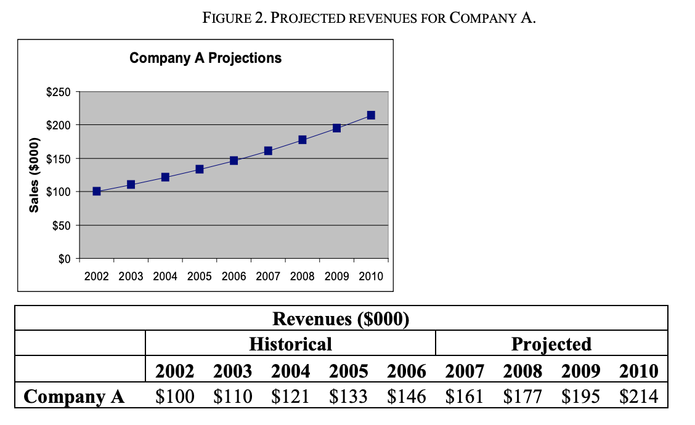
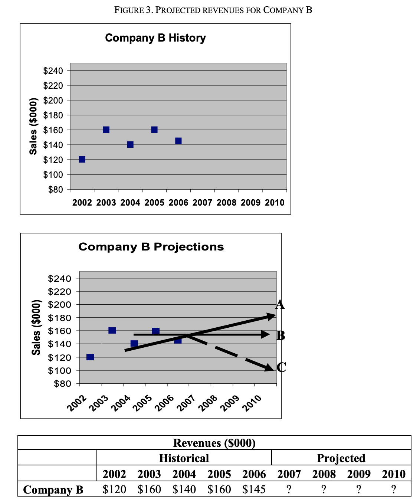
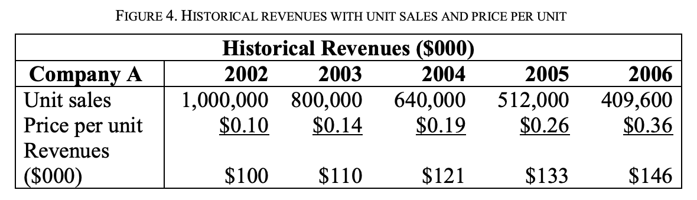

# Simple Valuation

**The Simplest Valuation of All: A Multiple of Pre-Tax Cash Flows from
Unit Economics**

This note introduces the idea of using a multiple of the annual free
cash flows of a firm as a proxy for its value. More specifically, it
describes the advantages and limitations to using a multiple of five
times the pre-tax annual cash flow as a cross check on other valuations.
Perhaps most importantly, once you think you have become more
financially sophisticated, this tool will protect you from relying too
heavily on the precise answers from more complex financial tools rather
than common sense.

**The Goal of a Valuation:** To approximate what the business is worth
to you and the market.

**Define Unit Economics: **

Unit economics is a financial tool that shows the relationship between
annual pre-tax cash flows and changes in revenues, variable costs and
fixed-period expenses, like rent and salaries. In other words, for
simple businesses, it shows how changes in unit volume will affect
revenues, expenses, profits and free cash flows.

***A Simple Valuation Formula: 5x the Annual Pre-Tax Cash Flow of a
Firm***

If you want to approximate the value of your business, multiply its
annual pre-tax cash flow by five.

***Calculating Pre-Tax Cash Flows***

The first step to using a cash flow multiple for a firm’s valuation is
to determine its annual free cash flow. To do this, you can use the
annual pre-tax cash flows from unit economics.

Unit economics is a financial tool that shows the relationship between
annual pre-tax cash flows and changes in revenues, variable costs and
fixed-period expenses, like rent and salaries. In other words, for
simple businesses, it shows how changes in unit volume will affect
revenues, expenses, profits and free cash flows.

Once you have calculated the annual pre-tax free cash flows for your
firm, it’s time to determine the correct
multiple.

**Which multiple do I use:**

5x annual pre-tax cash flow is not always the right multiple depending
on the predictability of the cash flows, interest rates, taxes, and a
host of other factors. A multiple of five, however, is a good starting
place.

A multiple of pre-tax cash flows is an excellent proxy for valuation for
a simple business, in normal times, but can give misleading results if:

1.  A firm’s revenues are growing quickly, and the business model of the
    firm requires reinvesting operating cash flows in working capital or
    capital expenditures to support continued revenue growth.

2.  A firm has substantial fixed assets that are depreciating—in other
    words, wearing out as items are produced or deteriorating with the
    passage of time.

3.  A firm has a legal form resulting in tax rates that differ from
    those of alternative investments.

4.  The goal is to value the equity (owner’s share) of a firm with debt
    rather than the entire firm itself.

The easiest way to value a simple (cash based, no debt) firm is to
multiply its annual pre-tax cash flows by a number (a multiple) that
reflects how much you might pay today for the right to own the firm’s
pre-tax cash flows in perpetuity (forever(.

**A multiple of 3 represents:**

  - Firm with less predictable or short lived cash flows

  - Customers: Company may be new to market, and the customer base might
    be small or fickle

  - Competition: Industry may have low barrier to entry – allowing
    newcomers to enter suddenly

**A multiple of 5 represents:**

  - A stable firm with more predictable solid cash flows expected to
    remain steady for 7+ years.

  - Customers: Relatively loyal customer base with good demand and
    growth potential

  - Competition: In an industry that has some barriers to entry

**A multiple of 7 represents:**

  - Stable, high performance firm with consistently strong cash flows –
    predictable and long lasting or that are expected to grow into the
    future.

  - Customers: extremely loyal customer base with good demand and growth
    potential

  - Competition: industry has high barrier to entry. Attaining a
    foothold will be difficult for competitors.

The pre-tax cash flow multiple method works well for simple, cash based
firms where changes in revenue and pre tax cash flows are forecast to be
minimal.

This method will not work well for a firm that:

  - Has quickly growing revenues and

  - Must invest in working capital (inventories or customer credit) or
    has recurring capital expenditures (machinery and buildings to
    repair or replace) required to support revenue growth.

W4: Projecting Revenues

**Two Fundamental Choices in Projecting
Revenues**

1.  Projecting Past Sales Trends or

2.  Using Market Analysis and Unit Economics

<!-- end list -->

  - You have two choices when it comes to projecting revenues in an
    established business: You can mechanically extrapolate past sales
    trends into the future. Or you can deeply examine the different
    needs of each customer segment, count the number of customers in
    each segment, and use a sales funnel to predict how quickly leads
    will turn into paying customers. Projecting future revenues by
    extrapolating past sales has its advantages.

  - Sales in previous years may reflect deeply embedded customer habits
    that are likely to continue. Unfortunately, such trends can be
    difficult to decipher if sales have been erratic. Do you use the
    past ten years as the basis for your predictions? The past five?
    Perhaps just the past two?

  - Without understanding the reasons why customers buy your products,
    it is difficult to explain aberrations in historical data or to know
    which trends should be honored. Your own optimism (or pessimism) or
    some preconceived idea may affect which data you pay attention to
    instead of the trend that best predicts future performance.
    Understanding what drives the behavior of your customers, dividing
    them into segments that reflect different needs, counting how many
    are in each market, and building the right sales funnel to move them
    along in the sales process can provide far more accurate short-term
    sales predictions. It is the only choice you have in a start-up
    business when there are no trends to project.

**Projecting Past Sales Trends: Extrapolating Historical Results**

Estimating future revenues based on historical results is simply a
matter of projecting past trends into the future. This can be done
graphically or mathematically. Either way, the most difficult decision
is which data to use and which data to ignore when looking for trends.

Company B, however, presents a more difficult problem, particularly if
you are told that management believes that the dip in sales during 2006
was an aberration.

Do you believe management and ignore the 2006 results? Should you use a
“least squares” fit from 2002 until 2006 (Projection A),1 the data
from the past four years (Projection B), or the data from the past two
years (Projection C)?

As you can see, the data you choose to include has a dramatic effect on
projections and can be influenced by your level of optimism, which has
nothing to do with the choices that will be made by real customers.

**Problems With Blindly Extrapolating Revenue Trends**

Simply extrapolating past results is a poor substitute for an
entrepreneur or manager understanding what’s happening on the front
lines, where customers are won or lost. “Managing from 30,000 feet” can
lead to dangerous missteps. For example, looking only at changes in
annual revenues can cause you to overlook important trends in unit
volume and prices per unit, trends that could dramatically change your
view of future revenues. Let’s look more deeply at Company A’s revenues
by examining the relationship between unit sales volume and price per
unit.

Previously, we were reassured by the steady upward climb of Company A’s
revenues. Now we see disturbing trends. Unit sales are steadily
dropping. Revenues are constant because the company is continually
raising the price per unit, which more than likely is causing more
customers to flee. Company A seems to be milking its market, something
that cannot continue indefinitely.

**Using Unit Economics to Project Revenues**

If forecasting future revenues by extrapolating past sales is like
bombing from 30,000 feet, unit economics is like hand-to-hand combat.
With unit economics, you try to crawl inside the head of your customers
to predict why they will buy. This gives you a better understanding of
the relationship between markets, price per unit, and unit volume, which
may lead to more-accurate revenue predictions.

**Step One: Judging the Intensity of a Need**

**Step Two: Measuring the Tradeoffs Between Substitutes**

**Step Three: Judging the Size of and Penetration Rates for Your
Market**

**Step Four: Using Sales Funnels to Forecast Revenues**

**Summary**

  - Projecting revenues, even when done well, often is little more than
    an educated guess. Projecting revenues is easier when you have a
    long string of year over year sales increases, showing strong
    evidence of hordes of customers with deeply ingrained habits that
    will keep them coming back time and again. You feel more confident
    when you have a deep understanding of your market, so you understand
    on a customer-by-customer basis what each person values, which
    substitutes are available, and the optimum price point that will
    contribute the maximum contribution per dollar at risk.

  - But even firms with the best market research and most loyal
    customers can be pleasantly surprised by consumer fads or long
    periods of economic prosperity. Even firms with the most transparent
    and forward-looking sales funnels are blindsided by disruptive
    technologies, irrational moves by competitors, or unexpected
    downturns in the economy.

  - Learning to make reasonable projections of future revenues, either
    by projecting past results into the future or building sales
    projections unit by unit through unit economics (or preferably
    both), will allow you to compare the commitments you must make to
    build capacity and assess the risk of not having enough revenues to
    cover your fixed-period costs and recover your investments.

  - The best defense against the unpredictability of revenues is to
    stage investments whenever possible, making the minimum sunk
    investments and fixed-period commitments for different levels of
    production, provided you allow enough time to add additional
    capacity when necessary.

