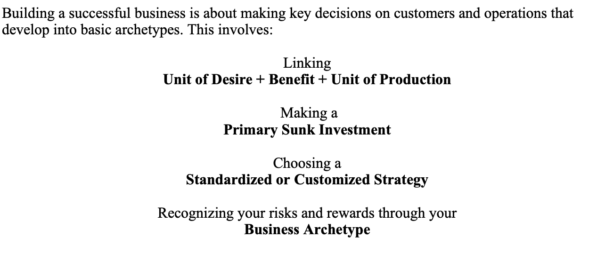

# Standing in Between Demand & Supply

**The Emergence of Business Archetypes**

Over time, the combination of an entrepreneur’s DNA, luck, and the
decisions made early in the life of a business, begin to come together
to form patterns in the way a business operates. In his Note on
Developing Start-up Strategies, Professor Amar Bhide identifies seven
cash flow “archetypes” that describe the risk and reward characteristics
and sustainability of most opportunities. Businesses don’t generally
“choose” one of these strategies; they are developed through trial and
error. But by studying the history of businesses that have similar
archetypes, you may learn something about what to expect for your own
choice of customers, “units” and primary sunk investment.

Solo Contracting Ventures

A Solo Contracting business has little in the way of a primary sunk
investment, differentiation from competitors or barriers to competition.
Initial investments and risks are low; as are profit margins and
rewards, and the profits continue only as long as the entrepreneur
continues to “hustle.” It is difficult for an entrepreneur to sell a
solo contracting business because it depends so much on the talents and
energy of the entrepreneur to survive. In many ways, the entrepreneur
does not own the business. It owns him. Lawn services, hairdressers, and
other sole proprietors fit this archetype. Most entrepreneurial ventures
in the United States are Solo Contracting businesses.

Revolutionary Ventures

The Revolutionary archetype is the polar opposite of the Solo
Contracting venture. Founders of Revolutionary Ventures typically make a
very large primary sunk investment to deliver something radically
different to a large group of customers. The risks are enormous and
successes rare, but the potential rewards from a Federal Express or
Compaq are large as well. Venture capitalists tend to fund Revolutionary
Ventures.

Other archetypes that fall between Solo Contracting and Revolutionary
Ventures on the risk and reward spectrum are:

Institutional Hustle

Institutionalized Hustle businesses include law firms, accounting firms,
consulting firms, venture capitalists, and investment banking. This
archetype is similar to the Solo Contracting archetype, except that
there are marginal reasons for practitioners to band together, such as
building a reputation or rent sharing. In rare cases, such as McKinsey &
Co., there are work processes and training and recruiting protocols that
qualify as primary sunk investments. Nevertheless, in most cases,
investments and risks are low and profits limited when compared to other
archetypes. 31 Like Solo Contractors, those in Institutionalized Hustle
businesses thrive mainly because of their individual energy and talent.

Syndication Ventures

The Syndication archetype relies on an entrepreneur to bring together
various buyers or sellers to create a more efficient market. The size of
the primary sunk investment depends on the size and breadth of the
market being served. Risk varies depending on how difficult it is to
find and convince players to participate.

Trading and Speculation Ventures

The Trading and Speculation archetype applies to such industries as oil
and gas, real estate, and securities trading. There is a large sunk
investment, but it is typically not made in a primary sunk investment to
service customers. Instead, entrepreneurs usually make short-term,
contrary bets to profit from imbalances in commodity-like markets.

Speed Ventures

Speed ventures involve the race to capture a new market created by
rapidly changing consumer tastes or technology. Primary sunk investments
must be made quickly with little information and few chances to perform
methodical “trial and error” tests. Sustainability may also be low if
the turbulence that led to the first opportunity continues and allows
new entrants to leapfrog current competitors.

Niche Ventures

In Niche Ventures, the entrepreneur chooses customers with unusual
desires that aren’t being well served by more standardized competitors.
Primary sunk investments are usually limited because production runs and
total market size are smaller. The potential rewards are lower than a
Revolutionary Venture but may be sustained for long periods if
competitors find the small market size unattractive. The best Niche
Ventures are those that create sunk assets or processes that may be
applied to other segments to create new opportunities.

**Wrapping Up**

Unit economics is about making sunk investments—primary sunk
investments—where you are confident you can “over-recover” the
investment to make a profit. When you start your business, it is
critical to have defined your primary sunk investment, and the “units”
its standardized process is designed to deliver. You must understand
that the key attributes of these “units of production” are critical for
satisfying the “units of desire” in your subset of customers, how many
of these customers are likely to buy and what price they will pay. You
then can calculate the variable and fixed period costs required to
attract, make, and deliver these units, and how long it will take to
recover your primary sunk investment and other start-up costs. All of
business—from water pipelines to theme parks—is a matter of making and
recovering sunk investments in a standardized set of processes. If you
are clear about the “units” you are selling, and the primary sunk
investment you have made, the chances are much higher that you will
“over recover” your fixed and sunk costs and survive.

The following questions will guide you through these decisions with your
own business:

• What is the “unit of desire?” How do customers measure it? What are
the key physical attributes that satisfy it?

• What price per unit are they willing to pay?

• How difficult will it be to find these customers and convince them to
buy?

• What is my Primary Sunk Investment? How will it create value for my
customers and a return for my investors?

• How many customers can be reached or serviced by what my Primary Sunk
Investment can deliver?

• What are the variable costs to produce each “unit?”

• How much in fixed period costs will it take to operate?

• How long does it take to recover my investment?

• How long can I keep competition from reducing my margins?

• What options does this investment give me to make other attractive
investments?

